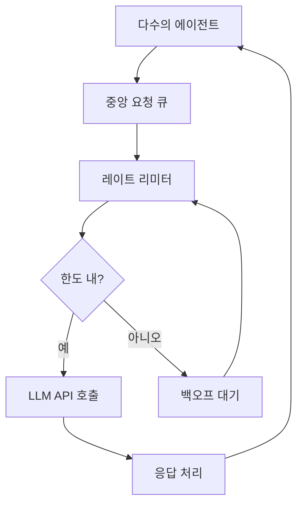
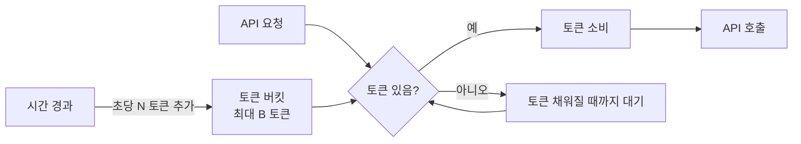
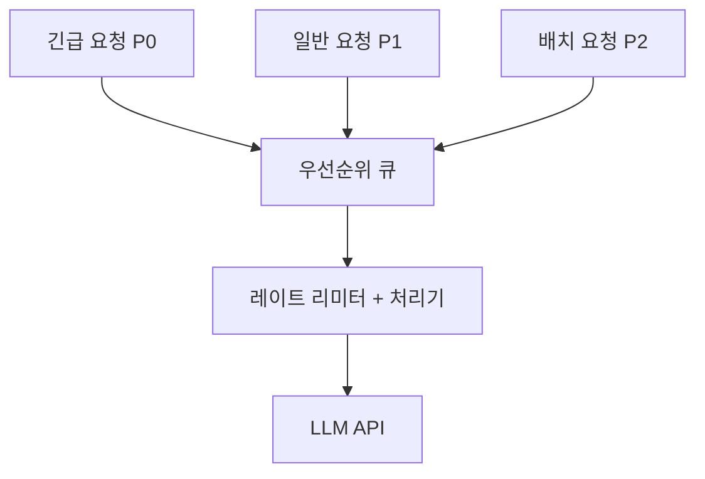
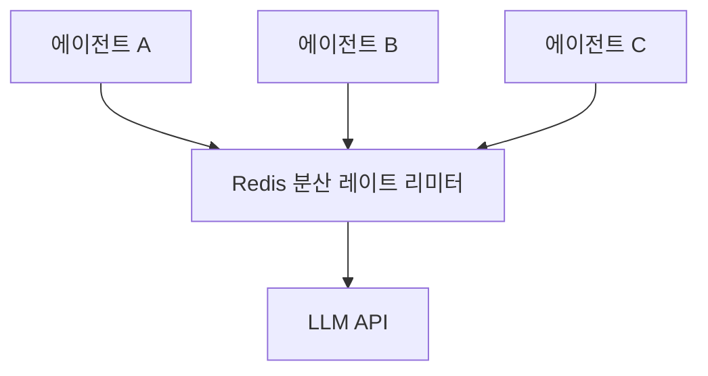

# 에이전트 레이트 제한 패턴

## 개요

에이전트 레이트 제한 패턴(Agent Rate Limiting Patterns)은 LLM API 및 외부 서비스의 요청 한도(rate limit)를 관리하고, 한도 초과 시 적절히 대응하며, 여러 에이전트가 공유 API를 효율적으로 사용할 수 있도록 조율하는 설계 패턴이다.

멀티 에이전트 시스템에서 레이트 제한 관리는 단순한 오류 처리를 넘어 전체 시스템 처리량과 비용에 직접 영향을 미치는 핵심 인프라 문제다.

**주요 LLM API 레이트 제한 유형:**

| 제한 유형 | 설명 | 단위 |
|----------|------|------|
| RPM (Requests Per Minute) | 분당 요청 횟수 | 요청/분 |
| TPM (Tokens Per Minute) | 분당 처리 토큰 수 | 토큰/분 |
| RPD (Requests Per Day) | 일일 요청 횟수 | 요청/일 |
| 동시 요청 수 | 동시에 처리 중인 요청 수 | 개수 |



## 핵심 알고리즘

### 지수 백오프 (Exponential Backoff)

API 호출이 429 (Too Many Requests) 오류를 반환할 때, 고정 간격으로 재시도하면 서버에 계속 부하를 준다. 지수 백오프는 재시도 간격을 지수적으로 늘려 서버가 회복할 시간을 준다.

기본 공식:
$$\text{대기 시간} = \min(\text{최대 대기}, \text{기본 대기} \times 2^n \times \text{지터})$$

- $n$: 재시도 횟수 (0부터 시작)
- 지터(jitter): 0.5~1.5 사이 무작위 계수 (여러 클라이언트의 동시 재시도 방지)
- 최대 대기: 보통 60-120초로 cap

```python
import asyncio
import random
from functools import wraps

def exponential_backoff(
    max_retries: int = 5,
    base_delay: float = 1.0,
    max_delay: float = 60.0,
    jitter: bool = True,
):
    """레이트 제한 오류에 지수 백오프를 적용하는 데코레이터."""
    def decorator(func):
        @wraps(func)
        async def wrapper(*args, **kwargs):
            for attempt in range(max_retries):
                try:
                    return await func(*args, **kwargs)
                except RateLimitError as e:
                    if attempt == max_retries - 1:
                        raise
                    
                    delay = min(max_delay, base_delay * (2 ** attempt))
                    if jitter:
                        delay *= (0.5 + random.random())  # 0.5~1.5 지터
                    
                    logger.warning(
                        f"레이트 제한 도달. {delay:.1f}초 후 재시도 ({attempt + 1}/{max_retries})"
                    )
                    await asyncio.sleep(delay)
        return wrapper
    return decorator

@exponential_backoff(max_retries=5)
async def call_llm_api(prompt: str) -> str:
    return await llm_client.generate(prompt)
```

**지수 백오프 대기 시간 예시 (기본 1초, 지터 없음):**

| 재시도 | 대기 시간 |
|--------|---------|
| 1번 | 1초 |
| 2번 | 2초 |
| 3번 | 4초 |
| 4번 | 8초 |
| 5번 | 16초 |

### 토큰 버킷 알고리즘 (Token Bucket)

지속적인 요청 흐름을 일정 속도로 제한하는 알고리즘이다. "버킷"에 토큰이 지속적으로 채워지고, 요청마다 토큰을 소비한다. 버킷이 비면 토큰이 채워질 때까지 대기한다.

장점: 순간적인 버스트(burst) 트래픽을 허용하면서도 장기 평균 속도를 제한할 수 있다.



```python
import asyncio
from dataclasses import dataclass, field
from datetime import datetime

@dataclass
class TokenBucket:
    """API 레이트 제한을 위한 토큰 버킷 구현."""
    capacity: float        # 버킷 최대 용량 (최대 버스트)
    refill_rate: float     # 초당 토큰 추가량
    
    _tokens: float = field(init=False)
    _last_refill: datetime = field(init=False)
    _lock: asyncio.Lock = field(init=False)
    
    def __post_init__(self):
        self._tokens = self.capacity
        self._last_refill = datetime.now()
        self._lock = asyncio.Lock()
    
    async def acquire(self, tokens: float = 1.0) -> float:
        """토큰을 획득한다. 필요 시 대기하고 실제 대기 시간을 반환한다."""
        async with self._lock:
            self._refill()
            
            if self._tokens >= tokens:
                self._tokens -= tokens
                return 0.0
            
            # 토큰이 부족하면 대기 시간 계산
            wait_time = (tokens - self._tokens) / self.refill_rate
            await asyncio.sleep(wait_time)
            self._refill()
            self._tokens -= tokens
            return wait_time
    
    def _refill(self):
        now = datetime.now()
        elapsed = (now - self._last_refill).total_seconds()
        self._tokens = min(self.capacity, self._tokens + elapsed * self.refill_rate)
        self._last_refill = now

# Anthropic Claude API: 분당 2000 요청, 분당 100000 토큰
request_bucket = TokenBucket(capacity=2000, refill_rate=2000/60)  # 분당 2000
token_bucket = TokenBucket(capacity=100000, refill_rate=100000/60)  # 분당 100k 토큰
```

### 슬라이딩 윈도우 (Sliding Window)

고정 윈도우(Fixed Window) 방식과 달리, 시간 창이 현재 시점을 기준으로 계속 움직인다. 윈도우 경계에서 발생하는 레이트 제한 폭발(burst at window reset)을 방지한다.

```python
from collections import deque
from datetime import datetime, timedelta

class SlidingWindowRateLimiter:
    """슬라이딩 윈도우 레이트 리미터."""
    
    def __init__(self, max_requests: int, window_seconds: int):
        self.max_requests = max_requests
        self.window = timedelta(seconds=window_seconds)
        self.request_times: deque[datetime] = deque()
    
    def is_allowed(self) -> bool:
        """현재 요청이 허용되는지 확인하고, 허용되면 요청을 기록한다."""
        now = datetime.now()
        window_start = now - self.window
        
        # 윈도우 밖의 오래된 기록 제거
        while self.request_times and self.request_times[0] < window_start:
            self.request_times.popleft()
        
        if len(self.request_times) < self.max_requests:
            self.request_times.append(now)
            return True
        
        return False
    
    def wait_time_seconds(self) -> float:
        """다음 요청까지 대기해야 할 시간을 반환한다."""
        if not self.request_times:
            return 0.0
        
        oldest_in_window = self.request_times[0]
        window_reset_time = oldest_in_window + self.window
        wait = (window_reset_time - datetime.now()).total_seconds()
        return max(0.0, wait)
```

## 우선순위 큐 (Priority Queue)

여러 에이전트가 동일한 API 한도를 공유할 때, 중요도에 따라 요청을 처리 순서를 조정한다.



```python
import heapq
from dataclasses import dataclass, field

@dataclass(order=True)
class PrioritizedRequest:
    priority: int           # 낮을수록 높은 우선순위
    timestamp: float        # 동일 우선순위 내 FIFO
    request_id: str = field(compare=False)
    prompt: str = field(compare=False)
    callback: any = field(compare=False)

class PriorityRequestQueue:
    """우선순위 기반 API 요청 큐."""
    
    PRIORITY_URGENT = 0    # 사용자 대기 중인 실시간 요청
    PRIORITY_NORMAL = 1    # 일반 에이전트 요청
    PRIORITY_BATCH = 2     # 백그라운드 배치 작업
    
    def __init__(self):
        self._queue: list[PrioritizedRequest] = []
        self._lock = asyncio.Lock()
    
    async def enqueue(self, prompt: str, priority: int, callback) -> str:
        async with self._lock:
            request = PrioritizedRequest(
                priority=priority,
                timestamp=time.time(),
                request_id=str(uuid.uuid4()),
                prompt=prompt,
                callback=callback,
            )
            heapq.heappush(self._queue, request)
            return request.request_id
    
    async def dequeue(self) -> PrioritizedRequest | None:
        async with self._lock:
            if self._queue:
                return heapq.heappop(self._queue)
            return None
```

## API 헤더 활용

Anthropic, OpenAI 등 주요 LLM API는 응답 헤더에 현재 레이트 제한 상태를 제공한다. 이를 적극적으로 활용하면 사전적으로 속도를 조절할 수 있다.

**Anthropic Claude API 응답 헤더:**
- `anthropic-ratelimit-requests-remaining`: 남은 요청 횟수
- `anthropic-ratelimit-requests-reset`: 다음 리셋 시각 (ISO8601)
- `anthropic-ratelimit-tokens-remaining`: 남은 토큰 수
- `anthropic-ratelimit-tokens-reset`: 토큰 리셋 시각

```python
async def adaptive_rate_limiter(response_headers: dict) -> float:
    """응답 헤더를 분석해 사전적으로 요청 속도를 조절한다."""
    requests_remaining = int(response_headers.get("anthropic-ratelimit-requests-remaining", 100))
    tokens_remaining = int(response_headers.get("anthropic-ratelimit-tokens-remaining", 10000))
    
    # 여유가 20% 이하면 속도 제한 시작
    if requests_remaining < 20 or tokens_remaining < 2000:
        # 남은 한도에 비례해 대기
        throttle_factor = min(requests_remaining, tokens_remaining / 100) / 20
        wait_time = 1.0 / max(0.1, throttle_factor)
        await asyncio.sleep(wait_time)
        return wait_time
    return 0.0
```

## 비용 인식 레이트 제한

단순히 요청 수만 제한하는 것이 아니라 예상 비용을 추적해 일일/월간 예산을 관리한다.

```python
@dataclass
class BudgetAwareRateLimiter:
    daily_budget_usd: float
    monthly_budget_usd: float
    
    daily_spent: float = 0.0
    monthly_spent: float = 0.0
    
    def estimate_cost(self, input_tokens: int, output_tokens: int, model: str) -> float:
        """모델별 토큰 비용을 계산한다."""
        # 예시 비용 (실제 최신 비용은 공식 문서 확인 필요)
        prices = {
            "claude-opus-4-5": {"input": 0.015/1000, "output": 0.075/1000},
            "claude-sonnet-4-5": {"input": 0.003/1000, "output": 0.015/1000},
        }
        price = prices.get(model, {"input": 0.001/1000, "output": 0.002/1000})
        return input_tokens * price["input"] + output_tokens * price["output"]
    
    async def check_budget(self, estimated_cost: float) -> bool:
        """예산 내에서 요청이 가능한지 확인한다."""
        if self.daily_spent + estimated_cost > self.daily_budget_usd:
            logger.warning(f"일일 예산 한도 초과 위험: {self.daily_spent:.2f} + {estimated_cost:.2f} > {self.daily_budget_usd:.2f}")
            return False
        if self.monthly_spent + estimated_cost > self.monthly_budget_usd:
            logger.warning(f"월간 예산 한도 초과 위험")
            return False
        return True
```

## 멀티 에이전트 공유 레이트 리미터

분산 시스템에서 여러 에이전트가 같은 API 한도를 공유할 때, 중앙 조율이 필요하다.



Redis의 `INCR` + TTL을 활용한 분산 레이트 리미터:

```python
import redis.asyncio as aioredis

class DistributedRateLimiter:
    def __init__(self, redis_url: str, api_name: str, max_rpm: int):
        self.redis = aioredis.from_url(redis_url)
        self.api_name = api_name
        self.max_rpm = max_rpm
    
    async def is_allowed(self) -> bool:
        """분산 환경에서 레이트 제한을 확인한다."""
        key = f"rate_limit:{self.api_name}:{int(time.time() // 60)}"
        
        pipe = self.redis.pipeline()
        pipe.incr(key)
        pipe.expire(key, 60)
        results = await pipe.execute()
        
        current_count = results[0]
        return current_count <= self.max_rpm
```

## 실무 권장 설정값

| 시나리오 | 권장 설정 |
|---------|---------|
| 단일 사용자 에이전트 | 백오프 기본 1초, 최대 5회 |
| 서버사이드 멀티 에이전트 | 토큰 버킷 + 우선순위 큐 |
| 배치 처리 | 느린 속도 + 비용 인식 제한 |
| 실시간 챗봇 | 우선순위 P0 + 빠른 폴백 |

## 한계와 트레이드오프

- **복잡성**: 정교한 레이트 제한 로직은 코드 복잡도를 높인다
- **지연 증가**: 대기가 발생하면 응답 시간이 늘어나 사용자 경험에 영향
- **분산 조율 비용**: Redis 같은 외부 저장소 의존성이 생김
- **예측 어려움**: LLM 응답 길이를 사전에 정확히 예측하기 어려워 토큰 예산 관리가 불완전할 수 있음

## 2026-05-06 보강 — Anthropic API 한도 (Cache-Aware ITPM)

Anthropic API 의 가장 중요한 운영 사실: **cached input token 은 (대부분 모델에서)
ITPM 한도에 포함되지 않는다**. 즉 prompt caching 이 throughput multiplier 로 작동.

### Cache-Aware ITPM 카운팅 규칙

> "For most Claude models, only uncached input tokens count towards your ITPM
> rate limits."

| 토큰 종류 | ITPM 카운트 |
|---|---|
| `input_tokens` (마지막 cache breakpoint 이후) | 카운트 |
| `cache_creation_input_tokens` | 카운트 |
| `cache_read_input_tokens` | 미카운트 (대부분 모델) |

**예시**: Tier 4 Sonnet 2,000,000 ITPM + 80% cache hit rate → effective
10,000,000 input tokens/min 처리 가능.

### Acceleration Limit (sharp burst 방지)

> "You might also encounter 429 errors due to acceleration limits on the API if
> your organization has a sharp increase in usage. To avoid hitting acceleration
> limits, ramp up your traffic gradually and maintain consistent usage patterns."

→ 신규 deploy: 10% → 25% → 50% → 100% gradual ramp-up.

### 429 응답 헤더 처리

| Header | 의미 |
|---|---|
| `retry-after` | 재시도까지 대기 초 (절대 우선) |
| `anthropic-ratelimit-requests-limit/-remaining/-reset` | 요청 수 한도 |
| `anthropic-ratelimit-input-tokens-limit/-remaining/-reset` | ITPM |
| `anthropic-ratelimit-output-tokens-limit/-remaining/-reset` | OTPM |
| `anthropic-ratelimit-tokens-limit/-remaining/-reset` | 가장 제한적인 한도 |

### Per-Model 독립 적용

> "Rate limits are applied separately for each model; therefore you can use
> different models up to their respective limits simultaneously."

→ Sonnet 한도 도달 시 Haiku 로 fallback 가능.

### Workspace 단위 sub-limit

- workspace 별로 입출력 토큰 sub-limit 가능 (default workspace 제외)
- organization 한도가 항상 우선 (workspace 합 ≥ org 이어도 org cap 적용)
- 한 사용자가 organization 전체 quota 를 잠그지 못하게 분리하는 fair-share 패턴

자세한 Tier 별 한도 표는 [[anthropic-api-rate-limits]] 참고.

## 관련 문서

- [[agent-fallback-strategies]] -- 레이트 제한 초과 시 폴백 전략
- [[agent-cost-optimization]] -- API 비용 전반 최적화
- [[agent-token-budget-management]] -- 토큰 예산 관리 상세
- [[agent-observability-tracing]] -- 레이트 제한 이벤트 모니터링
- [[prompt-caching-agentic]] -- 프롬프트 캐싱으로 API 호출 절감
- [[anthropic-api-rate-limits]] -- Tier 별 정확한 RPM/ITPM/OTPM 수치
- [[prompt-cache-cost-economics]] -- cache hit 의 throughput 효과
- [[agent-circuit-breaker]] -- 429 발생 시 circuit breaker
