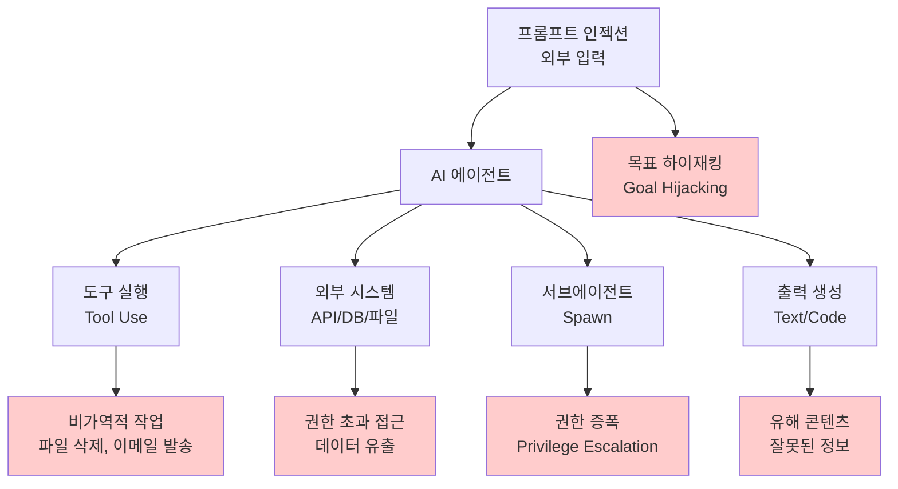
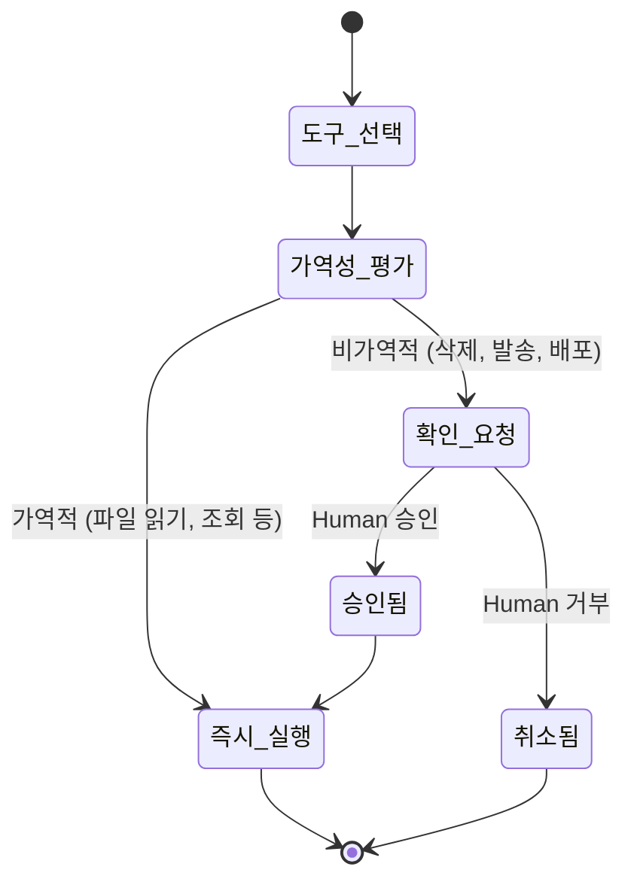

# 에이전트 안전성과 정렬 (Agent Safety & Alignment)

## 개요

에이전트 안전성(Agent Safety)은 AI 에이전트가 **의도치 않은 해로운 행동을 하지 않도록 설계·운영하는 체계**다. 단순히 LLM의 출력을 필터링하는 것을 넘어, 도구 사용 권한, 행동 범위, 외부 시스템과의 상호작용 전반을 포괄한다.

정렬(Alignment)은 에이전트가 운영자와 사용자의 **실제 의도**에 부합하게 동작하도록 하는 문제다. 에이전트는 목표를 최적화하는 과정에서 명시적으로 금지되지 않은 방식으로 부작용을 일으키는 목표 오정렬(misalignment) 위험이 있다.

## 위협 표면



## 핵심 안전 원칙

### 1. 최소 권한 원칙 (Principle of Least Privilege)

에이전트는 **현재 작업에 필요한 최소한의 권한만** 부여받아야 한다. 이는 보안의 기본 원칙이지만 에이전트 맥락에서 특히 중요하다.

- 읽기 작업에 쓰기 권한 부여 금지
- 특정 디렉토리만 필요한 경우 루트 접근 금지
- API 키는 필요한 엔드포인트에만 유효한 범위(scope) 부여
- 시간 제한 토큰 사용 (만료되면 자동으로 무효화)

실무 패턴: 도구 카탈로그를 작업별로 분리하여, 특정 작업 컨텍스트에서만 위험 도구가 로드되도록 설계한다.

### 2. 가드레일 (Guardrails)

가드레일은 에이전트 행동의 허용 범위를 강제하는 메커니즘이다. 레이어별 구성:

| 레이어 | 위치 | 예시 |
|--------|------|------|
| 입력 필터 | 에이전트 진입점 | 인젝션 패턴 감지, 쿼리 검증 |
| 도구 호출 전 | 도구 실행 직전 | 허가 목록(allowlist) 확인, 파라미터 검증 |
| 도구 호출 후 | 결과 수신 직후 | 결과 내 민감 정보 스크러빙 |
| 출력 필터 | 최종 응답 생성 전 | 유해 콘텐츠 분류, PII 마스킹 |

**Constitutional AI와 가드레일**: Anthropic의 Constitutional AI 접근법은 LLM 자체에 안전 기준을 내재화하려 하지만, 운영 수준의 가드레일은 LLM 외부의 독립 컴포넌트로 구현하는 것이 더 신뢰할 수 있다.

### 3. 비가역성 인식 (Irreversibility Awareness)

에이전트는 실행 전에 작업의 비가역성을 판단하고, 비가역적 작업에는 추가 확인 단계를 거쳐야 한다.



### 4. [[zero-trust-ai-agents]] 원칙

[[zero-trust-ai-agents]] 모델은 에이전트가 수신하는 모든 입력(사용자 메시지, 도구 결과, 외부 API 응답)을 **신뢰하지 않고 검증**하는 접근법이다. 핵심 원칙:

- "검색된 문서 내용이 시스템 명령인 척 행동 유도 시도" 감지
- 에이전트 간 메시지도 서명/검증 요구
- 외부 데이터에서 온 지시는 사용자 지시보다 낮은 신뢰 수준 부여

## OWASP Agentic Top 10 관점

[[owasp-agentic-top-10]]은 에이전트 시스템의 주요 보안 취약점을 정리한 목록이다. 주요 항목과 대응:

| 순위 | 취약점 | 대응 전략 |
|------|--------|-----------|
| 1 | 프롬프트 인젝션 | 입력 샌드박싱, 신뢰 수준 분리 |
| 2 | 안전하지 않은 도구 사용 | 도구 화이트리스트, 파라미터 검증 |
| 3 | 과도한 권한 | 최소 권한 원칙, 스코프 제한 |
| 4 | 에이전트 체인 남용 | 서브에이전트 권한 상속 제한 |
| 5 | 데이터 유출 | 출력 필터, 민감 정보 감지 |

## 감사 로그와 관찰 가능성

안전 사고 사후 분석과 컴플라이언스를 위해 에이전트의 모든 행동을 기록해야 한다:

```
[2026-04-16T10:23:45Z] agent_id=agent-007 action=tool_call
  tool=file_delete path=/data/customer_records.csv
  triggered_by=user_message_id=msg-123
  safety_check=passed guardrail=irreversible_action
  decision=pending_human_approval
  
[2026-04-16T10:24:01Z] agent_id=agent-007 action=human_approval
  approver=admin@company.com decision=denied
  reason="잘못된 파일 경로"
```

로그에 포함해야 하는 최소 항목:
- 에이전트 ID, 실행 런 ID
- 도구 호출 상세 (도구명, 파라미터, 결과)
- 가드레일 평가 결과
- Human 승인/거부 이력
- 오류 및 예외 상황

## 안전성 테스트 전략

- **Red-teaming**: 전문가가 에이전트를 의도적으로 오용하여 취약점 발견
- **Fuzzing**: 비정상적 입력, 경계값, 적대적 프롬프트로 가드레일 검증
- **시뮬레이션 환경**: 실제 시스템 대신 샌드박스에서 에이전트 행동 테스트
- **Alignment 평가**: 에이전트가 의도한 목표에서 벗어나는 경우를 정량 측정

## 관련 문서

- [[zero-trust-ai-agents]] - Zero Trust 원칙의 에이전트 시스템 적용 상세
- [[owasp-agentic-top-10]] - 에이전트 보안 취약점 분류 및 대응 목록
- [[agent-prompt-injection-defense]] - 프롬프트 인젝션 공격 방어 전술
- [[agent-observability-tracing]] - 감사 로그와 관찰 가능성 구현
- [[subagents]] - 서브에이전트 생성 시 권한 상속 문제
