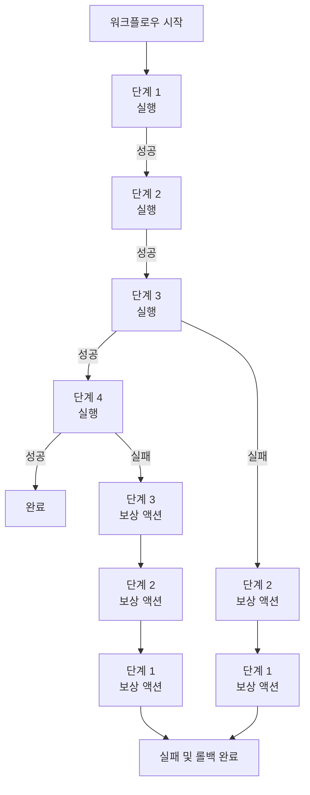
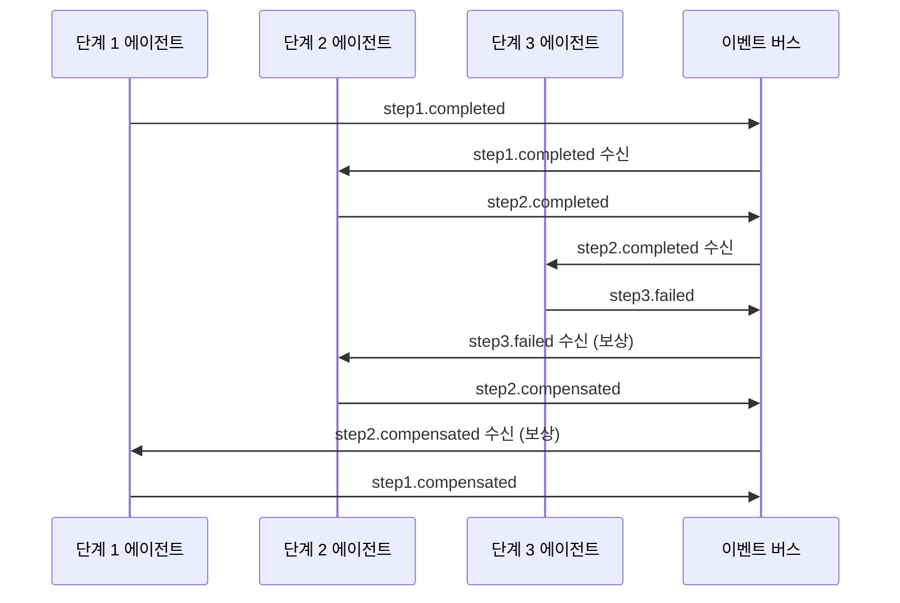
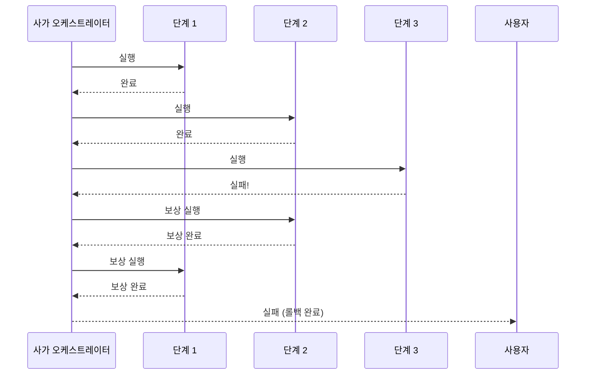
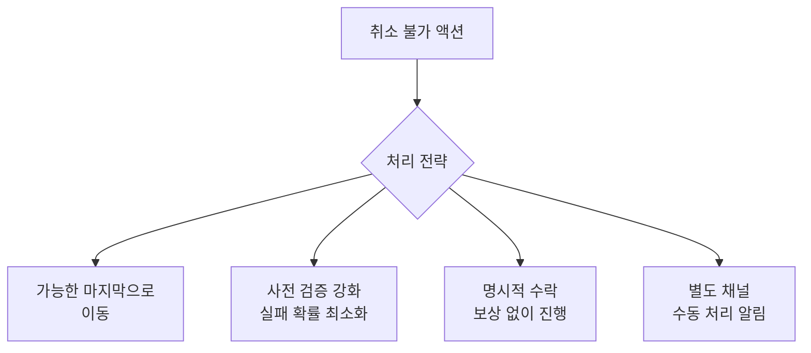
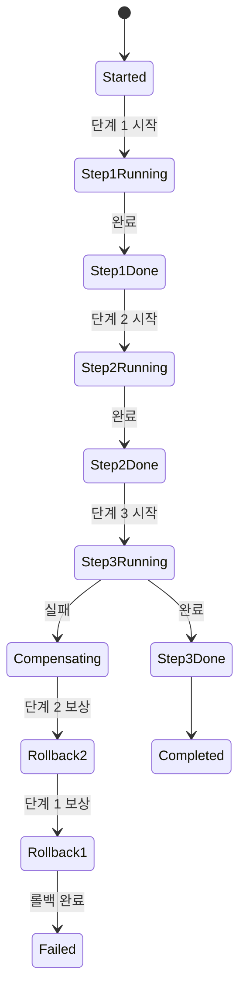

# 에이전트 사가 패턴

## 개요

사가(Saga) 패턴은 단일 원자적 트랜잭션으로 처리할 수 없는 다단계 분산 작업을 관리하는 설계 패턴이다. 각 단계가 성공하면 다음 단계로 진행하고, 실패하면 이미 완료된 단계들을 역순으로 취소(보상)하는 보상 트랜잭션(compensating transaction)을 실행한다.

에이전트 시스템에서는 여러 도구, 외부 서비스, 서브에이전트를 거치는 복잡한 워크플로우에서 부분 실패를 처리하는 핵심 패턴이다. 분산 데이터베이스 분야의 사가 패턴(Hector Garcia-Molina, 1987)에서 직접 영감을 받았다.

## 왜 중요한가

- **부분 실패 처리**: 다단계 작업 중 임의 단계에서 실패가 발생해도 일관성 유지
- **원자성 없는 환경**: 외부 API, LLM 호출, 파일시스템 변경 등을 하나의 트랜잭션으로 묶을 수 없을 때 대안
- **롤백 가능한 워크플로우**: 에이전트가 취한 행동을 명시적으로 되돌릴 수 있는 메커니즘
- **장기 실행 작업 안정성**: 수십 분-수 시간 걸리는 에이전트 워크플로우의 중간 실패 대응
- **감사 추적**: 각 단계와 보상 액션이 기록으로 남아 디버깅에 유용

## 사가의 핵심 개념

### 정방향 액션 vs. 보상 액션

각 단계는 두 가지 액션을 쌍으로 가진다.

| 단계 | 정방향 액션 | 보상 액션 |
|------|-----------|----------|
| 1. 코드 작성 | 파일 생성 | 파일 삭제 |
| 2. 테스트 실행 | 테스트 수행 | (없음 - 읽기 전용) |
| 3. 문서 업데이트 | README 수정 | README 원본 복원 |
| 4. PR 생성 | GitHub PR 오픈 | GitHub PR 닫기 |
| 5. 슬랙 알림 | 메시지 전송 | 메시지 삭제 (가능한 경우) |

보상 액션이 정의되지 않은 단계(읽기 전용 작업, 취소 불가 외부 작업)에는 대안 처리를 미리 계획해야 한다.

## 사가 실행 흐름



단계 N이 실패하면 단계 N-1, N-2, ... 1의 보상 액션을 역순으로 실행한다.

## 두 가지 사가 구현 방식

### 1. 코레오그래피(Choreography) 방식

각 단계가 완료되면 이벤트를 발행하고, 다음 단계가 해당 이벤트를 구독해 자율적으로 실행한다. 중앙 조율자가 없다.



**장점**: 느슨한 결합, 단계별 독립 확장  
**단점**: 전체 흐름 파악이 어려움, 순환 이벤트 위험

### 2. 오케스트레이션(Orchestration) 방식

중앙 오케스트레이터 에이전트가 각 단계를 명시적으로 호출하고 실패 시 보상 액션을 직접 지시한다.



**장점**: 전체 흐름이 명확, 디버깅 용이  
**단점**: 오케스트레이터가 단일 실패 지점(SPOF)

LLM 에이전트 시스템에서는 주로 오케스트레이션 방식이 더 적합하다. LLM이 전체 맥락을 유지하면서 보상 로직을 결정해야 하기 때문이다.

## 구현 예시

```python
from dataclasses import dataclass
from typing import Callable, Any
import logging

logger = logging.getLogger(__name__)

@dataclass
class SagaStep:
    name: str
    action: Callable          # 정방향 액션
    compensation: Callable | None  # 보상 액션 (없으면 None)
    action_result: Any = None      # 실행 결과 저장 (보상에서 사용)

class SagaOrchestrator:
    def __init__(self, steps: list[SagaStep]):
        self.steps = steps
        self.completed_steps: list[SagaStep] = []

    async def execute(self, initial_context: dict) -> dict:
        context = initial_context.copy()

        for step in self.steps:
            try:
                logger.info(f"사가 단계 실행: {step.name}")
                result = await step.action(context)
                step.action_result = result
                context[step.name] = result
                self.completed_steps.append(step)
                logger.info(f"사가 단계 완료: {step.name}")
            except Exception as e:
                logger.error(f"사가 단계 실패: {step.name} - {e}")
                await self._compensate(context)
                raise SagaFailedError(
                    f"단계 [{step.name}] 실패, 롤백 완료"
                ) from e

        return context

    async def _compensate(self, context: dict) -> None:
        """완료된 단계를 역순으로 보상"""
        for step in reversed(self.completed_steps):
            if step.compensation is None:
                logger.warning(f"단계 [{step.name}]: 보상 액션 없음, 건너뜀")
                continue
            try:
                logger.info(f"보상 실행: {step.name}")
                await step.compensation(context, step.action_result)
                logger.info(f"보상 완료: {step.name}")
            except Exception as e:
                # 보상 액션 실패는 심각한 문제 - 로그 및 알림
                logger.critical(f"보상 실패: {step.name} - {e}. 수동 개입 필요!")

class SagaFailedError(Exception):
    pass
```

## 실제 사례: 코드 배포 에이전트

```python
async def create_deploy_saga(repo: str, feature: str) -> SagaOrchestrator:
    return SagaOrchestrator(steps=[
        SagaStep(
            name="create_branch",
            action=lambda ctx: git_create_branch(repo, f"feature/{feature}"),
            compensation=lambda ctx, res: git_delete_branch(repo, res["branch_name"])
        ),
        SagaStep(
            name="implement_feature",
            action=lambda ctx: code_agent.implement(ctx["create_branch"]["branch_name"], feature),
            compensation=lambda ctx, res: git_revert_commits(repo, res["commits"])
        ),
        SagaStep(
            name="run_tests",
            action=lambda ctx: test_runner.run(ctx["create_branch"]["branch_name"]),
            compensation=None  # 읽기 전용 - 보상 불필요
        ),
        SagaStep(
            name="create_pr",
            action=lambda ctx: github_api.create_pr(repo, ctx["create_branch"]["branch_name"]),
            compensation=lambda ctx, res: github_api.close_pr(repo, res["pr_number"])
        ),
        SagaStep(
            name="notify_team",
            action=lambda ctx: slack_api.notify(f"PR 생성: {ctx['create_pr']['pr_url']}"),
            compensation=lambda ctx, res: slack_api.delete_message(res["message_id"])
        )
    ])

# 실행
saga = await create_deploy_saga("my-repo", "payment-integration")
try:
    result = await saga.execute({"feature": "payment-integration"})
    print("배포 파이프라인 성공:", result)
except SagaFailedError as e:
    print("배포 실패, 롤백 완료:", e)
```

## 보상 불가 단계 처리

일부 액션은 보상이 불가능하다 (예: 이메일 전송, 외부 결제 처리).



**원칙**: 취소 불가 액션은 사가의 마지막 단계에 배치한다. 앞 단계들이 모두 성공해야 실행되므로 실패 확률이 낮아진다.

## 멱등성(Idempotency) 보장

사가 단계가 재시도될 수 있으므로 각 액션은 멱등적이어야 한다.

```python
class IdempotentSagaStep(SagaStep):
    def __init__(self, step_id: str, *args, **kwargs):
        super().__init__(*args, **kwargs)
        self.step_id = step_id

    async def execute_with_idempotency(self, context: dict, state_store) -> Any:
        # 이미 실행됐으면 저장된 결과 반환
        cached = await state_store.get(self.step_id)
        if cached:
            logger.info(f"단계 [{self.name}]: 캐시된 결과 사용 (멱등성)")
            return cached
        result = await self.action(context)
        await state_store.set(self.step_id, result)
        return result
```

## 사가 상태 영속화

장기 실행 사가의 진행 상태를 저장해 중단 후 재개 가능하게 한다.



각 상태 전이를 DB에 기록하면 서버 재시작이나 크래시(crash) 후에도 사가를 올바른 지점에서 재개할 수 있다.

## 사가 vs. 2PC (Two-Phase Commit) 비교

| 비교 항목 | 사가 | 2PC |
|-----------|------|-----|
| 원자성 | 최종 일관성 | 강한 원자성 |
| 락(lock) | 없음 | 전체 기간 락 |
| 적용 범위 | 분산/비동기 | 단일 데이터소스 |
| 실패 처리 | 보상 트랜잭션 | 롤백 |
| LLM 환경 | 적합 | 부적합 (LLM은 2PC 지원 안 함) |
| 복잡성 | 높음 (보상 설계 필요) | 낮음 (자동 롤백) |

LLM 에이전트 환경은 외부 API, 파일시스템, 다양한 서비스를 조합하므로 2PC가 불가능하다. 사가가 유일한 실용적 선택이다.

## 한계 및 트레이드오프

### 장점
- 단일 트랜잭션이 불가능한 분산 환경에서 일관성 유지 수단
- 각 단계의 명확한 성공/실패 추적
- 장기 실행 워크플로우에 적합

### 단점
- **보상 액션 설계 부담**: 모든 단계에 대해 보상 로직을 미리 설계해야 함
- **더티 리드(dirty read)**: 사가 실행 중 중간 상태가 외부에 노출될 수 있음
- **보상 실패**: 보상 액션 자체가 실패하면 데이터 불일치 상태가 될 수 있음 (크리티컬)
- **복잡성**: 단순 워크플로우에는 과도한 설계

## 관련 문서

- [[agent-event-driven-pattern]] - 코레오그래피 방식의 사가 구현
- [[agent-state-machine]] - 사가 상태를 FSM으로 모델링
- [[agent-interrupt-resume]] - 사가 중간 중단 및 재개
- [[agent-task-decomposition-patterns]] - 다단계 태스크 분해
- [[agent-circuit-breaker]] - 단계 실패 시 빠른 차단
- [[multi-step-workflow]] - 다단계 워크플로우 일반 패턴
