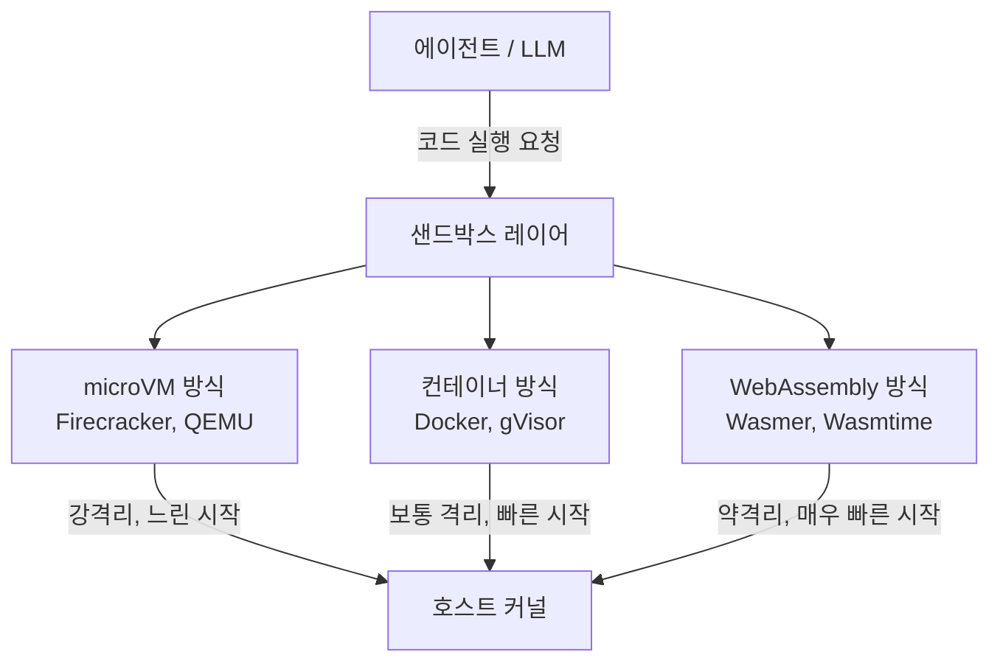
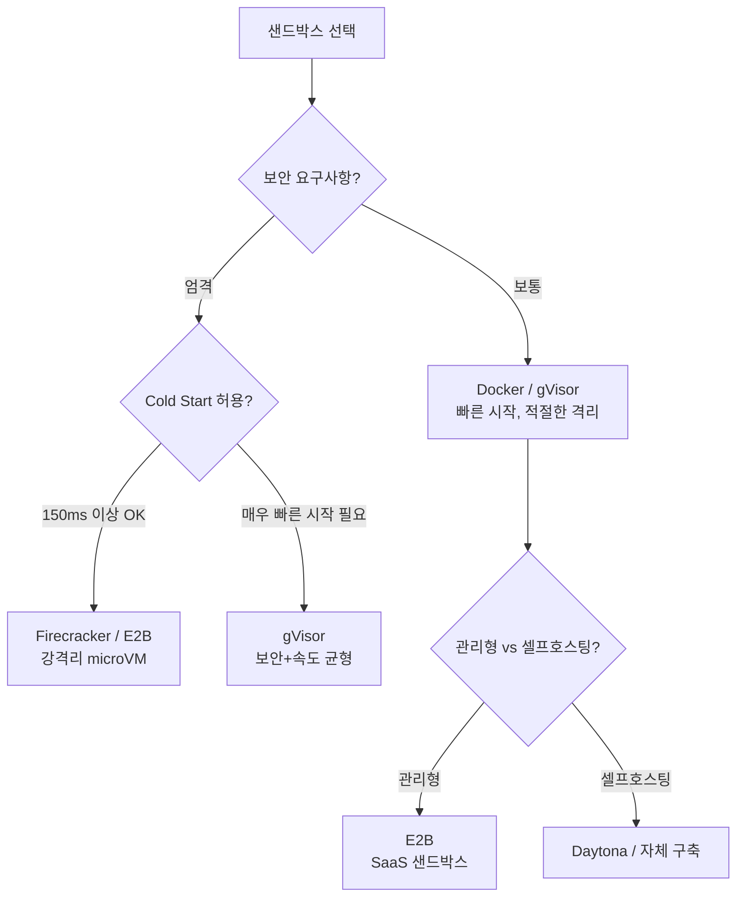

# 에이전트 샌드박스 인프라 (Agent Sandbox Infrastructure)

에이전트가 코드를 안전하게 실행할 수 있도록 격리된 실행 환경을 제공하는 인프라. 코드 실행 에이전트, 컴퓨터 사용 에이전트, 자율 개발 에이전트 모두 샌드박스 없이는 호스트 시스템을 위험에 노출한다.

## 왜 중요한가

LLM 에이전트가 생성한 코드는 악의적이거나 버그가 있을 수 있다. 파일 시스템 삭제, 네트워크 외부 유출, 무한 루프로 인한 자원 고갈 등 위험 행동이 호스트에 직접 영향을 주지 않도록 격리 계층이 필수다. 동시에 실행 환경은 빠르게 시작(cold start)되어야 하고, 에이전트 세션 간 독립적으로 초기화(stateless) 되어야 한다.

## 격리 기술 스택



## 주요 플랫폼 비교

### E2B

E2B는 AI 에이전트를 위한 관리형 코드 샌드박스 서비스다. 파이어크래커(Firecracker) microVM을 기반으로 하며, Python/TypeScript SDK를 제공한다.

**핵심 특징**:
- Cold start: ~150ms (Firecracker 기반)
- 파일 시스템 지속성: 세션 내 유지, 세션 종료 시 삭제
- 네트워크: 기본 차단, 허용 목록(allowlist) 방식
- 사전 구성된 환경(template) 시스템으로 빠른 프로비저닝

```python
# E2B SDK 예시 구조
from e2b_code_interpreter import Sandbox

with Sandbox() as sbx:
    execution = sbx.run_code("print('hello')", language="python")
    print(execution.logs.stdout)
```

### Daytona

오픈소스 개발 환경 관리 플랫폼으로 에이전트 워크스페이스(workspace) 개념을 사용한다. [[openai-agents-sdk-sandbox]]에서 지원하는 파트너 환경 중 하나다.

**핵심 특징**:
- DevContainer 스펙 기반 환경 정의
- Git 리포지토리 자동 클론 및 환경 설정
- IDE 연동 지원 (에이전트가 사람처럼 편집기 사용 가능)
- 셀프호스팅 또는 클라우드 배포

### Firecracker (기술 기반)

AWS가 오픈소스로 공개한 경량 microVM 하이퍼바이저. [[microvm-agent-sandboxes]] 범주의 대표 기술이다.

**핵심 특징**:
- KVM 기반, ~125ms cold start
- microVM당 메모리 오버헤드 ~5MB (Docker 대비 대폭 감소)
- 게스트 커널 완전 격리: 보안 수준이 컨테이너보다 높다
- AWS Lambda와 Fargate 백엔드로 사용됨

## 격리 수준 비교

| 기술 | 격리 수준 | Cold Start | 메모리 오버헤드 | 네트워크 제어 |
|------|-----------|-----------|----------------|--------------|
| Firecracker microVM | 최고 | ~125ms | ~5MB | 완전 제어 |
| gVisor (runsc) | 높음 | ~50ms | ~20MB | iptables 수준 |
| Docker (runc) | 보통 | ~30ms | ~30MB | iptables 수준 |
| WebAssembly | 낮음 | ~5ms | ~1MB | 제한적 |
| 네이티브 subprocess | 없음 | ~1ms | 없음 | 없음 |

## 에이전트 샌드박스 설계 원칙

**최소 권한(Least Privilege)**: 에이전트에게 필요한 최소한의 권한만 부여한다. 파일 시스템 접근을 특정 디렉토리로, 네트워크 접근을 허용된 도메인으로만 제한한다.

**상태 무결성(Stateless by Default)**: 세션 종료 시 모든 변경사항이 초기화되어야 한다. 지속성이 필요한 데이터만 명시적으로 외부 스토리지에 저장한다.

**자원 제한(Resource Quotas)**: CPU, 메모리, 디스크, 네트워크 대역폭에 상한을 설정한다. LLM이 생성한 코드가 `while True: pass` 류의 무한 루프를 실행해도 호스트에 영향이 없어야 한다.

**관측가능성(Observability)**: 샌드박스 내 실행된 명령, 파일 접근 패턴, 네트워크 요청을 로깅한다. 보안 감사와 디버깅에 필수다.

## 실무 선택 가이드



## 관련 문서

- [[microvm-agent-sandboxes]] - microVM 기반 샌드박스 기술 심화
- [[openai-agents-sdk-sandbox]] - OpenAI Agents SDK의 샌드박스 연동
- [[zero-trust-ai-agents]] - 에이전트 보안 전반
