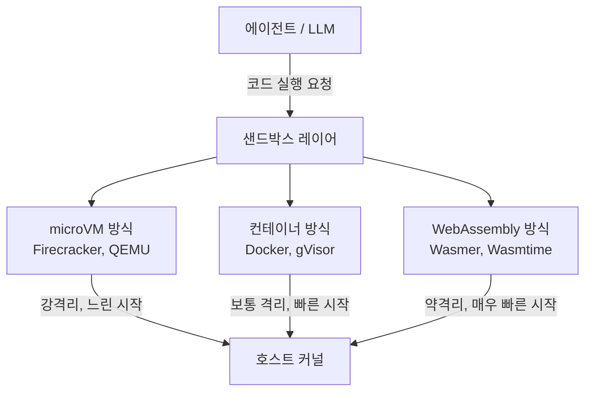
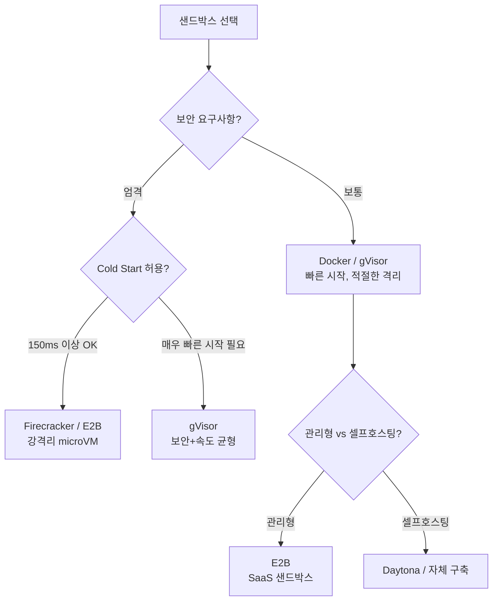

# 에이전트 샌드박스 인프라 (Agent Sandbox Infrastructure)

에이전트가 코드를 안전하게 실행할 수 있도록 격리된 실행 환경을 제공하는 인프라. 코드 실행 에이전트, 컴퓨터 사용 에이전트, 자율 개발 에이전트 모두 샌드박스 없이는 호스트 시스템을 위험에 노출한다.

## 왜 중요한가

LLM 에이전트가 생성한 코드는 악의적이거나 버그가 있을 수 있다. 파일 시스템 삭제, 네트워크 외부 유출, 무한 루프로 인한 자원 고갈 등 위험 행동이 호스트에 직접 영향을 주지 않도록 격리 계층이 필수다. 동시에 실행 환경은 빠르게 시작(cold start)되어야 하고, 에이전트 세션 간 독립적으로 초기화(stateless) 되어야 한다.

## 격리 기술 스택



## 주요 플랫폼 비교

### E2B

E2B는 AI 에이전트를 위한 관리형 코드 샌드박스 서비스다. 파이어크래커(Firecracker) microVM을 기반으로 하며, Python/TypeScript SDK를 제공한다.

**핵심 특징**:
- Cold start: ~150ms (Firecracker 기반)
- 파일 시스템 지속성: 세션 내 유지, 세션 종료 시 삭제
- 네트워크: 기본 차단, 허용 목록(allowlist) 방식
- 사전 구성된 환경(template) 시스템으로 빠른 프로비저닝

```python
# E2B SDK 예시 구조
from e2b_code_interpreter import Sandbox

with Sandbox() as sbx:
    execution = sbx.run_code("print('hello')", language="python")
    print(execution.logs.stdout)
```

### Daytona

오픈소스 개발 환경 관리 플랫폼으로 에이전트 워크스페이스(workspace) 개념을 사용한다. [[openai-agents-sdk-sandbox]]에서 지원하는 파트너 환경 중 하나다.

**핵심 특징**:
- DevContainer 스펙 기반 환경 정의
- Git 리포지토리 자동 클론 및 환경 설정
- IDE 연동 지원 (에이전트가 사람처럼 편집기 사용 가능)
- 셀프호스팅 또는 클라우드 배포

### Firecracker (기술 기반)

AWS가 오픈소스로 공개한 경량 microVM 하이퍼바이저. [[microvm-agent-sandboxes]] 범주의 대표 기술이다.

**핵심 특징**:
- KVM 기반, ~125ms cold start
- microVM당 메모리 오버헤드 ~5MB (Docker 대비 대폭 감소)
- 게스트 커널 완전 격리: 보안 수준이 컨테이너보다 높다
- AWS Lambda와 Fargate 백엔드로 사용됨

## 격리 수준 비교

| 기술 | 격리 수준 | Cold Start | 메모리 오버헤드 | 네트워크 제어 |
|------|-----------|-----------|----------------|--------------|
| Firecracker microVM | 최고 | ~125ms | ~5MB | 완전 제어 |
| gVisor (runsc) | 높음 | ~50ms | ~20MB | iptables 수준 |
| Docker (runc) | 보통 | ~30ms | ~30MB | iptables 수준 |
| WebAssembly | 낮음 | ~5ms | ~1MB | 제한적 |
| 네이티브 subprocess | 없음 | ~1ms | 없음 | 없음 |

## 에이전트 샌드박스 설계 원칙

**최소 권한(Least Privilege)**: 에이전트에게 필요한 최소한의 권한만 부여한다. 파일 시스템 접근을 특정 디렉토리로, 네트워크 접근을 허용된 도메인으로만 제한한다.

**상태 무결성(Stateless by Default)**: 세션 종료 시 모든 변경사항이 초기화되어야 한다. 지속성이 필요한 데이터만 명시적으로 외부 스토리지에 저장한다.

**자원 제한(Resource Quotas)**: CPU, 메모리, 디스크, 네트워크 대역폭에 상한을 설정한다. LLM이 생성한 코드가 `while True: pass` 류의 무한 루프를 실행해도 호스트에 영향이 없어야 한다.

**관측가능성(Observability)**: 샌드박스 내 실행된 명령, 파일 접근 패턴, 네트워크 요청을 로깅한다. 보안 감사와 디버깅에 필수다.

## 실무 선택 가이드



## 2026-05-06 보강 — Local Sandbox Stack & 운영 사례

### 운영 환경 표준 스택 (2026-05)

- **macOS**: `sandbox-exec` (Seatbelt) — Chrome 등 critical 3rd party 도 사용
- **Linux**: `bubblewrap` (namespaces) + `landlock` (filesystem LSM) + `seccomp`
  (syscall filter) 의 defense-in-depth
- **Windows**: native 미흡 → WSL2 안에서 Linux sandbox 실행 (Cursor 채택 패턴)

### 주요 도구 default 설정 (2026-05)

- **Claude Code**: Linux=bubblewrap, macOS=Seatbelt, **off by default**
- **OpenAI Codex**: Linux=Landlock+seccomp, **on by default** (sandboxing
  enabled by default 인 유일한 메이저 agent)
- **Cursor**: 위와 동일 + macOS Seatbelt 의 deprecated API 위험을 인지하고도 채택

### Linux Stack 구성 요소

#### bubblewrap

- 50KB sandbox binary, GNOME 팀 maintain, Flatpak 의 backend
- root 없이 실행 — `CLONE_NEWUSER` 로 user namespace 생성
- 격리: PID, UTS, IPC namespace
- mount isolation: ephemeral tmpfs `$HOME`, project dir 만 writable
- network: `--unshare-net` 로 완전 차단

#### Landlock LSM

- Linux 5.13 부터 kernel 에 포함 (root 권한 불필요)
- ABI V1 (5.13+), V2 (5.19+), V3 (6.2+) — graceful degradation
- 역할: filesystem access control at VFS level
- bubblewrap 보완 영역:
  - `/proc` 를 통한 escape path 차단
  - permitted mount 안에서의 symlink trick 방어

#### seccomp

- syscall whitelist/blacklist
- Codex 의 default sandbox 와 ai-jail 등에서 활용
- Landlock 이 filesystem 만 다루므로 seccomp 가 unsafe syscall 차단 담당

### macOS — sandbox-exec (Seatbelt)

- profile: SBPL (Sandbox Profile Language) — Apple deprecated 표시했으나 여전히 동작
- Cursor 는 runtime 에 dynamic profile 생성: "permissions with fine granularity,
  restricting syscalls and reads or writes to specific files and directories"
- **한계**: GPU (Metal), Display (Cocoa) 는 system-level 이라 sandbox-exec 로 제한 불가

### Threat Model — 차단 대상

1. **Credential theft**: dotfile (`.aws`, `.ssh`, `.gnupg`) unmount
2. **Supply-chain attack**: 컴파일된 dependency 가 filesystem 접근
3. **Persistent system modification**: system file read-only
4. **Symlink exploitation**: Landlock 이 permitted mount 내 symlink 차단
5. **`/proc` escape**: Landlock coverage

### 도구 비교 (실측)

| 도구 | 격리 강도 | 구동 비용 | 적합 환경 |
|---|---|---|---|
| sandbox-exec (Mac) | 중 | ms | macOS dev |
| bubblewrap+Landlock+seccomp | 중상 | ms | Linux dev |
| Firejail | 중 | ms | dev (setuid root 필요) |
| nsjail/minijail | 중상 | ms | production (복잡) |
| systemd-nspawn | 상 | seconds | system container |
| Docker | 상 | seconds | reproducible env |
| gVisor | 매우 상 | ~100ms+ | 멀티테넌트 untrusted code |
| Firecracker microVM | 최상 | ~125ms boot | per-tenant VM 격리 |
| e2b sandbox | 최상 (Firecracker) | API 호출 | hosted sandbox |
| OpenHands runtime | Docker container | seconds | agent eval |

### Cursor Production Data

- "Sandboxed agents stop 40% less often than unsandboxed ones, saving users
  hours of manual review and approval"
- "approximately a third of requests on supported platforms" 가 sandbox 에서 실행

### Defense in Depth — 운영 권장

1. **Process layer**: bubblewrap (Linux) / sandbox-exec (Mac)
2. **Filesystem layer**: Landlock (Linux) — bubblewrap 보완
3. **Syscall layer**: seccomp (Linux)
4. **Network layer**: 별도 firewall, agent 가 외부 access 시 explicit prompt
5. **Path-based**: Claude Code 의 protected paths (`.git`, `.bashrc`,
   `.mcp.json` 등) 정책 layer

### Hosted vs Local 결정 매트릭스

| 시나리오 | 권장 격리 |
|---|---|
| 로컬 dev, trusted user 가 LLM 호출 | sandbox-exec / bwrap+landlock+seccomp |
| 단일 조직 internal agent | container + bwrap layer |
| Multi-tenant SaaS agent | Firecracker microVM (e2b 등) |
| Untrusted user code 실행 | Firecracker + network 차단 |
| Compliance-critical | Confidential VM (SEV/TDX) |

### Network Policy 패턴

격리 강도와 별개로 network 는 별도 정책:

- **default off**: agent 외부 통신 명시 승인 필요 (Codex 패턴)
- **whitelist domain**: 특정 도메인만 허용 (npm registry, pypi 등)
- **proxy 강제**: 모든 outgoing traffic 이 logging proxy 통과
- **VPC 격리**: hosted sandbox 가 자체 VPC 에서만 작동

## 관련 문서

- [[microvm-agent-sandboxes]] - microVM 기반 샌드박스 기술 심화
- [[openai-agents-sdk-sandbox]] - OpenAI Agents SDK의 샌드박스 연동
- [[zero-trust-ai-agents]] - 에이전트 보안 전반
- [[claude-code-permission-modes]] - Claude Code 의 permission layer
- [[claude-code-auto-mode]] - classifier 기반 layer
- [[e2b-ai-sandbox]] - hosted sandbox
