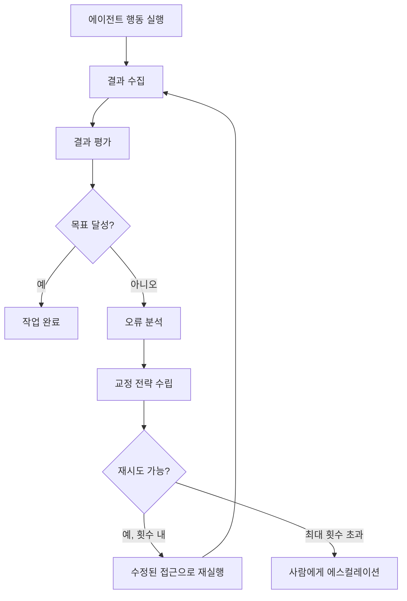
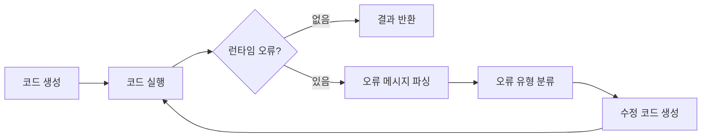
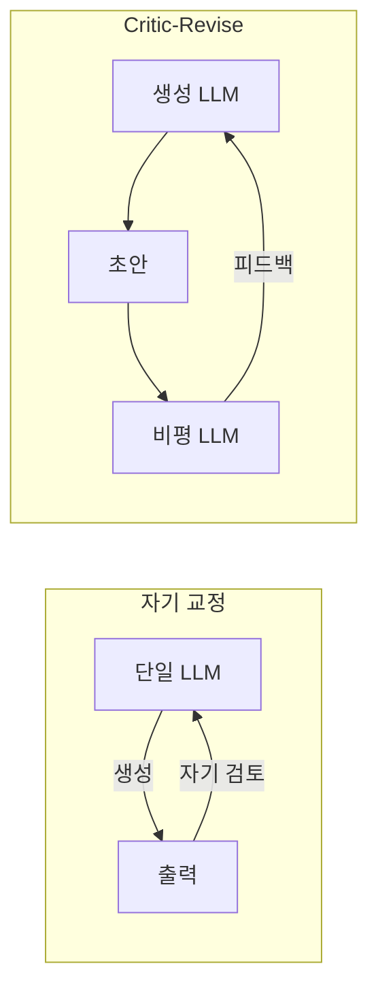

# 에이전트 자기 교정

## 개요

에이전트 자기 교정(Agent Self-Correction)은 LLM 에이전트가 자신의 실행 결과를 스스로 평가하고, 오류를 감지하면 원인을 분석해 수정된 접근으로 재시도하는 능력이다. 외부 피드백(사람, 검증 도구, 테스트 결과)을 내부화해 오류를 자율적으로 교정함으로써 에이전트의 **견고성(robustness)**과 **신뢰성**을 높인다.

자기 교정이 중요한 이유:
- LLM은 한 번의 출력이 완벽하지 않을 수 있다. 반복 교정으로 품질을 높인다
- 코드 실행 오류, API 실패, 형식 오류 등 예측 불가능한 환경 오류에 적응한다
- 첫 번째 접근이 잘못된 방향이었음을 인식하고 전략을 전환한다



## 자기 교정의 종류

### 1. 형식 오류 교정 (Format Correction)

LLM이 생성한 출력이 기대하는 형식(JSON, Python 코드, 특정 구조)에 맞지 않을 때 자동으로 재시도하는 가장 기본적인 자기 교정이다.

```python
import json
from pydantic import BaseModel, ValidationError

class UserProfile(BaseModel):
    name: str
    age: int
    email: str

def generate_with_retry(prompt: str, schema: type[BaseModel], llm, max_retries: int = 3):
    """스키마 검증 실패 시 오류 메시지를 포함해 재시도한다."""
    last_error = None
    
    for attempt in range(max_retries):
        output = llm.generate(
            prompt if attempt == 0 else
            f"{prompt}\n\n이전 시도 오류: {last_error}\n위 오류를 수정해서 올바른 JSON을 출력하세요."
        )
        
        try:
            return schema.model_validate_json(output)
        except (ValidationError, json.JSONDecodeError) as e:
            last_error = str(e)
    
    raise ValueError(f"{max_retries}회 시도 후에도 유효한 출력 생성 실패")
```

### 2. 실행 오류 교정 (Execution Error Correction)

코드 실행, API 호출, 파일 시스템 접근 등 실제 동작 중 발생한 오류를 분석하고 수정한다.



**오류 유형별 교정 전략:**

| 오류 유형 | 예시 | 교정 전략 |
|----------|------|----------|
| SyntaxError | 들여쓰기 오류, 닫히지 않은 괄호 | 구문 오류 위치 안내 후 재생성 |
| ImportError | 존재하지 않는 모듈 | 올바른 모듈명 제시 후 수정 |
| AttributeError | 없는 메서드/속성 접근 | API 문서 참조 후 수정 |
| TypeError | 잘못된 타입 전달 | 타입 힌트 강조 후 수정 |
| RuntimeError | 논리 오류, 무한 루프 | 로직 재검토 지시 |

### 3. 논리 오류 교정 (Logic Correction)

실행은 성공했지만 결과가 잘못된 경우다. 이는 형식적 오류보다 감지하기 어렵다.

```python
def verify_answer(question: str, answer: str, llm) -> tuple[bool, str]:
    """생성된 답변이 논리적으로 올바른지 별도 검증을 수행한다."""
    verification_prompt = f"""
    다음 질문과 답변을 검토하세요.
    
    질문: {question}
    답변: {answer}
    
    이 답변에 논리적 오류나 사실 오류가 있는지 확인하세요.
    오류가 있다면 구체적으로 어떤 부분이 틀렸는지 설명하고,
    오류가 없다면 "정확함"이라고만 답하세요.
    """
    feedback = llm.generate(verification_prompt)
    is_correct = "정확함" in feedback
    return is_correct, feedback
```

### 4. 계획 수준 교정 (Plan-Level Correction)

현재 실행 중인 계획 자체가 잘못된 방향임을 인식하고 전략적으로 접근을 전환한다.

[[reflexion]] 패턴에서 발전된 형태로, 에피소드 메모리에 이전 실패 원인을 기록해 다음 시도에서 같은 실수를 반복하지 않는다.

```python
@dataclass
class ReflectionMemory:
    failed_attempts: list[dict]  # {"approach": ..., "failure_reason": ...}
    
def reflect_and_replan(task: str, memory: ReflectionMemory, llm) -> str:
    """이전 실패를 반성하고 새로운 계획을 수립한다."""
    
    failure_summary = "\n".join([
        f"- 시도: {a['approach']}, 실패 이유: {a['failure_reason']}"
        for a in memory.failed_attempts
    ])
    
    prompt = f"""
    태스크: {task}
    
    이전 실패 기록:
    {failure_summary}
    
    위 실패를 바탕으로 다음 사항을 고려한 새로운 계획을 수립하세요:
    1. 이전에 시도한 방법은 피하세요
    2. 실패 원인을 구체적으로 해결하는 접근을 선택하세요
    3. 더 보수적이고 단계적인 방법을 선호하세요
    """
    return llm.generate(prompt)
```

## 환각(Hallucination) 억제와 자기 교정

자기 교정의 중요한 응용 중 하나는 LLM 환각을 줄이는 것이다. 환각은 LLM이 사실처럼 들리지만 실제로는 틀린 정보를 생성하는 현상이다.

### 자기 검증 (Self-Verification)

에이전트가 자신의 출력을 다시 읽고 검증한다:

```python
def self_verify(claim: str, source_context: str, llm) -> tuple[bool, str]:
    """에이전트가 자신이 생성한 주장을 소스에서 검증한다."""
    prompt = f"""
    다음 주장이 제공된 소스 컨텍스트에서 지지되는지 확인하세요.
    
    주장: {claim}
    
    소스:
    {source_context}
    
    주장이 소스에서 명확히 지지된다면 "확인됨"을,
    지지되지 않거나 상충한다면 구체적인 문제를 설명하세요.
    """
    result = llm.generate(prompt)
    return result.startswith("확인됨"), result
```

### 소크라테스식 반성 (Socratic Self-Questioning)

에이전트가 자신의 추론에 의문을 제기하는 질문을 스스로 생성하고 답한다:

```
내가 방금 생성한 답변: {answer}

이 답변에 대해 비판적으로 검토하세요:
- 이 주장의 근거는 무엇인가?
- 반론이 있다면?
- 내가 놓친 중요한 관점이 있는가?
- 더 확실한 증거가 필요한 부분이 있는가?
```

## [[critic-revise-pattern]]과의 관계

자기 교정은 단일 에이전트 내부에서 일어나는 반면, [[critic-revise-pattern]]은 별도의 비평자(Critic) 에이전트와 수정자(Reviser) 에이전트를 분리하는 패턴이다. 두 가지 모두 반복 개선 루프를 사용하지만:

- **자기 교정**: 동일 LLM이 생성자 + 검증자 역할을 모두 수행 (비용 낮음, 편향 가능성)
- **Critic-Revise**: 역할을 분리하거나 다른 모델을 사용 (비용 높음, 더 독립적인 피드백)



## 재시도 정책 설계

무한 재시도는 비용과 시간을 낭비한다. 실용적인 재시도 정책:

| 오류 유형 | 최대 재시도 | 전략 |
|----------|------------|------|
| 형식 오류 | 3회 | 오류 메시지 포함해 재시도 |
| 일시적 API 오류 | 5회 | 지수 백오프 |
| 논리 오류 | 2회 | 다른 접근으로 전환 |
| 계획 실패 | 2회 | 상위 수준 재계획 |
| 근본적 이해 부재 | 0회 | 즉시 사람에게 에스컬레이션 |

```python
from enum import Enum

class ErrorCategory(Enum):
    FORMAT = "format"         # 형식 오류: 재시도 가능
    TRANSIENT = "transient"   # 일시적 오류: 대기 후 재시도
    LOGIC = "logic"           # 논리 오류: 전략 전환
    FATAL = "fatal"           # 치명적 오류: 에스컬레이션

def categorize_error(error: Exception, context: str, llm) -> ErrorCategory:
    """오류를 분류해 적절한 재시도 전략을 결정한다."""
    if isinstance(error, (ValueError, json.JSONDecodeError)):
        return ErrorCategory.FORMAT
    if isinstance(error, (TimeoutError, ConnectionError)):
        return ErrorCategory.TRANSIENT
    # LLM으로 오류 의미를 파악해 분류
    classification = llm.generate(f"오류 분류: {error}\n맥락: {context}")
    return ErrorCategory[classification.upper()]
```

## 자기 교정 품질 평가

자기 교정이 실제로 효과를 내는지 측정하는 지표:

| 지표 | 설명 |
|------|------|
| 교정 성공률 | 재시도 후 목표 달성 비율 |
| 평균 재시도 횟수 | 태스크당 평균 교정 시도 수 |
| 교정 수렴률 | 같은 오류가 반복되지 않는 비율 |
| 과교정률 | 교정 과정에서 새로운 오류를 도입하는 비율 |

## 한계와 트레이드오프

- **자기 기만**: LLM이 자신의 오류를 인식하지 못할 수 있다. 특히 지식 한계에서 비롯한 환각은 자기 교정으로 해결하기 어렵다
- **비용 증가**: 교정 루프마다 추가 LLM 호출이 필요해 비용이 증가한다
- **수렴 실패**: 잘못된 전제에서 출발하면 아무리 교정해도 올바른 답에 도달하지 못할 수 있다
- **과적합**: 특정 테스트를 통과하기 위해 테스트를 우회하는 방향으로 교정이 일어날 수 있다

## 관련 문서

- [[critic-revise-pattern]] -- 비평자-수정자 분리 패턴
- [[reflexion]] -- 언어적 자기반성으로 에이전트 개선
- [[coding-agent-tdd]] -- TDD로 에이전트 교정 방향 고정
- [[agent-fallback-strategies]] -- 교정 실패 시 폴백 전략
- [[hallucination]] -- 환각 현상과 완화 전략
