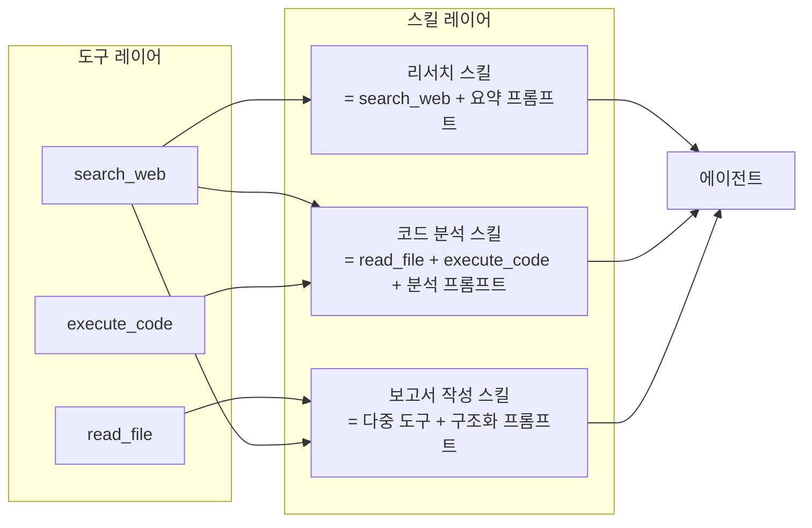
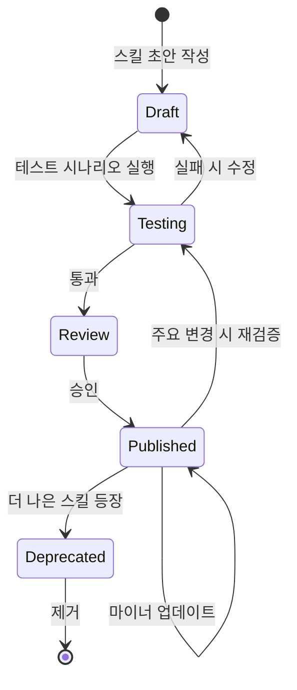
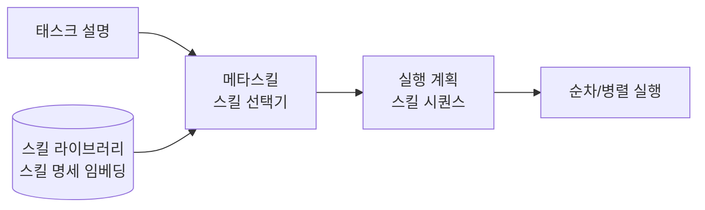

# 에이전트 스킬 라이브러리

에이전트 스킬 라이브러리(agent skill library)란 에이전트가 재사용 가능한 능력을 패키지화하여 여러 에이전트 또는 태스크에서 동일한 역량을 일관성 있게 활용할 수 있도록 하는 아키텍처 패턴이다. 스킬은 도구(tool)보다 고수준이며, 특정 목적을 위한 도구 + 프롬프트 + 실행 로직의 조합이다.

## 스킬 vs 도구의 차이



도구가 원자적 기능이라면, 스킬은 목적 지향적 능력이다. 스킬은 내부적으로 여러 도구를 조율하며 일관된 출력 형식과 오류 처리를 포함한다.

## 스킬 구성 요소

잘 설계된 스킬 패키지는 다음 요소를 포함한다.

**1. 스킬 명세 (Specification)**
스킬이 무엇을 하는지, 어떤 입력을 받는지, 어떤 출력을 반환하는지 정의한다. [[agent-skills-specification]]에서 다루는 형식적 명세 방법이 여기에 적용된다.

**2. 실행 로직 (Execution Logic)**
도구 호출 순서, 조건 분기, 오류 처리를 포함한 실제 실행 코드다.

**3. 가이드 프롬프트 (Guiding Prompt)**
스킬 실행 중 LLM이 참조하는 역할 지시, 출력 형식, 품질 기준을 담은 프롬프트다.

**4. 테스트 시나리오 (Test Scenarios)**
스킬의 올바른 동작을 검증하는 입력-출력 쌍 또는 행동 기준이다.

## [[agent-skills]]와의 관계

[[agent-skills]]는 스킬 개념의 전반적 패러다임을 다루고, 이 페이지는 스킬을 라이브러리로 패키지화하고 관리하는 인프라 측면에 집중한다.

스킬 라이브러리의 핵심 요구사항:

| 요구사항 | 설명 |
|----------|------|
| 검색 가능성 | 에이전트가 태스크에 필요한 스킬을 이름, 태그, 설명으로 검색 |
| 버전 관리 | 스킬 업데이트 시 기존 에이전트와의 호환성 유지 |
| 컴포저빌리티 | 스킬 간 조합으로 더 복잡한 능력 구성 |
| 격리 | 스킬 실행 오류가 다른 스킬이나 에이전트 전체에 영향 없음 |

## 스킬 생명주기



스킬은 코드 라이브러리처럼 생명주기를 갖는다. Published 상태의 스킬은 안정적으로 사용 가능하고, Deprecated 스킬은 대체 스킬로 마이그레이션을 안내한다.

## 스킬 조합 패턴

복잡한 태스크는 단일 스킬로 처리하기 어렵다. 스킬을 조합하는 세 가지 패턴이 있다.

**순차 파이프라인**
```python
result = await skill_library.run_pipeline([
    ("research_skill", {"query": topic}),
    ("summarize_skill", {"max_length": 500}),
    ("translate_skill", {"target_lang": "ko"}),
])
```

**병렬 실행**
```python
results = await skill_library.run_parallel([
    ("web_search_skill", {"query": q1}),
    ("knowledge_base_skill", {"query": q1}),
])
merged = skill_library.merge_results(results)
```

**조건부 분기**
```python
classification = await skill_library.run("classify_skill", {"input": text})
if classification == "code":
    result = await skill_library.run("code_analysis_skill", {"input": text})
else:
    result = await skill_library.run("text_analysis_skill", {"input": text})
```

## 메타스킬: 스킬 선택 스킬

스킬 라이브러리가 커질수록 에이전트가 주어진 태스크에 어떤 스킬을 사용할지 결정하는 것 자체가 도전이 된다. 이를 해결하는 메타스킬(meta-skill)은 태스크 설명을 입력으로 받아 최적 스킬 조합을 반환한다.



메타스킬은 스킬 명세를 임베딩해 벡터 유사도 검색으로 후보를 좁힌 뒤, LLM으로 최종 조합을 결정한다.

## 실무 관점

- 스킬은 처음부터 너무 세분화하지 않는다. 실제 사용 패턴을 관찰하고 반복되는 도구 조합을 스킬로 추출하는 bottom-up 접근이 효과적이다.
- 스킬 명세를 자연어로 충분히 상세하게 작성해야 에이전트가 올바른 상황에 올바른 스킬을 선택한다. "무엇을 하는지"보다 "언제 사용하는지"를 명시하는 것이 중요하다.
- 스킬 라이브러리 규모가 커지면 사용되지 않는 스킬이 노이즈로 작용해 선택 오류를 높인다. 사용 빈도 모니터링으로 저활용 스킬을 Deprecated 처리한다.

## 관련 문서

- [[agent-skills]] - 에이전트 스킬의 전반적 개념과 패러다임
- [[agent-skills-specification]] - 스킬 명세를 형식화하는 방법
- [[agent-workflow-patterns]] - 스킬을 조합해 워크플로우를 구성하는 패턴
- [[agent-memory-systems]] - 스킬 실행 결과를 저장하고 재활용하는 메모리 시스템
