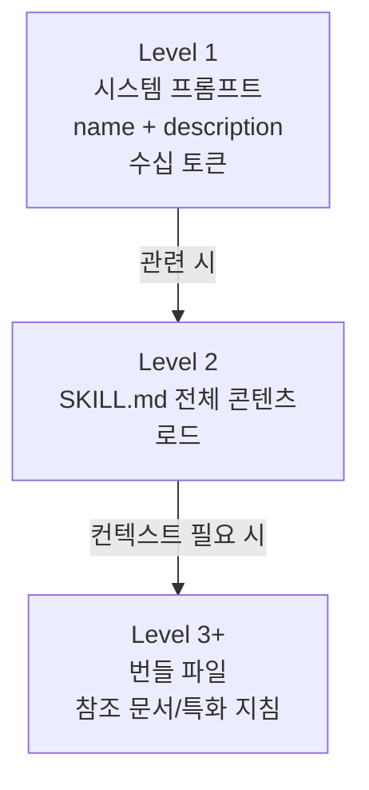

# Agent Skills

에이전트가 파일시스템에 저장된 SKILL.md 폴더를 메타데이터 → 본문 → 리소스 3단계로 점진적 로딩하는 능력 패키징 표준. 또한 SKILL.md 프론트매터와 참고 파일·스크립트 번들로 [[agentic-ai-foundation|에이전트]] 역량을 모듈화하는 오픈 표준.

## 핵심 정의 (Anthropic 원문)

> "organized folders of instructions, scripts, and resources that agents can discover and load dynamically"

각 use case별 커스텀 에이전트를 빌드하는 대신, **재사용 가능 능력으로 기존 에이전트를 특화** — "onboarding 가이드 작성"과 유사하다.

## Progressive Disclosure (3단계 정보 구조)

1. **Level 1**: 시스템 프롬프트의 skill 이름 + 설명
2. **Level 2**: 관련 시 SKILL.md 전체 콘텐츠 로드
3. **Level 3+**: 컨텍스트별 추가 번들 파일 (참조 문서, 특화 지침)

PDF skill 예시:
- 핵심 지침은 SKILL.md에
- form-filling 가이드는 별도 `forms.md`에 — 필요 시에만 접근

## SKILL.md 구조

모든 skill은 `SKILL.md`로 시작 — YAML frontmatter:
- **name**: skill 식별자
- **description**: 목적 요약

이 메타데이터가 시작 시 Claude의 시스템 프롬프트에 로드 → skill 사용 적절성 인식.

## Code Execution 통합

Skills는 실행 가능 스크립트(Python, Bash)를 번들 가능 — Claude가 결정적으로 실행.

PDF skill 예시: form fields 추출 Python 스크립트 — 전체 PDF나 스크립트 코드를 컨텍스트에 차지하지 않음.

## 개발 모범 사례 (Anthropic 권고)

- **Capability gaps 식별** — 대표적 작업 테스트
- **Scale 구조** — 거대한 SKILL.md 분할, 상호 배타적 컨텍스트 분리
- **Skill naming 우선** — Claude가 name/description으로 활성화 결정
- **협업 반복** — Claude의 사용 패턴/실패 자가 반성
- **보안 audit** — 파일 콘텐츠, 코드 의존성, 외부 연결 사전 검토

## 보안 고려사항

> "Install skills only from trusted sources"

- 알 수 없는 skill은 audit
- 번들 코드 의존성, 리소스 파일, untrusted 외부 연결 지시문 검토

## 가용성

지원 환경:
- Claude.ai
- Claude Code
- Claude Agent SDK
- Claude Developer Platform

## Simon Willison의 평가

> "Skills will trigger a Cambrian explosion that will make this year's MCP rush look pedestrian"

자세한 비교 분석은 [[claude-skills-vs-mcp]] 참조.

## 왜 중요한가

2025년 10월 Anthropic이 "Equipping agents for the real world with Agent Skills"로 공개한 후 12월 오픈 스펙으로 표준화되었고, 2026년 들어 OpenAI Codex CLI/ChatGPT, Microsoft Copilot, VS Code 등이 동일 포맷을 채택하면서 사실상 산업 표준 컨텍스트 패키징 형식이 되었다.

[[how-coding-agents-work|Claude Code]]가 `.claude/commands/`와 슬래시 커맨드를 `.claude/skills/`로 합병하면서 agentskills.io 오픈 표준이 공식화됐고, `disable-model-invocation`·`paths`·`context: fork`·`${CLAUDE_SKILL_DIR}` 같은 세밀한 제어 필드가 2026년 초 추가되며 여러 코딩 에이전트에 공통 포맷으로 퍼지기 시작했다.

## 대표 레퍼런스

- [Equipping agents for the real world with Agent Skills](https://claude.com/blog/equipping-agents-for-the-real-world-with-agent-skills)
- [Agent Skills Specification](https://agentskills.io/specification)
- [anthropics/skills GitHub Repository](https://github.com/anthropics/skills)
- [Agent Skills (Claude API Docs)](https://platform.claude.com/docs/en/agents-and-tools/agent-skills/overview)
- [Writing effective tools for agents (Anthropic)](https://www.anthropic.com/engineering/writing-tools-for-agents)
- [Extend Claude with skills](https://code.claude.com/docs/en/skills)
- [anthropics/skills (GitHub)](https://github.com/anthropics/skills)
- [Claude Code Changelog](https://code.claude.com/docs/en/changelog)
- [Discover and install plugins through marketplaces](https://code.claude.com/docs/en/discover-plugins)
- [Claude Agent SDK Overview](https://code.claude.com/docs/en/agent-sdk/overview)

[[agent-skills-specification|에이전트 스킬 스펙]]은 skill의 frontmatter 필드 및 디렉토리 구조를 정의한다. [[agent-memory-systems|메모리 시스템]]과 함께 설계해야 장기 실행 에이전트에서 효과적이다.

## 관련 문서

- [[ai-hot-topics-2026-04|2026년 4월 AI 개발 핫토픽 100선]]
- [[agent-memory-systems|Agent Memory Systems (Episodic / Semantic / Working)]]
- [[long-horizon-rl-training-for-agents|Long-Horizon RL Training for Agents (Multi-Turn RLVR)]]
- [[subagents|Subagents]]
- [[agent-skills-specification|Agent Skills Specification]] — 공식 skill packaging 스펙 요약
- [[claude-skills-vs-mcp]] — Simon Willison의 Skills vs MCP 비교
- [[mcp-code-execution]] — MCP를 코드 실행 패턴으로 (보완재)
- [[tool-design-for-agents]] — 도구 설계 가이드
