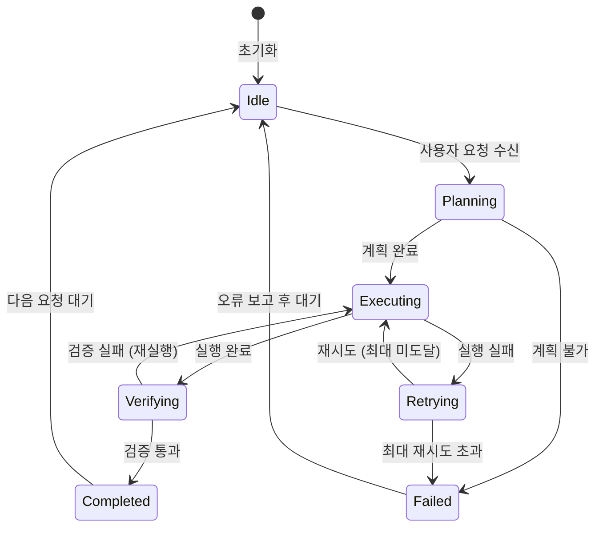
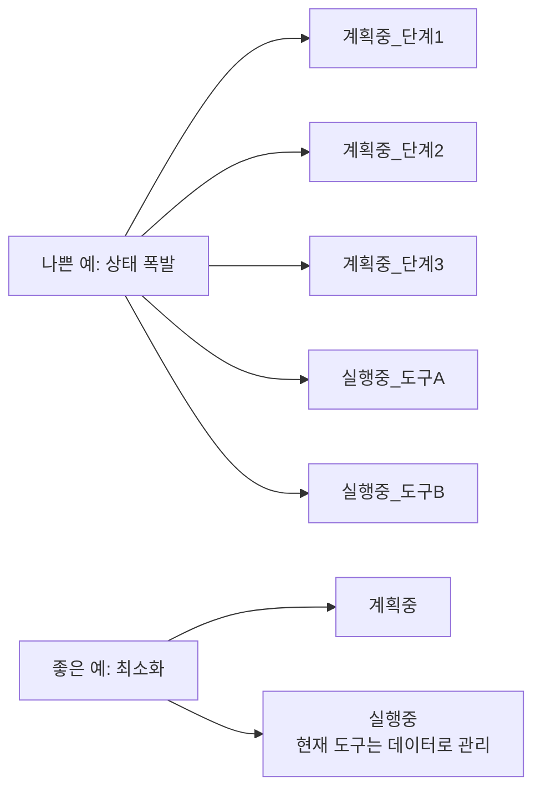
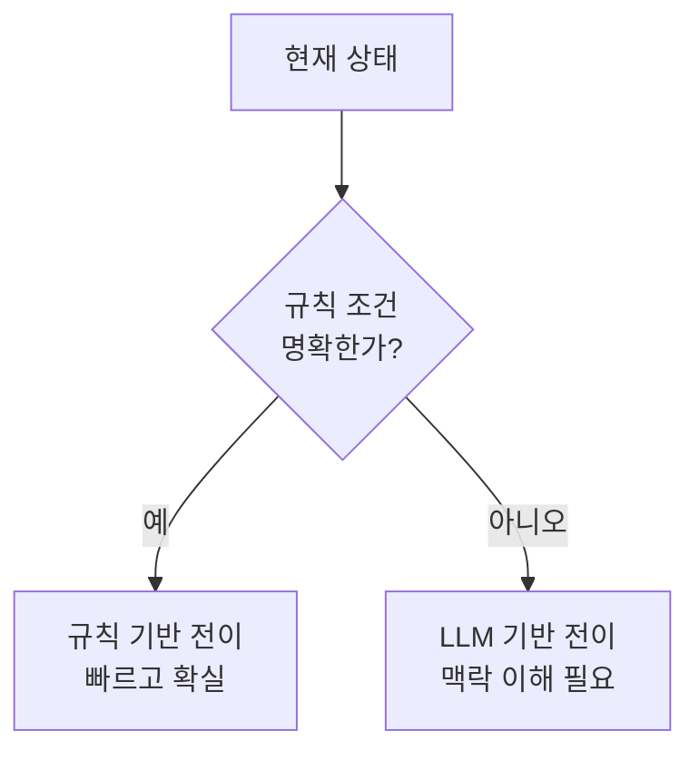
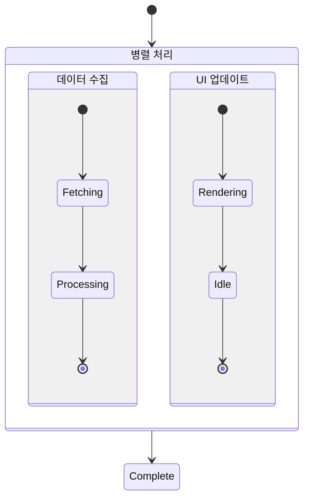
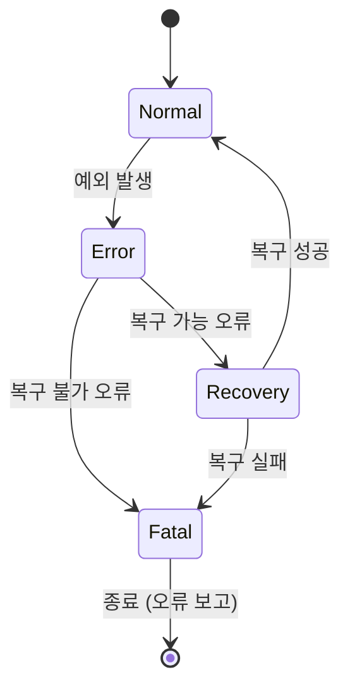
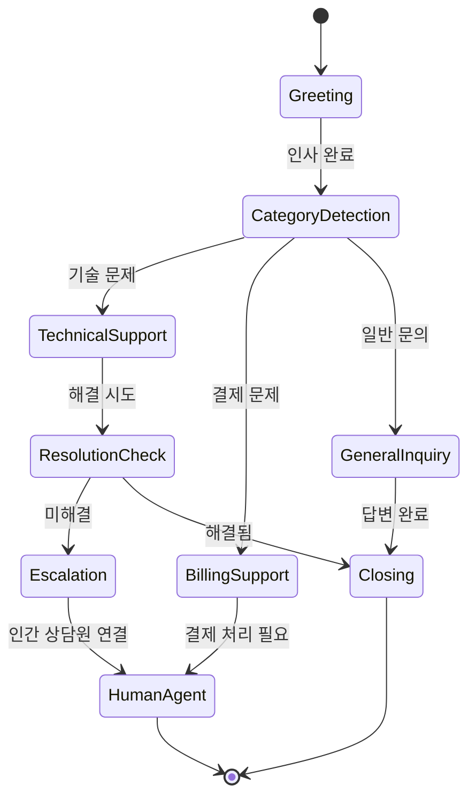

# 에이전트 유한 상태 머신 패턴

## 개요

에이전트 유한 상태 머신(Finite State Machine, FSM) 패턴은 에이전트의 동작을 명시적인 상태(state)와 전이 규칙(transition rule)으로 정의하는 설계 방식이다. 에이전트가 현재 어떤 상태에 있는지, 어떤 조건에서 다음 상태로 이동하는지를 코드나 그래프로 명시한다.

자유로운 LLM 추론에 의존하는 ReAct 루프와 달리, FSM 기반 에이전트는 허용된 전이만 실행할 수 있어 예측 가능성과 디버깅 용이성이 높다. LangGraph가 이 패턴을 LLM 에이전트 영역에서 가장 대중화한 프레임워크다.

## 왜 중요한가

- **예측 가능성**: 허용된 상태 전이만 발생하므로 에이전트가 "이상한 경로"로 이탈하지 않음
- **디버깅**: 현재 상태와 전이 이력을 추적하면 오류 위치를 정확히 파악 가능
- **재현성**: 동일 입력과 상태에서 동일한 전이가 발생
- **감사 가능성(auditability)**: 규제 요건이 있는 도메인에서 에이전트 행동 증명 가능
- **복잡 워크플로우 표현**: 단순 선형 체인으로 표현하기 어려운 분기, 루프, 병렬 구조를 자연스럽게 모델링

## 기본 FSM 구조



이 다이어그램이 보여주는 것: 에이전트는 정의된 상태 집합(Idle, Planning, Executing, Verifying, Retrying, Completed, Failed) 중 항상 정확히 하나에 있으며, 정의된 전이 경로로만 이동한다.

## LangGraph에서의 구현

LangGraph는 에이전트 워크플로우를 노드(node)와 엣지(edge)로 정의하는 그래프 기반 프레임워크다. FSM 패턴을 자연스럽게 표현한다.

```python
from langgraph.graph import StateGraph, END
from typing import TypedDict, Literal

# 에이전트 상태 정의
class AgentState(TypedDict):
    messages: list[dict]
    plan: str | None
    execution_result: str | None
    retry_count: int
    status: Literal["planning", "executing", "verifying", "completed", "failed"]

# 노드(상태별 처리 함수) 정의
def plan_node(state: AgentState) -> AgentState:
    """계획 수립 노드"""
    # LLM으로 계획 생성
    plan = generate_plan(state["messages"])
    return {**state, "plan": plan, "status": "executing"}

def execute_node(state: AgentState) -> AgentState:
    """실행 노드"""
    result = execute_plan(state["plan"])
    if result.success:
        return {**state, "execution_result": result.output, "status": "verifying"}
    return {**state, "retry_count": state["retry_count"] + 1, "status": "retrying"}

def verify_node(state: AgentState) -> AgentState:
    """검증 노드"""
    if verify_result(state["execution_result"]):
        return {**state, "status": "completed"}
    return {**state, "status": "executing"}

# 엣지 조건(전이 규칙) 정의
def route_after_execute(state: AgentState) -> str:
    if state["status"] == "verifying":
        return "verify"
    if state["retry_count"] >= 3:
        return "fail"
    return "retry"

# 그래프 구성
workflow = StateGraph(AgentState)
workflow.add_node("plan", plan_node)
workflow.add_node("execute", execute_node)
workflow.add_node("verify", verify_node)

workflow.set_entry_point("plan")
workflow.add_conditional_edges("execute", route_after_execute, {
    "verify": "verify",
    "fail": END,
    "retry": "execute"
})
workflow.add_edge("verify", END)

app = workflow.compile()
```

## 상태 설계 원칙

좋은 FSM 상태 설계의 핵심 원칙.

### 최소 완전성(Minimal Completeness)

상태는 시스템이 가질 수 있는 모든 상황을 커버하되, 가능한 한 적어야 한다.



도구 이름이나 단계 번호는 상태에 포함하지 말고 상태 데이터(state data)로 분리한다.

### 상태 vs. 데이터 구분

| 상태에 포함할 것 | 데이터에 포함할 것 |
|----------------|-----------------|
| 에이전트가 무엇을 하고 있는가 | 현재 처리 중인 구체적 내용 |
| 어떤 전이가 가능한가 | 실행 이력, 결과값 |
| 전반적인 진행 단계 | 재시도 횟수, 오류 메시지 |

## 전이 조건(Transition Condition) 패턴

### LLM 기반 전이

LLM이 다음 상태를 결정하는 방식. 유연하지만 비결정적.

```python
def llm_router(state: AgentState) -> str:
    response = llm.invoke(
        f"현재 상황: {state['execution_result']}\n"
        "다음 단계를 선택하라: verify / retry / fail"
    )
    return parse_next_state(response)
```

### 규칙 기반 전이

코드 규칙으로 전이를 결정. 예측 가능하고 빠름.

```python
def rule_based_router(state: AgentState) -> str:
    if state["retry_count"] >= MAX_RETRIES:
        return "fail"
    if state["execution_result"] and "error" not in state["execution_result"].lower():
        return "verify"
    return "retry"
```

### 하이브리드 전이

중요한 전이는 규칙으로, 판단이 필요한 전이만 LLM으로.



실무에서는 하이브리드가 가장 효과적이다. 재시도 한도, 오류 코드 처리 등은 규칙으로, "이 결과가 충분히 좋은가?"는 LLM으로.

## 중단점(Checkpoints)과 영속성(Persistence)

LangGraph는 상태를 체크포인트로 저장해 중단된 에이전트를 재개할 수 있다.

```python
from langgraph.checkpoint.memory import MemorySaver

# 메모리 체크포인터 (프로덕션에서는 DB 기반 사용)
checkpointer = MemorySaver()
app = workflow.compile(checkpointer=checkpointer)

# 실행 (스레드 ID로 상태 추적)
config = {"configurable": {"thread_id": "session-001"}}
result = app.invoke(initial_state, config=config)

# 나중에 동일 스레드 ID로 재개
resumed = app.invoke(None, config=config)  # 중단 지점부터 재개
```

이를 통해 [[agent-interrupt-resume]] 패턴을 자연스럽게 구현할 수 있다.

## 병렬 상태 (Parallel States)

FSM의 확장인 Statechart는 독립적인 상태 기계를 병렬로 실행할 수 있다.



LangGraph에서 `send` API를 사용해 병렬 노드를 구현한다.

## 에러 상태 관리



에러를 단일 상태로 모델링하지 말고, 복구 가능/불가 여부를 구분하는 것이 중요하다.

## FSM vs. ReAct 에이전트 비교

| 비교 항목 | FSM 에이전트 | ReAct 에이전트 |
|-----------|------------|--------------|
| 예측 가능성 | 높음 (정해진 전이) | 낮음 (LLM 자유 결정) |
| 유연성 | 낮음 (사전 정의 필요) | 높음 (자율 판단) |
| 디버깅 | 쉬움 (상태 이력 추적) | 어려움 |
| 적합한 문제 | 구조화된 비즈니스 프로세스 | 탐색적 문제 해결 |
| 상태 공간 | 유한, 사전 정의 | 동적, 무제한 |
| 감사 가능성 | 매우 높음 | 낮음 |

## 실제 적용 사례

### 고객 지원 에이전트



### CI/CD 파이프라인 에이전트

```
상태: Build -> Test -> Scan -> Deploy -> Verify -> Complete
전이 조건:
  Build 실패 -> 개발자 알림 후 종료
  Test 실패 -> 실패 리포트 생성 후 종료
  Scan 고위험 -> 자동 배포 차단
  Deploy 실패 -> 자동 롤백
```

## 한계 및 트레이드오프

### 장점
- 명확한 동작 보장
- 쉬운 테스트 (각 상태 독립 테스트)
- 운영팀이 이해하기 쉬운 구조

### 단점
- **상태 폭발(state explosion)**: 복잡한 시스템에서 상태 수가 기하급수적으로 증가
- **사전 설계 비용**: 모든 상태와 전이를 미리 정의해야 함 → 탐색적 태스크에 부적합
- **경직성**: 사전 정의되지 않은 상황 처리가 어렵고, 새 요구사항 반영 시 설계 변경 필요
- **LLM 자율성 억제**: 창의적 문제 해결이 필요한 경우 FSM이 제약이 됨

## 관련 문서

- [[agent-workflow-patterns]] - 에이전트 워크플로우 일반 패턴
- [[agent-interrupt-resume]] - 상태 기반 중단 및 재개
- [[react-pattern]] - 비구조적 추론-행동 루프 패턴
- [[agent-event-driven-pattern]] - 이벤트 기반 상태 전이
- [[agent-planning-strategies]] - 에이전트 계획 전략
- [[deterministic-workflows]] - 결정론적 워크플로우 설계
