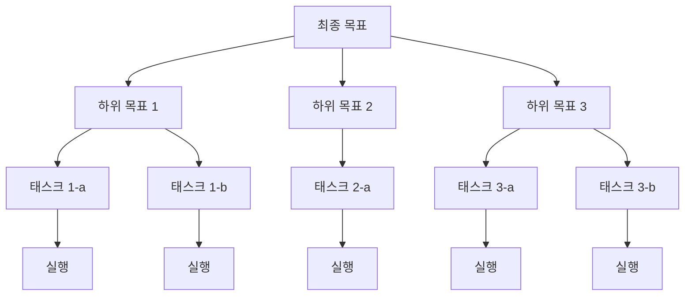
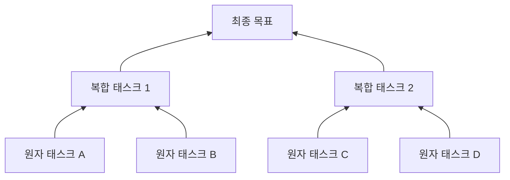
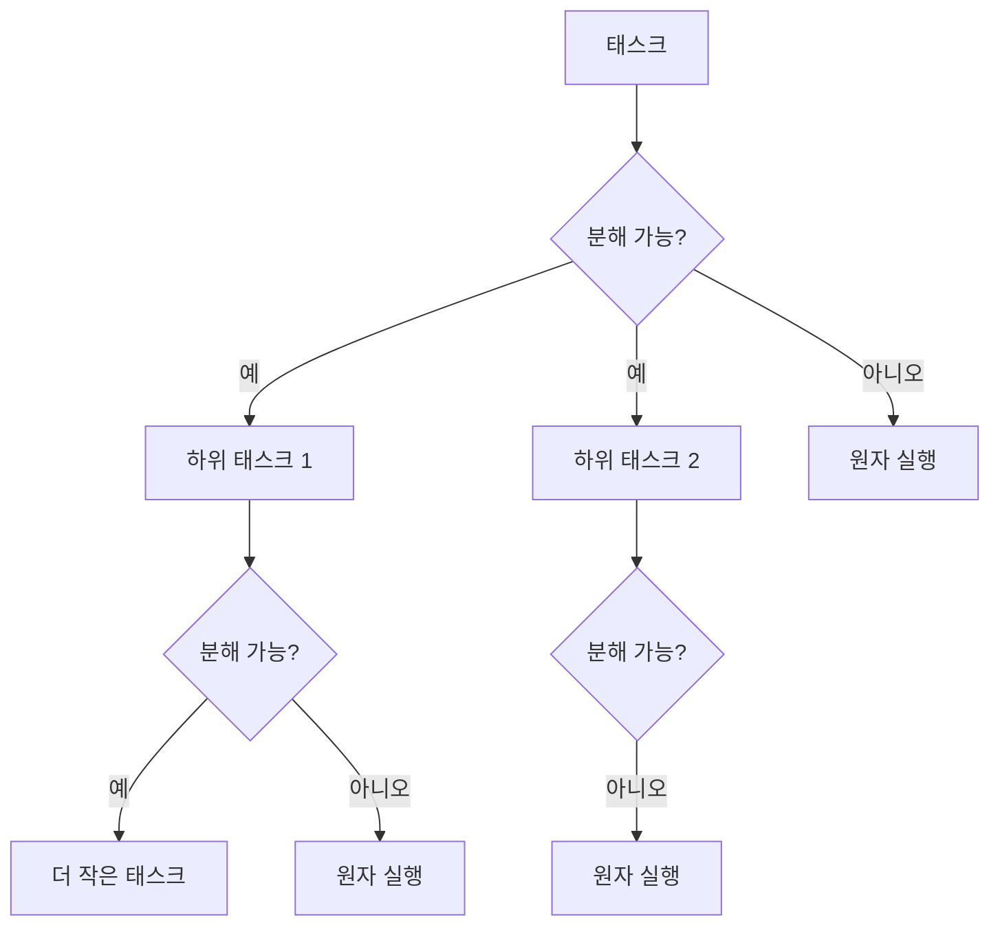
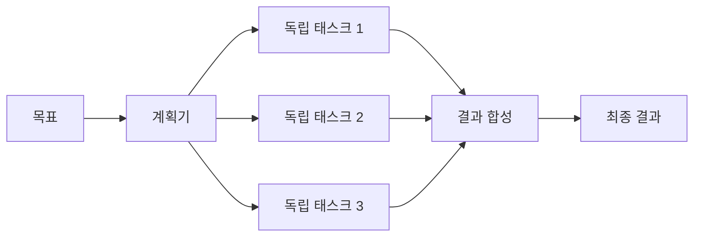
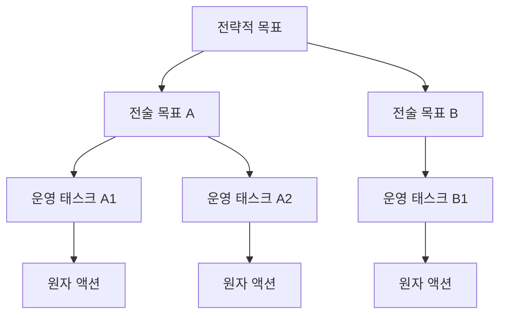
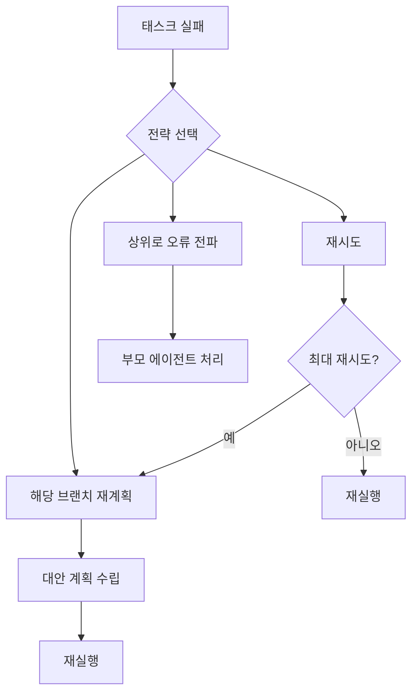

# 에이전트 태스크 분해 패턴

## 개요

태스크 분해(task decomposition)는 복잡한 목표를 LLM 에이전트가 실행 가능한 단위로 나누는 핵심 전략이다. 단일 프롬프트로 해결하기 어려운 문제를 구조화된 하위 태스크로 쪼개어 순차적 혹은 병렬로 처리함으로써, 각 단계에서의 오류를 격리하고 진행 상태를 추적할 수 있다.

전통적인 AI 계획(planning) 분야의 HTN(Hierarchical Task Network)과 STRIPS(Stanford Research Institute Problem Solver) 형식주의에서 영향을 받았으며, 현대 LLM 에이전트에서는 자연어 추론과 결합되어 더 유연한 형태로 구현된다.

## 왜 중요한가

- **컨텍스트 제한 극복**: LLM의 컨텍스트 창(context window) 크기 한계를 분할 정복으로 우회
- **오류 격리**: 하위 태스크 실패가 전체 플로우에 미치는 영향 최소화
- **재사용성**: 분해된 하위 태스크를 다른 목표에 재조합 가능
- **병렬 처리**: 독립적인 하위 태스크를 동시에 실행해 속도 향상
- **검증 가능성**: 각 단계의 결과를 체크포인트로 검증 가능

## 핵심 분해 전략

### 1. Top-Down 분해

목표를 먼저 정의한 뒤 점진적으로 세분화하는 방식. HTN 계획의 주요 패러다임이다.



목표의 전체 구조가 명확할 때 적합하다. Plan-and-Solve 프롬프팅이 이 방식을 따른다.

**장점**: 전체 구조를 먼저 파악 후 진행 → 중복/모순 방지  
**단점**: 초기 분해가 잘못되면 하위 태스크 전체가 흔들림

### 2. Bottom-Up 분해

실행 가능한 원자 태스크(atomic task)를 먼저 식별하고, 이를 조합해 상위 목표를 달성하는 방식.



도메인 지식이 풍부하고 원자 연산이 잘 정의된 경우 (예: 코드 도구 목록) 유리하다.

**장점**: 실행 가능한 단위를 먼저 확보 → 현실적  
**단점**: 목표 전체 그림이 후반부까지 불분명

### 3. Recursive 분해

각 하위 태스크를 다시 분해 가능한지 재귀적으로 평가하는 방식. "충분히 작은가?" 기준이 종료 조건이 된다.



BabyAGI의 태스크 생성 루프, [[cumulative-reasoning]] 패턴이 이 방식을 활용한다.

**장점**: 임의 깊이의 복잡도 처리 가능  
**단점**: 재귀 깊이 제어 실패 시 무한 분해 위험

## 전통 AI 형식주의와의 연결

### HTN (Hierarchical Task Network)

HTN은 태스크를 복합 태스크(compound task)와 원시 태스크(primitive task)로 구분한다.

- **복합 태스크**: 하나 이상의 메서드(method)로 분해 가능
- **원시 태스크**: 직접 실행 가능한 연산자(operator)로 구현
- **메서드**: 복합 태스크를 하위 태스크 시퀀스로 변환하는 규칙

LLM 에이전트에서 HTN의 영향은 "플래너(planner)가 태스크 트리를 생성하고 익스큐터(executor)가 원시 태스크를 실행"하는 구조로 나타난다.

### STRIPS (Stanford Research Institute Problem Solver)

STRIPS는 상태 공간 탐색 기반으로, 각 연산자가 전제조건(precondition)과 효과(effect)를 명시한다.

```
연산자: 파일_읽기
  전제조건: 파일_존재(f) AND 권한_있음(f)
  효과: 내용_알고있음(f)
```

LLM 에이전트에서는 이를 자연어로 느슨하게 모델링한다. [[react-pattern]]의 Observation이 상태 변화를 추적하는 방식이 STRIPS의 영향이다.

## LLM 에이전트에서의 구현 패턴

### 패턴 1: 정적 계획 + 실행 (Static Plan-Execute)

[[plan-and-solve-prompting]]이 대표적이다. 실행 전 전체 계획을 생성하고 순차 실행한다.

```python
# 의사코드
plan = llm.generate_plan(goal)       # 전체 계획 한 번에 생성
results = []
for step in plan.steps:
    result = executor.run(step)       # 순차 실행
    results.append(result)
final = llm.synthesize(results)
```

**적합한 경우**: 목표가 명확하고 단계 간 의존성이 선형인 경우  
**부적합한 경우**: 실행 결과에 따라 다음 단계가 달라져야 하는 경우

### 패턴 2: 동적 재계획 (Dynamic Replanning)

실행 중 상태에 따라 계획을 수정한다. [[react-pattern]]의 핵심 메커니즘이다.

```python
# 의사코드
plan = initial_plan(goal)
while not done:
    step = plan.next()
    obs = executor.run(step)
    if needs_replanning(obs):
        plan = replan(goal, history, obs)  # 동적 수정
```

**적합한 경우**: 환경이 불확실하거나 실행 결과가 예측 불가능한 경우  
**비용**: 재계획마다 LLM 호출 추가 발생

### 패턴 3: 병렬 분해 (Parallel Decomposition)

독립적 하위 태스크를 동시에 실행해 속도를 높인다.



[[parent-child-spawn-pattern]]에서 부모 에이전트가 여러 자식을 동시에 spawn하는 방식이다.

**적합한 경우**: 태스크 간 의존성이 없는 경우  
**주의**: 공유 상태(shared state) 경쟁 조건(race condition) 방지 필요

### 패턴 4: 계층적 분해 (Hierarchical Decomposition)

여러 단계의 추상화 레이어를 통해 목표를 세분화한다.



[[agent-trees]] 패턴과 직접 연결된다. 추상화 레이어마다 다른 에이전트나 모델이 담당할 수 있다.

## 분해 품질 기준

좋은 태스크 분해는 다음 기준을 충족해야 한다.

| 기준 | 설명 | 검증 방법 |
|------|------|----------|
| 완전성(Completeness) | 모든 하위 태스크를 완료하면 상위 목표 달성 | 역방향 추적 |
| 독립성(Independence) | 하위 태스크 간 불필요한 의존성 최소화 | 의존성 그래프 |
| 원자성(Atomicity) | 각 단말 태스크가 단일 LLM 호출로 처리 가능 | 컨텍스트 크기 |
| 검증 가능성(Verifiability) | 각 태스크의 성공/실패를 판단할 기준 존재 | 출력 스키마 |
| 순서 명확성(Ordering) | 필수 순서 제약이 명시적 | DAG 표현 |

## 실제 구현 사례

### 코드 생성 에이전트

```
목표: "결제 모듈 구현"
  ├─ 요구사항 분석 (독립)
  ├─ 데이터베이스 스키마 설계 (독립)
  ├─ API 엔드포인트 설계 (독립)
  ├─ 결제 처리 로직 구현 (API 설계 이후)
  ├─ 단위 테스트 작성 (로직 구현 이후)
  └─ 통합 테스트 (모든 하위 완료 이후)
```

### 리서치 에이전트

[[selfask-decomposition]]의 self-ask 패턴은 질문을 재귀적으로 분해한다.

```
질문: "GPT-4가 Claude 3와 다른 점은?"
  ├─ "GPT-4의 주요 특징은?" (서브질문 1)
  ├─ "Claude 3의 주요 특징은?" (서브질문 2)
  └─ [서브질문 1, 2 결과 합성] → 최종 답변
```

## 분해 깊이 제어

무한 재귀 방지와 과도한 세분화를 방지하기 위한 종료 조건(termination condition)이 필요하다.

```python
# 의사코드: 재귀 깊이 제한
def decompose(task, depth=0, max_depth=4):
    if depth >= max_depth:
        return [task]  # 더 이상 분해하지 않고 직접 실행
    if is_atomic(task):
        return [task]
    subtasks = llm_decompose(task)
    result = []
    for subtask in subtasks:
        result.extend(decompose(subtask, depth + 1, max_depth))
    return result
```

**실무 권장**: 최대 깊이 3-4 레이어. 그 이상은 LLM 비용 대비 품질 향상이 미미하다.

## 에러 처리와 재시도 전략

분해 후 실행 단계에서 실패가 발생하면 세 가지 전략을 선택할 수 있다.



[[agent-circuit-breaker]] 패턴과 결합하면 반복 실패를 조기에 차단할 수 있다.

## 한계 및 트레이드오프

### 과도한 분해의 위험

- 오버헤드 증가: 분해/합성 단계마다 LLM 호출 추가
- 컨텍스트 손실: 하위 태스크에 상위 맥락이 충분히 전달되지 않을 수 있음
- 계획-실행 불일치: 분해 당시 예측과 실행 시 현실의 괴리

### 과소 분해의 위험

- 단일 태스크가 너무 커서 LLM이 처리 불가
- 오류 발생 시 전체 재시도 비용이 높음
- 병렬화 기회 미활용

### 분해 품질의 LLM 의존성

분해 자체를 LLM이 수행할 때, 분해 품질이 LLM 능력에 강하게 의존한다. 도메인 특화 프롬프트나 예시를 제공하면 품질을 높일 수 있다.

## 관련 문서

- [[plan-and-solve-prompting]] - 정적 계획 후 실행 패턴
- [[chain-of-thought]] - 단계별 추론 기법
- [[react-pattern]] - 추론-행동-관찰 반복 루프
- [[selfask-decomposition]] - 재귀적 자기 질문 분해
- [[cumulative-reasoning]] - 누적 추론을 통한 문제 해결
- [[parent-child-spawn-pattern]] - 병렬 분해를 위한 서브에이전트 생성
- [[agent-trees]] - 트리 구조 에이전트 계층
- [[agent-circuit-breaker]] - 분해 실행 중 실패 처리
