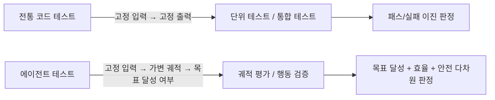
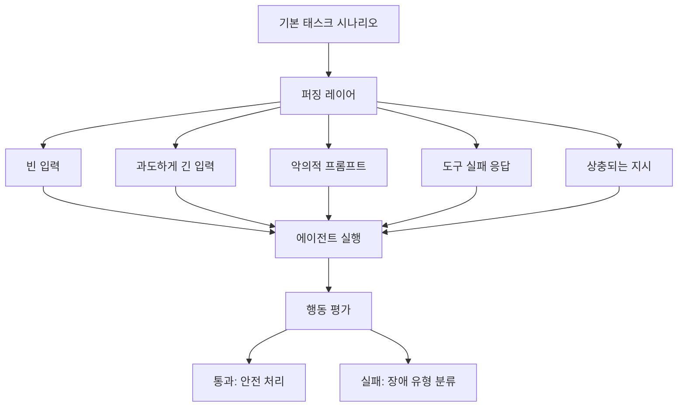
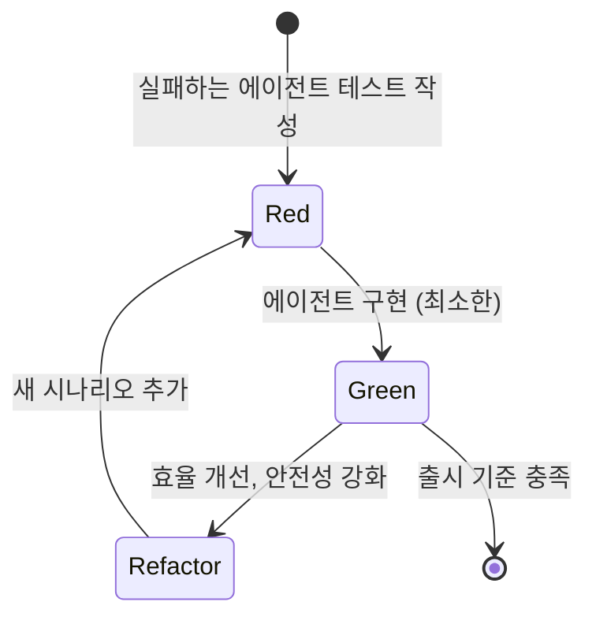

# 에이전트 테스팅과 시뮬레이션

LLM 에이전트의 테스팅은 결정적(deterministic) 코드 테스팅과 근본적으로 다르다. 에이전트는 확률적으로 동작하고, 외부 도구에 의존하며, 태스크를 완료하는 경로가 여러 개일 수 있다. 따라서 "올바른 출력"보다 "올바른 행동 패턴"을 검증하는 접근이 필요하다.

## 에이전트 테스트의 특수성



에이전트 테스트에서는 출력물 자체보다 에이전트가 목표를 달성하는 **과정**이 중요하다. 예를 들어 "파일을 삭제하지 않고 태스크를 완료했는가"는 결과가 아닌 행동 경로를 검증한다.

## 핵심 테스트 유형

### 1. 모의 환경 테스트 (Mock Environment)

실제 외부 시스템(API, 데이터베이스, 파일 시스템) 대신 예측 가능한 응답을 반환하는 목(mock) 도구를 사용한다.

```python
class MockFileSystem:
    """파일 시스템을 모사하는 테스트용 도구"""
    def __init__(self):
        self.files = {}
        self.call_log = []

    def read_file(self, path: str) -> str:
        self.call_log.append(("read", path))
        return self.files.get(path, "파일 없음")

    def write_file(self, path: str, content: str) -> None:
        self.call_log.append(("write", path))
        self.files[path] = content
```

목 환경의 핵심 장점은 **재현성**이다. 네트워크 응답 지연이나 외부 상태 변화 없이 동일 조건에서 수백 번 반복 실행이 가능하다.

### 2. 엣지케이스 탐지 (Edge Case Detection)

에이전트가 예외적 상황에서 어떻게 행동하는지 검증한다. 자동화된 엣지케이스 생성이 핵심이다.



자동 퍼징은 입력 공간의 경계를 체계적으로 탐색해 수동 테스트로 발견하기 어려운 장애 모드를 식별한다.

### 3. 반복 실행과 통계적 검증

에이전트의 확률적 특성 때문에 단일 실행으로는 성능을 판단할 수 없다. 동일 태스크를 N회(최소 30회 권장) 실행해 성공률, 평균 스텝 수, 비용 분포를 측정한다.

[[agent-evaluation-framework]]에서 정의하는 핵심 지표:

| 지표 | 설명 | 측정 방법 |
|------|------|-----------|
| 태스크 성공률 | N회 실행 중 목표 달성 비율 | 자동 판정기 또는 LLM-as-judge |
| 평균 스텝 수 | 태스크당 도구 호출 횟수 | 실행 로그 집계 |
| 비정상 종료율 | 루프 발산, 에러, 타임아웃 비율 | 실행 상태 코드 |
| 비용 효율 | 스텝당 평균 토큰 소비 | 토큰 카운터 |

## [[tdd-agentic-coding]]과의 연계

테스트 주도 개발 원칙을 에이전트 개발에 적용하면 다음 사이클로 구성된다.



에이전트 TDD의 "Red" 단계는 에이전트가 아직 처리하지 못하는 시나리오를 테스트로 먼저 정의하는 것이다. 목표 달성 여부를 판정하는 자동 평가기가 이 사이클의 핵심이다.

## 시뮬레이션 환경 구성 요소

실제 프로덕션을 모사하는 시뮬레이션 환경은 다음 구성요소를 포함한다.

**샌드박스 실행 환경**
파일 시스템, 터미널, 브라우저 등 에이전트가 사용하는 실제 인터페이스를 격리된 컨테이너에서 제공한다. 에이전트가 실제 시스템을 조작하는 것처럼 행동하되 실제 부작용이 발생하지 않는다.

**시나리오 라이브러리**
자주 발생하는 태스크와 엣지케이스를 재사용 가능한 테스트 시나리오로 구조화한다. CI/CD 파이프라인에 통합해 에이전트 코드 변경 시 자동 회귀 테스트를 실행한다.

**LLM-as-Judge**
복잡한 태스크에서 결과의 정확성을 사람이 직접 검증하기 어려울 때 별도 LLM 인스턴스가 평가자 역할을 한다. 평가 기준을 루브릭(rubric)으로 명세하고 일관성을 높이기 위해 여러 번 평가 후 다수결을 취한다.

## 실무 관점

- 목 환경은 완벽하지 않다. 실제 도구의 레이턴시, 부분 실패, 비정형 응답을 목이 충분히 모사하지 못하면 프로덕션에서 예상치 못한 장애가 발생한다.
- 테스트 시나리오는 버전 관리에 포함해야 한다. 에이전트 동작이 변경될 때 시나리오도 함께 갱신한다.
- 대규모 반복 실행은 API 비용이 크다. 비용 효율적인 접근으로 가장 중요한 시나리오 20%를 선별해 집중 테스트하고 나머지는 샘플링한다.

## 관련 문서

- [[agent-evaluation-framework]] - 에이전트 성능 평가의 지표와 판정 기준
- [[tdd-agentic-coding]] - 에이전트 개발에 적용하는 테스트 주도 개발
- [[agent-debugging-techniques]] - 테스트에서 발견된 장애를 디버깅하는 기법
- [[agent-trajectory-evaluation]] - 에이전트 실행 궤적 기반 품질 평가
