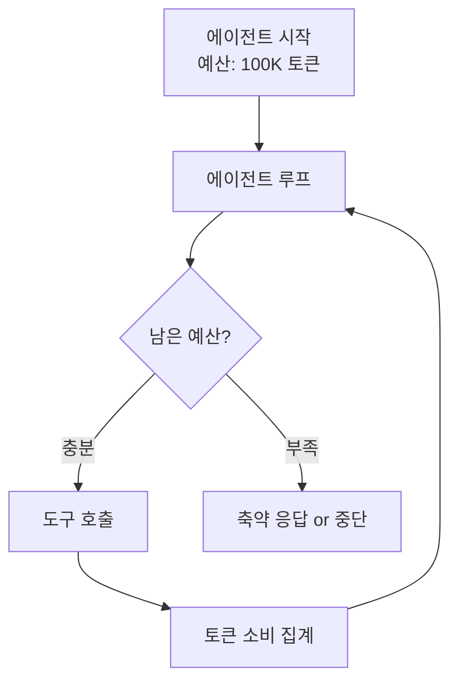

# 에이전트 토큰 예산 관리

에이전트 루프의 **토큰 총량 한도**를 설정하고 모니터링하여 비용 폭주와 무한 루프를 방지하는 운영 패턴. [[agent-cost-optimization|에이전트 비용 최적화]]의 가장 기본적인 제어 수단.

## 예산 구성요소

| 구성 | 설명 | 일반 비율 |
|------|------|----------|
| 시스템 프롬프트 | 고정 비용 | 5-15% |
| 도구 호출 | 입출력 토큰 | 40-60% |
| 추론/생성 | 모델 응답 | 20-30% |
| 재시도 | 오류 복구 | 5-15% (제한 필요) |

## 제어 전략

1. **하드 캡**: 총 토큰 초과 시 즉시 중단
2. **소프트 캡**: 경고 후 축약 모드 전환 (상세 설명 생략)
3. **재시도 제한**: 동일 도구 호출 최대 3회
4. **[[agent-model-routing|모델 다운그레이드]]**: 예산 소진 시 소형 모델로 전환

## 관련 문서

- [[agent-cost-optimization]] -- 에이전트 비용 최적화
- [[agent-model-routing]] -- 에이전트 모델 라우팅
- [[prompt-caching-agentic]] -- 에이전트 프롬프트 캐싱
