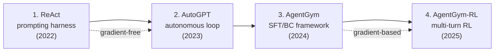

# Agent training harness - prompting부터 multi-turn RL까지

## 개요

LLM 에이전트의 학습 harness는 2022~2025년 사이 네 단계로 진화했다 — **(1) ReAct prompting**, **(2) AutoGPT 자율 루프**, **(3) AgentGym SFT/BC**, **(4) AgentGym-RL 멀티 턴 RL**. 각 단계는 **gradient-free → gradient-based**, **단일 turn → long-horizon**, **단일 환경 → cross-env generalist**로 점진 진화하며, 후단계는 이전 단계 harness 위에 학습 신호를 추가한 형태다.

## 1. ReAct - prompting harness (Yao et al. 2022)

- 논문: ["ReAct: Synergizing Reasoning and Acting in Language Models"](https://arxiv.org/abs/2210.03629) (2022-10-06, ICLR 2023)
- 저자: Shunyu Yao 외 6명
- repo: [ysymyth/ReAct](https://github.com/ysymyth/ReAct)

### 핵심 패턴

**Thought → Action → Observation** 루프를 하나의 prompt로 묶는다. LLM이 reasoning trace와 action을 interleave해서 생성하고, 환경 도구 호출 결과(observation)를 다음 prompt에 다시 삽입한다. 1~2개의 in-context example만으로 강한 baseline을 형성한다.

상세 설명은 [[react-pattern]] 참조.

### 의의

"Reasoning + acting in a single prompt loop" 패턴이 사실상 모든 후속 LLM 에이전트의 base scaffold다. LangChain, AutoGPT, OpenAI function-calling 모두 ReAct 변형이며, **gradient-free** harness의 표준이다.

## 2. AutoGPT - autonomous agent harness

- repo: [Significant-Gravitas/AutoGPT](https://github.com/Significant-Gravitas/AutoGPT) (2023-03 출시)
- 컨셉: 사용자 목표 → GPT-4가 self-prompt로 sub-task 분해 → tool 실행 → 반복

### 특징

- **Self-prompting** loop (no human in the loop)
- 메모리: vector DB (Pinecone, Weaviate) 사용
- LTS(long-term-stability) 구조는 있지만 구현이 빈약 — "AutoGPT is a harness whose LTS structure is sound but whose implementation of that structure is not"
- 실제 task completion이 낮음 → 후속 BabyAGI, SuperAGI, OpenDevin이 개선

상세는 [[autogpt-original-agent]] 참조.

## 3. AgentGym - agent self-evolution training framework

- 논문: ["AgentGym: Evolving Large Language Model-based Agents across Diverse Environments"](https://arxiv.org/abs/2406.04151) (2024-06, ACL 2025 long paper)
- 저자: Zhiheng Xi 외 (Fudan NLP)
- repo: [WooooDyy/AgentGym](https://github.com/WooooDyy/AgentGym)

### 구성

- **14개 환경** (web nav, text game, household, tool use, programming, embodied 등)
- **AgentTraj-L** 대형 trajectory dataset (instruction + behavior)
- **AgentEval** 평가 벤치
- **AgentEvol** 학습 방법:
  1. **Instruction expansion** — diverse prompt로 지시 확장
  2. **Behavior cloning** — successful trajectory로 SFT
  3. **DPO/RFT** — preference 기반 또는 reward fine-tuning

### 의의

단일 환경 specialized agent의 한계를 넘어 cross-env generalization을 시도. AutoGPT/Voyager 같은 prompting-only 한계를 SFT + preference learning으로 보강.

## 4. AgentGym-RL - multi-turn RL framework (2025)

- 논문: ["AgentGym-RL: Training LLM Agents for Long-Horizon Decision Making through Multi-Turn Reinforcement Learning"](https://arxiv.org/abs/2509.08755) (2025-09, ICLR 2026 Oral)
- 저자: Zhiheng Xi 외 (Fudan NLP)
- repo: [WooooDyy/AgentGym-RL](https://github.com/WooooDyy/AgentGym-RL)

### 핵심

- **Multi-turn RL** — 한 턴이 아닌 long-horizon trajectory 단위 학습
- Reward shaping for long-horizon tasks
- AgentGym 환경 위에 RL 학습 루프 통합 (PPO/GRPO 등)
- ReAct 스캐폴드 + RL fine-tuning 결합

### Agent harness 측면

**prompting (ReAct) → SFT (AgentGym BC) → RL (AgentGym-RL)**의 3-stage 진화. [[trl-library]] / [[openrlhf]] / [[verl-bytedance]] 같은 RL 인프라와 결합 (rollout backend는 vLLM, training은 FSDP 기반).

agent harness가 곧 RL environment — 환경 / 도구 / 메모리 모두 학습 대상이 된다.

## 통합 비교

| 방법 | 학습 | 인프라 의존 | 대상 |
|------|------|------------|------|
| ReAct | gradient-free | LLM API | reasoning + tool use |
| AutoGPT | gradient-free | LLM API + vector DB | autonomous task |
| Voyager | gradient-free | GPT-4 API + skill DB | lifelong skill 축적 |
| AgentGym (BC) | SFT | accelerate / DeepSpeed | cross-env generalist |
| AgentGym-RL | multi-turn RL | TRL / OpenRLHF + vLLM | long-horizon decision |

## 핵심 인용

> "generating both reasoning traces and task-specific actions in an interleaved manner ... reasoning traces help the model induce, track, and update action plans as well as handle exceptions, while actions allow it to interface with external sources." — ReAct abstract

## 관련 문서

- [[react-pattern]] - ReAct 상세
- [[autogpt-original-agent]] - AutoGPT 상세
- [[voyager-agent]] - gradient-free lifelong learning
- [[long-horizon-rl-training-for-agents]] - 멀티 턴 RL 일반
- [[trl-library]], [[openrlhf]], [[verl-bytedance]] - RL backend
- [[rl-harness-frameworks-comparison]] - RL harness 통합 비교
