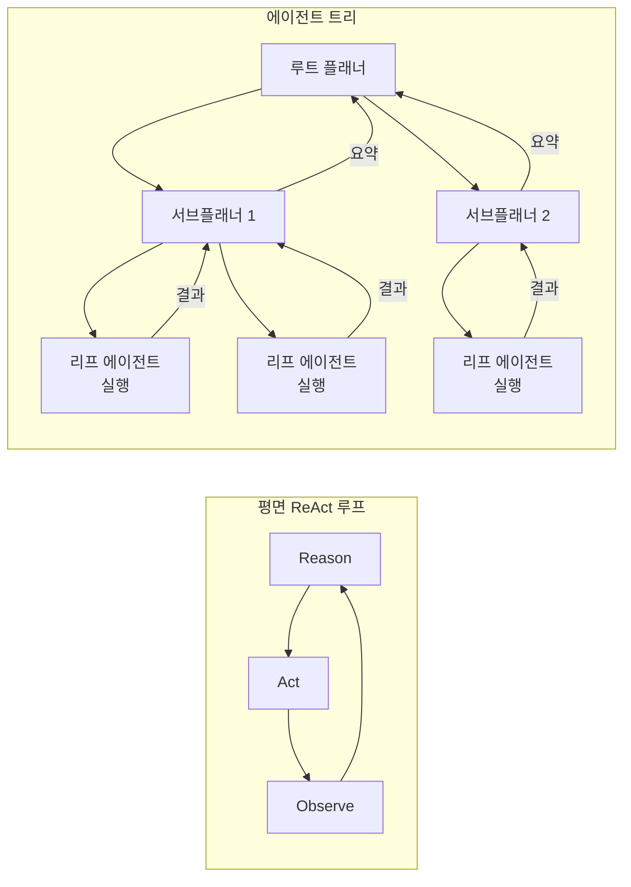

# Hierarchical Planning with Agent Trees

복잡한 목표를 동적으로 구성되는 에이전트 트리(agent tree)로 분해하고 제어 흐름(control flow) 노드로 서브에이전트들을 조정하는 계획 방식. 평면적 ReAct 루프의 한계를 극복하는 장기 태스크 계획 패턴이다.

## 왜 중요한가

AAMAS 2026에 채택된 ReAcTree가 Qwen 2.5 72B로 ReAct(31%) 대비 **61% 성공률**을 달성하며 트리 기반 분해의 우월성을 입증했다. Plan-and-Act, Plan-Then-Execute, 다층 메모리 계획기 등이 동시 등장하면서 평면적 ReAct 루프의 한계가 명확해졌다.

## ReAct 루프 vs 에이전트 트리



트리 구조는 중간 계획자(intermediate planner)가 세부 계획을 담당해 루트 에이전트의 컨텍스트를 절약하고, 병렬 실행으로 처리 속도를 높인다.

## ReAcTree: 핵심 기여

AAMAS 2026 채택 논문 ReAcTree의 핵심 혁신:

1. **동적 트리 구성**: 목표 복잡도에 따라 트리 깊이를 런타임에 결정
2. **제어 흐름 노드**: `if/while/fork` 등 프로그래밍 제어 흐름을 에이전트 노드로 모델링
3. **선택적 백트래킹**: 리프 에이전트 실패 시 부모 계획자에게만 예외 전파

```mermaid
flowchart TD
    Goal[목표] --> PlanNode{계획 노드}
    PlanNode -- "조건 분기\n(if 노드)" --> Branch1[브랜치 A]
    PlanNode -- "조건 분기\n(if 노드)" --> Branch2[브랜치 B]
    Branch1 --> ForkNode{병렬 포크\n(fork 노드)}
    ForkNode --> Leaf1[리프: 검색]
    ForkNode --> Leaf2[리프: 코드 실행]
    Leaf1 -- 실패 --> BackTrack[백트래킹\n부모로 예외 전파]
    Branch2 --> Leaf3[리프: 문서 작성]
```

## Plan-and-Act vs ReAcTree 비교

| 항목 | Plan-and-Act | ReAcTree |
|------|-------------|---------|
| 계획 단계 | 실행 전 전체 계획 확정 | 동적 트리 구성 |
| 적응성 | 낮음 (계획 고정) | 높음 (실행 중 트리 수정) |
| 실패 대응 | 재계획 필요 | 부분 백트래킹 |
| 병렬 실행 | 제한적 | fork 노드로 완전 지원 |

## 깊이별 에이전트 역할

```
깊이 0 (루트): 전체 목표 이해, 최상위 분해, 결과 합성
깊이 1 (중간): 서브목표 계획, 리프 에이전트 조율
깊이 2 (리프): 단일 원자 태스크 실행 (검색, 계산, 작성)
```

깊이가 깊어질수록 개별 에이전트의 역할은 단순해지고, 더 작은 모델로 처리 가능해진다.

## 컨텍스트 관리와 트리의 연관

에이전트 트리는 [[context-folding|컨텍스트 폴딩(Context Folding)]]과 자연스럽게 결합된다. 각 서브트리가 완료되면 그 결과를 요약(fold)해 부모에게 전달하고, 서브트리의 상세 실행 이력은 버린다. 이로써 루트 에이전트 컨텍스트를 최소화한다.

## SkyworkAI DeepResearchAgent 구현

실제 계층적 에이전트 트리를 공개 구현한 사례:
- 루트: 연구 목표를 10-15개 서브쿼리로 분해
- 중간: 각 서브쿼리를 검색 에이전트 그룹으로 병렬 처리
- 리프: 단일 웹 검색 + 추출 에이전트

## 실무 적용 관점

- **도입 기준**: 단일 ReAct 루프가 20+ 스텝을 넘어가면 에이전트 트리 도입 고려
- **깊이 제한**: 3단계 이내가 실용적. 더 깊어지면 디버깅이 어렵고 실패 전파 복잡도 급상승
- **제어 흐름 노드**: if/while 로직을 LLM에게 맡기기보다 코드 레벨 분기로 구현하는 것이 안정적
- **오케스트레이터-워커와의 관계**: 단순 병렬 위임은 [[orchestrator-worker-pattern|오케스트레이터-워커]], 깊은 계획이 필요하면 에이전트 트리

## 대표 레퍼런스

- [ReAcTree: Hierarchical LLM Agent Trees with Control Flow for Long-Horizon Task Planning](https://arxiv.org/abs/2511.02424)
- [Plan-and-Act: Improving Planning of Agents for Long-Horizon Tasks](https://arxiv.org/abs/2503.09572)
- [Deep Research Agents: A Systematic Examination And Roadmap](https://arxiv.org/abs/2506.18096)
- [SkyworkAI/DeepResearchAgent (Hierarchical Multi-Agent System)](https://github.com/SkyworkAI/DeepResearchAgent)
- [How we built our multi-agent research system (Anthropic)](https://www.anthropic.com/engineering/multi-agent-research-system)

## 관련 문서

- [[ai-hot-topics-2026-04|2026년 4월 AI 개발 핫토픽 100선]]
- [[orchestrator-worker-pattern|Orchestrator-Worker Multi-Agent Pattern]]
- [[context-folding|Context Folding & Sub-Trajectory Compression]]
- [[long-horizon-agent-benchmarks|Long-Horizon Agent Benchmarks]]
- [[subagents|Subagents]]
- [[deep-research-agents-roadmap|Deep Research Agents Roadmap]]
- [[skywork-deepresearchagent|SkyworkAI DeepResearchAgent]]
