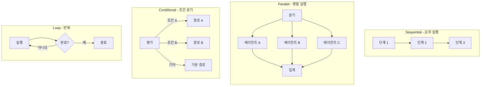
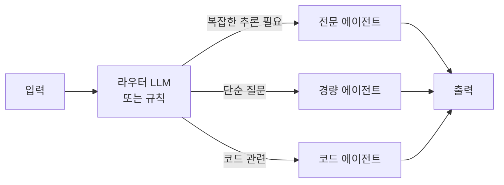
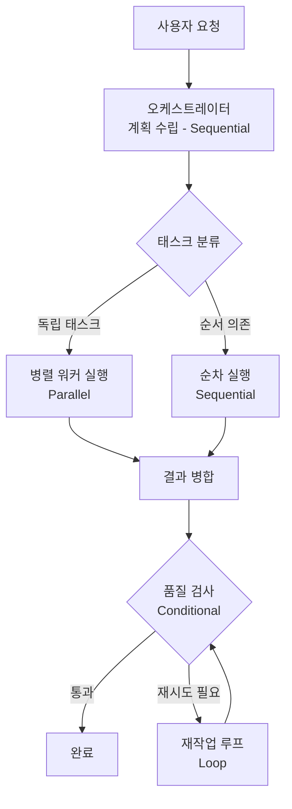

# 에이전트 워크플로우 패턴 (Agent Workflow Patterns)

에이전트 태스크의 실행 흐름을 구조화하는 기본 패턴들. Sequential(순차), Parallel(병렬), Conditional(조건 분기), Loop(반복)의 4가지 기본형과 이를 조합한 복합 패턴으로 분류된다.

## 왜 중요한가

에이전트의 지능은 "어떤 도구를 가졌는가"보다 "어떤 순서와 구조로 실행되는가"에 크게 좌우된다. [[orchestrator-worker-pattern]]이나 [[how-coding-agents-work]]에서 설명하는 고수준 아키텍처는 결국 이 기본 워크플로우 패턴들의 조합이다. 패턴을 명확히 이해하면 복잡한 에이전트 시스템을 분석하고 설계하기 쉬워진다.

## 4가지 기본 패턴

## Sequential (순차 실행)

이전 단계의 출력이 다음 단계의 입력이 되는 파이프라인 구조. 각 단계가 독립적으로 실행될 수 없고 의존성이 있을 때 사용한다.

**예시**: 리서치 파이프라인 - 검색 -> 요약 -> 사실 확인 -> 보고서 작성

**장점**: 추론이 쉽고 디버깅이 단순하다. 단계 간 상태 전달이 명확하다.

**단점**: 지연이 단계별 합산이다. 한 단계 실패 시 전체가 중단된다.

## Parallel (병렬 실행)

독립적인 서브태스크를 동시에 실행하고 결과를 집계하는 구조. [[orchestrator-worker-pattern]]의 핵심이기도 하다.

**예시**: 여러 소스에서 동시 검색, 멀티모달 분석(텍스트+이미지+오디오 동시 처리)

**집계 전략**:
- `gather_all`: 모든 결과 완료 후 집계 (all-or-nothing)
- `first_success`: 첫 번째 성공한 결과만 사용 (경쟁)
- `timeout_merge`: 타임아웃 내 완료된 결과만 병합

**주의**: 에이전트 간 공유 상태(예: 동일 파일 수정)가 있으면 경쟁 조건이 발생한다. 상태를 독립적으로 분리하거나 잠금(lock) 메커니즘이 필요하다.

## Conditional (조건 분기)

실행 중 평가 결과에 따라 다른 경로를 선택하는 구조. 에이전트의 "판단" 능력이 핵심이다.

**라우팅 방법**:
- 규칙 기반(키워드, 정규식): 빠르고 예측 가능
- 소형 분류 LLM: 더 유연하지만 추가 호출 비용
- 임베딩 기반 유사도: 의미론적 라우팅 가능

## Loop (반복 실행)

목표 달성 여부를 체크하며 동일 또는 유사한 행동을 반복하는 구조. ReAct(Reason-Act) 루프가 대표적이다.

**종료 조건 설계가 핵심**:

| 종료 유형 | 구현 방법 |
|-----------|-----------|
| 목표 달성 감지 | LLM에게 "작업이 완료됐는가?" 판단 요청 |
| 최대 반복 수 | `max_steps` 하드 리밋 |
| 타임아웃 | 절대 시간 제한 |
| 품질 임계값 | 평가 점수가 기준 초과 시 종료 |
| 수렴 감지 | 연속 2회 동일 행동 시 강제 종료 |

**안전 장치**: 무한 루프는 비용 폭발과 시스템 블로킹을 유발한다. Loop 패턴을 사용할 때는 반드시 하드 리밋을 설정해야 한다.

## 복합 패턴 예시

실제 에이전트 시스템은 보통 Sequential이 전체 뼈대를 이루고, 그 안의 특정 단계가 Parallel로 팬아웃하며, 품질 검증 단계에서 Conditional과 Loop가 결합되는 형태다.

## 구현 프레임워크 비교

| 프레임워크 | Sequential | Parallel | Conditional | Loop |
|-----------|-----------|---------|------------|------|
| LangGraph | Edge/Node | 분기 후 Join | Conditional Edge | Cycle |
| Dify | Pipeline 블록 | 병렬 블록 | IF/ELSE 노드 | Loop 노드 |
| CrewAI | Task 순서 | Async Tasks | 기본 지원 제한 | 외부 루프 |
| Mastra | Step 체인 | concurrentStep | 조건부 스텝 | 재귀 워크플로우 |

## 관련 문서
- [[ai-workflow-automation]] -- AI 워크플로우 자동화
- [[ai-data-pipeline-automation]] -- AI 데이터 파이프라인 자동화
- [[agent-skill-library]] -- 에이전트 스킬 라이브러리

- [[orchestrator-worker-pattern]] - 병렬 패턴의 대표 구현
- [[how-coding-agents-work]] - 코딩 에이전트에서의 Loop 패턴
- [[agent-evaluation-framework]] - 워크플로우 품질 평가
