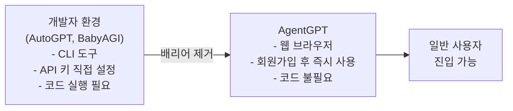
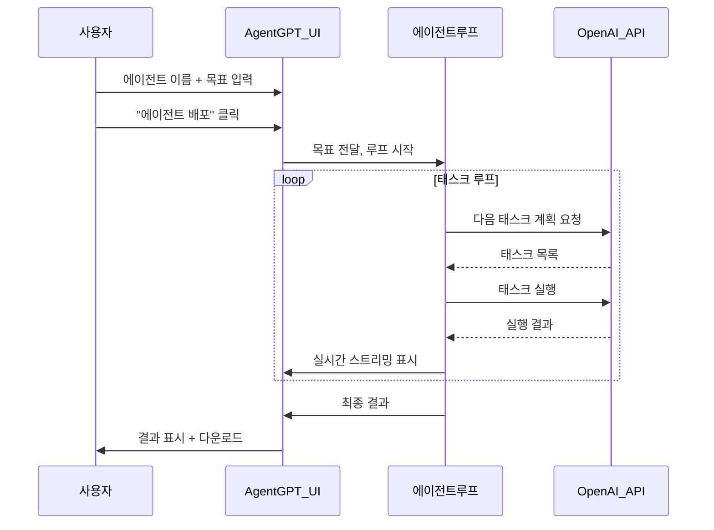

# AgentGPT - 자율 에이전트 플랫폼

## 개요

AgentGPT는 2023년 Reworkd AI가 개발한 브라우저 기반 자율 에이전트 플랫폼이다. [[autogpt-original-agent]]와 [[babyagi-task-agent]]가 CLI 도구나 개발자 중심의 스크립트였던 것과 달리, AgentGPT는 **기술적 배경 없는 일반 사용자도 웹 브라우저에서 자율 에이전트를 실행**할 수 있는 UI를 제공했다. "AI 에이전트의 민주화"를 표방한 최초의 주류 웹 기반 에이전트 플랫폼이다.

## 핵심 가치 제안



AgentGPT의 핵심 혁신은 기술이 아닌 **접근성**이었다. LLM 에이전트가 "개발자 장난감"에서 "일반인도 쓸 수 있는 도구"로 전환되는 시점을 상징한다.

## 사용자 경험 흐름



## 기술 아키텍처

AgentGPT는 현대적인 웹 스택으로 구축됐다.

| 레이어 | 기술 |
|--------|------|
| 프론트엔드 | Next.js + TypeScript + Tailwind CSS |
| 백엔드 | Next.js API Routes (T3 Stack) |
| LLM | OpenAI API (GPT-3.5, GPT-4) |
| 에이전트 엔진 | LangChain (Python) |
| 데이터베이스 | PlanetScale (MySQL) |
| 인증 | NextAuth.js |
| 배포 | Vercel |

T3 Stack(Next.js + tRPC + Prisma + NextAuth)을 기반으로 했으며, 이는 2023년 Next.js 풀스택 앱의 인기 있는 보일러플레이트였다.

## 주요 기능

### 에이전트 생성 및 배포

사용자는 두 가지 입력만 제공한다.

- **에이전트 이름**: 예) "마케팅 리서처"
- **목표**: 예) "2024년 한국 스타트업 트렌드를 조사하고 보고서를 작성해라"

입력 후 "에이전트 배포(Deploy Agent)" 버튼을 누르면 즉시 실행이 시작된다.

### 실시간 태스크 시각화

에이전트가 실행하는 각 태스크와 결과가 UI에 실시간으로 스트리밍된다. 사용자는 에이전트가 "무엇을 생각하고 있는지" 단계별로 확인할 수 있다.

```
[에이전트 실행 중...]
태스크 1: 한국 스타트업 생태계 현황 조사
  -> 결과: 2023년 한국 벤처 투자 규모는...

태스크 2: 주요 성장 섹터 분석
  -> 결과: 헬스테크, 핀테크, AI 스타트업이...

태스크 3: 글로벌 비교 분석
  -> 결과: 한국은 인당 스타트업 밀도 기준...

태스크 4: 보고서 초안 작성
  -> 결과: [마크다운 형식 보고서]
```

### 에이전트 저장 및 공유

완료된 에이전트 실행 세션을 저장하고 링크로 공유할 수 있다. 이는 "에이전트 결과물 공유"라는 새로운 콘텐츠 형식을 만들어냈다.

### API 키 직접 연결

유료 플랜 대신 자신의 OpenAI API 키를 연결해 사용하는 옵션도 제공됐다.

## AutoGPT / BabyAGI와의 비교

| 항목 | AutoGPT | BabyAGI | AgentGPT |
|------|---------|---------|---------|
| 인터페이스 | CLI | CLI/스크립트 | 웹 브라우저 |
| 대상 사용자 | 개발자 | 개발자/연구자 | 일반 사용자 |
| 설치 필요 | 필요 | 필요 | 불필요 |
| 실시간 UI | 없음 | 없음 | 있음 |
| 에이전트 저장 | 없음 | 없음 | 있음 |
| 오픈소스 | 완전 공개 | 완전 공개 | 공개 (코어) |

## 역사적 의미

AgentGPT는 자율 에이전트가 **프로덕트(product)** 가 될 수 있음을 처음으로 보여줬다. AutoGPT와 BabyAGI가 "개념의 증명"이었다면, AgentGPT는 "제품의 원형"이었다. 이후 나온 수많은 에이전트 SaaS 플랫폼들(Devin, AgentBench 기반 서비스들)이 AgentGPT의 UX 패턴을 참고했다.

## 한계와 비판

- **신뢰성 문제**: 기반 에이전트 루프(AutoGPT/BabyAGI 계열)의 환각 및 루프 탈출 문제를 그대로 상속
- **비용 예측 불가**: 태스크가 얼마나 많이 생성될지 미리 알 수 없어 API 비용 폭증 위험
- **실용성 한계**: 흥미로운 시연용이나 실제 업무 활용 시 결과물 품질이 불안정
- **도구 부재**: 초기 버전은 실제 웹 검색, 파일 처리 등 외부 도구 연동이 제한적

## 현재 상태 (2026 기준)

Reworkd AI는 AgentGPT를 넘어 더 전문적인 자동화 에이전트 서비스로 피벗했다. 오픈소스 버전은 GitHub에서 계속 유지되고 있으나, 2023년의 폭발적 관심에 비해 사용자 기반은 많이 줄었다. [[openai-agents-sdk]], Devin, Cursor 등 더 전문화된 도구들이 에이전트 시장을 나눠 가졌다.

## 관련 문서

- [[autogpt-original-agent]] - AgentGPT의 개념적 기반
- [[babyagi-task-agent]] - 태스크 큐 구조 참고 소스
- [[agentic-ai-foundation]] - 자율 에이전트 개념 기초
- [[agent-workflow-patterns]] - 에이전트 워크플로우 패턴
- [[evolution-of-agentic-patterns]] - 에이전트 패턴 역사
