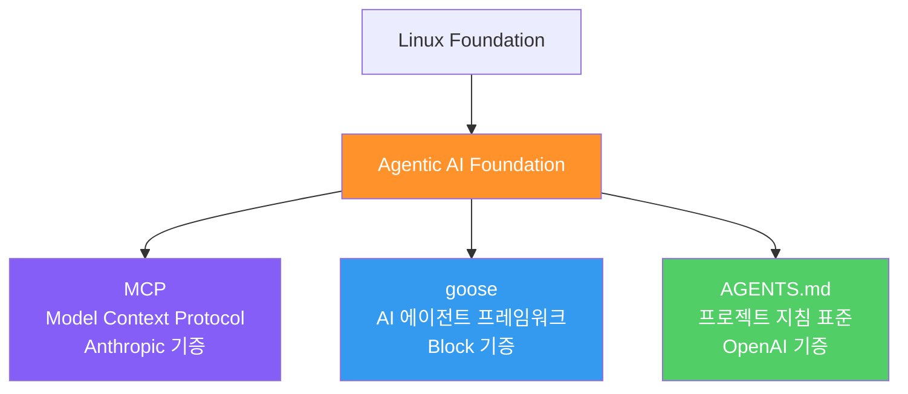
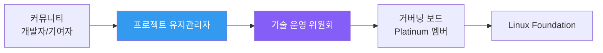

# Agentic AI Foundation (AAIF)

Linux Foundation 산하에 설립된 에이전틱 AI 오픈소스 거버넌스 재단. Anthropic(MCP), Block(goose), OpenAI(AGENTS.md) 세 프로젝트를 통합 관리하며, AI 에이전트 인프라의 중립적 표준화를 목표로 한다.

## 왜 지금 중요한가

경쟁 관계인 Anthropic, OpenAI, Google, Microsoft가 하나의 재단 아래 에이전트 프로토콜을 통합하는 것은 전례 없는 일이다. MCP가 월간 9,700만 이상의 SDK 다운로드를 기록하고, 10,000개 이상의 활성 서버가 운영되는 상황에서, 단일 기업이 아닌 중립 재단이 거버넌스를 맡음으로써 산업 전체의 상호운용성 기반이 마련되었다.

## 설립 구조

### 설립일
2025년 12월 9일

### 참여 조직

**Platinum 멤버 (8개사)**
- Amazon Web Services, Anthropic, Block, Bloomberg, Cloudflare, Google, Microsoft, OpenAI

**Gold 멤버 (17개사)**
- Adyen, Arcade.dev, Cisco, Datadog, Docker, Ericsson, IBM, JetBrains, Okta, Oracle 등

**Silver 멤버 (22개사)**
- Apify, Chronosphere, Elasticsearch, Hugging Face, Pydantic, Zapier 등

## 3대 창립 프로젝트

### 1. MCP (Model Context Protocol) -- Anthropic 기증
AI 모델을 도구, 데이터, 애플리케이션에 연결하는 범용 표준 프로토콜.
- 10,000개 이상의 활성 공개 서버
- ChatGPT, Cursor, Gemini, Microsoft Copilot 등에 채택
- Python/TypeScript SDK 월간 9,700만+ 다운로드
- Claude 디렉토리에 75개+ 커넥터

### 2. goose -- Block 기증
언어 모델, 확장 가능한 도구, MCP 통합을 결합한 오픈소스 에이전트 프레임워크.
- Rust 기반, Apache 2.0 라이선스
- 15+ LLM 프로바이더 지원
- 41.9K GitHub 스타
- 자세한 내용은 [[goose|Goose (Block)]] 참조

### 3. AGENTS.md -- OpenAI 기증
AI 코딩 에이전트에 프로젝트별 지침을 제공하는 마크다운 기반 표준.
- 에이전트가 프로젝트 컨텍스트를 이해하기 위한 구조화된 포맷
- CLAUDE.md, .cursorrules 등과 유사하나 범용 표준 지향

## 거버넌스 모델

- 프로젝트 유지관리자가 커뮤니티 입력과 투명한 의사결정을 우선시
- 기존 MCP 거버넌스 모델은 변경 없이 유지
- Linux Foundation의 중립적 법적/운영적 프레임워크 활용

## MCP 기부 배경

Anthropic은 MCP를 기부하면서 다음을 강조했다:
- **중립성 약속 이행** -- "MCP가 중립적이고 개방적인 표준으로 유지되도록 하겠다"는 약속 실현
- **채택 가속화** -- 단일 기업 소유보다 재단 소유가 경쟁사 채택에 유리
- **생태계 성장** -- 10,000+ 서버, 9,700만+ SDK 다운로드의 성장세를 유지하기 위한 신뢰 기반

## 이벤트 프로그램

AAIF는 2026년 글로벌 이벤트 프로그램을 발표했다:
- **AgntCon** -- 에이전틱 AI 전반 컨퍼런스
- **MCPCon North America** -- MCP 특화 컨퍼런스
- **MCPCon Europe** -- 유럽 MCP 컨퍼런스

## 산업적 의미

### 상호운용성 표준화
경쟁 기업들이 단일 재단 아래 모여 에이전트 프로토콜을 표준화하는 것은, HTTP나 HTML이 W3C 아래에서 표준화된 것과 유사한 패턴이다.

### 에이전트 생태계 성숙
MCP(통신), goose(실행), AGENTS.md(컨텍스트)라는 세 축이 통합됨으로써, AI 에이전트 개발의 기본 인프라 스택이 형성되었다.

## 관련 페이지

- [[goose|Goose (Block)]] -- AAIF 창립 프로젝트, 오픈소스 AI 에이전트
- [[a2a-protocol|A2A Protocol]] -- Google 주도 에이전트 간 프로토콜
- [[google-adk|Google ADK]] -- AAIF에 참여한 Google의 에이전트 개발 킷
- [[acp-protocol|ACP Protocol]] -- 에이전트 통신 프로토콜
- [[agent-skills|Agent Skills]] -- AGENTS.md와 연결되는 에이전트 역량 표준
- [[xcode-agentic-coding|Xcode 26.3 Agentic Coding]] -- MCP 활용 사례

## 대표 레퍼런스

- [Linux Foundation Announces the Formation of the Agentic AI Foundation](https://www.linuxfoundation.org/press/linux-foundation-announces-the-formation-of-the-agentic-ai-foundation)
- [Donating the Model Context Protocol and Establishing the Agentic AI Foundation -- Anthropic](https://www.anthropic.com/news/donating-the-model-context-protocol-and-establishing-of-the-agentic-ai-foundation)
- [Agentic AI Foundation -- OpenAI](https://openai.com/index/agentic-ai-foundation/)
