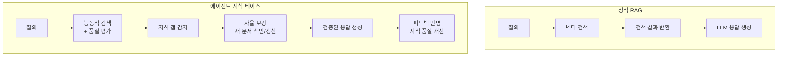
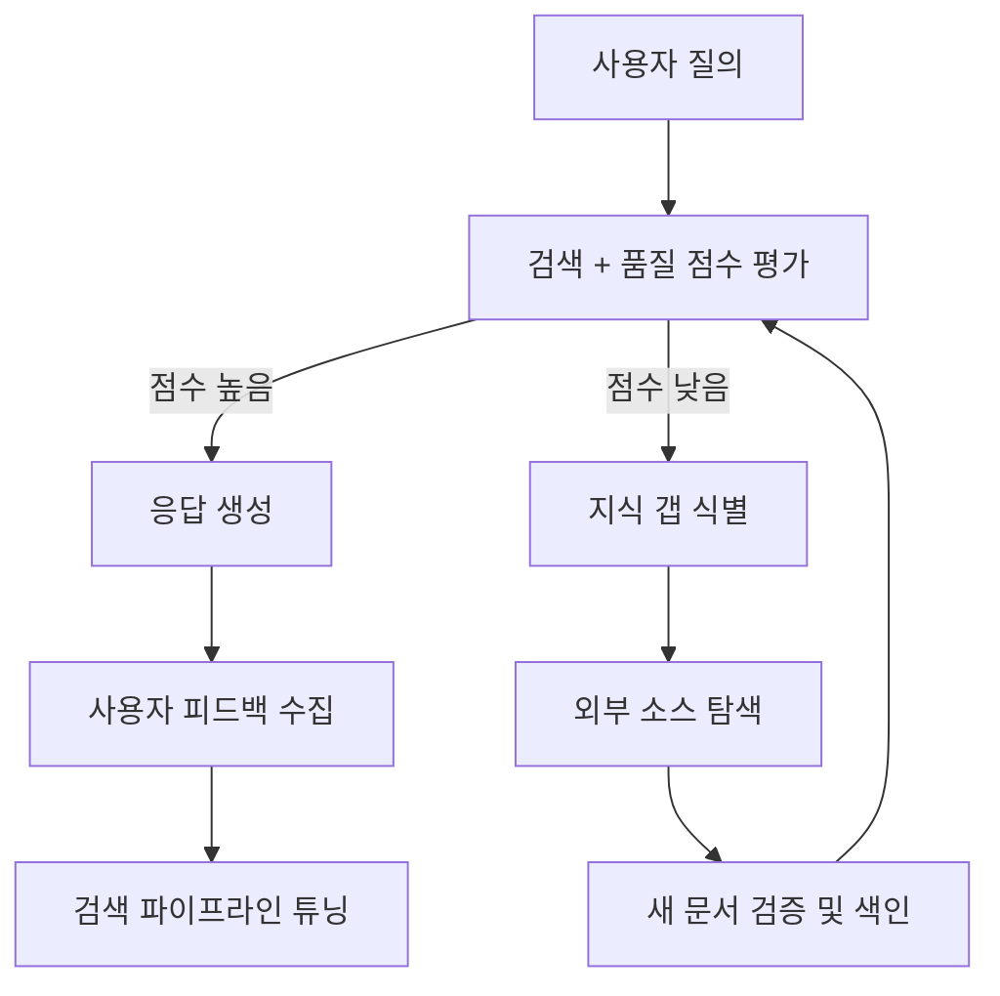

## 개요

에이전트 지식 베이스 패턴(Agentic Knowledge Base Patterns)은 [[agentic-ai-foundation|AI 에이전트]]가 지식 기반을 자율적으로 검색, 갱신, 확장하는 6가지 설계 패턴을 정리한 것이다. 정적 RAG가 사전 색인된 문서를 검색만 하는 데 비해, [[agent-memory-systems|에이전트 지식 베이스]]는 능동적으로 문서를 관리하고, 지식 공백을 감지하며, 정보의 품질을 자체적으로 개선한다. [[context-folding|컨텍스트 압축]]과 함께 장기 실행 에이전트의 핵심 인프라를 이룬다.

## 핵심 개념

### 정적 RAG vs 에이전트 지식 베이스

### 6가지 핵심 패턴

1. **Self-Healing Knowledge**: 에이전트가 오래된 정보, 모순, 누락을 자동 감지하고 수정하는 패턴. 검색 결과의 신선도와 일관성을 지속적으로 검증. 자기 교정 루프(self-correction loop)로 초기 검색 결과가 불충분할 때 자율적으로 쿼리를 정제하고 재검색한다
2. **Proactive Indexing**: 사용자 질의 패턴을 분석하여 필요할 것으로 예상되는 문서를 사전에 색인. 반응적 검색에서 예측적 준비로 전환. 사용자 참여도를 분석하여 갱신이 필요한 콘텐츠를 자동 식별한다
3. **Adaptive Chunking**: 문서 유형과 질의 패턴에 따라 청킹 전략을 동적으로 조정. 코드, 테이블, 장문 텍스트 각각에 최적화된 분할. 레이아웃 인식 보강(layout-aware enrichment)으로 테이블, 그림, 헤더, 섹션을 구조적으로 추출하여 검색 품질을 높인다
4. **Knowledge Graph Augmentation**: 벡터 검색에 엔티티 관계 그래프를 결합하여 다단계 추론(multihop retrieval)이 필요한 질의에 대응. 단순 유사도 검색이 놓치는 관계적 맥락을 보완
5. **Feedback-Driven Refinement**: 사용자 피드백과 응답 품질 메트릭을 바탕으로 검색 파이프라인과 임베딩을 지속 개선. 리랭킹(reranking) 전략으로 의미적 단편화(semantic fragmentation) 문제를 해결
6. **Multi-Source Orchestration**: 내부 문서, 외부 API, 데이터베이스, 실시간 웹 등 이기종 소스를 통합 관리하며 소스별 신뢰도 가중치 적용

## 기술 상세

### 메모리 레이어 아키텍처

프로덕션 에이전트의 지식 베이스는 계층화된 메모리 구조로 구현된다:

| 레이어 | 역할 | 저장소 예시 |
|--------|------|-----------|
| 단기 기억 | 현재 세션의 대화 맥락 | 인메모리 버퍼 |
| 작업 기억 | 진행 중인 태스크의 중간 결과 | Redis / 세션 스토어 |
| 장기 기억 | 축적된 지식, 사용자 선호 | 벡터 DB + 관계형 DB |
| 외부 지식 | 실시간 정보, API 결과 | 웹 검색, 외부 API |

### 가드레일과 결합

지식 베이스의 자율 갱신에는 반드시 안전장치가 필요하다:
- **행동 검증(Action Validation)**: 색인 추가/삭제 전 규칙 기반 검증
- **폴백 메커니즘**: 지식 베이스 장애 시 기본 응답으로 graceful degradation
- **접근 제어**: 에이전트가 접근 가능한 지식 범위를 제한하여 권한 외 정보 노출 방지

### 구현 패턴: 자율 갱신 루프

### 핵심 에이전틱 설계 패턴

에이전틱 지식 베이스의 자율 운영은 4가지 기반 패턴에 의존한다:

| 패턴 | 역할 | 적용 |
|------|------|------|
| **반성(Reflection)** | 검색된 정보를 평가하고 자기 비판 | 응답 품질 사후 검증 |
| **계획(Planning)** | 복잡한 쿼리를 관리 가능한 하위 태스크로 분해 | 멀티홉 검색 전략 |
| **도구 사용(Tool Use)** | 외부 리소스(API, DB, 웹) 접근 | 지식 갭 보충 |
| **멀티에이전트 협업** | 전문화된 에이전트 네트워크가 상호 검증 | 교차 검증, 품질 보장 |

### 정적 RAG와의 핵심 차이

정적 RAG는 수동적 정보 검색 도구인 반면, 에이전틱 지식 베이스는 자율적이고 지능적인 문제 해결자다. 자체 평가 역량(self-assessment)을 통해 검색 결과의 충분성을 판단하고, 불충분하면 쿼리를 재구성하거나 대안 소스를 탐색한다.

### 설계 원칙

- **변경 불변성**: 지식 갱신은 기존 데이터를 덮어쓰지 않고 버전을 추가하여 롤백 가능하게 설계
- **출처 추적**: 모든 지식 항목에 소스 URL, 수집 시점, 신뢰도 점수를 메타데이터로 부착
- **주기적 감사**: 지식 베이스의 일관성과 최신성을 정기적으로 검증하는 자동화 프로세스 운영
- **점진적 보강**: 전체 재색인 대신, 변경분만 증분 업데이트하여 운영 비용 최소화
- **신뢰도 기반 라우팅**: 소스별 신뢰도 점수에 따라 검색 우선순위를 동적으로 조정

## 관련 문서

- [[agent-memory-systems]] - 에이전트 메모리 시스템
- [[context-folding]] - 컨텍스트 폴딩
- [[human-in-the-loop-patterns]] - 지식 갱신 시 인간 승인
- [[ai-agent-guardrails]] - 에이전트 가드레일
