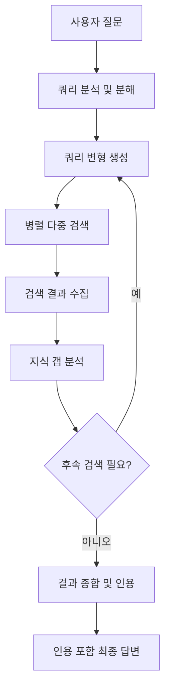
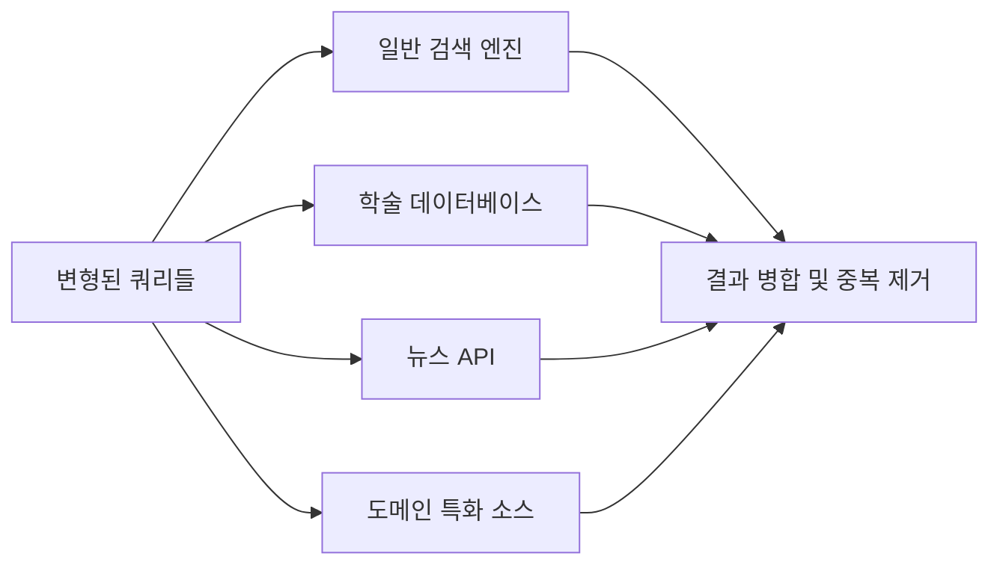
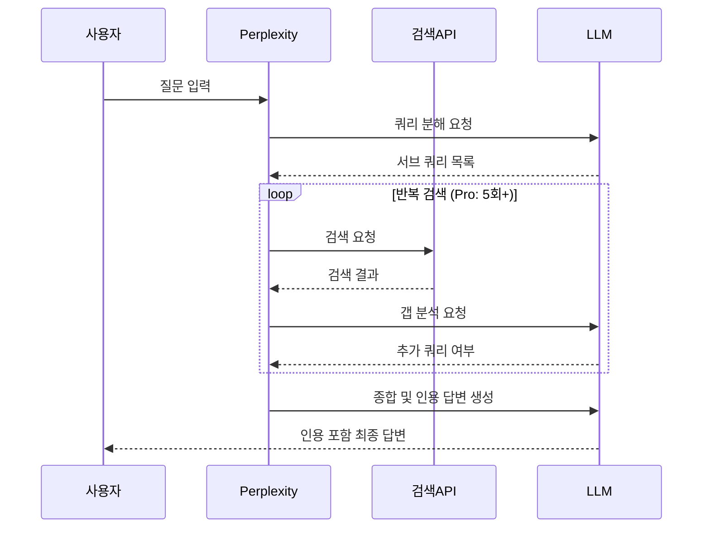

# 에이전트 웹 검색 패턴

## 개요

에이전트 웹 검색 패턴(Agentic Web Search Pattern)은 단순히 검색 API를 한 번 호출하는 것이 아니라, LLM 에이전트가 **쿼리를 능동적으로 변형하고, 여러 검색을 조합하며, 결과를 비판적으로 종합**하는 다단계 검색 전략을 말한다. Perplexity AI, OpenAI SearchGPT(ChatGPT Search) 등이 이 패턴을 프로덕션 레벨에서 구현한 대표 사례다.

기존 단순 RAG(Retrieval-Augmented Generation)와의 차이는 **검색 자체를 에이전트 루프의 일부로** 취급한다는 점이다. 에이전트는 초기 결과를 보고 지식 갭을 스스로 파악하고 후속 검색을 계획한다.



이 순환 루프가 에이전트 웹 검색의 핵심이다.

## 핵심 구성 요소

### 1. 쿼리 분해 (Query Decomposition)

복잡한 사용자 질문을 여러 개의 단순한 서브 쿼리로 분리한다.

**예시:**
- 원래 질문: "2024년 NVIDIA와 AMD의 AI 칩 성능 및 가격 비교"
- 분해된 쿼리:
  - "NVIDIA H100 AI chip performance benchmarks 2024"
  - "AMD MI300X performance benchmarks 2024"
  - "NVIDIA H100 price 2024"
  - "AMD MI300X price 2024"

분해 전략:
- **독립 분해**: 각 쿼리가 독립적으로 답을 구할 수 있는 경우
- **의존 분해**: 앞 쿼리 결과가 뒤 쿼리에 영향을 주는 경우 (순차 실행 필요)

### 2. 쿼리 변형 (Query Rewriting/Reformulation)

원래 쿼리의 표현을 바꿔 다양한 각도에서 검색해 재현율(recall)을 높인다.

변형 기법:

| 기법 | 설명 | 예시 |
|------|------|------|
| 동의어 치환 | 핵심 용어를 유의어로 대체 | "LLM" -> "large language model" |
| 구체화 | 추상적 표현을 구체화 | "AI 칩" -> "GPU accelerator for inference" |
| 확장 | 관련 용어 추가 | "RLHF" -> "RLHF reinforcement learning human feedback LLM training" |
| 역방향 | 반대 관점에서 검색 | "장점" 검색 후 "단점/한계" 추가 검색 |
| 시간 한정 | 날짜 범위 명시 | "site:arxiv.org 2024 2025" |

### 3. 다중 검색 소스 활용

단일 검색 엔진에 의존하지 않고 여러 소스를 병렬 활용한다:

- **일반 검색**: Bing, Google, Brave Search API
- **학술 검색**: Semantic Scholar, arXiv, PubMed
- **뉴스**: Google News, NewsAPI
- **코드**: GitHub, Stack Overflow
- **도메인 특화**: Reddit, HackerNews (커뮤니티 의견)



### 4. 결과 관련성 필터링

검색으로 수집된 결과 중 실제로 유용한 것만 선별한다:

- **재순위화(Re-ranking)**: 크로스 인코더로 쿼리-문서 관련성 재계산
- **중복 제거**: 동일 정보를 담은 여러 문서 중복 제거
- **신선도 필터**: 최신 정보 우선 (시간 민감 질문의 경우)
- **신뢰도 필터**: 도메인 권위 점수, 인용 횟수 기반 필터링

### 5. 지식 갭 감지 및 반복 검색

수집된 결과를 LLM이 읽고 답변에 부족한 부분을 파악한다:

```python
# 지식 갭 감지 의사 코드
def detect_knowledge_gap(question: str, retrieved_docs: list[str]) -> list[str]:
    prompt = f"""
    질문: {question}
    
    수집된 정보:
    {retrieved_docs}
    
    위 정보만으로 질문에 완전히 답할 수 있나요?
    답하기 어려운 부분이 있다면, 추가로 검색해야 할 구체적인 쿼리를 나열해주세요.
    """
    gaps = llm.generate(prompt)
    return gaps  # 추가 검색 쿼리 목록
```

### 6. 인용 생성 (Citation Generation)

신뢰할 수 있는 출처를 명시해 답변의 검증 가능성을 높인다. Perplexity의 인라인 인용 `[1]`, `[2]` 형태가 대표적 UI 패턴이다.

인용 구현 핵심:
- 각 사실 주장을 원본 URL과 텍스트 스팬에 매핑
- 답변 생성 시 출처 참조 인덱스 삽입
- 최종 결과에 참조 목록 첨부

## Perplexity 패턴

Perplexity AI는 에이전트 웹 검색을 제품화한 가장 성공적인 사례다. 핵심 구현 특징:

1. **실시간 인덱싱**: 검색 시점에 웹 크롤링해 최신 정보 반영
2. **멀티스텝 검색**: "Pro Search" 모드에서 5회 이상 반복 검색
3. **인라인 인용**: 각 문장에 소스 링크를 직접 삽입
4. **관련 질문 제안**: 후속 탐색을 위한 파생 질문 자동 생성



## SearchGPT (ChatGPT Search) 패턴

OpenAI의 접근은 Perplexity와 유사하지만 몇 가지 차이가 있다:

- **Bing 백엔드**: Microsoft Bing을 검색 엔진으로 활용
- **도구 호출 통합**: ChatGPT의 함수 호출(tool use) 프레임워크에 검색을 도구로 통합
- **모델 내 판단**: 언제 웹 검색이 필요한지 모델이 자율적으로 판단

## 실무 구현 가이드

### LangChain을 활용한 기본 구현

```python
from langchain.tools import TavilySearchResults
from langchain_anthropic import ChatAnthropic
from langchain.agents import create_react_agent

# 검색 도구 설정
search_tool = TavilySearchResults(
    max_results=5,
    include_raw_content=True,
    include_images=False,
)

llm = ChatAnthropic(model="claude-sonnet-4-5")

# ReAct 에이전트로 웹 검색 통합
agent = create_react_agent(
    llm=llm,
    tools=[search_tool],
    prompt=REACT_PROMPT,
)
```

### 쿼리 변형 최적화

```python
def generate_query_variants(original_query: str, llm) -> list[str]:
    """원래 쿼리에서 다양한 변형 쿼리를 생성한다."""
    prompt = f"""
    다음 질문에 대해 검색 재현율을 높이기 위한 
    서로 다른 표현의 검색 쿼리 3개를 생성해주세요.
    
    원래 질문: {original_query}
    
    규칙:
    - 각 쿼리는 다른 각도에서 접근
    - 영어와 한국어 혼용 가능
    - 따옴표로 정확한 구문 검색 활용
    """
    return llm.generate(prompt)
```

## 검색 품질 측정

| 지표 | 설명 | 목표값 |
|------|------|--------|
| 인용 정확도 | 인용된 소스가 실제로 해당 정보를 포함하는 비율 | 90%+ |
| 사실 신뢰도 | 검증 가능한 주장의 비율 | 85%+ |
| 신선도 | 6개월 이내 소스 비율 (시사 질문) | 70%+ |
| 검색 효율 | 최종 답변에 기여한 검색 비율 | 60%+ |
| 응답 시간 | 검색 포함 전체 응답 시간 | 5초 이내 |

## 한계와 트레이드오프

- **비용**: 다중 검색 API 호출 + 여러 번의 LLM 호출로 비용이 누적됨
- **지연**: 반복 검색으로 응답 시간이 단순 LLM보다 5-10배 길어질 수 있음
- **환각 위험**: 검색 결과가 잘못된 경우 그 오류를 사실처럼 인용할 수 있음
- **인덱싱 지연**: 매우 최신 이벤트(수 시간 이내)는 검색 엔진 인덱싱이 안 된 경우가 있음
- **언어 편향**: 영어 정보가 압도적으로 많아 비영어권 주제는 품질이 낮을 수 있음

## 관련 문서

- [[react-pattern]] -- Thought-Action-Observation 에이전트 루프
- [[rag]] -- 검색 증강 생성 전반
- [[document-qa-agent]] -- 문서 QA 에이전트 패턴
- [[agent-context-management]] -- 검색 결과의 컨텍스트 관리
- [[browser-use-agent-framework]] -- 실제 웹 브라우징 에이전트
