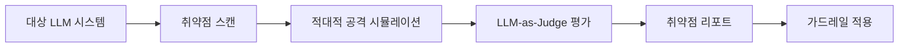

# AI 레드팀 & LLM 취약점 스캐닝

LLM 기반 시스템의 보안 취약점을 사전에 탐지하기 위한 자동화된 적대적 테스트 방법론. [[zero-trust-ai-agents|에이전트 제로 트러스트]]와 함께 AI 보안의 핵심 축을 이룬다.

## 개요

2026년 들어 프론티어 모델들이 [[agentic-ai-foundation|에이전트]] 기능을 갖추면서, 전통적 소프트웨어 보안 테스트를 넘어선 AI 전용 레드팀 활동이 필수가 되었다. Novee는 자율 AI 레드팀 에이전트로 LLM 애플리케이션의 취약점을 자동 탐지하며, DeepTeam은 오픈소스 프레임워크로 50개 이상의 취약점 유형과 20개 이상의 적대적 공격 기법을 지원한다. 현재 모든 프론티어 모델이 다양한 공격 벡터에 취약한 것으로 확인되었다. [[owasp-agentic-top-10|OWASP Agentic Top 10]]에서 체계적인 취약점 분류를 확인할 수 있다.

## 핵심 개념

### 레드팀 자동화 도구 생태계

- **Novee**: 자율 AI 펜테스팅 에이전트. 챗봇, 코파일럿, 자율 에이전트, LLM 워크플로우를 대상으로 적대적 공격을 시뮬레이션한다. 테스트 전 애플리케이션 문서와 API를 분석하여 내부 모델을 구축한 뒤, 다중 기법을 연쇄(chaining)하여 정적 스캐너가 놓치는 취약점을 탐지한다. 창업자 전원이 국가급 공격 보안 운영 출신이며, $5150만 투자를 유치했다(YL Ventures, Canaan Partners, Zeev Ventures). RSAC 2026 Conference에서 발표되었다.
- **DeepTeam**: DeepEval 기반 오픈소스 LLM 레드팀 프레임워크(Apache 2.0). "침투 테스트, 단 LLM용"이라는 콘셉트로, `model_callback` 함수를 래핑하여 적대적 입력을 생성하고 LLM-as-Judge 방식으로 합격/불합격을 판정한다. **50개 이상의 취약점 유형**과 **20개 이상의 공격 기법**을 지원한다.
- **Promptfoo**: 프롬프트 수준 취약점 탐지 및 방어 검증 도구.

### 취약점 분류 체계

DeepTeam이 지원하는 50개 이상의 취약점은 다음 범주로 구분된다:

- **데이터 프라이버시**: PII 유출, 프롬프트 유출
- **책임 있는 AI**: 편향, 독성, 공정성 위반
- **보안**: SQL 인젝션, 셸 인젝션, SSRF, BOLA/BFLA 인가 우회
- **안전**: 불법 활동 조장, 유해 콘텐츠 생성
- **에이전트 전용**: 목표 탈취(goal theft), 재귀적 하이재킹, 과도한 자율성

### 적대적 공격 기법

DeepTeam이 지원하는 20개 이상의 공격 기법은 단일 턴과 다중 턴으로 구분된다:

**단일 턴 공격**: 프롬프트 인젝션(PromptInjection), 역할극(Roleplay), 인코딩 기반 난독화(Leetspeak, ROT13, Base64), 다국어 번역 우회, 문맥 부풀리기(Context Inflation)

**다중 턴 공격**:
- 선형 탈옥(Linear Jailbreak): 반복적 공격 정제
- 트리 탈옥(Tree Jailbreak): 병렬 변형 탐색
- 크레센도 탈옥(Crescendo Jailbreak): 단계적 에스컬레이션
- 순차 탈옥(Sequential Jailbreak): 대화형 스캐폴딩

## 기술 상세

### 레드팀 워크플로



### DeepTeam 사용 예시

```python
from deepteam import red_team
from deepteam.vulnerabilities import Bias
from deepteam.attacks.single_turn import PromptInjection

async def model_callback(input: str) -> str:
    # 대상 LLM 시스템 호출
    return await call_target_llm(input)

# 특정 취약점 + 공격 기법 지정
risk_assessment = red_team(
    model_callback=model_callback,
    vulnerabilities=[Bias(types=["race"])],
    attacks=[PromptInjection()]
)

# 또는 OWASP Top 10 프레임워크 전체 적용
from deepteam.frameworks import OWASPTop10
risk_assessment = red_team(
    model_callback=model_callback,
    framework=OWASPTop10()
)
```

### 프로덕션 가드레일

DeepTeam은 7개의 프로덕션 가드레일을 제공하여 실시간 입출력 보호를 수행한다:

- **ToxicityGuard**: 유해/모욕적 콘텐츠 차단
- **PromptInjectionGuard**: 프롬프트 인젝션 탐지
- **PrivacyGuard**: PII 유출 방지
- **IllegalGuard**: 불법 활동 조장 차단
- **HallucinationGuard**: 할루시네이션 탐지
- **TopicalGuard**: 주제 이탈 방지
- **CybersecurityGuard**: 보안 공격 시도 차단

이는 OWASP Top 10 for LLMs 2025, OWASP Top 10 for Agents 2026, NIST AI RMF, MITRE ATLAS, BeaverTails, Aegis 등 확립된 보안 프레임워크와 통합된다.

### Novee vs DeepTeam 비교

| 항목 | Novee | DeepTeam |
|------|-------|----------|
| 유형 | 자율 에이전트 (상용) | 오픈소스 프레임워크 |
| 접근법 | 적응적 추론 + 다단계 공격 연쇄 | 정의된 취약점/공격 조합 |
| CI/CD 통합 | 지원 | 지원 |
| 가드레일 | 별도 제공 | 7개 내장 |
| 라이선스 | 상용 | Apache 2.0 |

### 프론티어 모델 취약점 현황

2026년 기준, 모든 주요 프론티어 모델이 프롬프트 인젝션, 탈옥, 시스템 프롬프트 유출 등에 취약한 것으로 확인되었다. 이는 AI 보안이 일회성 작업이 아닌 지속적 군비 경쟁(arms race)임을 시사한다. CI/CD 파이프라인에 레드팀 테스트를 통합하여 배포 전 자동 검증하는 것이 업계 모범 사례로 자리잡고 있다.

## 관련 문서

- [[llm-security-owasp|LLM Security (OWASP / Adversarial Attacks)]]
- [[metatron|METATRON (Offline AI Pentesting)]]
- [[agent-prompt-injection-defense|Agent Prompt Injection Defense]]
- [[constitutional-classifiers|Constitutional Classifiers]]
