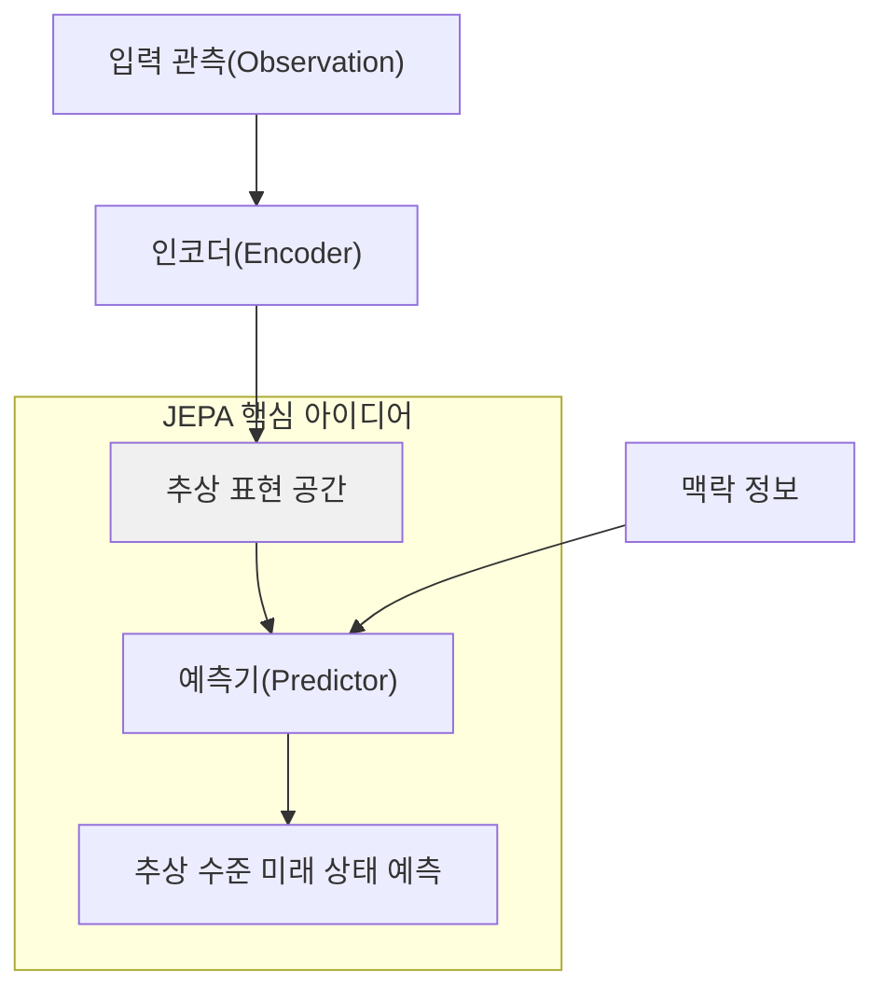

# AMI Labs

## 개요

AMI Labs는 튜링상 수상자 Yann LeCun이 Meta를 떠나 설립한 AI 연구 기업이다. 유럽 역대 최대 시드 라운드인 $1.03B를 $3.5B 프리머니 밸류에이션으로 조달했다. LLM이 아닌 **월드 모델(World Models)**을 핵심 기술 방향으로 삼으며, JEPA(Joint Embedding Predictive Architecture)를 기반으로 한다.

LeCun의 핵심 주장은 현재 업계의 LLM 집착이 잘못된 방향이라는 것이다. 의사결정의 신뢰성이 중요하고 환각(hallucination)이 실제 비용을 초래하는 로보틱스, 산업 프로세스 제어, 헬스케어 등의 영역에서는 월드 모델이 더 적합하다고 본다.

## 핵심 기술: JEPA

JEPA(Joint Embedding Predictive Architecture)는 LeCun이 Meta 시절 제안한 학습 프레임워크다.

핵심 통찰: 고차원 디테일에서 미래 상태를 예측하는 생성 모델(generative model)은 본질적으로 부정확하다. JEPA는 대신 **추상적 표현 공간(abstract representation space)**에서 예측하도록 모델을 훈련한다 -- 세상이 어떻게 변하는지에서 "중요한 것"만 학습하는 방식이다.

- **I-JEPA**: JEPA 기반 최초 AI 모델. 인간처럼 세계의 내부 모델을 구축하여 학습
- **생성 모델과의 차이**: 픽셀 수준 예측 대신 의미적 표현(semantic representation) 수준에서 예측

위 다이어그램은 JEPA의 핵심 흐름을 보여준다. 고차원 입력을 추상 표현 공간으로 인코딩한 후, 그 추상 수준에서 미래 상태를 예측한다. 픽셀 수준 재구성을 하지 않는 것이 생성 모델과의 근본적 차이점이다.

## LeCun의 비전

- 첫 해는 **연구에만 집중**, 제품 타임라인은 연 단위
- 로보틱스, 산업 프로세스 제어, 웨어러블, 헬스케어가 1차 타겟 도메인
- LLM이 잘 못하는 영역 -- 신뢰성 있는 의사결정, 물리 세계 이해 -- 을 정조준
- $1.03B 시드는 "연구만으로 이 규모 펀딩이 가능한가"에 대한 시장의 답변

## 시장 맥락

| 플레이어 | 접근 방식 |
|----------|-----------|
| AMI Labs (LeCun) | JEPA 기반 월드 모델 |
| DeepMind | Genie 2 등 시뮬레이션 기반 |
| Meta FAIR | I-JEPA 후속 연구 (LeCun 이탈 후 지속 여부 불투명) |
| 스타트업군 | 자율주행/로보틱스 특화 월드 모델 |

2025-2026년 월드 모델 패러다임이 주류 AI 개발에 진입하면서, 로보틱스, 자율주행, 시뮬레이션 분야에서 응용이 확대되고 있다. AMI Labs는 이 흐름의 가장 큰 단일 투자를 유치한 회사다.

## 관련 문서

- [[ai-robotics-physical-ai]] -- Physical AI 및 로보틱스 시장 전반
- [[nvidia-isaac-groot]] -- NVIDIA의 로보틱스 파운데이션 모델
- [[hy-embodied]] -- Tencent의 VLA 파운데이션 모델
