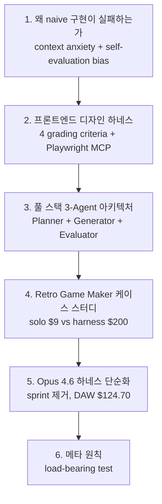
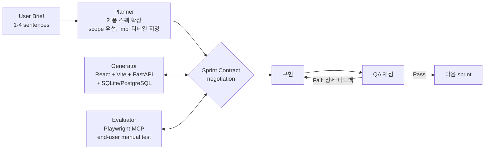

# Anthropic Harness Design for Long-Running Application Development

**저자**: Prithvi Rajasekaran (Anthropic Labs) · **발행**: 2026-03-24 · **출처**: [anthropic.com/engineering/harness-design-long-running-apps](https://www.anthropic.com/engineering/harness-design-long-running-apps)

[[harness-engineering|하네스 엔지니어링]] 시대를 대표하는 Anthropic 공식 엔지니어링 포스트. GAN(Generative Adversarial Networks)에서 영감받은 **generator-evaluator 분리** 패턴으로 Claude가 장시간 고품질 애플리케이션을 자율 구축하도록 만든 실험 기록. 저자는 프론트엔드 디자인 하네스에서 출발해 풀 스택 3-agent 아키텍처로 확장하고, Opus 4.6 릴리스와 함께 하네스를 단순화한 과정을 시간 순서로 공유한다.

## 글의 구조

## 1. 왜 naive 구현이 실패하는가

두 가지 지속적 실패 모드:

### Context Degradation & [[context-anxiety|"Context Anxiety"]]

긴 작업에서 컨텍스트 창이 채워질수록 모델이 일관성을 잃는다. 저자는 특히 **Claude Sonnet 4.5에서 "context anxiety"** 현상을 관찰했다 — 모델이 자신이 컨텍스트 한계에 가까워졌다고 *믿고* 작업을 조기 종료한다.

**컴팩션(compaction) vs 리셋(reset) 구분이 결정적**:

- **컴팩션**: 이전 대화를 요약해서 같은 에이전트가 계속 → clean slate 아님, context anxiety 지속
- **리셋**: 창을 완전히 비우고 새 에이전트 시작 → 이전 상태·다음 단계를 담은 **구조화된 핸드오프 아티팩트** 필요

저자 결론:
> "compaction alone wasn't sufficient to enable strong long task performance"

리셋은 필수지만 "orchestration complexity, token overhead, and latency"를 추가한다.

### [[self-evaluation-bias|Self-Evaluation Bias]]

에이전트는 자기 작업을 자신 있게 칭찬한다. 품질이 평범할 때도 그렇다. 특히 바이너리 검증이 없는 **주관적 작업(디자인 등)** 에서 심각하다. 해법은 작업 에이전트와 평가 에이전트를 분리하는 것:

> "tuning a standalone evaluator to be skeptical proves far more tractable than making a generator critical of its own work"

## 2. 프론트엔드 디자인: 주관적 품질을 채점 가능하게 만들기

[[generator-evaluator-architecture|Generator-evaluator 루프]]를 Claude Agent SDK 위에 구축. 4개 채점 기준:

| 기준 | 핵심 질문 |
|---|---|
| **Design Quality** | 디자인이 부분들의 집합이 아니라 coherent whole로 느껴지는가? |
| **Originality** | Custom 결정의 증거인가, 아니면 템플릿/AI 기본값인가? |
| **Craft** | Typography hierarchy, spacing, color harmony, contrast 등 기술 실행 |
| **Functionality** | 미학과 무관한 사용성 — 사용자가 primary action을 찾는가? |

저자는 "design quality and originality over craft and functionality"에 가중치를 줬다. Claude는 기술 competence 점수는 이미 높지만 기본값은 "bland" 디자인을 만들기 때문.

### 반복 루프

- Generator가 HTML/CSS/JS 생성
- Evaluator에 **Playwright MCP** 접근 제공 → 실제 페이지를 navigate/screenshot/스터디한 후 점수·비평
- **5~15 iteration per generation**
- 매 평가 후 generator에게 전략적 결정 지시: 점수가 좋으면 refine, 아니면 "pivot to an entirely different aesthetic"
- 풀 런은 "up to four hours"

### Calibration: 문구의 힘

Few-shot 예시로 평가자 정렬. **문구 자체가 출력을 직접 형성**한다:

> "the best designs are museum quality"

이 한 구절이 디자인을 특정 visual convergence로 밀어낸다.

### 사례: Dutch Art Museum

- Iteration 9: clean, dark-themed landing page
- Iteration 10: generator가 방향 완전 폐기 → **3D 방 + CSS perspective checkered floor + 벽에 자유 배치된 아트워크 + 문간 기반 gallery navigation** 으로 재상상

## 3. 풀 스택 3-Agent 아키텍처

### Planner

- 1-4 문장 → 전체 제품 스펙
- **ambitious scope와 product context/high-level technical design**에 집중 (granular 구현 디테일 지양)
- 이유: "if the planner tried to specify granular technical details upfront and got something wrong, the errors in the spec would cascade into the downstream implementation"
- AI features를 제품 스펙에 엮어넣기도 담당

### Generator

- Sprint 단위로 한 번에 하나의 기능 구현
- 스택: **React, Vite, FastAPI, SQLite (later PostgreSQL)**
- Sprint 끝에 QA handoff 전 self-evaluation
- git version control 유지

### Evaluator

- **Playwright MCP**로 running app을 end user처럼 수동 클릭
- UI 기능, API 엔드포인트, DB 상태 테스트
- "product depth, functionality, visual design, and code quality" 기준 채점
- 각 기준 hard threshold; 실패 시 상세 피드백

### [[sprint-contracts|Sprint Contracts]]

각 sprint 코딩 전, generator와 evaluator가 "sprint contract" 협상 — "done"의 정의와 검증 방법. Generator가 구현 접근법 제안, evaluator가 review, "iterated until they agreed". 고수준 user story와 testable 구현 간 간극을 upfront over-specification 없이 연결.

### Inter-Agent 통신

파일 기반. 한 에이전트가 쓰면 다른 에이전트가 읽고 응답 — 같은 파일 내 또는 새 파일로. "kept the work faithful to the spec without over-specifying implementation too early"

## 4. 케이스 스터디: Retro Game Maker

**프롬프트**: "Create a 2D retro game maker with features including a level editor, sprite editor, entity behaviors, and a playable test mode."

| | Solo Agent | Full Harness |
|---|---|---|
| 시간 | 20분 | 6시간 |
| 비용 | **$9** | **$200** (20배+) |
| 결과 | UI만 있고 게임 동작 불가 | 16 feature 스펙, 10 sprint, 실제 플레이 가능 |

**Solo run 치명적 실패**: "the actual game was broken. My entities appeared on screen but nothing responded to input." 엔티티 정의와 게임 런타임 간 와이어링이 끊겨 있었고 표면에는 단서가 없었다.

**Full harness 결과**: 캔버스가 viewport 전체 사용, sprite editor가 "richer and more fully featured", 결정적으로 게임이 **실제로 작동**. 약간의 물리 버그는 있었으나 "the core thing worked, which the solo run did not manage". Planner의 AI feature 지시 덕에 "built-in Claude integration that let me generate different parts of the game through prompting"까지 구현됨.

### Evaluator 튜닝의 교훈

Claude는 초기에 "a poor QA agent"였다:
- 정당한 이슈를 식별한 뒤 "talk itself into deciding they weren't a big deal and approve the work anyway"
- 표면적 테스트만, 엣지 케이스 probe 안 함

**개선 과정**: 로그 읽기 → 저자 판단과 divergence 식별 → QA 프롬프트 iteratively 업데이트. "several rounds of development before the evaluator was grading in a way that I found reasonable".

**훈련된 evaluator의 실제 findings 예**:
1. Rectangle fill tool: `fillRectangle` 함수는 있으나 `mouseUp`에서 trigger 안 됨
2. Delete key handler: 조건이 `selection && selectedEntityId`로 되어 있어 엔티티만 클릭했을 때 작동 안 함 → `selection || (selectedEntityId && activeLayer === 'entity')`
3. FastAPI routing: `PUT /frames/reorder`가 `/{frame_id}` 이후에 정의되어 'reorder'를 integer로 파싱 시도 → 422 에러

## 5. Opus 4.6를 위한 하네스 단순화

### "Building Effective Agents" 원칙 적용

> "find the simplest solution possible, and only increase complexity when needed"

저자는 Opus 4.6 릴리스와 함께 **한 번에 한 컴포넌트씩** 제거하는 [[load-bearing-harness|load-bearing test]]를 수행.

### Opus 4.6가 바꾼 것

- "plans more carefully"
- "sustains agentic tasks for longer"
- "operate more reliably in larger codebases"
- "better code review and debugging skills to catch its own mistakes"
- "long-context retrieval" 대폭 개선

### Sprint 제거

Sprint 완전 삭제. Planner와 Evaluator는 유지 — 둘 다 "obvious value" 지속. **Planner 없이**: "the generator under-scoped: given the raw prompt, it would start building without first speccing its work, and end up creating a less feature-rich application".

Evaluator는 per-sprint 채점 → 단일 end-of-run 패스로 이동. 원칙:

> "The evaluator is not a fixed yes-or-no decision. It is worth the cost when the task sits beyond what the current model does reliably solo."

### DAW 케이스 스터디

**프롬프트**: "Build a fully featured DAW in the browser using the Web Audio API."

| Phase | Duration | Cost |
|---|---|---|
| Planner | 4.7 min | $0.46 |
| Build R1 | 2 hr 7 min | $71.08 |
| QA R1 | 8.8 min | $3.24 |
| Build R2 | 1 hr 2 min | $36.89 |
| QA R2 | 6.8 min | $3.09 |
| Build R3 | 10.9 min | $5.88 |
| QA R3 | 9.6 min | $4.06 |
| **Total** | **3 hr 50 min** | **$124.70** |

Builder는 "ran coherently for over two hours without the sprint decomposition that Opus 4.5 had needed". 최종 앱은 arrangement view, mixer, transport가 모두 작동하는 "functional music production program". Integrated agent이 tempo·key 설정, melody 녹음, 드럼 트랙 구축, 믹서 레벨 조정, reverb 추가까지 자율 시연.

**잔존 gap**: 클립 드래그/리사이즈 미구현, mic capture stub, EQ curve 대신 numeric slider. "display-only without interactive depth" 피드백이 2라운드에도 완전히 해소되지 못함.

## 6. 저자의 메타 원칙

### 네 가지 교훈

1. **하네스 복잡도는 모델 개선과 함께 감소해야 한다** — 한 번에 한 컴포넌트씩 제거해서 무엇이 load-bearing인지 발견
2. **Evaluator의 가치는 태스크 난이도에 비례** — 모델 baseline 내에서는 오버헤드, frontier 태스크에서는 critical
3. **프롬프트 기준이 출력을 형성** — "museum quality"가 점수 이상으로 방향을 밀어냄
4. **분리가 튜닝을 가능케 함** — standalone evaluator를 skeptical로 만드는 것이 generator를 self-critical로 만드는 것보다 tractable

### 결론

> "As models improve, the space of interesting harness combinations doesn't shrink. Instead, it moves, and the interesting work for AI engineers is to keep finding the next novel combination."

> "Every component in a harness encodes an assumption about what the model can't do on its own."

모델이 개선되어도 하네스 디자인 문제는 사라지지 않는다 — **scaffolding이 필요한 경계가 이동할 뿐**. 그 경계의 반대편에는 항상 새로운 불가능한 태스크가 있고, 엔지니어링의 재미는 거기에 있다.

## 관련 문서
- [[agent-interrupt-resume]] -- 에이전트 인터럽트/재개 패턴 (Agent Interrupt & Resume)

- [[harness-engineering]] — 2026+ 패러다임 전체
- [[generator-evaluator-architecture]] — 이 글이 도입한 핵심 패턴
- [[context-anxiety]] — Sonnet 4.5 failure mode
- [[self-evaluation-bias]] — 분리의 동기
- [[sprint-contracts]] — pre-coding 협상 패턴
- [[load-bearing-harness]] — 하네스 단순화 메타 원칙
- [[anthropic-app-harness-case-study]] — Game Maker + DAW 상세 비교
- [[subagents]] — 관련이지만 다른 동기(컨텍스트 창)에서 출발한 패턴
- [[harness-quadrants]] — Fowler/Böckeler 4사분면 중 "Inferential" 에 해당
- [[evolution-of-agentic-patterns]] — 3 에라 연대기에서 Era 3
