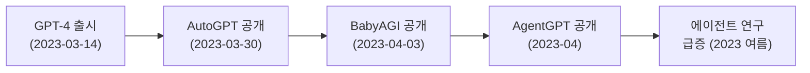
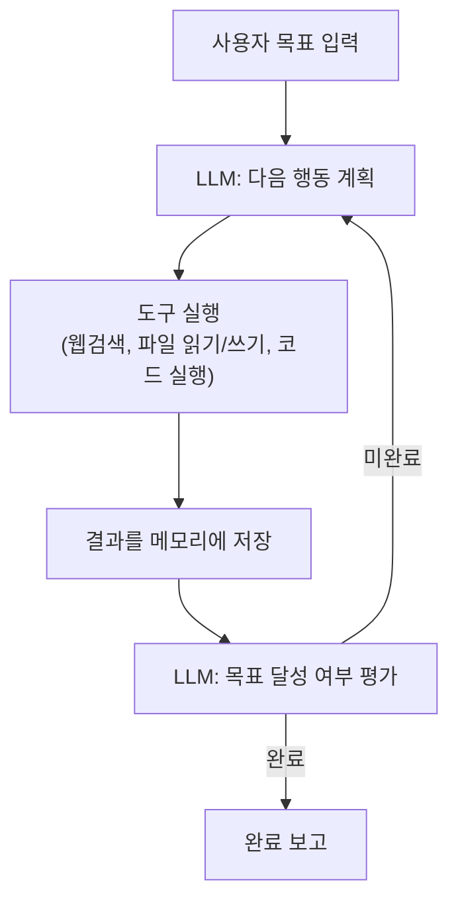

# AutoGPT - 자율 에이전트 시초

## 개요

AutoGPT는 2023년 3월 Significant Gravitas(Toran Bruce Richards)가 공개한 오픈소스 LLM 자율 에이전트 프로젝트다. "GPT-4에게 목표를 주면 스스로 계획하고 실행한다"는 개념으로 GitHub에서 불과 며칠 만에 수만 개의 스타를 획득하며 LLM 에이전트 시대의 서막을 열었다. AutoGPT 이전에도 LLM 에이전트 연구는 존재했지만, AutoGPT는 일반 대중이 "AI가 자율적으로 작업한다"는 개념을 처음으로 체감하게 만든 프로젝트다.

## 탄생 배경과 역사적 맥락



GPT-4의 강력한 추론 능력이 공개되자 개발자들은 즉시 이를 반복적으로 실행하는 루프를 실험하기 시작했다. AutoGPT는 그 초기 실험의 결정체로, 단일 LLM 호출이 아닌 **자기 반복적 에이전트 루프**를 대중에게 소개한 최초의 주류 프로젝트다.

## 핵심 아키텍처

### 에이전트 루프



AutoGPT의 루프는 단순하다. LLM에게 현재 상태와 목표를 보여주고 "다음에 무엇을 할지" 결정하게 한 뒤, 그 결정을 실행하고, 결과를 다시 LLM에 피드백한다. 이 반복이 목표 달성까지 계속된다.

### 4대 구성 요소

**1. 목표 설정 (Goal Definition)**
사용자가 자연어로 목표를 입력한다. AutoGPT는 이를 세부 목표(sub-goal) 목록으로 분해한다.

```
목표: "파이썬으로 웹 스크래퍼를 만들고 결과를 CSV로 저장해라"
분해:
  1. 필요한 라이브러리 조사
  2. 스크래퍼 코드 작성
  3. 코드 실행 및 오류 수정
  4. CSV 저장 로직 추가
  5. 테스트 및 검증
```

**2. 메모리 시스템 (Memory)**
- **단기 메모리**: LLM 프롬프트 내 컨텍스트 윈도우
- **장기 메모리**: Pinecone, Redis 등 벡터 DB에 실행 이력 저장. 관련 기억을 임베딩 검색으로 현재 프롬프트에 주입

**3. 도구 사용 (Tool Use)**

| 도구 유형 | 예시 |
|----------|------|
| 웹 검색 | Google, DuckDuckGo API |
| 파일 시스템 | 파일 읽기/쓰기/삭제 |
| 코드 실행 | Python 코드 실행 (Docker 샌드박스) |
| 웹 브라우징 | 웹페이지 내용 가져오기 |
| 이미지 생성 | DALL-E API 호출 |

**4. 자기 피드백 (Self-Feedback)**
각 행동 후 LLM이 스스로 "이 행동이 목표에 도움이 됐는가"를 평가하고 다음 계획을 수정한다. 이는 [[react-pattern]]의 Thought-Action-Observation 루프와 유사한 구조다.

## 기술 스택 (초기 버전)

```
LLM: GPT-4 (OpenAI API)
장기 메모리: Pinecone 벡터 DB
검색: Google Custom Search API
코드 실행: Docker 컨테이너 (격리 실행)
파일 관리: 로컬 파일시스템
UI: CLI (초기), 이후 웹 UI 추가
```

## 역사적 영향

### 즉각적 파급 효과
- GitHub 스타 수 기준 역대 가장 빠른 성장 속도 중 하나 (3일 만에 5,000+)
- [[babyagi-task-agent]], [[agentgpt-deployment]] 등 후속 프로젝트를 1-2주 내에 촉발
- 학계와 산업계 모두 LLM 에이전트 연구에 급격히 자원 투입 시작

### 한계 인식의 기여

역설적으로 AutoGPT는 자율 에이전트의 **한계를 공개적으로 드러내는** 역할도 했다.

- **루프 탈출 실패**: 명확한 종료 조건 없으면 무한 루프
- **환각 누적 문제**: LLM이 잘못된 계획을 세우면 이후 단계 전체가 오염
- **고비용**: GPT-4 API를 수십 회 호출하므로 간단한 작업에도 수 달러 소요
- **신뢰성 부족**: 웹 검색 결과를 비판 없이 수용해 잘못된 정보로 행동

이 한계들은 이후 [[plan-and-execute-pattern]], [[reflexion]] 등 더 정교한 에이전트 설계 연구의 동기가 됐다.

## AutoGPT의 진화

초기 CLI 도구에서 시작해 여러 형태로 진화했다.

| 버전/형태 | 특징 |
|----------|------|
| AutoGPT Classic (2023-03) | Python CLI, GPT-4 루프 원형 |
| AutoGPT 0.2.x | 플러그인 시스템 추가 |
| AutoGPT Platform (2023 후반) | 웹 기반 UI, 워크플로우 에디터 |
| Forge (2024) | AutoGPT 에이전트 개발 템플릿 |

## 현재 상태 (2026 기준)

AutoGPT 프로젝트는 여전히 활발히 개발 중이다. 초기의 단순 루프 구조에서 벗어나 그래프 기반 워크플로우, 에이전트 마켓플레이스, 팀 기반 멀티에이전트 실행 등을 지향하고 있다. 그러나 LangChain, LlamaIndex, OpenAI Agents SDK 같은 전문 프레임워크들이 성숙하면서 AutoGPT 고유의 포지션이 다소 희석됐다.

## 실무 관련성

AutoGPT를 직접 프로덕션에 사용하는 사례는 드물지만, AutoGPT가 제시한 **에이전트 루프 패턴**은 모든 현대 에이전트 프레임워크의 기반이 됐다. AutoGPT를 이해하면 [[openai-agents-sdk]], LangGraph, CrewAI 등의 설계 철학을 더 빠르게 파악할 수 있다.

## 관련 문서

- [[babyagi-task-agent]] - AutoGPT와 함께 2023 에이전트 붐을 이끈 미니멀 에이전트
- [[agentgpt-deployment]] - AutoGPT를 브라우저에서 실행 가능하게 만든 파생 프로젝트
- [[react-pattern]] - AutoGPT 루프의 학술적 기반
- [[agentic-ai-foundation]] - 자율 에이전트 개념 기초
- [[evolution-of-agentic-patterns]] - 에이전트 패턴 역사적 흐름
- [[plan-and-execute-pattern]] - AutoGPT 한계를 극복한 계획 실행 패턴
