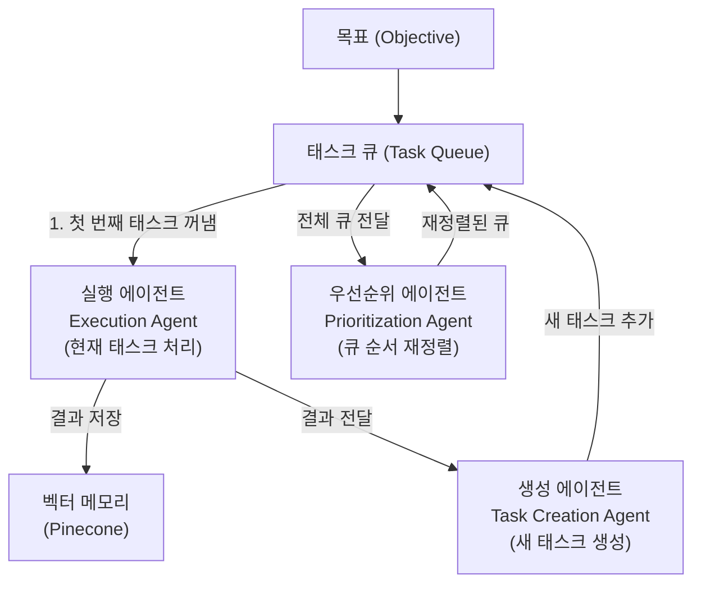
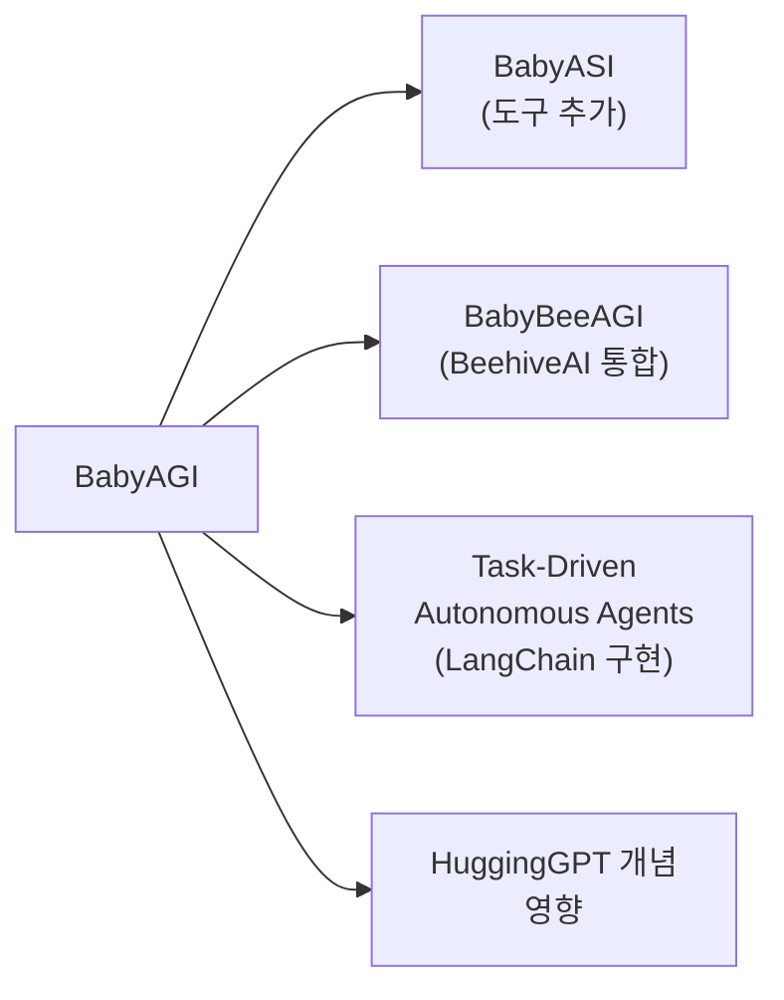

# BabyAGI - 태스크 매니저 에이전트

## 개요

BabyAGI는 2023년 4월 Yohei Nakajima가 공개한 초경량 LLM 태스크 매니저 에이전트다. 원본 코드가 약 100줄에 불과함에도 불구하고 AI 커뮤니티에 큰 영향을 미쳤다. [[autogpt-original-agent]]가 복잡한 도구와 메모리 시스템을 내장한 것과 달리, BabyAGI는 **태스크 생성, 우선순위 정렬, 실행**이라는 세 가지 LLM 호출만으로 자율 목표 달성 사이클을 구현했다.

> "The simplest possible implementation of an AI agent that can perform tasks based on a given objective."
> - Yohei Nakajima, BabyAGI 소개 트위터

## 핵심 아이디어

BabyAGI의 근본 통찰은 **AGI를 향한 첫걸음은 복잡한 시스템이 아니라 단순한 태스크 루프에서 출발한다**는 것이다. 이름의 "Baby"는 이 원시적 단순함을 의도적으로 표현한다.

## 3-에이전트 루프 아키텍처



위 다이어그램이 BabyAGI의 전체 동작이다. 세 개의 LLM 호출이 하나의 루프를 형성하고, 이 루프가 태스크 큐가 빌 때까지 반복된다.

### 1. 실행 에이전트 (Execution Agent)

태스크 큐에서 가장 높은 우선순위의 태스크를 꺼내 실행한다. 이 에이전트는 벡터 메모리에서 관련 컨텍스트를 검색해 참고하며 결과를 생성한다.

```python
def execution_agent(objective: str, task: str, memory) -> str:
    context = memory.query(task, n_results=5)  # 관련 과거 결과 검색
    prompt = f"""
    당신은 AI 어시스턴트입니다. 다음 태스크를 수행하세요.
    목표: {objective}
    태스크: {task}
    컨텍스트: {context}
    결과:
    """
    return llm(prompt)
```

### 2. 태스크 생성 에이전트 (Task Creation Agent)

실행 결과와 현재 태스크 목록을 보고 새로운 태스크를 생성한다.

```python
def task_creation_agent(objective: str, result: str, task_description: str,
                         task_list: list[str]) -> list[dict]:
    prompt = f"""
    목표: {objective}
    마지막 태스크: {task_description}
    마지막 결과: {result}
    기존 태스크: {task_list}
    위 결과를 바탕으로 목표 달성을 위한 새 태스크를 생성하세요.
    기존 태스크와 중복되지 않아야 합니다.
    """
    return parse_tasks(llm(prompt))
```

### 3. 우선순위 에이전트 (Prioritization Agent)

태스크 큐 전체를 보고 목표 달성에 가장 중요한 순서로 재정렬한다.

```python
def prioritization_agent(objective: str, this_task_id: int,
                          task_list: list) -> list:
    prompt = f"""
    목표: {objective}
    태스크 목록:
    {task_list}
    위 태스크들을 목표 달성에 중요한 순서로 재정렬하세요.
    번호는 {this_task_id + 1}부터 시작하여 다시 매기세요.
    """
    return parse_prioritized_tasks(llm(prompt))
```

## 전체 메인 루프

```python
# BabyAGI 핵심 루프 (원본 약 100줄 버전 단순화)
objective = "인터넷에서 AI 관련 최신 연구를 조사하고 요약 보고서를 작성하라"
initial_task = "할 일 목록 작성"
task_queue = deque([{"task_id": 1, "task_name": initial_task}])

while task_queue:
    # 1. 태스크 꺼내기
    task = task_queue.popleft()
    print(f"현재 태스크: {task['task_name']}")

    # 2. 실행
    result = execution_agent(objective, task["task_name"], memory)
    memory.add(task["task_name"], result)

    # 3. 새 태스크 생성
    new_tasks = task_creation_agent(
        objective, result, task["task_name"],
        [t["task_name"] for t in task_queue]
    )
    for new_task in new_tasks:
        task_queue.append(new_task)

    # 4. 우선순위 재정렬
    task_queue = prioritization_agent(
        objective, task["task_id"], list(task_queue)
    )
```

## AutoGPT와의 비교

| 항목 | BabyAGI | AutoGPT |
|------|---------|---------|
| 코드 규모 | ~100줄 | 수천 줄 |
| 도구 | 없음 (LLM만 사용) | 웹검색, 파일, 코드 실행 등 |
| 메모리 | Pinecone 벡터 DB | Pinecone + 로컬 파일 |
| 태스크 관리 | 명시적 태스크 큐 | 암묵적 (LLM 내부 계획) |
| 투명성 | 태스크 큐가 외부로 노출됨 | 루프 내부 상태 불투명 |
| 실행 가능 행동 | 텍스트 생성만 | 실제 도구 호출 |
| 학습 가치 | 에이전트 구조 학습 최적 | 실제 활용 가능 |

BabyAGI는 "작동하는 에이전트"보다는 "에이전트 개념의 교육적 구현"에 가깝다. 도구가 없으므로 실제 웹 조사, 파일 작성 등은 불가능하다.

## 영향과 파생 프로젝트

BabyAGI의 단순한 구조는 커뮤니티가 빠르게 이해하고 확장할 수 있게 했다.



특히 LangChain의 `BabyAGI` 구현체는 LangChain 에코시스템에서 에이전트 패턴을 소개하는 대표적 예제가 됐다.

## 한계

- **도구 없음**: 실제 정보 수집, 파일 작성 등 외부 행동 불가
- **무한 루프 위험**: 종료 조건이 명시적이지 않아 태스크 생성 에이전트가 끝없이 새 태스크를 만들 수 있음
- **일관성 문제**: 우선순위 에이전트가 매 루프마다 순서를 바꿔 방향이 흔들릴 수 있음
- **GPT-4 의존**: 당시 기준 비용이 높은 GPT-4를 루프당 3회 호출

## 역사적 의미

BabyAGI가 남긴 가장 중요한 유산은 **코드의 단순함 그 자체**다. 복잡한 시스템 없이도 LLM이 자율적으로 태스크를 관리하고 실행한다는 개념을 100줄로 증명했다. 이 "극단적 단순화"는 이후 에이전트 연구자들이 핵심 메커니즘에 집중하게 만드는 기준점이 됐다.

## 관련 문서

- [[autogpt-original-agent]] - 동시기 자율 에이전트 선구자
- [[agentgpt-deployment]] - BabyAGI 영향 받은 브라우저 기반 에이전트
- [[agentic-ai-foundation]] - 에이전트 개념 기초
- [[plan-and-execute-pattern]] - BabyAGI를 발전시킨 계획-실행 패턴
- [[agent-workflow-patterns]] - 에이전트 워크플로우 패턴 정리
