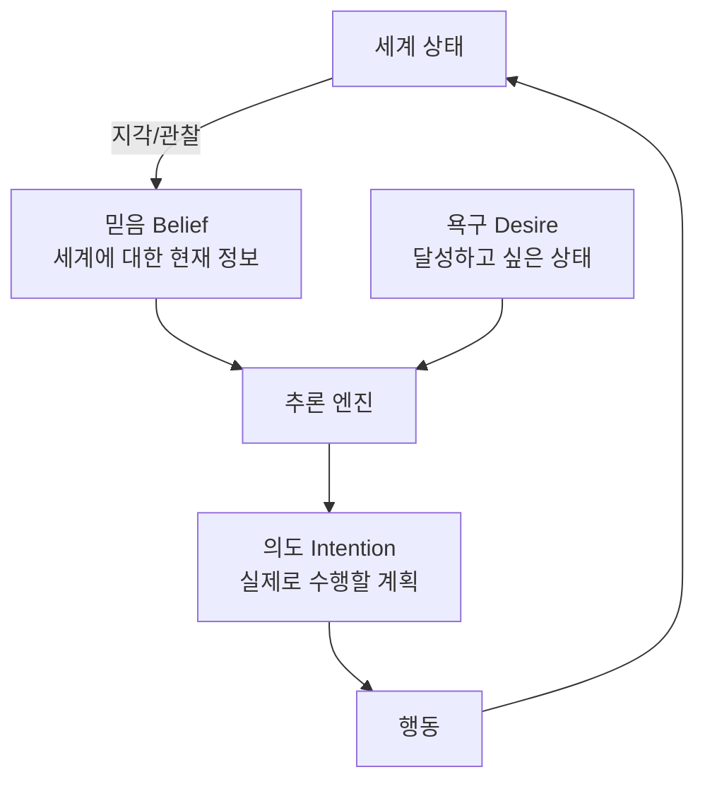
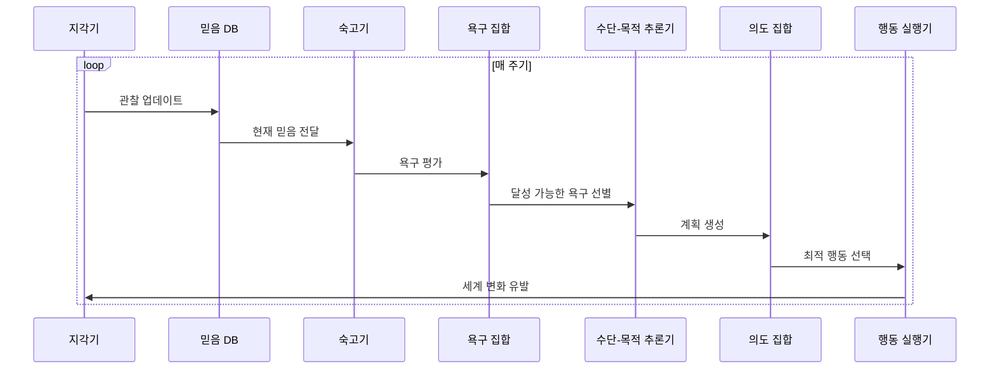

# BDI 에이전트 모델 (Belief-Desire-Intention)

BDI(Belief-Desire-Intention) 모델은 1987년 Michael Bratman의 실용적 추론(practical reasoning) 철학에서 출발해, Rao와 Georgeff가 1991년 AI 에이전트 아키텍처로 형식화한 인지 모델이다. 에이전트의 내부 상태를 믿음(무엇이 사실인지), 욕구(무엇을 원하는지), 의도(무엇을 할 것인지) 세 요소로 분리해 합리적 행동을 모델링한다.

## 세 요소의 정의

**믿음 (Belief)**
에이전트가 세계에 대해 현재 가지고 있는 정보 집합이다. 완전한 진실이 아니라 에이전트의 관점에서 사실이라고 판단하는 것이다. 센서 오류, 정보 지연, 불완전한 관찰로 인해 실제 세계와 다를 수 있다.

**욕구 (Desire)**
에이전트가 달성하고자 하는 목표 상태들이다. 서로 상충될 수 있으며 동시에 모두 달성하는 것이 불가능할 수 있다. 욕구는 모두 동시에 추구되는 것이 아니라 우선순위와 실현 가능성에 따라 선별된다.

**의도 (Intention)**
에이전트가 실제로 실행하기로 결정한 계획과 목표다. 욕구의 부분집합이며, 한번 의도로 채택되면 다른 선택지가 생겨도 쉽게 변경하지 않는다는 **의도의 안정성(commitment)** 속성이 핵심이다. 의도가 너무 쉽게 바뀌면 에이전트가 어떤 목표도 완수하지 못한다.

## BDI 추론 사이클

의도의 안정성 때문에 에이전트는 매 주기마다 의도를 재계산하지 않는다. 현재 의도가 여전히 유효한지(믿음과 일치하는지) 검사하고, 유효하면 계속 실행한다.

## LLM 기반 에이전트에서의 BDI

[[react-pattern]]의 Thought-Action-Observation 루프는 비공식적으로 BDI를 구현한다.

| BDI 요소 | ReAct 대응 |
|----------|-----------|
| 믿음 | Observation (도구 실행 결과) + 대화 기록 |
| 욕구 | 사용자 지시 + 시스템 프롬프트 목표 |
| 의도 | Thought (현재 계획) |
| 행동 | Action (도구 호출) |

그러나 LLM 기반 BDI에는 전통적 BDI와 구분되는 특성이 있다.

- **암묵적 믿음**: 믿음이 별도 데이터베이스가 아닌 컨텍스트 창에 암묵적으로 인코딩된다.
- **연속적 욕구 처리**: 욕구 간 상충을 형식 논리가 아닌 LLM 추론으로 해결한다.
- **약한 의도 안정성**: LLM은 새로운 정보에 과도하게 반응해 의도를 자주 변경하는 경향이 있다. 이를 보완하려면 "현재 계획을 계속 진행하라"는 앵커 지시가 필요하다.

## [[agent-planning-strategies]]와의 관계

[[agent-planning-strategies]]에서 다루는 계획 기법들은 BDI 모델의 수단-목적 추론(means-ends reasoning) 단계를 구현한다. 하위 목표 분해(subgoal decomposition), 역방향 체이닝(backward chaining), 계층적 태스크 네트워크(HTN)가 모두 욕구에서 의도로 이행하는 과정에 해당한다.

## BDI의 강점과 한계

**강점**
- 합리적 행동을 세 요소로 분리해 에이전트 동작을 설명 가능하고 감사 가능하게 만든다.
- 의도의 안정성으로 인해 장기 목표를 일관성 있게 추구한다.
- 반응성(새 자극에 반응)과 목표 지향성(장기 목표 유지)을 균형 있게 지원한다.

**한계**
- 믿음이 오염되거나 욕구가 상충될 때 공식적 해결 기제가 명확하지 않다.
- LLM 구현에서는 믿음·욕구·의도 경계가 불분명해 시스템 동작 예측이 어렵다.
- 실시간 고속 반응이 필요한 환경에서는 숙고 사이클의 오버헤드가 문제가 된다.

## 실무 관점

- BDI 용어는 에이전트 동작을 팀 내에서 소통하는 공통 어휘로 유용하다. "에이전트의 믿음이 오래됐다", "의도가 욕구와 충돌한다"처럼 문제를 명확히 표현할 수 있다.
- 프로덕션 에이전트에서 의도 안정성을 높이려면 계획 변경 시 변경 이유를 명시적으로 로깅해 불필요한 계획 변경을 감지한다.
- 복잡한 멀티에이전트 시나리오에서는 각 에이전트가 독립적인 BDI 상태를 유지하되 공유 믿음 저장소로 동기화하는 아키텍처가 효과적이다.

## 관련 문서

- [[agent-planning-strategies]] - 욕구에서 의도로 이행하는 계획 수립 기법
- [[react-pattern]] - BDI의 비공식 LLM 구현인 ReAct 패턴
- [[agent-memory-systems]] - 믿음 데이터베이스 역할을 하는 에이전트 메모리 구조
- [[plan-and-execute-pattern]] - BDI의 전체 계획 수립 + 단계 실행 변형
