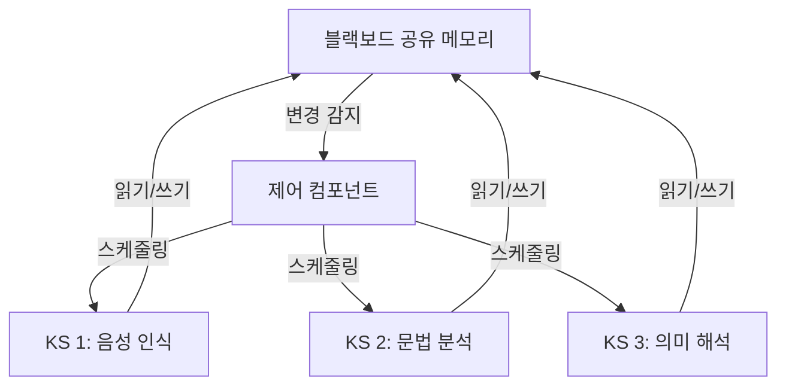

# 블랙보드 시스템

1980년대 Hearsay-II에서 시작된 고전적 멀티에이전트 아키텍처. **공유 메모리 공간(블랙보드)**에 전문가 에이전트(Knowledge Sources)들이 기여해 협력적으로 문제를 해결한다.

## 3대 구성요소

1. **블랙보드**: 부분 해를 저장하는 공유 데이터 구조. 계층적으로 구성 가능
2. **Knowledge Sources (KS)**: 독립적 전문가 모듈. 블랙보드를 읽고, 기여할 수 있을 때 쓴다
3. **제어 컴포넌트**: 어떤 KS가 언제 실행될지 결정하는 스케줄러

## LLM 에이전트에서의 부활

현대 멀티에이전트 시스템에서 블랙보드 패턴이 재등장하고 있다:

- **Shared Scratchpad**: 여러 LLM 에이전트가 공유 문서에 기여하는 패턴
- **[[mixture-of-agents|MoA]]**: 에이전트들이 공유 컨텍스트에 응답을 쌓는 구조
- **[[orchestrator-worker-pattern|오케스트레이터-워커]]**: 오케스트레이터가 블랙보드(태스크 보드) 역할

## 오케스트레이터-워커와의 차이

| 측면 | 블랙보드 | 오케스트레이터-워커 |
|------|---------|-------------------|
| 제어 | 데이터 주도 (기회주의적) | 명시적 태스크 할당 |
| 통신 | 공유 메모리 간접 통신 | 직접 메시지 전달 |
| 유연성 | 동적 (KS가 자발적 참여) | 정적 (할당된 태스크 실행) |
| 적합한 문제 | 불명확한 문제, 점진적 정제 | 분할 가능한 명확한 태스크 |

## 관련 문서

- [[multi-agent-orchestration]] -- 멀티에이전트 오케스트레이션
- [[orchestrator-worker-pattern]] -- 오케스트레이터-워커 패턴
- [[mixture-of-agents]] -- 에이전트 혼합 (MoA)
- [[multi-agent-debate]] -- 멀티에이전트 디베이트
