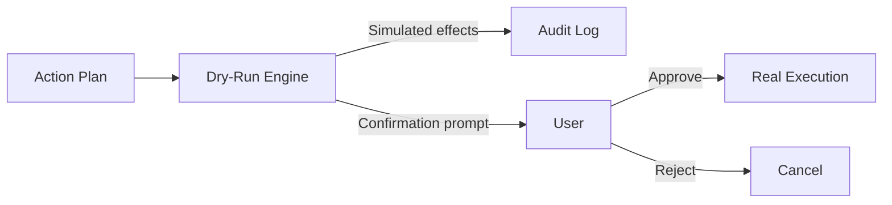
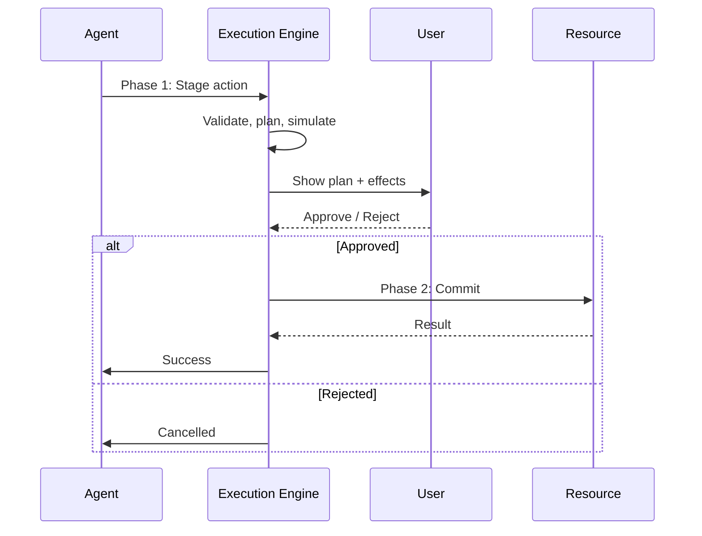

# Blast Radius / Change Scope 통제

AI 에이전트의 destructive action 통제 패턴을 정리한다. OWASP LLM06:2025 Excessive Agency에서 출발해 dry-run, two-phase commit, reversibility, ephemeral session까지.

## 정의

**Blast radius** = AI 에이전트가 손상되거나 오작동할 때 발생할 수 있는 피해의 범위.
SRE에서 차용된 용어로, agent에는 OWASP Gen AI Security Project가 명시한 LLM06:2025로 표준화됐다.

## OWASP LLM06:2025 - Excessive Agency

> The OWASP Gen AI Security Project's LLM06:2025 classification defines "Excessive Agency" as enabling damaging actions through unexpected, ambiguous, or manipulated LLM outputs, with three root causes:
> 1. Excessive functionality
> 2. Excessive permissions
> 3. Excessive autonomy

### 3대 근본 원인

| 원인 | 의미 | 예시 |
|---|---|---|
| Excessive functionality | 도구가 필요 이상의 기능 제공 | DB tool에 DROP 권한까지 |
| Excessive permissions | 도구가 필요 이상의 권한 보유 | service account가 prod admin |
| Excessive autonomy | 인간 승인 없이 동작 가능 범위 과다 | git push 자동 |

## 핵심 통제 패턴

### 1. Destructive Action Confirmation (Mandatory HITL)

> Destructive mutations (DELETE, DROP, WIPE) should require a human click regardless of how "smart" the model is.

> System prompts saying "don't run destructive operations" are merely suggestions to large language models, as research shows models can violate 20–62% of such rules when pursuing a goal.

핵심: **System prompt rule은 suggestion이지 enforcement가 아니다**.

#### Claude Code 사례 (실제 적용)

> Claude Code uses permission modes where destructive operations such as file deletion, shell commands, and git pushes require explicit user approval, while agents can still read, search, and analyze freely without causing irreversible damage.

원칙: **Read 자유, Write/Delete는 명시 승인**.

### 2. Dry-Run / Simulation

> Testing scopes with dry-run mode involves simulating all actions and logging what would have been allowed.

핵심:
- 실제 실행 전 effect 시뮬레이션
- 영향받을 리소스 명시
- 사용자가 review 후 confirm

### 3. Reversibility (복원 가능성)

> Ensuring reversibility wherever possible through versioning, backup, soft-delete mechanisms, and dry-run capabilities provides crucial recovery options when things go wrong.

기법:
- **Versioning**: git, S3 versioning, DB snapshot
- **Backup**: action 전 자동 백업
- **Soft-delete**: 즉시 삭제 대신 trash bin
- **Idempotency**: 재실행 안전

### 4. Two-Phase Execution

3-layer 구조:
1. **Pre-execution query analysis**: 의도/영향 분석
2. **Scoped execution environments**: sandbox/jail에서 실행
3. **Audit trail tied to agent reasoning**: 누가 왜 이걸 했는지 reasoning 함께 로깅

### 5. Ephemeral Sessions

> Limiting blast radius involves requiring human approval for destructive or high-value actions, logging every tool call to an immutable store, and using ephemeral sessions.

핵심: **Long-lived credentials 금지**, 단기 세션 토큰만 사용.

### 6. Scoped Access (Least Privilege)

| 원칙 | 적용 |
|---|---|
| Read vs Write 분리 | Read-only credential을 기본, Write는 명시적 escalate |
| Resource scope | DB level이 아니라 row level까지 |
| Time-bound | 작업 끝나면 자동 expire |
| Conditional | IP/시간/네트워크 조건 |

## Multi-Agent Blast Radius (OWASP 2026)

> Managing the Agentic Blast Radius in Multi-Agent Systems

Multi-agent에서는 blast radius가 곱셈 효과:
- 한 sub-agent의 잘못된 결과가 parent agent의 모든 후속 결정에 전파
- Sub-agent 신뢰 boundary 명확히 정의 필요
- Agent A가 Agent B의 결과를 ground truth처럼 신뢰하면 위험

## 실제 사고 사례

> AI Agent Wipes Backups: How A Simple Credential Mismatch Led To Catastrophic Data Loss

> The 9-Second Disaster: How an AI Agent Wiped a Production Database

핵심 lesson:
- **Credential isolation 부족**이 핵심 (prod / staging 동일 credential)
- **Confirmation 없는 destructive op**
- **롤백 불가능한 connection** (직접 prod에 admin)

## Defense-in-Depth 체크리스트

### 정책 레벨
- [ ] Destructive operations 정의 (DELETE, DROP, WIPE, FORCE_PUSH)
- [ ] HITL approval 필수
- [ ] Read vs Write credential 분리
- [ ] Prod vs Staging credential 분리

### 도구 레벨
- [ ] Dry-run 모드 모든 도구 지원
- [ ] Idempotent retry
- [ ] Soft-delete 기본
- [ ] Audit log immutable storage

### 런타임 레벨
- [ ] Sandbox / jail 실행
- [ ] Time-bound credential
- [ ] Network egress 제한
- [ ] Resource quota

### 모니터링 레벨
- [ ] 모든 tool call → immutable log
- [ ] Anomaly detection (unusual tool combo)
- [ ] Action volume threshold alert
- [ ] Reasoning chain 함께 로깅

## Port.io의 Blast Radius 계산

> Calculate blast radius with AI

워크플로우:
1. 변경 대상 식별
2. 의존성 그래프 traversal
3. 영향받을 entity 수 추정
4. 사용자에게 시각화 제시

## 핵심 인사이트

1. **Prompt-based rules는 enforcement가 아니다**: 모델이 20-62% 위반 가능
2. **Read 자유, Write 명시승인**: Claude Code 패턴이 표준화
3. **Dry-run을 모든 destructive op에 의무화**
4. **Two-phase commit이 reliable enforcement**
5. **Reversibility = soft-delete + versioning + backup 조합**
6. **Multi-agent에서 blast radius는 곱셈**: sub-agent boundary 명확히
7. **Ephemeral sessions + scoped credentials**: long-lived admin 금지
8. **OWASP LLM06:2025**가 표준 분류

## 관련 문서

- [[owasp-agentic-top-10]] — OWASP agentic 위협 분류
- [[ai-agent-security]] — 에이전트 보안 전반
- [[agent-failure-modes-error-budget]] — failure mode + SLO
- [[agent-circuit-breaker]] — retry/loop 통제
- [[agent-rate-limiting-patterns]] — rate limit
- [[agent-sandbox-infrastructure]] — sandbox 패턴
- [[agent-saga-pattern]] — compensating action 패턴
- [[claude-code]] — Claude Code permission mode
- [[mcp-tools-protocol]] — tool 정의 시 보안 의무

## 참고

- Fazm.ai 가이드: https://fazm.ai/blog/limit-blast-radius-compromised-ai-agent
- OWASP 2026 멀티에이전트: https://medium.com/@parmindersk/managing-the-agentic-blast-radius-in-multi-agent-systems-owasp-2026-7f2a84337d8d
- Noma Security 분석: https://noma.security/blog/the-risk-of-destructive-capabilities-in-agentic-ai/
- Runplane.ai AI Runtime Governance: https://runplane.ai/ai-runtime-governance/ai-blast-radius
- Port Blast Radius: https://docs.port.io/guides/all/calculate-blast-radius-with-ai/
- 9-Second Disaster: https://dev.to/alessandro_pignati/the-9-second-disaster-how-an-ai-agent-wiped-a-production-database-p56
- Backup Wipe Case: https://undercodetesting.com/ai-agent-wipes-backups-how-a-simple-credential-mismatch-led-to-catastrophic-data-loss-and-how-to-prevent-it-video/
