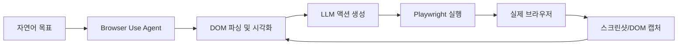
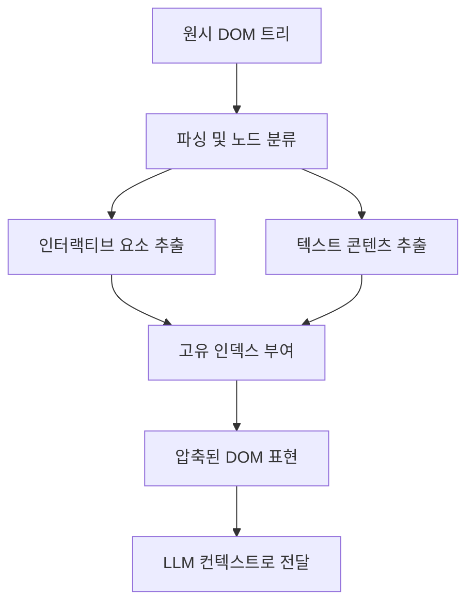

# Browser Use 에이전트 프레임워크

## 개요

Browser Use는 LLM이 실제 웹 브라우저를 자율적으로 조작할 수 있도록 설계된 오픈소스 파이썬 에이전트 프레임워크다. 2024년 말에 등장해 빠르게 웹 자동화 에이전트의 사실상 표준 라이브러리로 자리잡았다. 핵심 아이디어는 DOM(Document Object Model) 구조를 LLM이 이해하기 쉬운 시각적 표현으로 변환하고, LLM이 생성한 액션을 Playwright 백엔드가 실제로 실행하는 "인식-결정-실행" 루프다.

기존 웹 스크래핑 도구(Selenium, Playwright 직접 사용)와의 차이점은 **규칙 기반 자동화**에서 **자연어 지시 기반 자동화**로의 패러다임 전환에 있다. 개발자가 XPath나 CSS 선택자를 작성하는 대신, "로그인하고 주문 내역을 CSV로 다운받아줘"라는 자연어 목표를 LLM이 해석해 단계별 액션을 생성한다.



에이전트가 목표를 달성하거나 최대 스텝 수에 도달할 때까지 루프가 반복된다.

## 핵심 아키텍처

### DOM 시각 표현 (Visual DOM Representation)

브라우저의 DOM을 그대로 LLM에 넘기면 토큰이 폭발적으로 늘어나고 불필요한 정보가 많다. Browser Use는 다음 과정으로 DOM을 압축·구조화한다:

1. **인터랙티브 요소 추출**: 클릭 가능한 버튼, 입력 필드, 링크 등 실제로 조작 가능한 요소만 필터링
2. **계층적 인덱싱**: 각 요소에 고유 인덱스 번호를 부여해 "3번 요소를 클릭해라"처럼 참조 가능
3. **텍스트 맥락 보존**: 레이블, 플레이스홀더, 주변 텍스트를 함께 포함해 LLM이 요소의 목적을 파악 가능
4. **뷰포트 기반 필터링**: 현재 화면에 보이는 요소를 우선 처리



### 액션 공간 (Action Space)

LLM이 실행할 수 있는 표준 액션 집합:

| 액션 | 설명 | 예시 |
|------|------|------|
| `click` | 요소 클릭 | `click(index=3)` |
| `type` | 텍스트 입력 | `type(index=5, text="hello")` |
| `scroll` | 페이지 스크롤 | `scroll(direction="down", amount=3)` |
| `navigate` | URL 이동 | `navigate(url="https://example.com")` |
| `extract` | 정보 추출 | `extract(index=7, description="가격")` |
| `done` | 태스크 완료 선언 | `done(result="주문 완료")` |
| `wait` | 로딩 대기 | `wait(seconds=2)` |

### Playwright 백엔드

모든 브라우저 조작은 Playwright를 통해 실제로 수행된다. Playwright는 Chromium, Firefox, WebKit을 지원하며 headless/headful 모드 모두 동작한다. Browser Use는 Playwright의 비동기 API를 활용해 여러 탭과 병렬 세션을 관리할 수 있다.

## 멀티 LLM 지원

Browser Use는 특정 LLM에 종속되지 않도록 설계되었다. LangChain의 ChatModel 인터페이스를 추상화 레이어로 사용하므로 OpenAI GPT, Anthropic Claude, Google Gemini, 로컬 Ollama 모델 등을 교체 가능하다.

시각 정보(스크린샷)를 활용하려면 멀티모달 모델이 필요하다. 텍스트 전용 DOM 표현만 사용하면 텍스트 모델도 동작한다.

```python
from browser_use import Agent
from langchain_anthropic import ChatAnthropic

agent = Agent(
    task="링크드인에서 'Python developer' 채용공고 5개를 찾아서 목록을 반환해줘",
    llm=ChatAnthropic(model="claude-opus-4-5"),
)

result = await agent.run()
```

## 주요 기능

### 멀티탭 관리

에이전트가 여러 탭을 동시에 열고, 탭 간 전환하며 정보를 교차 참조하는 것이 가능하다. 쇼핑몰에서 여러 상품을 비교하거나 여러 소스에서 정보를 수집할 때 유용하다.

### 커스텀 액션 등록

기본 액션 외에 사용자 정의 Python 함수를 에이전트 액션으로 등록할 수 있다. 파일 저장, 데이터베이스 쓰기, 외부 API 호출 등 웹 브라우저 외부 시스템과의 연동이 필요할 때 활용한다.

```python
from browser_use import Agent, Controller

controller = Controller()

@controller.action("CSV 파일로 저장")
def save_to_csv(data: list[dict], filename: str) -> str:
    import csv
    with open(filename, "w", newline="") as f:
        writer = csv.DictWriter(f, fieldnames=data[0].keys())
        writer.writeheader()
        writer.writerows(data)
    return f"{filename}에 저장 완료"

agent = Agent(task="...", llm=llm, controller=controller)
```

### 세션 관리와 재사용

로그인 상태, 쿠키, 세션 정보를 유지해 매번 재인증하지 않아도 된다. 브라우저 컨텍스트를 직접 제공하거나 Playwright의 저장된 상태를 불러올 수 있다.

### 민감 정보 보호

XPath 인덱싱 과정에서 패스워드 필드나 hidden input은 자동으로 마스킹되어 LLM 컨텍스트에 원문이 노출되지 않는다.

## 사용 사례

### 데이터 수집 자동화
- 가격 비교: 여러 쇼핑몰에서 동일 상품 가격을 자동 수집
- 리서치: 여러 뉴스 사이트에서 특정 키워드 관련 기사 수집
- 모니터링: 경쟁사 웹사이트 변경 사항 감지

### 폼 작성 및 프로세스 자동화
- 반복적인 웹 폼 자동 입력
- 여러 플랫폼에 동일 공고/콘텐츠 게시
- 예약, 신청, 접수 자동화

### 소프트웨어 테스팅
- E2E 테스트를 자연어 시나리오로 작성
- 회귀 테스트 자동 생성
- 접근성 감사 자동화

## Claude Code와의 연계

[[claude-code]]와 Browser Use를 조합하면 "코딩 + 웹 조작"을 아우르는 풀스택 에이전트를 구성할 수 있다. Claude Code가 코드를 작성하고 테스트를 실행하는 동안, Browser Use 에이전트가 웹 UI 레이어를 검증하는 역할 분담이 가능하다.

[[multi-agent-orchestration]] 컨텍스트에서 Browser Use 에이전트는 "웹 조작" 전문 서브에이전트로 활용된다. 오케스트레이터가 "이 URL에서 데이터를 가져와라"는 지시를 내리면 Browser Use 에이전트가 독립적으로 수행하고 결과만 반환한다.

## 한계와 트레이드오프

| 한계 | 설명 |
|------|------|
| 비용 | 각 스텝마다 LLM API 호출이 발생. 복잡한 태스크는 수십 번의 호출이 필요 |
| 속도 | 사람보다 느릴 수 있음. 특히 시각 분석이 필요한 경우 |
| 동적 UI | React/Vue SPA의 동적 렌더링이나 캔버스 기반 UI는 처리 어려움 |
| 캡차 | 캡차(CAPTCHA) 우회는 지원하지 않음 |
| 법적 이슈 | 특정 사이트의 이용약관과 robots.txt 준수는 사용자 책임 |
| 재현성 | LLM 생성 액션의 비결정성으로 동일 태스크가 매번 다른 경로를 취할 수 있음 |

## 관련 도구 비교

| 도구 | 방식 | LLM 통합 | 특징 |
|------|------|----------|------|
| Browser Use | DOM+LLM | 기본 내장 | 범용 웹 자동화 |
| Playwright | 코드 기반 | 없음 | 정밀 제어, 고속 |
| Selenium | 코드 기반 | 없음 | 레거시, 광범위한 지원 |
| Puppeteer | 코드 기반 | 없음 | Chromium 특화 |
| Skyvern | 시각 기반 | GPT-4V | 시각 우선 자동화 |

## 관련 문서

- [[web-agent]] -- 웹 에이전트 일반 개념과 벤치마크
- [[computer-use-agent]] -- 스크린샷 기반 컴퓨터 조작 에이전트
- [[tool-use-patterns]] -- LLM 도구 사용 패턴 전반
- [[agent-sandbox-infrastructure]] -- 에이전트 실행 격리 인프라
- [[agentic-web-search-pattern]] -- 에이전트 웹 검색 패턴
