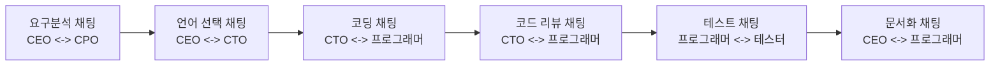
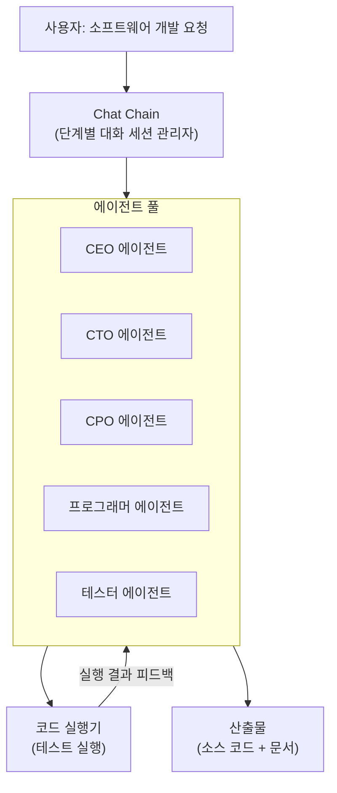

# ChatDev - 가상 소프트웨어 회사

## 개요

ChatDev는 2023년 Chen Qian 등 칭화대학교 연구팀이 발표한 멀티 에이전트 소프트웨어 개발 시스템이다. 가상의 소프트웨어 회사를 만들고 LLM 에이전트들에게 CEO, CTO, CPO, 프로그래머, 테스터 등의 역할을 부여해 **폭포수 소프트웨어 개발 생명주기(Waterfall SDLC)를 대화 기반으로 재현**한다. 핵심 메커니즘은 에이전트들이 주어진 역할로 서로 대화(채팅)하면서 자연스럽게 소프트웨어를 개발하는 "Chat Chain"이다.

## 핵심 메커니즘: Chat Chain

ChatDev의 가장 독창적인 아이디어는 **Chat Chain**이다. 소프트웨어 개발 단계(요구분석, 설계, 코딩, 테스트, 문서화)를 연쇄적인 대화 세션으로 분해한다.



각 채팅 세션은 2명의 에이전트가 담당한다. 한 에이전트는 "인스트럭터" 역할(방향 지시), 다른 에이전트는 "어시스턴트" 역할(실행 담당)을 맡는다. 이 구분이 대화의 방향성을 유지한다.

## 소프트웨어 개발 단계별 에이전트 역할

### 1단계: 요구분석 (Demand Analysis)

```
CEO (인스트럭터): "다음 소프트웨어를 개발합시다: [사용자 요청]"
CPO (어시스턴트): "이해했습니다. 구체적인 기능 요구사항은..."
CEO: "핵심 기능은 X, Y, Z입니다..."
CPO: "모듈 구조는 다음과 같이 제안합니다..."
[합의 도달 -> 다음 단계]
```

### 2단계: 프로그래밍 언어 선택

```
CEO: "어떤 언어로 구현할까요?"
CTO: "요구사항을 분석하면 Python이 적합합니다. 이유는..."
CEO: "동의합니다. Python으로 진행합니다."
```

### 3단계: 코딩 (Coding)

CTO와 프로그래머가 대화하며 실제 코드를 작성한다. 특이한 점은 코드가 대화 안에 삽입된다.

```
CTO: "main.py 파일을 먼저 작성하세요."
프로그래머: "알겠습니다. 다음과 같이 작성했습니다:
```python
def main():
    ...
```"
CTO: "좋습니다. 이제 utils.py를..."
```

### 4단계: 코드 리뷰

```
CTO: "코드를 검토해 보겠습니다. [코드 삽입] 이 부분에서..."
프로그래머: "지적하신 대로 수정하겠습니다..."
```

### 5단계: 테스트

```
프로그래머: "테스트를 실행합니다: [테스트 코드]"
테스터: "오류가 발견됐습니다: [에러 메시지]"
프로그래머: "수정하겠습니다..."
```

## 아키텍처 구성요소



## 역할 설계 세부 원칙

**역할 특화 프롬프트**: 각 에이전트는 자신의 역할에 맞는 시스템 프롬프트를 갖는다. CEO는 비즈니스 관점, CTO는 기술 관점을 갖도록 설계된다.

**인스트럭터/어시스턴트 이분법**: 모든 채팅 세션에서 한 에이전트는 "방향 설정자"(인스트럭터), 다른 에이전트는 "실행자"(어시스턴트)로 명확히 나뉜다. 이를 통해 대화가 목적 없이 표류하는 것을 방지한다.

**역할 반전 방지**: 어시스턴트 에이전트가 인스트럭터를 "지시"하는 역할 역전이 발생하는 경우를 탐지해 수정한다.

## [[metagpt-software-agent]]와의 비교

| 항목 | ChatDev | MetaGPT |
|------|---------|---------|
| 핵심 메커니즘 | Chat Chain (대화 기반) | 공유 메시지 풀 (구조화 산출물) |
| 개발 모델 | 폭포수 SDLC | 역할 기반 SOP |
| 에이전트 통신 | 1:1 직접 대화 | 게시-구독 패턴 |
| 코드 생성 시점 | 코딩 세션에서 점진적 생성 | 엔지니어 에이전트가 일괄 생성 |
| 구조화 강도 | 중간 (대화는 자유로움) | 높음 (형식 스키마 강제) |
| 연구 특성 | 사회적 상호작용 연구 | 공학적 SOP 연구 |

## 연구 결과 및 벤치마크

ChatDev 논문은 다양한 소프트웨어 개발 태스크에서의 성능을 보고했다.

- **코드 완성률**: 단일 에이전트 대비 높은 실행 가능 코드 생성 비율
- **버그 수**: 테스트 단계를 거친 ChatDev의 코드는 직접 생성 코드 대비 버그 감소
- **소요 시간**: 단순 소프트웨어는 수 분 내 완성 가능
- **비용**: ChatGPT 기준 태스크당 약 $0.5-2 소요

## 한계

- **단방향 파이프라인**: 폭포수 모델의 특성상 초기 요구분석 오류가 후반에 발견되면 처음부터 다시 시작해야 하는 경우 발생
- **긴 대화의 맥락 손실**: 채팅 세션이 길어지면 초기 합의 내용을 에이전트가 잊는 경우
- **실제 실행 환경 미비**: 코드 테스트가 제한적이며 복잡한 의존성은 처리 어려움
- **역할의 실제 전문성 한계**: CEO/CTO "역할"이 실제 의사결정 능력을 보장하지는 않음

## 영향

ChatDev는 멀티 에이전트 연구에서 "역할 기반 대화"의 효과를 체계적으로 연구한 초기 논문 중 하나다. 이후 CrewAI, AutoGen 등 역할 기반 멀티 에이전트 프레임워크들이 ChatDev에서 영감을 받았다. 특히 **"에이전트에게 역할을 부여하고 대화하게 하면 복잡한 태스크를 수행할 수 있다"**는 직관의 실험적 검증으로서 가치가 높다.

## 관련 문서

- [[metagpt-software-agent]] - 동시기 소프트웨어 개발 에이전트, SOP 기반
- [[multi-agent-orchestration]] - 멀티 에이전트 조율 패턴
- [[agent-workflow-patterns]] - 에이전트 워크플로우 패턴
- [[agentic-ai-foundation]] - 에이전트 개념 기초
