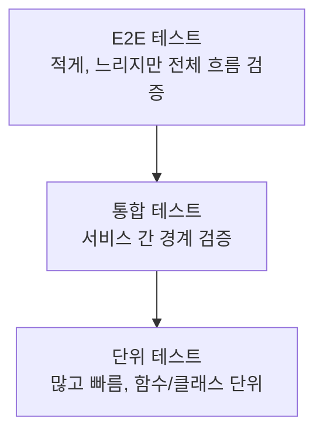

# TDD 기반 코딩 에이전트

## 개요

TDD 기반 코딩 에이전트(Test-Driven Development Coding Agent)는 인간 개발자의 TDD 방법론을 LLM 에이전트에 적용한 패턴이다. "테스트를 먼저 작성하고, 그 테스트를 통과하는 최소한의 코드를 구현하며, 이후 리팩토링한다"는 Red-Green-Refactor 사이클을 에이전트가 자율적으로 실행한다.

Aider, Claude Code 등의 코딩 보조 도구에서 이미 이 접근을 권장하며, 더 나아가 에이전트가 스펙에서 테스트를 자동 도출해 구현까지 완주하는 자율 TDD 루프가 2024-2025년 사이 프로덕션 수준에 도달했다.

핵심 가치:
- **방향 고정**: 테스트가 "완료 기준"을 명확히 정의해 에이전트가 목표에서 이탈하는 것을 방지
- **조기 실패 감지**: 구현 중 잘못된 방향으로 가면 즉시 테스트 실패로 드러남
- **리그레션 방지**: 후속 변경이 기존 기능을 망가뜨리면 즉시 감지
- **환각 억제**: LLM이 "동작한다"고 주장해도 테스트가 거짓말하지 않음

```mermaid
stateDiagram-v2
    [*] --> 스펙분석: 요구사항 수신
    스펙분석 --> 테스트작성: RED 단계 시작
    테스트작성 --> 테스트실행: 테스트 실행
    테스트실행 --> 실패확인: 예상대로 실패?
    실패확인 --> 구현: 예 (Red 확인됨)
    실패확인 --> 테스트수정: 아니오 (테스트 오류)
    테스트수정 --> 테스트실행
    구현 --> 구현후테스트: 테스트 재실행
    구현후테스트 --> 통과확인: 통과?
    통과확인 --> 리팩토링: 예 (Green 달성)
    통과확인 --> 구현: 아니오 (추가 구현)
    리팩토링 --> 리팩후테스트: 테스트 재실행
    리팩후테스트 --> 여전히통과{모든 테스트 통과?}
    여전히통과 --> 다음스펙: 예
    여전히통과 --> 리팩토링수정: 아니오
    리팩토링수정 --> 리팩후테스트
    다음스펙 --> [*]: 완료
    다음스펙 --> 스펙분석: 다음 기능
```

## 단계별 상세 설명

### 1단계: 스펙 분석 및 테스트 설계

에이전트는 자연어 요구사항을 받아 테스트 케이스 목록으로 변환한다.

```python
def analyze_spec_to_tests(spec: str, llm) -> list[TestCase]:
    """요구사항에서 테스트 케이스를 도출한다."""
    prompt = f"""
    다음 요구사항을 테스트 케이스로 분해하세요.
    
    요구사항:
    {spec}
    
    각 테스트 케이스에 대해:
    1. 테스트 이름 (test_<동작>_<조건>_<결과> 형식)
    2. 입력 데이터
    3. 기대 출력/동작
    4. 엣지 케이스 여부
    
    결과를 JSON 목록으로 반환하세요.
    """
    return llm.generate(prompt)
```

**좋은 테스트 케이스 설계 원칙 (에이전트용)**:
- 각 테스트는 하나의 동작만 검증 (에이전트가 실패 원인을 명확히 파악하도록)
- 입출력이 구체적인 값으로 명시 (에이전트가 인터페이스를 추론 가능하도록)
- 경계값과 오류 케이스 포함

### 2단계: RED - 테스트 먼저 작성

테스트 코드를 구현 코드 없이 작성한다. 이 시점에 모든 테스트는 실패해야 한다 (클래스/함수가 없으므로 ImportError나 AttributeError).

```python
# 에이전트가 작성하는 테스트 예시
import pytest

class TestUserAuthentication:
    def test_valid_login_returns_token(self):
        auth = UserAuth()
        token = auth.login(username="alice", password="correct_pw")
        assert token is not None
        assert len(token) > 0

    def test_invalid_password_raises_error(self):
        auth = UserAuth()
        with pytest.raises(AuthenticationError):
            auth.login(username="alice", password="wrong_pw")

    def test_locked_account_raises_locked_error(self):
        auth = UserAuth()
        with pytest.raises(AccountLockedError):
            auth.login(username="locked_user", password="any_pw")
```

테스트 실행 후 `ModuleNotFoundError: No module named 'user_auth'` 같은 에러가 나오면 RED 단계 성공.

### 3단계: GREEN - 최소 구현

테스트를 통과하는 "가장 단순한" 코드를 작성한다. 이 단계에서 완벽한 코드를 쓰려 하지 않는다.

에이전트 지시 전략:
```
현재 테스트 실패 내용:
{test_failure_output}

테스트를 통과하는 최소한의 구현을 작성하세요.
- 지금은 성능이나 코드 품질을 고려하지 마세요
- 테스트가 기대하는 인터페이스만 충족하면 됩니다
- 특수 케이스 먼저, 일반화는 나중에
```

### 4단계: REFACTOR - 개선

모든 테스트가 통과하는 상태에서 코드 품질을 개선한다. 테스트가 안전망 역할을 해서 리팩토링 중 기능이 깨지면 즉시 알 수 있다.

에이전트 리팩토링 지시:
```
모든 테스트가 통과합니다.
다음 항목을 개선하되 테스트가 계속 통과하는지 확인하세요:
- 중복 코드 제거
- 변수/함수명 명확화
- 복잡한 조건문 단순화
- 성능 최적화 (필요한 경우)
```

## Aider에서의 TDD 패턴

[Aider](https://aider.chat)는 터미널 기반 AI 코딩 도구로, TDD를 기본 워크플로로 채택한다.

```bash
# Aider에서 TDD 시작
aider --auto-test

# 테스트 실행 명령 설정
/test pytest tests/ -v

# 자연어로 기능 요청하면 테스트 먼저 작성
/ask 사용자 인증 모듈을 TDD로 구현해줘. 로그인, 로그아웃, 비밀번호 변경 기능이 필요해.
```

Aider의 `--auto-test` 플래그는 코드 변경 후 자동으로 테스트를 실행하고, 실패 시 자동으로 수정을 시도하는 에이전트 TDD 루프를 활성화한다.

## Claude Code에서의 TDD 패턴

[[claude-code]]에서 TDD를 활용하는 권장 프롬프트 패턴:

```
TDD 방식으로 <기능명>을 구현해줘.
1. 먼저 테스트 파일 tests/test_<기능명>.py를 만들고
2. pytest로 실행해서 실패를 확인한 후
3. 구현 코드를 작성하고
4. 테스트가 통과하면 리팩토링해줘
5. 각 단계에서 실제로 pytest를 실행해서 결과를 보여줘
```

테스트를 실제로 실행해 결과를 확인하는 것이 핵심이다. 에이전트가 "테스트가 통과할 것 같다"고 주장하는 것과 실제 통과는 다르다.

## 마크다운 스펙 기반 TDD

복잡한 프로젝트에서는 자연어 요구사항 → 마크다운 스펙 → 테스트 케이스 → 구현의 계층적 파이프라인이 효과적이다.

```markdown
# 사용자 인증 스펙

## 기능: 로그인

### 성공 케이스
- 올바른 아이디와 비밀번호 입력 시 JWT 토큰 반환
- 토큰 유효 기간: 24시간

### 실패 케이스
- 잘못된 비밀번호: AuthenticationError 발생
- 5회 연속 실패: 계정 잠금, AccountLockedError 발생
- 탈퇴한 사용자: DeactivatedAccountError 발생
```

이 스펙에서 에이전트가 자동으로 테스트 케이스를 도출한다. [[spec-driven-development]] 패턴과 직접 연결된다.

## 테스트 피라미드와 에이전트

에이전트가 작성하는 테스트도 인간과 동일한 테스트 피라미드 원칙을 따라야 한다:



에이전트 TDD에서의 실용적 원칙:
- **단위 테스트 우선**: 빠른 피드백 루프를 위해 단위 테스트를 가장 많이 작성
- **통합 테스트 선별**: DB, 외부 API 등 경계를 검증하는 통합 테스트는 필수 케이스만
- **E2E 테스트 최소화**: 에이전트 TDD 루프에서 E2E는 최종 검증에만 활용

## 에이전트 TDD의 흔한 실패 패턴

| 패턴 | 문제 | 해결책 |
|------|------|--------|
| 테스트 없이 구현 | "나중에 테스트 추가"는 실제로 추가되지 않음 | 테스트 먼저를 명시적으로 지시 |
| 테스트 삭제로 통과 | 실패하는 테스트를 지우거나 주석 처리 | 테스트 파일 수정 시 사용자 확인 요구 |
| 테스트 조작 | 구현 대신 테스트를 하드코딩으로 통과 | 테스트 품질 리뷰 단계 추가 |
| 과도한 목킹 | 실제 로직 없이 목(mock)으로 테스트를 통과시킴 | 목 사용 범위 제한 규칙 명시 |
| 너무 많은 구현 | 테스트를 벗어나 과도하게 구현 | "테스트를 통과하는 최소 코드" 제약 |

## 한계와 트레이드오프

- **초기 비용**: 테스트를 먼저 작성하는 시간이 추가로 필요함. 간단한 스크립트에는 과도할 수 있음
- **LLM 일관성**: 에이전트가 의도치 않게 테스트를 변경하거나 우회할 수 있어 주의 필요
- **레거시 코드**: 테스트가 없는 기존 코드에 TDD를 도입하는 것은 별도의 전략 필요
- **UI 테스팅**: 시각적 UI 변경은 자동 TDD 루프에 통합하기 어려움

## 관련 문서

- [[tdd-agentic-coding]] -- TDD와 에이전트 코딩 결합 상세
- [[spec-driven-development]] -- 스펙 주도 개발
- [[agent-self-correction]] -- 에이전트 자기 교정 패턴
- [[critic-revise-pattern]] -- 비평자-수정자 루프
- [[how-coding-agents-work]] -- 코딩 에이전트 내부 구조
