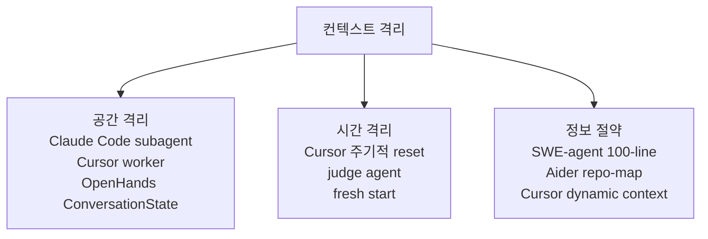
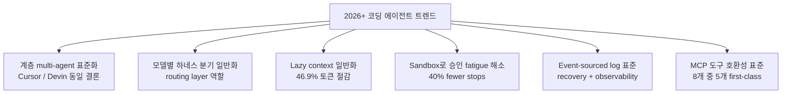

# 코딩 에이전트 하네스 횡단 비교

8개 주요 코딩 에이전트 시스템(Claude Code, Cursor, Aider, OpenHands, SWE-agent, Cline, Devin, Continue.dev)을 6개 디자인 축으로 횡단 비교한 메타 분석. 각 시스템의 1차 인용은 개별 entity 페이지를 참조한다.

## 비교 대상 8개 시스템

| 시스템 | 핵심 정체성 | 호스팅 | 라이선스 | 자체 모델 |
|---|---|---|---|---|
| [[claude-code\|Claude Code / Agent SDK]] | 멀티 표면 + hooks + subagents | Anthropic 일부 | 비공개 (SDK 공개) | Claude |
| [[cursor\|Cursor]] | 자체 모델 + 자체 IDE | Anysphere 서버 | 비공개 | Composer (MoE+RL) |
| [[aider\|Aider]] | 터미널 git-native | client-side | Apache 2.0 | 없음 (라우팅) |
| [[openhands\|OpenHands]] | event-sourced + opt-in sandbox | self-host or cloud | MIT | 없음 (라우팅) |
| [[swe-agent\|SWE-agent]] | ACI 연구 산출물 | client-side | MIT | 없음 |
| [[cline-claude-coder\|Cline]] | VSCode + Plan/Act + zero-trust | 100% client | Apache 2.0 | 없음 (BYOK) |
| [[devin-2-0-release\|Devin (Cognition)]] | VM-level autonomous | Cognition 클라우드 | 비공개 | SWE-1.5 |
| [[continue-vscode-extension\|Continue.dev]] | 단일 yaml configurability | client + Hub | Apache 2.0 | 없음 (라우팅) |

## 디자인 축 1 — 컨텍스트 격리

| 시스템 | 메커니즘 |
|---|---|
| Claude Code | Subagents (별도 컨텍스트, 결과만 반환) + auto compaction |
| Cursor | Planner-Worker hierarchy + 주기적 fresh start + judge agent + dynamic context discovery (lazy load) |
| Aider | repo-map (압축된 graph signature) + 명시적 파일 추가 |
| OpenHands | ConversationState event log (event-sourced) + Skills로 lazy 활성 |
| SWE-agent | 100-line file viewer + 매치된 파일만 리스팅 |
| Cline | Plan mode (read-only) → Act mode 전환 시 컨텍스트 carry over |
| Devin | DeepWiki 자동 인덱싱 + per-session preliminary plan |
| Continue.dev | Context providers를 명시적으로 plug |

### 세 가지 패러다임

- **공간 격리**: subagent / worker 별도 컨텍스트 (Claude Code, Cursor, OpenHands)
- **시간 격리**: 주기적 reset, judge agent, fresh start (Cursor scaling-agents 발견)
- **정보 절약**: 한 번에 보여주는 양 제한 (SWE-agent 100-line)

## 디자인 축 2 — Edit format

| 시스템 | 주요 포맷 | 특이점 |
|---|---|---|
| Aider | whole / diff / diff-fenced / udiff / editor-* (6종) | 모델별 자동 선택. udiff가 GPT-4 Turbo 20%→61% |
| Claude Code | Edit/Write 도구 (string replacement) | 모델이 native하게 학습된 포맷 |
| Cursor | OpenAI는 patch-based, Anthropic은 string replacement | 모델 패밀리별 선호 포맷 분리 |
| OpenHands | Action schema (Pydantic) → ToolExecutor | tool 추상화로 edit 자체는 도구 구현 |
| SWE-agent | linter-validated edit + 100-line viewer | 구문 오류 거부 |
| Cline | read_file/write_to_file/replace_in_file | per-mode tool restriction |
| Devin | code editor in cloud IDE | 명시적 edit format 미공개 |
| Continue.dev | edit role 모델로 위임 | apply role과 분리 |

### 관찰

- **모델 선호 포맷 ≠ 단일 표준** — Aider와 Cursor 양쪽이 모델별 다른 포맷을 보내야 한다는 결론에 도달
- **Linter on edit** 패턴이 SWE-agent → Cursor → 다른 시스템으로 확산

## 디자인 축 3 — Sandbox / Isolation

| 시스템 | Sandbox 레벨 | 메커니즘 |
|---|---|---|
| Claude Code | OS-level (사용자 머신) | Permission mode + hooks |
| Cursor | OS-level + sandbox | macOS Seatbelt, Linux Landlock+seccomp, Win WSL2 |
| Aider | None (사용자 머신 직접) | git diff 기반 사용자 승인 |
| OpenHands | Opt-in container | LocalWorkspace vs RemoteWorkspace (Docker/Modal/Daytona/E2B) |
| SWE-agent | Container | dev container, Codespaces |
| Cline | None (사용자 머신 직접) | 모든 변경 사용자 승인 |
| Devin | VM-level + hypervisor snapshot | otterlink |
| Continue.dev | Provider별 다름 | MCP server 격리 |

### 관찰

- **격리 강도 ↔ 자율성 trade-off**: 사용자 머신 직접 실행 → 빠른 피드백 + 변경 직관성. VM-level → 신뢰성 + async + multi-tenancy
- **Cursor는 OS-level sandbox로 중간 지점 — 40% fewer stops** 달성 (사용자 승인 fatigue 감소)
- **otterlink**가 Cognition의 핵심 비대칭 우위 — RL training과 production이 같은 hypervisor에서 동작

## 디자인 축 4 — Multi-agent orchestration

| 시스템 | 패턴 | 컨트롤러 |
|---|---|---|
| Claude Code | Orchestrator-workers (Task tool 통한 subagent 호출) | Main agent loop + Anthropic 정의 5 패턴 중 1번 |
| Cursor | Hierarchical (root planner → subplanners → workers) | Anyrun (Rust orchestrator) + judge agent |
| Aider | architect mode = 2-tier (architect → editor) | 단일 conversation |
| OpenHands | Single agent + skill 활성 (multi-agent는 별도 프레임워크) | EventStream |
| SWE-agent | Single agent loop | Demonstration-driven |
| Cline | Single agent + Plan/Act 모드 토글 | StateManager + Controller |
| Devin | Planner LLM + Executor LLM (per-step tool select) | Cognition 비공개 인프라 |
| Continue.dev | Agent = config 단일 단위 | 단일 |

### 관찰

- **2-tier(planner+executor) → 3-tier(root + sub + worker)**로 long-horizon이 길어질수록 계층 깊어짐
- **[[aider|Aider]]의 architect/editor**는 가장 단순한 분업 패턴이지만 효과 명확 (o1 + GPT-4o 권장)
- **Cursor self-driving 발견**: integrator role은 병목 → 도입하지 않음. 단순함이 신뢰성

## 디자인 축 5 — Hooks / Extensibility

| 시스템 | Extension 메커니즘 |
|---|---|
| Claude Code | Hooks (5 핸들러 타입 × 11+ 이벤트) + Skills + MCP + Plugins + CLAUDE.md |
| Cursor | MCP + 커스텀 모드 + Cursor SDK |
| Aider | CLI flag + repo-specific yaml |
| OpenHands | Skills (markdown) + MCP + custom Tool/Workspace |
| SWE-agent | yaml config (single file) |
| Cline | MCP (auto-create) + rules |
| Devin | DeepWiki + Slack/Teams/Jira 연동 |
| Continue.dev | config.yaml (rules + prompts + context-providers + MCP servers) + Hub 공유 |

### 관찰

- **[[claude-code|Claude Code]]가 가장 fine-grained extensibility** (hooks가 lifecycle 11+ 이벤트 가로채기 가능)
- **Continue.dev / OpenHands가 가장 declarative** (단일 yaml로 모든 행동 정의)
- **MCP가 사실상 표준** — Claude Code, Cursor, Cline, Continue, OpenHands 모두 first-class 지원

## 디자인 축 6 — Production / Observability / Cost

| 시스템 | Observability 메커니즘 | Cost 메커니즘 |
|---|---|---|
| Claude Code | Hooks로 모든 이벤트 stream + transcript JSONL | per-tool token usage 추적 |
| Cursor | CursorBench 내부 eval + 온라인 A/B + 99.9-99.99% reliability sprint | 모델 routing |
| Aider | git history 자체가 audit trail | repo-map 1k 토큰 budget |
| OpenHands | EventStream (immutable event log) + base_state.json | per-conversation persistence |
| SWE-agent | yaml + demonstration + run logs | 단순 |
| Cline | UI에 모든 token usage 표시 | per-mode model |
| Devin | DeepWiki + Slack/Teams 통합 | otterlink hypervisor (수만 동시) |
| Continue.dev | 명시적 - | per-role 모델 선택 (chat 비싸게, autocomplete 저렴하게) |

### 관찰

- **Event sourcing이 Observability + Recovery의 공통분모** — OpenHands EventStream, Claude Code transcript_path, Cursor 내부 telemetry
- **Cost 최적화의 두 축**: (1) 모델 routing (Continue role, Cursor model choice), (2) 컨텍스트 절약 (Aider repo-map, Cursor dynamic context discovery 46.9% 감소)

## 엔터프라이즈 도입 매트릭스

| 시스템 | Self-host | Zero-trust | Multi-tenancy | Audit | 자체 인프라 필요 |
|---|---|---|---|---|---|
| Claude Code | 부분 (Bedrock/Vertex/Foundry routing) | 부분 (모델 호출 외부) | N/A (single user) | hooks + transcript | 없음 |
| Cursor | 일부 (Cursor SaaS 기본) | 약함 (서버 임베딩) | Anysphere | 내부 telemetry | 없음 |
| Aider | 완전 | 완전 | N/A | git auto-commit | 없음 |
| OpenHands | 완전 (Kubernetes self-host) | 완전 | SaaS-style 가능 | event log | 컨테이너 인프라 |
| SWE-agent | 완전 | 완전 | N/A | run logs | dev container |
| Cline | 완전 | 완전 | N/A | UI 표시 | 없음 |
| Devin | 없음 (Cognition SaaS) | 약함 | Cognition 운영 | 통합 도구로 가시 | 없음 |
| Continue.dev | 완전 | 완전 (BYOK) | Hub | yaml 명시 | 없음 |

### 관찰

- **Strict zero-trust 우선** → Cline / Aider / Continue.dev / SWE-agent
- **자체 클라우드 자율성 우선** → Devin (단, vendor lock-in)
- **하이브리드 (모델은 SaaS, 코드는 로컬)** → Claude Code, Cursor
- **자체 호스트 + 멀티테넌시** → OpenHands

## 향후 패턴 예측 (자료 기반)

1. **계층 multi-agent의 표준화** — Cursor self-driving, Devin Planner-Executor가 모두 비슷한 결론. 단일 long-horizon agent는 한계가 명확
2. **모델별 하네스 분기 일반화** — Cursor가 OpenAI vs Anthropic 모델에 별도 도구 포맷을 보내듯, 멀티 provider 전제로 하네스 자체가 routing layer 역할
3. **Lazy context의 일반화** — Cursor dynamic context (46.9% 토큰 절감) + OpenHands skill keyword trigger + Aider repo-map이 모두 같은 방향
4. **Sandbox로 승인 fatigue 해소** — Cursor 40% fewer stops, otterlink VM-level. 사용자 승인을 거치지 않고 안전을 보장하는 메커니즘
5. **Event-sourced log이 사실상 표준** — OpenHands EventStream, Claude Code transcript, Cursor 내부 — recovery + observability + replay
6. **MCP가 도구 호환성 표준** — 8개 중 5개가 first-class

## 미확인 / 추가 조사 필요

- Cursor의 inference infra 정확한 구성 (Fireworks 사용 여부 등)는 paywall 또는 비공개. [교차검증 필요]
- Devin의 otterlink 내부 동작 (KVM/Firecracker 기반 여부)는 비공개. [교차검증 필요]
- Continue.dev의 정확한 context provider 전체 목록은 docs 페이지 일부 404. [교차검증 필요]
- Claude Code의 subagent definition frontmatter (name/description/tools schema 정확한 spec)는 docs 추가 fetch 필요

## 관련 문서

- [[claude-code]] — 멀티 표면 + hooks
- [[cursor]] — 자체 모델 + IDE
- [[aider]] — 터미널 git-native
- [[openhands]] — event-sourced + opt-in sandbox
- [[swe-agent]] — ACI 연구 산출물
- [[cline-claude-coder]] — Plan/Act + zero-trust
- [[devin-2-0-release]] — VM-level autonomous
- [[continue-vscode-extension]] — 단일 yaml configurability
- [[anthropic-harness-design]] — Anthropic harness 디자인 원칙
- [[how-coding-agents-work]] — 코딩 에이전트 작동 원리
- [[mcp-protocol]] — 도구 호환성 표준
- [[parent-child-spawn-pattern]] — 계층 multi-agent의 일반 패턴
- [[event-sourcing-pattern]] — 관찰 가능성 표준
- [[plan-and-execute-pattern]] — Planner-Executor 디자인
