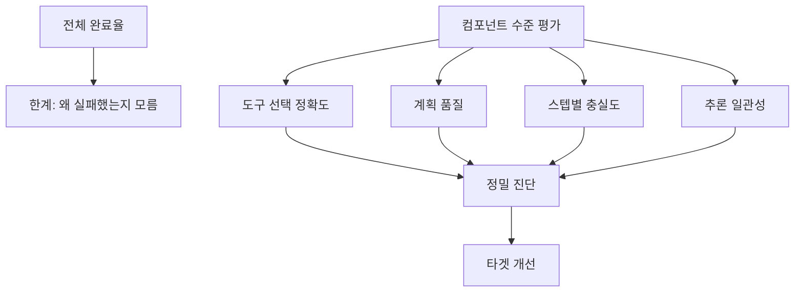

# 컴포넌트 수준 에이전트 평가

## 개요

컴포넌트 수준 에이전트 평가는 [[agentic-ai-foundation|AI 에이전트]]의 성능을 전체 완료율(end-to-end completion rate)이 아닌 개별 구성요소 단위로 분해하여 정밀 진단하는 평가 패러다임이다. 도구 선택 정확도, 계획 품질, 스텝별 충실도, 추론 일관성을 독립적으로 측정하여 에이전트의 실패 원인을 구조적으로 파악할 수 있다.

기존의 전체 완료율 중심 평가는 "에이전트가 태스크를 완수했는가?"라는 이진적 질문에만 답할 수 있었다. 컴포넌트 수준 평가는 "왜 실패했는가?", "어느 단계에서 품질이 저하되는가?"를 식별하여 에이전트 개선의 구체적 방향을 제시한다. 에이전트가 복잡한 멀티 스텝 태스크를 수행할수록 이런 분해 평가의 가치가 커진다. [[long-horizon-agent-benchmarks|장기 실행 벤치마크]]가 이 패러다임의 실용적 적용이다.

## 핵심 개념

### 4대 평가 축

**도구 선택 정확도 (Tool Selection Accuracy)**
에이전트가 주어진 맥락에서 올바른 도구를 선택했는지 측정한다. 사용 가능한 도구 목록 중 최적의 도구를 골랐는지, 불필요한 도구를 호출하지 않았는지, 호출 순서가 적절한지를 평가한다.

**계획 품질 (Plan Quality)**
에이전트가 태스크를 하위 단계로 분해하는 계획의 품질을 평가한다. 계획이 태스크의 목표를 달성하기에 충분한지, 단계 간 논리적 순서가 맞는지, 불필요한 중복 단계가 없는지를 측정한다.

**스텝별 충실도 (Step-Level Faithfulness)**
각 실행 단계에서 에이전트의 출력이 입력 맥락과 이전 단계의 결과에 충실한지 평가한다. 중간 단계에서 환각이 발생하면 최종 결과가 정확하더라도 시스템의 신뢰성이 떨어진다.

**추론 일관성 (Reasoning Consistency)**
에이전트의 추론 과정이 단계 간에 일관되는지 측정한다. 이전 단계의 결론과 모순되는 추론을 하거나, 동일한 질문에 대해 문맥에 따라 다른 판단을 내리는 경우를 탐지한다.

### 전체 완료율과의 관계

## 기술 상세

### 평가 방법론

컴포넌트 수준 평가는 에이전트 실행 트레이스(trace)를 수집하여 각 단계를 개별 평가 단위로 분리한다. 에이전트는 도구 호출, LLM 완료, 검색 단계, 계획 결정 등 다양한 스팬(span)으로 구성된 트레이스를 생성하며, 유의미한 평가는 각 스팬을 독립적으로 점수화하는 것을 의미한다. 주요 접근법은 다음과 같다.

**트레이스 기반 평가**: 에이전트의 전체 실행 기록을 수집하고, 각 도구 호출, 추론 단계, 중간 출력을 개별 테스트 케이스로 변환한다. DeepEval의 `@observe` 데코레이터가 이 패턴을 지원하며, 스팬 수준 평가를 통해 에이전트의 각 단계를 독립적으로 점수화한다.

**참조 궤적 비교**: 전문가가 정의한 이상적 실행 경로(reference trajectory)와 에이전트의 실제 경로를 비교하여 단계별 편차를 측정한다. 도구 선택을 정답 데이터셋과 대조하여 체계적 실패를 조기에 탐지한다.

**LLM-as-Judge 단계 평가**: 각 중간 단계의 입출력 쌍에 대해 별도의 LLM 판정자를 적용하여 충실도, 관련성, 논리적 일관성을 자동 평가한다. 태스크 완료(Task Completion) 메트릭은 사전 정의된 정답 데이터셋 없이도 다양한 태스크 유형에 적응 가능하다.

### 세부 메트릭 정의

2026년 주요 평가 플랫폼들은 에이전트 워크플로우에 특화된 50개 이상의 연구 기반 메트릭을 제공한다:

| 메트릭 | 측정 대상 | 적용 수준 |
|--------|---------|---------|
| **Tool Correctness** | 올바른 도구 + 정확한 파라미터 호출 여부 | 스팬(span) 수준 |
| **Tool Efficiency** | 불필요한 도구 호출 최소화 여부 | 워크플로우 수준 |
| **Contextual Relevancy** | 검색된 컨텍스트의 질의 관련성 | 검색기(retriever) 수준 |
| **Faithfulness** | 응답이 검색 컨텍스트에 근거하는지 (환각 방지) | 생성기(generator) 수준 |
| **Answer Relevancy** | 최종 답변의 질의 관련성 | 전체 에이전트 수준 |
| **Task Completion** | 사용자 지정 태스크 완수 여부 | 엔드투엔드 수준 |

Tool Correctness는 선택, 입력 파라미터, 출력 정확도를 다양한 엄격도 수준에서 평가하며, 유스케이스에 따라 호출 순서와 빈도에 대한 유연성을 제공한다.

### 비결정성 처리

LLM 기반 에이전트는 본질적으로 비결정적이다. 프롬프트의 미세한 변화가 전혀 다른 실행 경로를 만들어낼 수 있다. 컴포넌트 수준 평가에서는 동일 입력에 대해 복수 실행을 수행하고 각 구성요소의 분산을 측정하여 견고성(robustness)을 함께 평가한다. Faithfulness 점수는 추론 과정 전반의 논리적 일관성을 측정하여, 올바른 최종 답변이더라도 중간 과정에서 비일관적 추론이 발생하면 감점한다.

### 안전성 메트릭 통합

안전성(Safety) 메트릭은 개별 LLM 생성기 수준 또는 집계된 에이전트 출력 수준 모두에 배치할 수 있어, 유연한 모니터링이 가능하다. 이를 통해 에이전트의 중간 단계에서 발생하는 유해 출력이나 정보 유출을 조기에 탐지한다.

### 적용 프레임워크 (2026)

| 프레임워크 | 핵심 기능 | 컴포넌트 평가 지원 |
|-----------|---------|-----------------|
| [[deepeval]] | `@observe` 데코레이터, 50+ 메트릭, 스팬 수준 평가 | Tool Correctness, Step Efficiency |
| [[ragas]] | RAG 파이프라인 단계별 분리 평가 | Faithfulness, Context Relevancy |
| Amazon Bedrock AgentCore | 관리형 에이전트 평가 서비스 | 도구 사용, 태스크 완료 |
| MLflow | 에이전트 트레이싱 + 평가 파이프라인 | 커스텀 메트릭 정의 |
| Maxim | 에이전트 전용 평가 플랫폼 | 멀티스텝 워크플로우 진단 |

## 관련 문서

- [[deepeval]] -- 에이전트 트레이스 평가 지원 프레임워크
- [[ragas]] -- RAG 파이프라인 단계별 평가
- [[swe-bench-ecosystem-2026]] -- 에이전트 벤치마크 생태계
- [[long-horizon-agent-benchmarks]] -- 장기 호흡 에이전트 벤치마크
