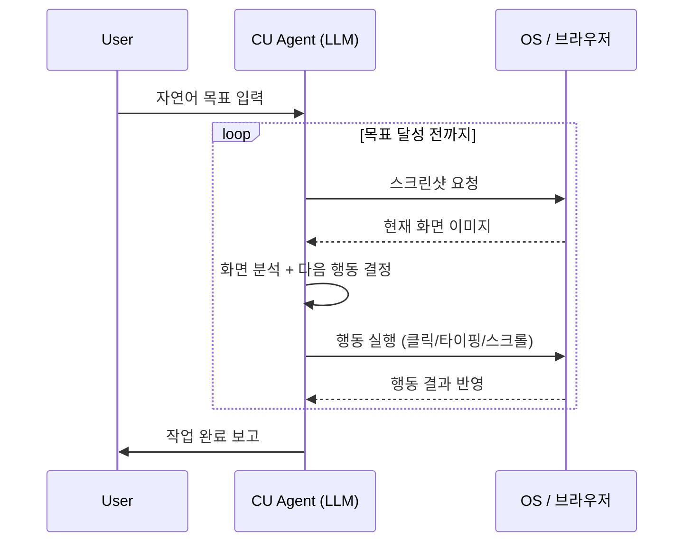

# 컴퓨터 사용 에이전트 (Computer Use Agent)

스크린샷을 입력으로 받아 마우스 클릭, 키보드 입력, 스크롤 등 GUI 조작 행동을 출력하는 에이전트. API나 코드 실행 없이 **사람처럼 화면을 보고 조작**하는 것이 핵심이다.

## 왜 중요한가

대부분의 소프트웨어는 API를 제공하지 않는다. 레거시 데스크탑 애플리케이션, 브라우저 기반 SaaS, 내부 사내 시스템 등 수십억 개의 UI가 그 범주에 해당한다. 컴퓨터 사용 에이전트는 이 "API 없는 세계"에 자동화를 가능하게 하는 범용 인터페이스다. Anthropic이 2024년 10월 Claude 3.5 Sonnet에 Computer Use 기능을 공개하면서 업계 표준 접근법으로 자리잡았다.

## 핵심 루프

위 루프는 **관측-추론-행동(observe-reason-act)** 사이클을 스크린샷 단위로 반복한다. 각 스텝은 독립적인 멀티모달 추론 호출이며, 이전 행동의 결과가 다음 스텝의 관측값이 된다.

## 주요 행동 유형

| 행동 종류 | 설명 | 예시 |
|-----------|------|------|
| `click` | 좌표 기반 마우스 클릭 | 버튼 클릭, 링크 이동 |
| `type` | 키보드 텍스트 입력 | 폼 작성, 검색어 입력 |
| `scroll` | 스크롤 이동 | 페이지 탐색 |
| `key` | 특수키 조합 | Ctrl+C, Tab, Enter |
| `screenshot` | 현재 화면 캡처 | 상태 관측 |
| `drag` | 드래그 앤 드롭 | 파일 이동, 슬라이더 조작 |

## 좌표 추출 방식

LLM이 스크린샷에서 행동 대상의 좌표를 추출하는 방법은 두 가지다:

- **픽셀 좌표 직접 출력**: `(x: 452, y: 237)` 형태로 절대 좌표 예측. 해상도 의존성이 높아 일반화가 어렵다.
- **정규화 좌표**: `(0.35, 0.18)` 처럼 0~1 사이 비율로 출력. 해상도 독립적이며 현재 주류 방식이다.
- **UI 요소 참조**: `aria-label`, `alt text` 등 접근성 속성을 파싱해 위치를 간접 특정. 구조적 탐색이 가능하다.

## 한계와 도전

**좌표 오류**: LLM은 공간 추론에 약하다. 버튼이 몇 픽셀 이동해도 클릭이 빗나갈 수 있다.

**지연 처리**: 비동기 로딩(스피너, 애니메이션) 시 화면이 아직 완성되지 않은 상태에서 행동하면 오류가 발생한다. 에이전트는 "대기" 행동이나 재시도 로직을 내장해야 한다.

**비밀번호/민감 정보**: 에이전트가 로그인 화면을 조작할 때 자격증명 노출 위험이 있다.

**무한 루프**: 목표 달성 여부를 잘못 판단하면 동일 행동을 반복한다. 최대 스텝 수 제한이 필수다.

## OSWorld 벤치마크

[[osworld-verified]] 벤치마크는 369개의 실제 컴퓨터 작업으로 에이전트를 평가한다. 2025년 기준 최고 성능 모델도 성공률이 40% 미만으로, 컴퓨터 사용은 아직 미해결 과제다.

## 브라우저 전용 에이전트와의 차이

[[browser-automation-agents]]는 DOM 트리에 직접 접근해 요소를 조작한다. 컴퓨터 사용 에이전트는 DOM 없이 **픽셀만으로** 동작하므로 모든 GUI 환경에 적용 가능하지만 정밀도가 낮다. 두 방식을 결합한 하이브리드 접근법이 연구되고 있다.

## 실무 적용 팁

- 해상도를 낮게 고정(예: 1280x720)하면 LLM의 좌표 예측 정확도가 높아진다.
- 스크린샷 주기를 줄이면 비용이 절감되지만 상태 관측이 부정확해진다. 행동 후 0.5~1초 대기 후 캡처가 실용적이다.
- 에이전트 행동 이력(action history)을 프롬프트에 포함하면 루프 검출이 쉬워진다.

## 관련 문서

- [[browser-automation-agents]] - DOM 기반 브라우저 자동화 에이전트
- [[osworld-verified]] - 컴퓨터 사용 에이전트 벤치마크
- [[agent-workflow-patterns]] - 에이전트 워크플로우 패턴
