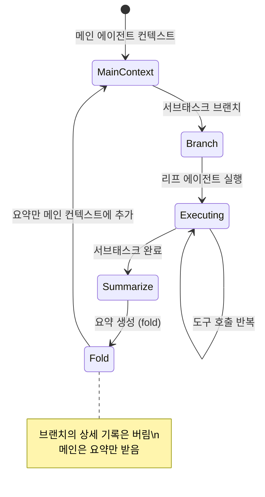
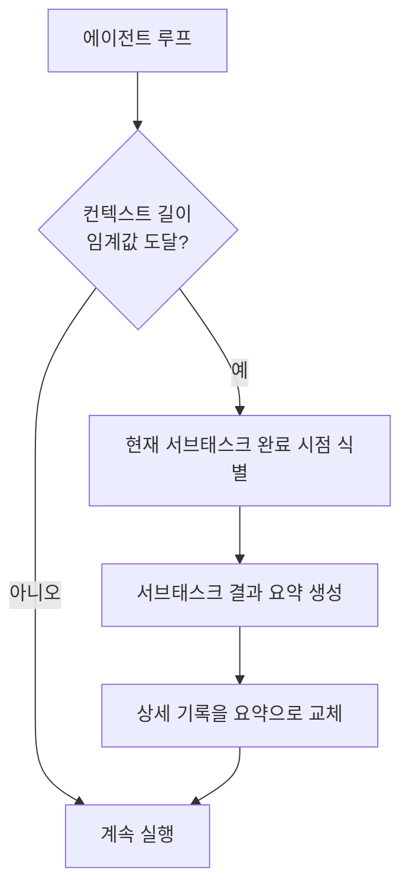

# Context Folding & Sub-Trajectory Compression

에이전트가 서브태스크 단위로 실행 궤적(trajectory)을 분기한 뒤, 완료 시 그 구간을 요약(summary)으로 압축해 활성 컨텍스트를 대폭 줄이는 기법. 장기 실행 에이전트의 핵심 비용 절감 전략이다.

## 왜 중요한가

2025년 10월 ByteDance의 "Scaling Long-Horizon LLM Agent via Context-Folding"이 ReAct 베이스라인 대비 **10배 작은 컨텍스트로 동등 성능**을 보였고, 후속 AgentFold가 BrowseComp에서 OpenAI o4-mini를 능가했다. 단순 컨텍스트 확장이 아닌 능동적 압축이 장기 실행 에이전트의 핵심임이 확립됐다.

## 컨텍스트 로트(Context Rot) 문제

컨텍스트가 길어질수록 중간 토큰의 영향력이 희석되는 "컨텍스트 로트(context rot)" 현상이 발생한다. Chroma 연구에 따르면 입력 토큰이 128k를 넘어가면 성능이 급격히 하락하는 패턴이 일관되게 관찰된다.

```
성능
 |
 | ████████
 |         ████
 |             ████
 |                 ▄▄▄▄▄▄▄▄▄ (컨텍스트 로트)
 +--------------------------> 컨텍스트 길이
   8k  32k  64k  128k  256k
```

## Branch & Fold 메커니즘



## FoldGRPO: RL로 학습한 컨텍스트 폴딩

ByteDance의 FoldGRPO는 컨텍스트 폴딩을 규칙 기반이 아닌 **강화학습으로 학습**한다.

| 항목 | 규칙 기반 폴딩 | FoldGRPO |
|------|-------------|---------|
| 폴딩 시점 결정 | 사람이 설계한 규칙 | 에이전트가 학습 |
| 요약 품질 | 일정 | 태스크별 최적화 |
| 적응성 | 낮음 | 높음 |
| 학습 비용 | 없음 | RL 훈련 필요 |

## ACON: 컨텍스트 압축 최적화

ACON(Optimizing Context Compression for Long-horizon Agents)은 컨텍스트를 단순 요약이 아닌 **태스크별로 필요한 정보만 선택적으로 유지**하는 방식을 제안한다.

- 히스토리에서 현재 태스크와 무관한 내용 제거
- 중요도 함수(importance function)로 토큰별 보존 여부 결정
- 압축률 80% 달성하면서도 성능 손실 5% 이내

## AgentFold: 능동적 컨텍스트 관리

AgentFold는 사후(after) 요약이 아닌 **사전(proactive) 컨텍스트 관리**를 도입한다. 에이전트가 실행 중 컨텍스트 길이를 모니터링하다가 임계값 도달 전에 자율적으로 압축을 시작한다.

BrowseComp 벤치마크에서 o4-mini를 능가한 핵심 이유 중 하나로 분석됐다.

## 컨텍스트 엔지니어링(Context Engineering)과의 관계

컨텍스트 폴딩은 Anthropic이 정의한 **컨텍스트 엔지니어링(context engineering)** 의 핵심 기법 중 하나다. 컨텍스트를 수동으로 채우는 것이 아니라 에이전트가 능동적으로 관리하는 패러다임 전환을 의미한다.

## 실무 적용 패턴



## 실무 적용 관점

- **임계값 설정**: 컨텍스트 창의 70-80%에서 폴딩 시작이 실용적 기준
- **요약 품질**: 폴딩 요약이 불충분하면 이후 태스크에서 정보 손실 발생. 요약 품질 검증 단계 필수
- **에이전트 트리와의 조합**: [[agent-trees|에이전트 트리]]의 각 서브트리 완료 시 자연스럽게 폴딩 적용
- **RAG 연동**: 폴딩된 내용을 외부 메모리([[agent-memory-systems|에피소딕 메모리]])에 저장하면 나중에 필요 시 재조회 가능

## 대표 레퍼런스

- [Scaling Long-Horizon LLM Agent via Context-Folding (FoldGRPO)](https://arxiv.org/abs/2510.11967)
- [AgentFold: Long-Horizon Web Agents with Proactive Context Management](https://arxiv.org/abs/2510.24699)
- [ACON: Optimizing Context Compression for Long-horizon LLM Agents](https://arxiv.org/abs/2510.00615)
- [Effective context engineering for AI agents (Anthropic)](https://www.anthropic.com/engineering/effective-context-engineering-for-ai-agents)
- [Context Rot: How Increasing Input Tokens Impacts LLM Performance](https://www.trychroma.com/research/context-rot)

## 관련 문서
- [[grn-generative-refinement-paper]] -- GRN: 생성적 정제 네트워크 - 확산 이후의 시각 합성
- [[effective-context-engineering-anthropic]] -- Effective Context Engineering for AI Agents (Anthropic)
- [[context-window]] -- 컨텍스트 윈도우 (Context Window)
- [[agentfold-paper]] -- AgentFold: Long-Horizon Web Agents with Proactive Context Management

- [[ai-hot-topics-2026-04|2026년 4월 AI 개발 핫토픽 100선]]
- [[long-horizon-rl-training-for-agents|Long-Horizon RL Training for Agents (Multi-Turn RLVR)]]
- [[agent-trees|Hierarchical Planning with Agent Trees]]
- [[agent-memory-systems|Agent Memory Systems]]
- [[subagents|Subagents]]
- [[orchestrator-worker-pattern|Orchestrator-Worker Multi-Agent Pattern]]
