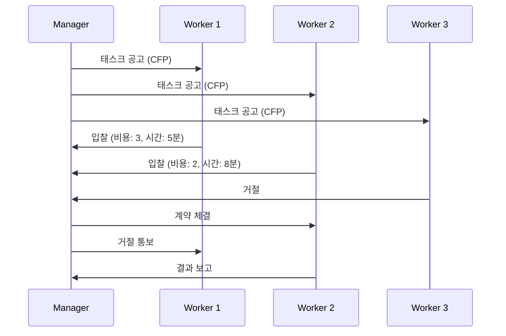

# 컨트랙트 넷 프로토콜

Smith (1980)이 제안한 분산 태스크 할당 프로토콜. **관리자(manager)**가 태스크를 공고하면 **작업자(contractor)**들이 입찰하고, 최적 입찰자와 계약을 체결하는 시장 메커니즘 기반 멀티에이전트 조율 방식.

## 프로토콜 흐름

## LLM 멀티에이전트에서의 적용

현대 에이전트 프레임워크에서 Contract Net의 변형이 활용된다:

- **CrewAI**: 역할 기반 에이전트가 태스크 적합도를 자체 평가 후 수행
- **[[a2a-protocol|A2A]]**: Agent Card로 능력을 공고하고 태스크를 매칭
- **동적 라우팅**: [[agent-model-routing|모델 라우팅]]에서 쿼리를 최적 모델에 "입찰" 방식으로 배정

## [[orchestrator-worker-pattern|오케스트레이터-워커]]와의 차이

| Contract Net | 오케스트레이터-워커 |
|-------------|-------------------|
| 작업자가 능동적 입찰 | 오케스트레이터가 일방적 할당 |
| 분산 의사결정 | 중앙 집중 의사결정 |
| 작업자의 자율성 높음 | 작업자는 지시에 따름 |

## 관련 문서

- [[multi-agent-orchestration]] -- 멀티에이전트 오케스트레이션
- [[orchestrator-worker-pattern]] -- 오케스트레이터-워커 패턴
- [[a2a-protocol]] -- A2A 프로토콜
- [[agent-capability-discovery]] -- 에이전트 능력 발견
