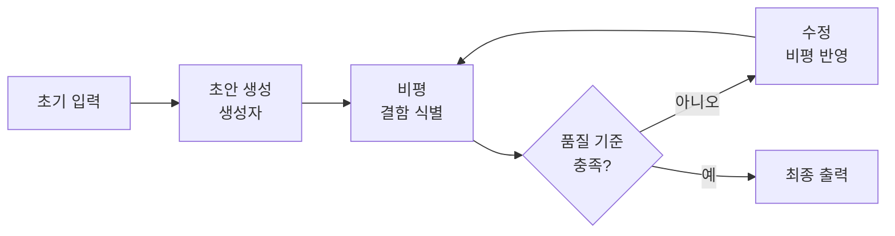
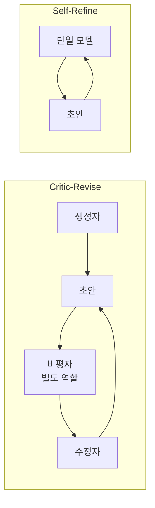

# Critic-Revise 패턴

## 개념 정의

Critic-Revise(비평-수정) 패턴은 LLM 에이전트가 초안(draft)을 생성한 뒤 비평자(critic) 관점에서 결함을 식별하고, 수정자(reviser)가 비평을 반영해 개선된 버전을 생성하는 반복 루프다. 동일 모델이 두 역할을 모두 담당하거나, 별도 모델이 각 역할을 맡는 구성 모두 가능하다.

Anthropic의 Constitutional AI(헌법적 AI)에서 영감을 받았으며, [[self-refine]], [[reflexion]]과 밀접한 관련이 있다.



생성 -> 비평 -> 수정의 루프가 품질 기준을 충족할 때까지 반복된다.

## 구성 요소

### 1. 생성자 (Generator)
주어진 입력에서 초안을 생성한다. 코드, 텍스트, 계획, 수식 등 다양한 형태의 출력을 생성할 수 있다.

### 2. 비평자 (Critic)
생성된 초안의 결함을 식별한다. 비평의 차원은 용도에 따라 다르다:

| 도메인 | 비평 기준 예시 |
|--------|--------------|
| 코드 | 버그, 성능, 가독성, 보안 취약점 |
| 텍스트 | 논리 일관성, 문법, 명확성, 편향 |
| 수학 풀이 | 계산 오류, 논리적 비약, 생략된 단계 |
| 계획 | 실행 가능성, 누락된 엣지 케이스, 의존성 |

### 3. 수정자 (Reviser)
비평 내용을 받아 개선된 버전을 생성한다. 비평을 단순히 반영하는 것이 아니라, 수정이 새로운 문제를 만들지 않는지도 확인한다.

### 4. 종료 조건 평가자 (Judge)
더 이상 의미있는 개선이 없거나 품질 기준을 충족했는지 판단한다.

## 프롬프트 패턴

### 비평자 프롬프트

```
다음 [코드/텍스트/계획]을 비평하라.

원본 요청: {original_request}

초안:
{draft}

비평 지침:
1. 명확한 오류나 버그를 먼저 나열하라
2. 개선 가능한 부분을 우선순위 순으로 제시하라
3. 잘 된 부분도 언급하라 (무엇을 유지해야 하는지)
4. 비평은 구체적이어야 한다 - "나쁘다"가 아니라 "왜 나쁜지, 어떻게 고쳐야 하는지"

비평:
```

### 수정자 프롬프트

```
다음 [코드/텍스트/계획]을 비평을 반영하여 개선하라.

원본 요청: {original_request}

현재 초안:
{draft}

비평:
{critique}

개선 지침:
- 비평의 모든 지적 사항을 반영하라
- 수정이 새로운 문제를 만들지 않도록 주의하라
- 잘 된 부분은 유지하라

개선된 버전:
```

## 구현 예시

```python
class CriticReviseAgent:
    def __init__(
        self,
        generator_llm,
        critic_llm=None,   # None이면 generator와 동일 모델 사용
        max_iterations: int = 3,
        quality_threshold: float = 0.8,
    ):
        self.generator = generator_llm
        self.critic = critic_llm or generator_llm
        self.max_iterations = max_iterations
        self.quality_threshold = quality_threshold

    def run(self, request: str) -> dict:
        # 1. 초안 생성
        draft = self.generator.generate(f"요청: {request}\n\n응답:")

        history = [{"role": "draft", "content": draft, "iteration": 0}]

        for iteration in range(1, self.max_iterations + 1):
            # 2. 비평 생성
            critique = self.critic.generate(
                critic_prompt(request, draft)
            )

            # 3. 품질 평가
            score = self._assess_quality(critique)
            if score >= self.quality_threshold:
                break

            # 4. 수정 생성
            draft = self.generator.generate(
                revise_prompt(request, draft, critique)
            )

            history.append({
                "role": "revised",
                "content": draft,
                "critique": critique,
                "iteration": iteration,
            })

        return {"final": draft, "history": history}

    def _assess_quality(self, critique: str) -> float:
        """비평 강도로 품질 추정 (0.0 = 많은 문제, 1.0 = 문제 없음)"""
        negative_signals = [
            "오류", "버그", "잘못", "문제", "개선", "수정",
            "부족", "불명확", "누락", "실수"
        ]
        score = 1.0 - min(
            sum(1 for s in negative_signals if s in critique) / len(negative_signals),
            1.0
        )
        return score
```

## Constitutional AI와의 관계

Anthropic의 Constitutional AI(CAI)는 Critic-Revise 패턴의 특수화된 형태다:

| 속성 | 일반 Critic-Revise | Constitutional AI |
|------|-------------------|-------------------|
| 비평 기준 | 사용자 정의 | 미리 정의된 원칙 집합 (헌법) |
| 비평 역할 | LLM 자유 비평 | 헌법 조항별 비교 |
| 수정 방향 | 전반적 개선 | 특정 원칙 준수 |
| 적용 목적 | 품질 향상 | 안전성, 무해성, 정직성 |

CAI의 핵심: "이 응답이 [원칙 X]를 위반하는가? 만약 그렇다면, 원칙 X를 준수하도록 재작성하라."

## Self-Refine과의 비교

[[self-refine]]은 Critic-Revise 패턴의 단일 모델 변형으로 볼 수 있다:



- **Self-Refine**: 단일 모델이 생성, 비평, 수정을 모두 담당. 구현이 단순하지만 자기 편향에 취약
- **Critic-Revise**: 역할 분리로 더 객관적인 비평 가능. 별도 전문 비평 모델 투입 가능

## 적용 시 주의사항

### 비평의 환각(Critic Hallucination)
비평자가 실제로 존재하지 않는 문제를 지적하거나 옳은 코드를 틀렸다고 할 수 있다. 비평을 맹목적으로 반영하면 좋은 초안이 오히려 나빠진다. 비평의 근거를 함께 요청하고 검증하는 단계가 필요하다.

### 루프 발산
수정 후 비평이 더 나빠지거나 루프를 빠져나오지 못하는 경우가 발생한다. 최대 반복 횟수와 개선률 모니터링을 통해 조기 종료 조건을 명시해야 한다.

### 자기 비평의 편향
동일 모델이 생성과 비평을 모두 담당하면 자신의 결함을 지적하지 못하는 편향이 생긴다. 가능하면 다른 모델이나 다른 온도 설정(더 높은 온도의 비평자)을 사용한다.

### 비용 증가
반복마다 LLM 호출이 2-3회 추가된다. 비용 관점에서 최대 반복 횟수를 현실적으로 설정(보통 2-3회)한다.

### 개선 방향의 드리프트
여러 번 수정을 거치면 원래 요구사항에서 벗어날 수 있다. 매 수정 단계에서 원본 요청을 다시 주입하여 방향을 고정한다.

## 실무 적용 패턴

### 코드 리뷰 자동화
PR 코드를 critic이 검토하고 수정 제안을 생성한 뒤, reviser가 수정된 코드를 제시한다.

### 문서 품질 개선
기술 문서 초안을 critic이 명확성, 정확성, 완성도 측면에서 검토하고 reviser가 개선한다.

### 프롬프트 최적화
LLM 프롬프트를 critic이 평가하고 더 나은 프롬프트로 진화시키는 자동 프롬프트 엔지니어링에 활용된다.

## 관련 문서

- [[self-refine]] - 단일 모델 자기 비평-수정
- [[reflexion]] - 자기 반성 기반 에이전트
- [[cumulative-reasoning]] - 검증 명제 누적 추론
- [[agent-planning-strategies]] - 에이전트 계획 전략
- [[react-pattern]] - 추론-행동-관찰 루프
- [[agent-prompt-patterns]] - 에이전트 프롬프트 패턴 모음
