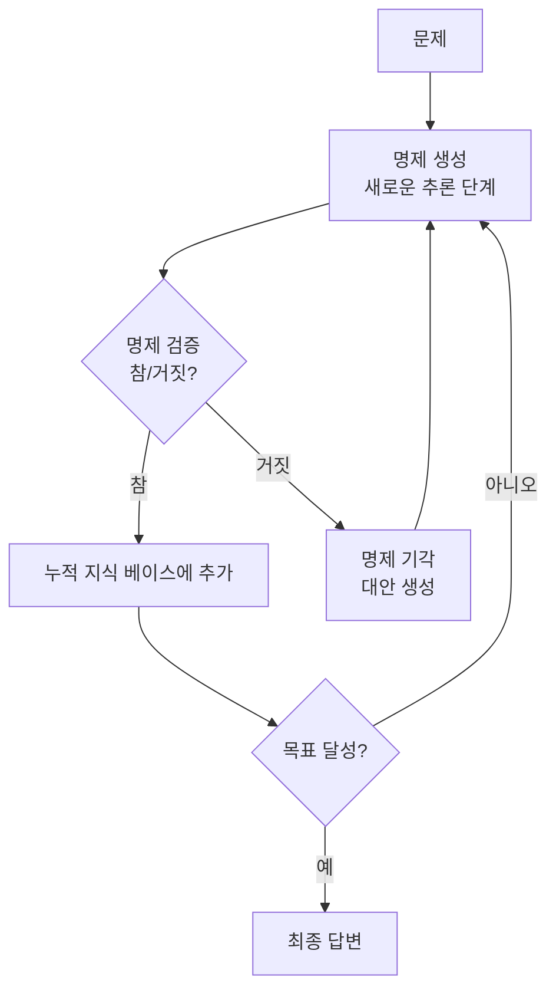

# 누적 추론 (Cumulative Reasoning)

## 개념 정의

누적 추론(Cumulative Reasoning, CR)은 Zhang et al.(2023)이 제안한 추론 패턴으로, 검증된 명제(proposition)를 누적 지식 베이스에 추가하면서 새로운 추론 단계를 진행하는 방식이다. 각 추론 단계에서 생성된 명제는 검증을 거친 뒤에만 다음 단계의 맥락으로 사용된다. 이는 오류가 초기에 차단되어 이후 단계로 전파되지 않는다는 핵심 강점을 낳는다.

[[chain-of-thought]] (CoT)가 모든 추론 단계를 연속으로 생성하는 것과 달리, 누적 추론은 각 명제를 독립적으로 검증하면서 점진적으로 진실의 집합을 쌓아나간다.



각 명제가 검증을 통과해야 다음 단계로 진행되므로, 오류 전파가 원천적으로 차단된다.

## 핵심 아이디어: 명제 단위 검증

### 기존 CoT의 문제

CoT는 "생각의 사슬"을 한 번에 생성한다. 중간 단계에서 오류가 발생해도 이를 감지하지 못하고 계속 진행한다:

```
문제: 24를 만들어라 (숫자: 2, 3, 4, 5)
CoT:
  2 + 3 = 5
  5 * 4 = 20    <- 올바름
  20 / 5 = 4    <- 올바름
  4 + 5 = 9     <- 잘못된 방향, 하지만 계속 진행
  결론: 실패 (하지만 오류를 모름)
```

### 누적 추론의 접근

각 명제를 생성 후 즉시 검증하고, 검증된 것만 다음에 사용:

```
문제: 24를 만들어라 (숫자: 2, 3, 4, 5)

명제 1: "4 * (5 + 1) = 24"
검증: 5 + 1 = 6 (1이 없음, 기각)

명제 2: "(5 - 2 + 3) * 4 = 24"
검증: 5 - 2 = 3, 3 + 3 = 6, 6 * 4 = 24 (참, 누적)

결론: (5 - 2 + 3) * 4 = 24
```

## 세 가지 역할 구조

누적 추론 시스템은 세 개의 독립된 역할(또는 프롬프트)로 구성된다:

### 1. 제안자 (Proposer)
현재까지 누적된 검증 명제를 바탕으로 새로운 명제를 생성한다.

```python
def proposer_prompt(problem: str, verified_propositions: list[str]) -> str:
    props_text = "\n".join(f"- {p}" for p in verified_propositions)
    return f"""
문제: {problem}

지금까지 검증된 사실:
{props_text}

위 사실들을 바탕으로 문제 해결에 도움이 될 새로운 명제 1개를 생성하라.
새 명제:"""
```

### 2. 검증자 (Verifier)
제안된 명제가 올바른지 독립적으로 검증한다. 수학 문제라면 계산기, 논리 문제라면 논리 확인자, 사실 문제라면 검색 엔진을 활용할 수 있다.

```python
def verifier_prompt(proposition: str, problem: str, context: list[str]) -> str:
    ctx_text = "\n".join(f"- {c}" for c in context)
    return f"""
문제: {problem}
기존 검증된 사실: {ctx_text}

다음 명제가 올바른가?
명제: {proposition}

검증 과정을 보이고 참/거짓으로 결론 내려라.
결론 (참/거짓):"""
```

### 3. 보고자 (Reporter)
누적된 명제들을 바탕으로 문제가 해결됐는지 확인하고 최종 답변을 생성한다.

```python
def reporter_prompt(problem: str, verified_propositions: list[str]) -> str:
    props_text = "\n".join(f"- {p}" for p in verified_propositions)
    return f"""
문제: {problem}

검증된 명제 목록:
{props_text}

위 명제들로 문제가 해결됐는가? 해결됐다면 최종 답변을 제시하라.
해결 여부 (예/아니오):
최종 답변:"""
```

## 전체 루프 구현

```python
class CumulativeReasoning:
    def __init__(self, llm, verifier=None, max_steps: int = 10):
        self.llm = llm
        self.verifier = verifier  # 외부 검증자 (선택)
        self.max_steps = max_steps

    def solve(self, problem: str) -> str:
        verified = []  # 검증된 명제 누적 리스트

        for step in range(self.max_steps):
            # 1. 새 명제 생성
            prop = self.llm.generate(proposer_prompt(problem, verified))

            # 2. 명제 검증
            if self.verifier:
                is_valid = self.verifier.check(prop, problem)
            else:
                verdict = self.llm.generate(
                    verifier_prompt(prop, problem, verified)
                )
                is_valid = "참" in verdict.split("결론")[-1]

            if is_valid:
                verified.append(prop)

            # 3. 종료 조건 확인
            report = self.llm.generate(reporter_prompt(problem, verified))
            if "예" in report.split("해결 여부")[-1]:
                return extract_final_answer(report)

        # 최대 단계 도달 시 현재 상태로 최선 답변
        return self.llm.generate(
            f"문제: {problem}\n검증된 사실: {verified}\n최선의 답변:"
        )
```

## 성능 벤치마크

원 논문에서 보고된 주요 결과:

| 벤치마크 | CoT | ToT | 누적 추론 |
|----------|-----|-----|-----------|
| 24 Game | ~4% | ~74% | ~98% |
| MATH | 기준 | +5~8% | +10~15% |
| 논리 추론 | 기준 | 유사 | 상회 |

특히 24 게임에서 기존 방법 대비 압도적인 성능을 보여줬다. 중간 계산 검증이 가능한 도메인에서 효과가 두드러진다.

## 적용 시 주의사항

### 검증 비용
명제마다 별도 검증 단계가 필요하므로 LLM 호출 수가 배 이상 증가한다. 토큰 비용과 지연 시간을 고려할 때 단순 문제에는 과잉이다.

### 검증자의 한계
LLM이 자기 명제를 스스로 검증하면 동일한 오류가 재현될 수 있다. 가능하면 외부 검증자(계산기, 코드 실행, 데이터베이스)를 사용하거나 다른 모델이 검증하는 구조가 낫다.

### 명제 독립성 가정
누적 추론은 각 명제가 독립적으로 검증 가능하다고 가정한다. 명제들 간의 복잡한 의존 관계가 있으면 단순 누적이 충돌을 일으킬 수 있다.

### 수렴 보장 없음
최대 단계 수 이내에 문제가 해결되지 않을 수 있다. 중간 목표 설정(sub-goal decomposition)과 결합하면 수렴 가능성이 높아진다.

### 적합 도메인
- 적합: 수학 계산, 퍼즐, 논리 추론 (검증 가능한 사실 기반)
- 부적합: 창의적 글쓰기, 주관적 판단, 검증하기 어려운 개방형 문제

## 관련 문서

- [[chain-of-thought]] - 선형 추론 기법 (누적 추론의 비교 기준)
- [[tree-of-thought]] - 트리 구조 분기 탐색
- [[graph-of-thoughts-got]] - 그래프 기반 비선형 추론
- [[self-consistency-decoding]] - 다수결 앙상블 추론
- [[critic-revise-pattern]] - 비평-수정 루프 패턴
- [[reflexion]] - 자기 반성 기반 에이전트
- [[plan-and-solve-prompting]] - 계획 단계 명시 패턴
