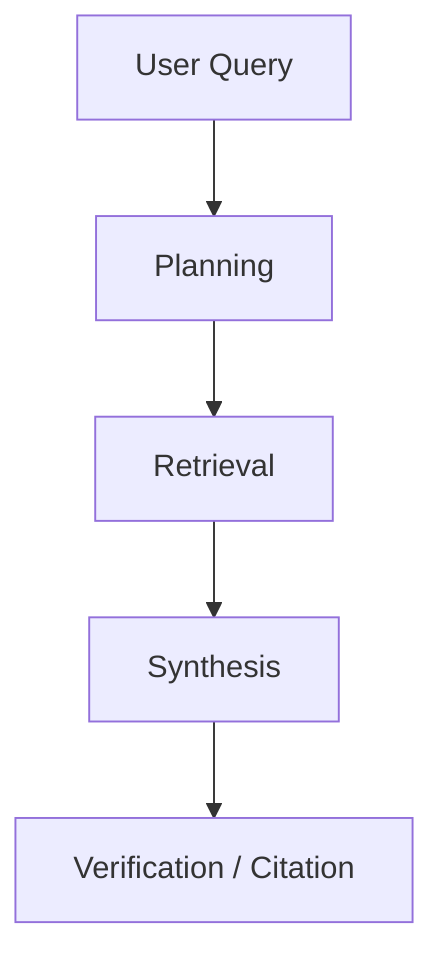

# Deep Research Agents Roadmap

deep research agent를 체계적으로 분해하고, 향후 연구 방향까지 정리한 roadmap 성격의 문서 요약이다. [[skywork-deepresearchagent|SkyworkAI]]의 오픈소스 구현체와 함께 읽으면 실무 적용 맥락이 명확해진다.

## 핵심 내용

- deep research agent를 planning, retrieval, synthesis, verification의 결합 시스템으로 설명하며, [[agent-trees|에이전트 트리]] 구조를 기반으로 한다
- 단순 검색 에이전트보다 더 넓은 범주의 조사형 [[orchestrator-worker-pattern|오케스트레이터-워커]] 패턴의 agent를 다룸
- 앞으로의 연구 과제를 로드맵 형태로 정리

## 구조 한눈에 보기

이 다이어그램은 deep research agent를 단일 search step이 아니라 **조사 파이프라인 전체**로 보게 만든다.

## 왜 중요한가

research agent는 단순 web browsing이 아니라, **문제 분해 + 탐색 + 근거 정리 + 검증**이 함께 가야 한다. 이 문서는 그 전체 구조를 조망하게 해 준다.

## 실무 적용 관점

조사형 에이전트를 만들려면 retrieval만 붙이는 것으로는 부족하다. planning, citation, evaluation, memory 설계를 같이 해야 한다는 점을 보여준다.

## 원문이 다루는 흐름

원문은 대체로 `Computer Science > Artificial Intelligence` → `Title:Deep Research Agents: A Systematic Examination And Roadmap` → `BibTeX formatted citation` → `Code, Data and Media Associated with this Article` → `Demos` 순서로 전개된다. 따라서 `Deep Research Agents Roadmap` 페이지도 세부 API 목록보다 **입문 → 구조 이해 → 운영 확장**의 흐름으로 읽는 편이 좋다.

- 따라가야 할 순서: Computer Science > Artificial Intelligence, Title:Deep Research Agents: A Systematic Examination And Roadmap, BibTeX formatted citation, Code, Data and Media Associated with this Article, Demos
- 위키에 남겨야 할 축: 입문 경로, 핵심 구조, 다음에 읽을 세부 문서

## 읽기 포인트

- 이 문서는 **원문을 어떤 순서로 읽어야 실무 판단으로 이어지는가**라는 질문을 붙잡고 읽으면 훨씬 덜 얕아진다.
- 소개 문단만 읽고 끝내지 말고, 원문 snapshot에서 실제 섹션 이름·예시·제약 조건을 다시 확인하는 습관이 중요하다.
- summary 문서는 결론 고정본이 아니라 읽기 가이드다. 따라서 입문, 세부 문서, 운영 문서를 어떤 순서로 볼지까지 안내해야 위키 품질이 올라간다.
- 공식 문서/논문/저장소가 함께 있으면 발표 글 하나만 믿지 말고, 사양 문서와 구현 저장소를 교차 확인하는 것이 안전하다.

## source 메모

- **Deep Research Agents: A Systematic Examination And Roadmap** — snapshot: `raw/2026-04-10-hot-ai-topics-sources/agent-trees/03-arxiv-org-deep-research-agents-a-systematic-examination-and-roadmap.md` · source: https://arxiv.org/abs/2506.18096 · 볼 섹션: Computer Science > Artificial Intelligence, Title:Deep Research Agents: A Systematic Examination And Roadmap, BibTeX formatted citation, Code, Data and Media Associated with this Article

## 관련 문서

- [[anthropic-multi-agent-research-system|Anthropic Multi-Agent Research System]]
- [[agent-trees|Hierarchical Planning with Agent Trees]]
- [[subagents|Subagents]]
