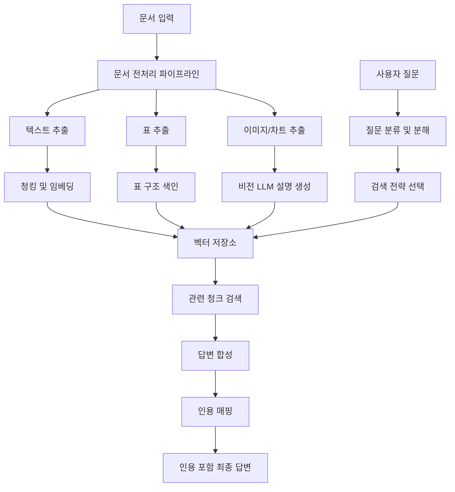
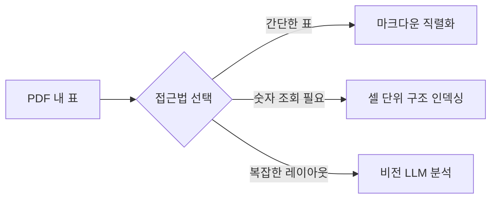
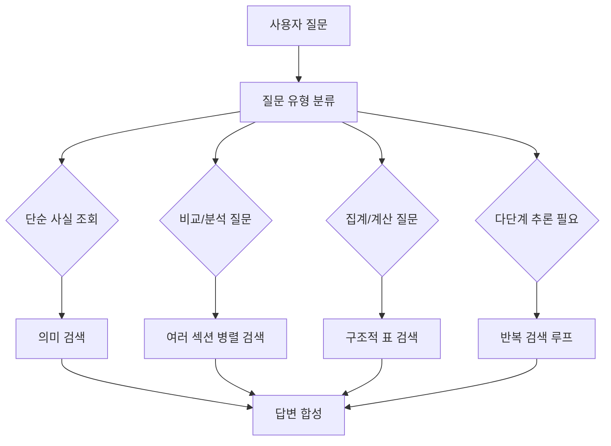

# 문서 QA 에이전트 패턴

## 개요

문서 QA 에이전트(Document Question-Answering Agent) 패턴은 PDF, Word, 슬라이드 등 구조화된 문서에서 질문에 답하는 전문 에이전트를 설계하는 방법론이다. 단순히 텍스트를 청킹해 벡터 검색하는 기본 RAG를 넘어, **표/이미지 처리**, **다단계 추론**, **정확한 인용 생성**까지 아우르는 고품질 문서 이해 에이전트를 구성하는 전략을 다룬다.

실무에서 마주치는 주요 도전:
- PDF의 표/차트/수식은 일반 텍스트 파서로 정확하게 추출되지 않는다
- "전체 문서에서 가장 높은 매출을 기록한 분기는?"처럼 여러 섹션을 종합해야 답할 수 있는 질문이 있다
- "3쪽 2번째 표의 3행 2열 값"처럼 정확한 출처를 명시해야 신뢰할 수 있다



## 문서 전처리 파이프라인

### 텍스트 추출 전략

단순 PDF 텍스트 추출은 단어 순서가 깨지거나 헤더/푸터가 본문과 섞이는 문제가 있다. 고품질 추출을 위한 도구 선택:

| 도구 | 특징 | 적합한 경우 |
|------|------|-------------|
| PyMuPDF (fitz) | 빠른 텍스트 추출, 좌표 정보 포함 | 일반 PDF |
| pdfplumber | 표 추출 강점, 선 기반 탐지 | 표가 많은 문서 |
| Unstructured.io | 다양한 형식 지원, OCR 내장 | 스캔 문서, 복잡한 레이아웃 |
| LlamaParse | LLM 기반 파싱, 마크다운 변환 | 복잡한 학술/기업 문서 |
| Document AI (Google) | OCR + 구조 인식 | 스캔 문서 |

레이아웃 기반 파싱이 중요한 이유: 다단 레이아웃, 헤더/푸터, 각주는 단순 텍스트 순서로 읽으면 의미가 깨진다. 좌표 기반 파싱으로 읽는 순서를 보정해야 한다.

### 표 처리 (Table Extraction)

표는 문서 QA에서 가장 까다로운 요소다. 여러 접근법을 상황에 따라 선택한다:

**1. 텍스트 직렬화**: 표를 마크다운 또는 CSV 형식의 텍스트로 변환해 일반 청크처럼 처리
```
| 분기 | 매출 | 영업이익 |
|------|------|---------|
| Q1 2024 | 120억 | 18억 |
```

**2. 구조적 인덱싱**: 각 셀을 (행 헤더, 열 헤더, 값)의 트리플로 저장해 정확한 조회 지원
```python
# 셀 인덱싱 예시
cells = [
    {"row_header": "Q1 2024", "col_header": "매출", "value": "120억", "page": 5, "table_id": "T3"},
    {"row_header": "Q1 2024", "col_header": "영업이익", "value": "18억", "page": 5, "table_id": "T3"},
]
```

**3. 비전 LLM 분석**: 표 이미지를 GPT-4V/Claude 비전으로 직접 분석해 자연어 설명 생성



### 이미지 및 차트 처리

문서 내 이미지, 차트, 다이어그램은 기본 텍스트 파서가 무시한다. 처리 전략:

1. **이미지 추출**: PDF에서 이미지 영역을 PNG로 추출
2. **비전 LLM 설명 생성**: 각 이미지에 대해 Claude Opus/GPT-4V로 상세 설명 텍스트 생성
3. **설명 텍스트 색인**: 생성된 설명을 원본 이미지 위치 정보(페이지, 좌표)와 함께 벡터 저장소에 색인

```python
async def process_image(image_path: str, context: str, llm) -> str:
    """이미지를 비전 LLM으로 분석해 설명 텍스트를 생성한다."""
    with open(image_path, "rb") as f:
        image_data = base64.b64encode(f.read()).decode()
    
    response = await llm.generate(
        messages=[{
            "role": "user",
            "content": [
                {"type": "image", "source": {"type": "base64", "media_type": "image/png", "data": image_data}},
                {"type": "text", "text": f"이 이미지를 상세히 설명해주세요. 문서 맥락: {context}"},
            ]
        }]
    )
    return response.content
```

## 청킹 전략

문서 QA에서 청킹 전략은 검색 품질에 직접적인 영향을 미친다. 자세한 내용은 [[chunking-strategies]]를 참조하되, 문서 QA 특화 고려 사항:

- **계층적 청킹**: 문서 → 섹션 → 단락 계층을 유지해 작은 청크로 정밀 검색 후 큰 단위로 컨텍스트 확장
- **의미적 청킹**: 섹션 헤딩을 경계로 삼아 논리적 단위 보존
- **청크 중첩**: 50-100 토큰 오버랩으로 경계 부근 정보 손실 방지
- **메타데이터 보존**: 페이지 번호, 섹션 제목, 문서 ID를 청크와 함께 저장

## 질문 분류와 라우팅

모든 질문이 동일한 처리 경로를 거쳐서는 안 된다. 질문 유형별로 최적 검색 전략이 다르다:



### 질문 분류 구현 예시

```python
QUESTION_TYPES = {
    "factual": "특정 사실, 날짜, 이름, 숫자 조회",
    "comparison": "두 개 이상 항목 비교",
    "aggregation": "합계, 평균, 최대/최소 계산",
    "multi_hop": "여러 정보를 연결해 추론 필요",
    "summarization": "섹션 또는 전체 문서 요약",
}

def classify_question(question: str, llm) -> str:
    prompt = f"""
    다음 질문의 유형을 분류하세요: {question}
    
    유형: {QUESTION_TYPES}
    
    가장 적합한 유형 하나만 반환하세요.
    """
    return llm.generate(prompt)
```

## 다단계 QA (Multi-Hop QA)

여러 문서 섹션의 정보를 연결해야 답할 수 있는 질문을 처리하는 패턴이다.

**예시:**
- 질문: "전년 대비 영업이익률이 가장 크게 개선된 사업부의 팀장은 누구인가?"
- 단계 1: 각 사업부의 2023/2024 영업이익률 검색 → 최대 개선 사업부 파악
- 단계 2: 해당 사업부 팀장 정보 검색

```python
async def multi_hop_qa(question: str, retriever, llm) -> str:
    """다단계 추론이 필요한 질문을 반복 검색으로 처리한다."""
    collected_facts = []
    current_question = question
    
    for step in range(max_steps := 5):
        # 현재 질문으로 관련 청크 검색
        chunks = await retriever.search(current_question)
        
        # 수집된 정보로 답변 시도
        response = await llm.generate(
            f"질문: {question}\n"
            f"수집된 정보: {collected_facts + chunks}\n"
            f"현재 답변이 가능한가? 불가능하다면 다음 검색 질문은?"
        )
        
        if response.is_complete:
            return response.answer
        
        collected_facts.extend(chunks)
        current_question = response.next_question
    
    return "충분한 정보를 찾지 못했습니다."
```

## 인용 생성 (Citation Generation)

문서 QA에서 인용은 단순한 부가 기능이 아니라 **신뢰성의 핵심 요소**다. 잘못된 정보를 그럴듯하게 설명하는 환각을 방지하고 검증 가능성을 제공한다.

### 인용 수준

1. **문서 수준**: "ABC 보고서에 따르면..."
2. **페이지 수준**: "(3쪽)"
3. **섹션 수준**: "2.3절 시장 현황에 따르면..."
4. **문장 수준**: 특정 문장을 직접 인용하고 출처 위치 명시

### 인용 구현 패턴

```python
@dataclass
class Citation:
    document_id: str
    page: int
    section: str
    text_span: str  # 원문 텍스트 일부
    chunk_id: str

def generate_answer_with_citations(
    question: str,
    retrieved_chunks: list[Chunk],
    llm
) -> tuple[str, list[Citation]]:
    """인용 정보가 포함된 답변을 생성한다."""
    
    # 각 청크에 참조 번호 부여
    context_with_refs = "\n".join([
        f"[{i+1}] (페이지 {chunk.page}, {chunk.section})\n{chunk.text}"
        for i, chunk in enumerate(retrieved_chunks)
    ])
    
    prompt = f"""
    다음 정보를 바탕으로 질문에 답하세요.
    답변에서 사용한 정보의 출처 번호를 [1], [2] 형식으로 인라인 표시하세요.
    
    정보:
    {context_with_refs}
    
    질문: {question}
    """
    
    answer = llm.generate(prompt)
    citations = extract_citations(answer, retrieved_chunks)
    return answer, citations
```

## 평가 지표

| 지표 | 설명 | 측정 방법 |
|------|------|----------|
| 답변 정확도 | 정답과의 일치 여부 | 황금 데이터셋 비교 |
| 인용 정밀도 | 인용된 소스가 실제로 관련 정보를 포함하는 비율 | 수동 검토 또는 LLM 평가 |
| 인용 재현율 | 답변에 사용된 정보가 실제 소스에서 나온 비율 | 역추적 검증 |
| 환각률 | 소스에 없는 정보를 사실처럼 기술한 비율 | 소스 대비 검증 |
| 검색 재현율 | 관련 청크가 Top-K에 포함된 비율 | 황금 검색 결과 비교 |

## 한계와 트레이드오프

- **스캔 PDF 한계**: OCR 오류율이 높은 오래된 스캔 문서는 품질이 크게 낮아짐
- **복잡한 수식**: LaTeX 수식이 많은 논문은 텍스트 추출이 왜곡될 수 있음
- **장문 문서**: 수백 쪽 문서에서 긴 문맥이 필요한 질문은 청킹으로 인해 맥락이 단절될 수 있음
- **이미지 의존 내용**: 텍스트 없이 이미지만으로 전달되는 정보는 비전 LLM 없이는 처리 불가
- **비용**: 고품질 파싱 + 비전 LLM 처리는 기본 RAG보다 비용이 5-10배 높음

## 관련 문서

- [[rag]] -- RAG 검색 증강 생성 개요
- [[chunking-strategies]] -- 청킹 전략 상세
- [[agentic-web-search-pattern]] -- 웹 검색 에이전트 패턴
- [[agent-context-management]] -- 컨텍스트 관리
- [[multi-agent-debate]] -- 복수 에이전트 검증 패턴
