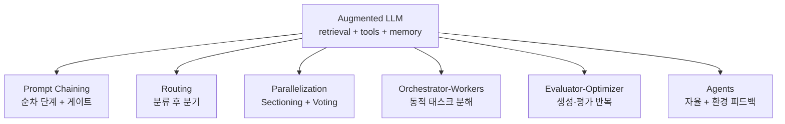

# Building Effective Agents (Anthropic Engineering 2024-12)

Anthropic Applied AI 팀(Erik S., Barry Zhang)이 내부 에이전트 빌딩 경험을 정리한 글. **"성공적인 LLM 에이전트는 복잡한 프레임워크가 아니라 단순하고 조합 가능한 패턴(simple, composable patterns)에서 나온다"**는 핵심 명제로 시작해, 7가지 빌딩 블록을 카탈로그화한 사실상 표준 레퍼런스다.

## 핵심 정의: Workflows vs Agents

| 구분 | 정의 |
|---|---|
| **Workflows** | "LLM과 도구가 사전에 정의된 코드 경로를 따라 오케스트레이션되는 시스템" |
| **Agents** | "LLM이 자신의 프로세스와 도구 사용을 동적으로 지시하면서 어떻게 작업을 수행할지에 대한 통제권을 유지하는 시스템" |

> "Agents can be used for open-ended problems where it's difficult or impossible to predict the required number of steps, and where you can't hardcode a fixed path."

## 7가지 핵심 빌딩 블록

### 1. Augmented LLM
모든 에이전트 시스템의 기본 단위. LLM + retrieval + tools + memory. 모델이 자체적으로 검색 쿼리를 만들고, 도구를 선택하고, 보존할 정보를 결정한다.

### 2. Prompt Chaining (프롬프트 체이닝)
작업을 순차적 단계로 분해. 각 단계 사이에 **프로그래밍적 검증 게이트** 삽입.
- 사례: 마케팅 카피 작성 후 번역, 문서 개요 작성 후 본문 채우기

### 3. Routing (라우팅)
입력을 분류해 특화된 다운스트림 작업으로 보냄.
- 사례: 고객 문의 종류별로 다른 처리 흐름(환불, 일반 질문, 기술 지원)

### 4. Parallelization (병렬화)
두 가지 변형:
- **Sectioning**: 독립 가능한 하위 작업으로 분할 후 병렬 실행
- **Voting**: 같은 작업을 여러 번 실행해서 다양성 확보
- 사례: 가드레일 검사를 별도 호출로, [[llm-as-judge|LLM-as-judge]] 평가를 다중 인스턴스로

### 5. Orchestrator-Workers (오케스트레이터-워커)
중앙 LLM이 동적으로 하위 작업을 분해하고 워커 LLM에 위임, 결과를 종합.
- Parallelization과의 차이: **하위 작업 분할이 사전에 정해지지 않고 입력에 따라 동적**으로 결정됨
- 사례: 복잡한 코딩 작업에서 여러 파일을 변경해야 할 때

### 6. Evaluator-Optimizer (평가자-최적화자)
한 LLM이 응답을 생성하고 다른 LLM이 평가/피드백 → 반복.
- 사례: 번역에서 미묘한 뉘앙스 캡처, 복잡한 검색에서 다중 라운드 분석

### 7. Agents (에이전트)
환경으로부터 피드백을 받으며 자율적으로 동작.
- 정지 조건: 작업 완료, 최대 반복 한계, 인간 개입 필요 시그널

## 핵심 권고사항

### 단순함부터 시작
> "When building applications with LLMs, we recommend finding the simplest solution possible, and only increasing complexity when needed. This might mean not building agentic systems at all."

### Latency/Cost 트레이드오프
에이전트 시스템은 성능을 위해 지연시간과 비용을 희생한다. 비용을 정당화하는 작업에만 사용.

### 프레임워크 사용 권장 + 주의
LangGraph, Amazon Bedrock AI Agent framework, Rivet, Vellum 등이 있지만 "abstract layer가 디버깅을 어렵게 만들 수 있다." **직접 LLM API를 사용하는 것부터 시작 권장**.

### Tool 설계 원칙 (ACI - Agent-Computer Interface)
- 사람이 사용하기 편한 인터페이스에 들이는 만큼 **ACI에도 투자**
- 모델이 헷갈릴 만한 형식 회피 (정확한 카운팅/이스케이프 필요한 형식 등)
- 도구 정의에 예시와 엣지 케이스 포함
- 워크벤치에서 광범위 테스트 후 프로덕션 배포
- "**Poka-yoke**" 원칙으로 모델의 실수 방지 (예: 절대경로 강제)

## 프로덕션 적용 사례

- **고객 지원(Customer Support)**: 대화 + 도구 통합으로 주문 이력, 환불, 티켓 관리
- **코딩 에이전트(Coding Agents)**: 자동 테스트로 검증 가능. SWE-bench Verified 이슈 해결 사례

## 성공의 3가지 원칙

1. **Maintain simplicity** - 에이전트 설계의 단순함 유지
2. **Prioritize transparency** - 계획 단계를 명시적으로 보여주기
3. **Carefully craft your ACI** - 도구 문서화와 테스트 철저히

## 후속 가이드 (시리즈)

이 글은 Anthropic Engineering 시리즈의 출발점이며 후속편들이 각 영역을 심화한다:

- "How we built our multi-agent research system" (2025-06) → [[anthropic-multi-agent-research-system]]
- "Effective context engineering for AI agents" (2025-09) → [[effective-context-engineering-anthropic]]
- "Writing effective tools for AI agents" (2025-09) → [[tool-design-for-agents]]
- "Demystifying evals for AI agents" (2026-01) → [[agent-evals-anthropic-perspective]]

## 관련 문서

- [[orchestrator-worker-pattern]] — Orchestrator-Workers 패턴
- [[react-pattern]] — Augmented LLM의 대표적 구현
- [[evolution-of-agentic-patterns]] — 에이전트 패턴 진화 연대기
- [[agent-workflow-patterns]] — Workflow 패턴 일반론
- [[anthropic-harness-design]] — 후속 하네스 디자인
