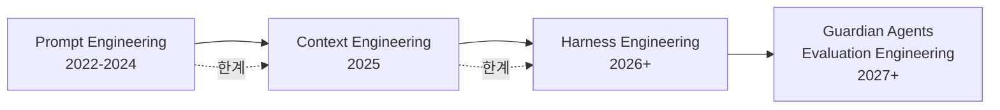

# 프롬프트에서 하네스까지 — AI 에이전틱 패턴 4년의 기록

## 출처

- **원문**: bits-bytes-nn.github.io, 2026-04-05
- **URL**: https://bits-bytes-nn.github.io/insights/agentic-ai/2026/04/05/evolution-of-ai-agentic-patterns.html
- **성격**: 2022-2026 사이 AI 에이전틱 패러다임 전환의 연대기 + 부검 보고서

## 핵심 주장

이 글의 중심 명제는 Chad Fowler의 "[[relocating rigor]]" 원칙이다:

> "엔지니어링의 엄밀함은 사라지지 않는다 — 이동할 뿐이다."

4년간 AI 개발은 세 번의 패러다임 전환을 겪었고, 각 전환은 이전 패러다임이 약속을 지키지 못한 결과였다. 저자는 이를 **부검 보고서(autopsy report)** 형식으로 정리한다.

## 3 에라 타임라인

각 에라는 전임자를 대체하지 않고 **포함(subsume)** 한다. 좋은 하네스는 좋은 컨텍스트를 요구하고, 좋은 컨텍스트는 좋은 프롬프트를 요구한다. 진화는 포기가 아닌 추상화 수준의 상승이다.

## 3 에라 종합 비교

| 차원 | Prompt Engineering | Context Engineering | Harness Engineering |
|---|---|---|---|
| **에라** | 2022-2024 | 2025 | 2026+ |
| **핵심 질문** | "무엇을 말할까?" | "어떤 정보를 주입할까?" | "어떤 시스템을 구축할까?" |
| **엄밀함 위치** | 프롬프트 텍스트 | 컨텍스트 창 구성 | 시스템 아키텍처 |
| **핵심 메트릭** | 응답 품질 (주관적) | KV-캐시 히트율 | 작업 완료율, 작업당 비용 |
| **실패 모드** | Blind prompting, 비결정성 | 컨텍스트 오염, Lost-in-Middle | 오케스트레이션 버그, 보안 침해 |

## 에라별 요약

### Era 1: 프롬프트 엔지니어링 (2022-2024)

**촉발 사건**:
- 2022년 6월 GitHub Copilot 출시 ($10/월)
- 2022년 11월 ChatGPT 출시 (5일 만에 100만, 2개월 만에 1억 사용자)

**학술적 기반**:
- **Chain-of-Thought** (Wei et al., 2022): "단계별로 생각"하면 GSM8K 정확도 17.9% → 58.1%
- **ReAct** (Yao et al., 2022): Thought → Action → Observation 루프
- **Tree-of-Thought** (Yao et al., 2023): 다중 추론 경로 탐색 (비용 폭발)
- **Self-Refine / Reflexion** (Madaan, Shinn 2023): 모델의 자기 비평

**Andrew Ng의 4 Agentic Design Patterns (2024)**:
- Reflection, Tool Use, Planning, Multi-Agent Collaboration

**벽에 부딪히다**: Mitchell Hashimoto의 "[[blind prompting]]" — 엄밀한 측정 없는 trial-and-error. 구조적 문제는 프롬프트 텍스트가 아니라 **불완전한 컨텍스트**였다.

### Era 1.5: 코딩 도구 폭발 + 바이브 코딩 숙취 (2024-2025)

**도구 확산**:
- Cursor (2023년 3월): `@file`, `@codebase`, `@Docs` 참조. 2025년 $1.2B ARR
- Devin, Windsurf, Ralph, Aider, Cline, Void Editor 등
- GitHub AI 프레임워크: 14개 → 89개 (535% 증가)

**[[Vibe Coding]] 등장**:
- 2025년 2월 Karpathy: Cursor 제안을 diff 검토 없이 수락
- 코드가 인간 이해 수준을 넘어섰다는 이유

**Vibe Coding Hangover (2025년 9월)**:
- Fast Company 보도: 3개월 된 AI MVP가 버그 축적, 아무도 코드베이스 이해 못 함
- CodeRabbit: AI 생성 코드는 메이저 이슈 1.7배, 보안 취약점 45% 증가
- Simon Willison의 교정: "리뷰하고 테스트했다면 그건 vibe coding이 아니라 engineering이다"

### Era 2: 컨텍스트 엔지니어링 (2025 중반)

**기원**: 2025년 6월 19일 Shopify CEO Tobi Lütke의 용어 제안. Karpathy와 Andrew Ng가 이어받음.

**[[LLM as OS]] 메타포** (Karpathy):
- Kernel = LLM 추론 엔진
- RAM = 컨텍스트 창
- File system = RAG / 벡터 DB
- System calls = Tool calls / APIs
- Process mgmt = 멀티 에이전트 오케스트레이션

**Anthropic 4전략 프레임워크**:
- **Write**: 시스템 프롬프트 명시적 구조화
- **Select**: 관련 있는 정보만 전달 ([[lost in the middle]] 대응)
- **Compress**: 긴 대화를 80%+ 보존하면서 축약
- **Isolate**: 특화 작업을 [[subagents]]에 위임

**핵심 메트릭은 [[KV cache]]로 이동**:
- 프롬프트 접두사 재사용으로 비용 90% 감소
- 안정적 접두사(시스템 프롬프트) + 가변 접미사(사용자 입력) 구조 필수
- 접두사 한 토큰이라도 바뀌면 캐시 무효화

**인프라 표준**:
- **MCP (Model Context Protocol)**: 2024년 11월 Anthropic 발표. 2025년 12월 월 9700만+ SDK 다운로드, 10,000+ 커뮤니티 서버
- Skills, Sub-agents, Swarms, Context Hub, Memory Systems

**여전히 불충분한 이유**:
1. 단일 턴 중심 — 멀티턴 결정 체인 부재
2. 에러 복구 메커니즘 부재
3. 프롬프트 인젝션 보안 공백

### Era 3: 하네스 엔지니어링 (2026~)

**기원**: 2026년 2월 Mitchell Hashimoto "My AI Adoption Journey" 발표 후 2주 내 OpenAI, Martin Fowler/Birgitta Böckeler, Ethan Mollick의 **다중 발견(multiple discovery)**.

**핵심 공식**:
> Agent = Model + **Harness** (모델을 제외한 모든 것)

**[[harness quadrants|하네스 4사분면]]** (Fowler/Böckeler):

|  | Feedforward (사전 유도) | Feedback (사후 교정) |
|---|---|---|
| **Deterministic** | Guides: AGENTS.md, 컨벤션 | Computational: 컴파일러, 린터 |
| **Non-deterministic** | System prompts: 역할, few-shot | Inferential: LLM-as-a-judge |

**케이스 스터디**:
- **Anthropic 3-Agent 아키텍처**: Planner + Generator + Evaluator. 비용 22배 ($200 vs $9)지만 완성도 비교 불가
- **OpenAI Codex 5개월 실험**: 수동 코드 0줄, 100만 라인 생성, 1500 PR, 10× 속도. 엔지니어는 코드가 아닌 **컨텍스트 생성 환경**을 설계
- **Ralph Pattern**: PRD 완료까지 자동 루프 + 반복 간 클린 컨텍스트 리셋

**보안: [[lethal trifecta|치명적 3요소]] + Meta Rule of Two**:
- 비신뢰 입력 + 민감 데이터 접근 + 상태 수정 = 사고 불가피
- Meta Rule of Two: 최대 2개만 동시 보유, 3개 필요 시 human-in-the-loop

## 원문 핵심 문장

> "Agent = Model + Harness (everything except the model)"

> "엔지니어링의 엄밀함은 사라지지 않는다 — 이동할 뿐이다."

> "When agents make mistakes, change the system so the same mistake cannot structurally recur." — Mitchell Hashimoto

> "If you reviewed and tested, it's not vibe coding — it's engineering." — Simon Willison

## 저자가 제시한 미래 지평

- **Guardian Agent**: 정책 위반 배포를 막는 실시간 감시. 엄밀함이 "실행"에서 "감독"으로 이동
- **Evaluation Engineering**: 벤치마크 점수 → 실제 작업 완료율. 검증 불가 보상(readability, 미적 가치) 문제 대응
- **Knowledge Engines**: 코드 그래프 + 커밋 히스토리 + 프로젝트 설계 의도 통합

## 관련 문서

### 추출된 concept
- [[relocating rigor]] — 엄밀함 이동 원칙 (메타 원칙)
- [[prompt engineering]] — 2022-2024 에라
- [[context engineering]] — 2025 에라
- [[harness engineering]] — 2026+ 에라
- [[llm as os]] — Karpathy OS 메타포
- [[KV cache]] — 캐시 재사용 기반 프로덕션 최적화
- [[harness quadrants]] — Fowler/Böckeler 2×2 분류
- [[lethal trifecta]] — Simon Willison 보안 원칙
- [[blind prompting]] — Mitchell Hashimoto 지적

### 연결된 기존 concept
- [[vibe coding]] — 2.3절 vibe coding 숙취 사례 병합
- [[agentic engineering]] — 프로페셔널 관점
- [[subagents]] — Isolate 전략 구현
- [[coding agent]] — Era 1의 결과물

## 지식 갭 (미수집)

- Mitchell Hashimoto의 "Blind Prompting" 및 "My AI Adoption Journey" 원문
- Tobi Lütke의 2025-06-19 원본 트윗
- Karpathy의 Software 3.0 원본 (Latent Space)
- Anthropic 3-Agent 아키텍처 상세
- OpenAI Codex 5개월 실험 원본
- Chain-of-Thought, ReAct, Tree-of-Thought 원본 논문 (paper 페이지 필요)
- Lost-in-the-Middle 논문 (Liu et al., 2023)
- Andrew Ng "Four Agentic Design Patterns" 원본
