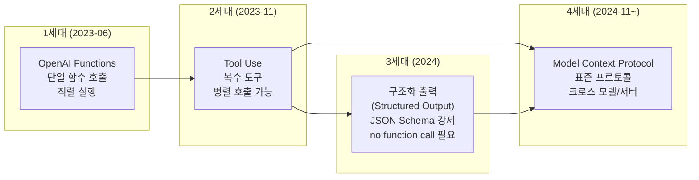
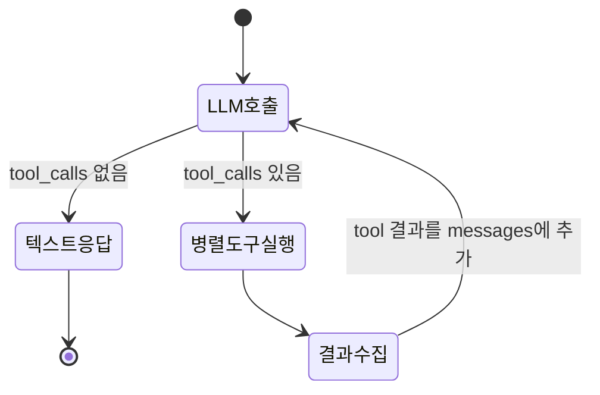
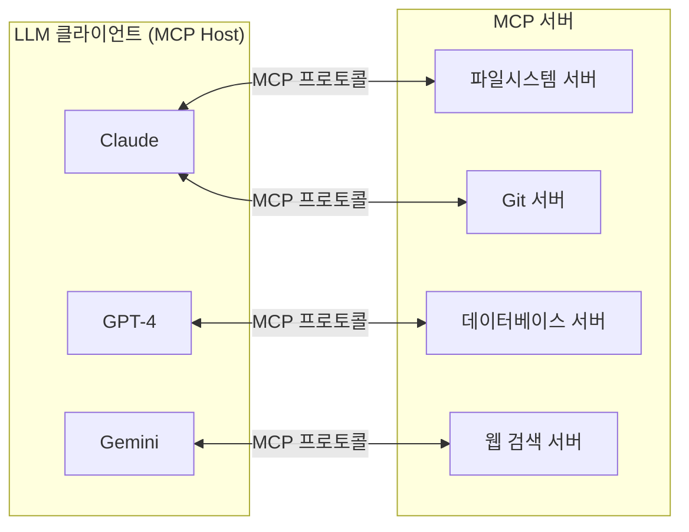
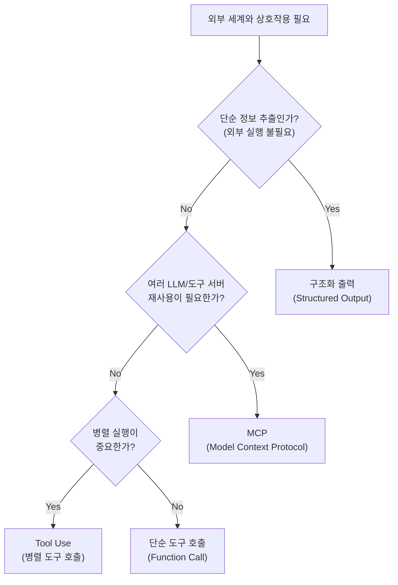

# 함수 호출 진화사

## 개요

함수 호출(Function Calling)은 LLM이 자연어 응답 대신 **구조화된 함수 호출 명령을 출력**하게 하는 메커니즘이다. 이 기능은 2023년부터 2025년에 걸쳐 "OpenAI Functions" -> "Tool Use" -> "구조화 출력(Structured Output)" -> "Model Context Protocol(MCP)"로 진화했다. 각 세대의 전환은 단순한 API 변경이 아니라 **LLM이 외부 세계와 상호작용하는 방식의 패러다임 변화**를 반영한다. 이 진화를 이해하는 것은 현대 에이전트 설계의 기초다.

## 진화 타임라인



## 1세대: OpenAI Functions (2023년 6월)

### 개념

OpenAI가 ChatCompletions API에 `functions` 파라미터를 추가했다. LLM에게 사용 가능한 함수 목록과 각 함수의 JSON Schema를 제공하면, LLM이 필요할 때 함수 호출을 요청하는 JSON을 출력한다.

### API 형태

```python
import openai

functions = [
    {
        "name": "get_weather",
        "description": "특정 도시의 현재 날씨를 반환합니다",
        "parameters": {
            "type": "object",
            "properties": {
                "city": {"type": "string", "description": "도시 이름"},
                "unit": {"type": "string", "enum": ["celsius", "fahrenheit"]}
            },
            "required": ["city"]
        }
    }
]

response = openai.ChatCompletion.create(
    model="gpt-3.5-turbo-0613",
    messages=[{"role": "user", "content": "서울 날씨 알려줘"}],
    functions=functions,
    function_call="auto"  # LLM이 자동으로 함수 호출 여부 결정
)

# LLM 응답에 function_call이 포함되면 함수를 실행하고 결과를 다시 전달
message = response.choices[0].message
if message.get("function_call"):
    func_name = message.function_call.name
    func_args = json.loads(message.function_call.arguments)
    result = execute_function(func_name, func_args)
```

### 1세대의 한계

- **단일 함수 호출**: 한 번의 응답에서 하나의 함수만 호출 가능
- **직렬 실행**: 여러 정보가 필요할 때 여러 번의 왕복(round-trip) 필요
- **OpenAI 전용**: 다른 LLM 제공자와 호환 없음
- **`function_call` 필드**: 구버전 필드명으로 이후 API에서 변경

## 2세대: Tool Use (2023년 11월~)

### 개념

OpenAI가 `functions` 파라미터를 `tools`로 대체하고, 병렬 도구 호출(parallel tool calls)을 도입했다. Anthropic Claude도 유사한 시기에 Tool Use를 공개했다. "함수"가 아닌 "도구"로 명칭이 바뀐 것은 의미 있는 변화다. 도구는 함수뿐 아니라 더 넓은 외부 리소스(파일 시스템, API, 데이터베이스)를 포괄하는 개념이다.

### API 형태 (OpenAI Tools)

```python
tools = [
    {
        "type": "function",
        "function": {
            "name": "get_weather",
            "description": "날씨 조회",
            "parameters": {...}
        }
    },
    {
        "type": "function",
        "function": {
            "name": "search_web",
            "description": "웹 검색",
            "parameters": {...}
        }
    }
]

response = openai.chat.completions.create(
    model="gpt-4-turbo",
    messages=[{"role": "user", "content": "서울과 부산의 날씨를 비교해줘"}],
    tools=tools,
    tool_choice="auto"
)

# 이제 복수의 tool_calls가 반환될 수 있음
tool_calls = response.choices[0].message.tool_calls
# [{"id": "call_abc", "function": {"name": "get_weather", "arguments": '{"city": "서울"}'}},
#  {"id": "call_def", "function": {"name": "get_weather", "arguments": '{"city": "부산"}'}}]

# 병렬로 두 함수 실행 가능
results = await asyncio.gather(*[execute_tool(tc) for tc in tool_calls])
```

### Tool Use 처리 루프



### 2세대의 발전

- **병렬 호출**: 하나의 응답에서 여러 도구를 동시에 호출 가능 -> 대폭 빠른 처리
- **`tool_calls` + `tool` 역할 메시지**: 더 명확한 도구 실행 이력 표현
- **Anthropic, Google 등 다수 LLM 지원**: 사실상 업계 표준 패턴으로 수렴

### Anthropic의 Tool Use

```python
# Anthropic Claude Tool Use
import anthropic

response = client.messages.create(
    model="claude-3-5-sonnet-20241022",
    max_tokens=1024,
    tools=[{
        "name": "get_weather",
        "description": "날씨 조회",
        "input_schema": {
            "type": "object",
            "properties": {"city": {"type": "string"}},
            "required": ["city"]
        }
    }],
    messages=[{"role": "user", "content": "서울 날씨는?"}]
)
# stop_reason == "tool_use"이면 도구 실행 필요
```

## 3세대: 구조화 출력 (Structured Output, 2024년~)

### 개념

도구 호출이 아닌 경우에도 LLM 출력을 JSON Schema에 강제로 맞추는 기능이다. LLM이 항상 유효한 JSON 형식으로 응답하도록 보장한다.

```python
from pydantic import BaseModel

class CalendarEvent(BaseModel):
    name: str
    date: str
    participants: list[str]

response = openai.beta.chat.completions.parse(
    model="gpt-4o-2024-08-06",
    messages=[
        {"role": "system", "content": "이벤트 정보를 추출하세요."},
        {"role": "user", "content": "알리와 친구들이 금요일 오후 3시에 과학 박람회에 간다."}
    ],
    response_format=CalendarEvent,
)

event = response.choices[0].message.parsed
# CalendarEvent(name="과학 박람회", date="금요일 오후 3시", participants=["알리", ...])
```

### 적용 맥락

구조화 출력은 도구 호출과 독립적으로 동작한다. 에이전트 내부에서 "이 정보를 구조화된 형식으로 추출해 다음 에이전트에 전달"하는 내부 파이프라인 접착제 역할을 한다.

## 4세대: Model Context Protocol (MCP, 2024년 11월~)

### 개념

[[model-context-protocol]]은 Anthropic이 제안하고 업계가 채택 중인 **표준화된 LLM-도구 통신 프로토콜**이다. 특정 LLM 제공자의 API에 종속되지 않고, 어떤 LLM이든 어떤 도구 서버든 호환되는 공통 인터페이스를 정의한다.



### MCP와 Tool Use의 차이

| 항목 | Tool Use (2세대) | MCP (4세대) |
|------|----------------|-------------|
| 프로토콜 정의 | LLM 제공자별 상이 | 통합 표준 프로토콜 |
| 도구 발견 | 정적 (코드에 하드코딩) | 동적 (서버에서 목록 조회) |
| 통신 방식 | API 파라미터 | JSON-RPC over stdio/HTTP |
| 상태 관리 | 없음 | 세션/리소스 관리 |
| 도구 재사용성 | LLM 제공자별 구현 필요 | 한번 구현으로 범용 사용 |

## 진화의 핵심 패턴

함수 호출의 진화를 관통하는 3가지 흐름이 있다.

**1. 표현력 확장**: 단일 함수 -> 복수 도구 -> 도구 + 구조화 출력 + 리소스

**2. 표준화**: 제공자별 포맷 -> 업계 공통 Tool Use -> MCP 표준 프로토콜

**3. 신뢰성 강화**: 텍스트 파싱 -> JSON Schema 강제 -> 구조화 출력 보장

## 실무 선택 가이드



## 에이전트 설계에의 함의

함수 호출 진화가 에이전트 설계에 미친 영향:

- **[[react-pattern]] 구현**: Thought-Action-Observation에서 Action이 도구 호출로 구체화됨
- **[[plan-and-execute-pattern]] 실현**: 실행 단계에서 복수 도구를 병렬 호출해 속도 향상
- **[[swarm-openai-handoffs]] 기반**: 핸드오프 자체가 함수 반환값으로 구현됨
- **[[multi-agent-orchestration]] 가능**: 에이전트가 다른 에이전트를 도구로 호출하는 패턴 등장

## 관련 문서

- [[function-calling-tool-use]] - 함수 호출 및 도구 사용 심화
- [[tool-use-patterns]] - 도구 사용 패턴 정리
- [[model-context-protocol]] - MCP 표준 프로토콜 상세
- [[openai-agents-sdk]] - Tool Use 기반의 공식 에이전트 SDK
- [[swarm-openai-handoffs]] - Swarm의 핸드오프 구현 (함수 호출 활용)
- [[react-pattern]] - 도구 호출을 포함하는 에이전트 루프 패턴
