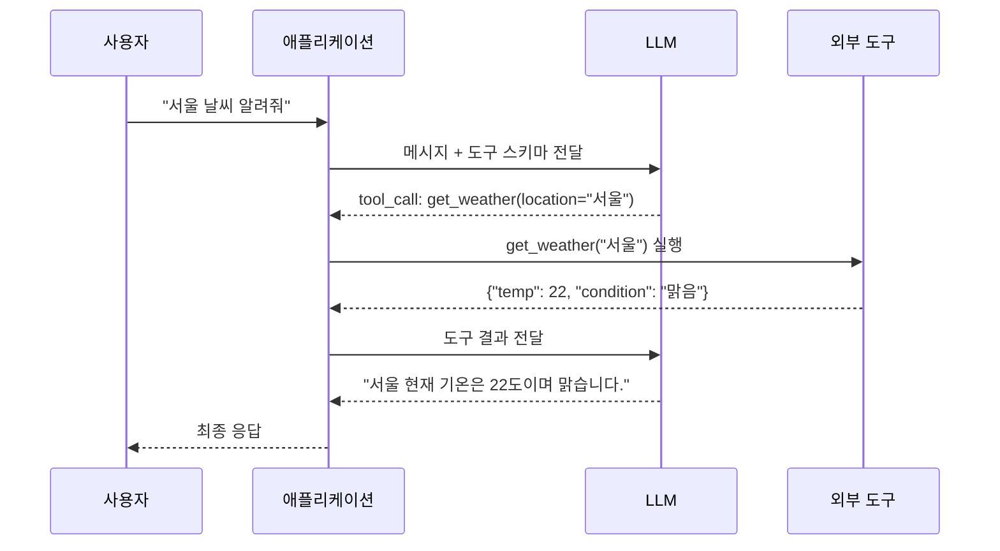
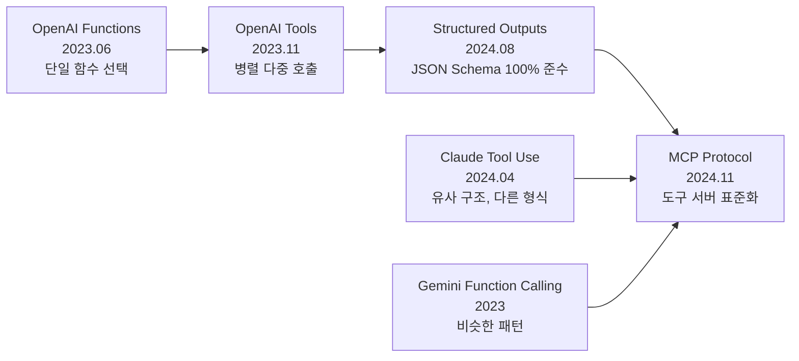
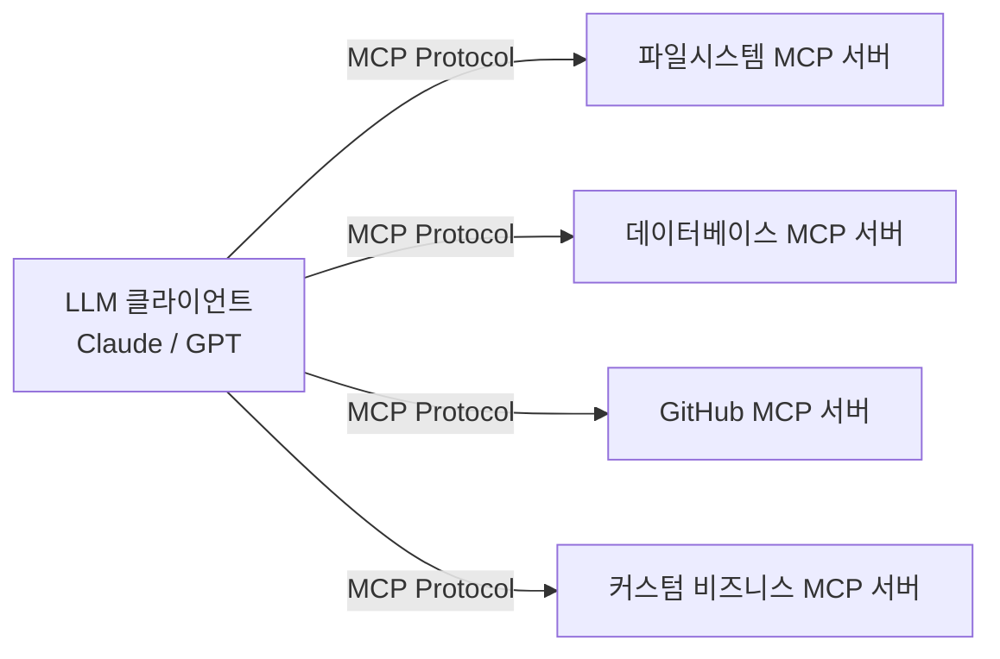

# 함수 호출 (Function Calling)

함수 호출(Function Calling)은 LLM(Large Language Model)이 자연어 이해 능력을 외부 도구 실행과 연결하는 메커니즘이다. 모델이 응답 텍스트 대신 구조화된 함수 호출 요청을 생성하면, 애플리케이션 레이어가 이를 실행하고 결과를 다시 모델에 전달한다.

2023년 OpenAI Functions API 도입 이후 Claude Tool Use, Gemini Function Calling 등으로 확산됐으며, 2024~2025년에는 OpenAI Tool Use, 구조화 출력(Structured Outputs), MCP(Model Context Protocol)로 진화했다.

## 왜 중요한가

LLM만으로는 할 수 없는 것들을 가능하게 한다:
- **실시간 데이터 접근**: 날씨, 주가, DB 쿼리 등
- **외부 시스템 조작**: 이메일 전송, 파일 생성, API 호출
- **계산 정확성**: 수식을 직접 "계산"하는 대신 코드 실행에 위임
- **구조화 출력**: JSON, XML 등 정형 데이터 반환 보장

함수 호출은 [[function-call-evolution]]과 [[agent-as-tool-pattern]]의 근간이 되는 기본 메커니즘이다.

---

## 작동 원리



핵심은 LLM이 직접 도구를 실행하지 않는다는 점이다. LLM은 "무엇을 어떻게 호출할지"를 결정하고, 실제 실행은 애플리케이션 레이어에서 이루어진다.

---

## 진화 과정



### OpenAI Functions (2023.06) - 시작점

최초 구현. 모델이 `function_call` 필드로 단일 함수 이름과 인수를 반환한다. `functions` 파라미터로 스키마를 전달하는 방식이었으며, 현재는 deprecated.

### OpenAI Tools (2023.11) - 병렬 호출

`tools` 파라미터로 변경, **병렬 도구 호출(parallel tool calls)** 지원. 한 번의 응답에 여러 도구를 동시에 호출할 수 있다.

### Structured Outputs (2024.08) - 출력 보장

JSON Schema를 100% 준수하는 응답을 보장한다. 함수 인수뿐 아니라 일반 응답 형식에도 적용 가능하다.

### MCP (Model Context Protocol, 2024.11)

Anthropic이 주도한 개방형 표준. 도구 서버(MCP Server)와 클라이언트(LLM) 간 통신 프로토콜을 표준화해 에코시스템을 형성한다.

---

## JSON Schema 기반 도구 정의

함수 호출의 핵심은 **JSON Schema**로 도구의 입력 형식을 정의하는 것이다. LLM은 이 스키마를 보고 올바른 인수를 생성한다.

```python
# OpenAI Tools API 예시
tools = [
    {
        "type": "function",
        "function": {
            "name": "search_database",
            "description": "제품 데이터베이스에서 검색. 재고, 가격, 스펙 조회 가능",
            "parameters": {
                "type": "object",
                "properties": {
                    "query": {
                        "type": "string",
                        "description": "검색어 (제품명, 카테고리 등)"
                    },
                    "max_results": {
                        "type": "integer",
                        "description": "반환할 최대 결과 수",
                        "default": 10,
                        "minimum": 1,
                        "maximum": 100
                    },
                    "category": {
                        "type": "string",
                        "enum": ["전자제품", "의류", "식품", "가구"],
                        "description": "필터링할 카테고리 (선택사항)"
                    }
                },
                "required": ["query"]
            }
        }
    }
]
```

### 스키마 설계 모범 사례

```python
# 좋은 스키마 - 명확한 description, 타입 제약, 예시 포함
good_schema = {
    "name": "send_email",
    "description": "지정된 수신자에게 이메일을 전송합니다. "
                   "중요: HTML 형식은 지원하지 않으며 plain text만 허용됩니다.",
    "parameters": {
        "type": "object",
        "properties": {
            "to": {
                "type": "array",
                "items": {"type": "string", "format": "email"},
                "description": "수신자 이메일 주소 목록 (예: ['user@example.com'])"
            },
            "subject": {
                "type": "string",
                "maxLength": 998,  # RFC 5321 제한
                "description": "이메일 제목"
            },
            "body": {
                "type": "string",
                "description": "이메일 본문 (plain text)"
            }
        },
        "required": ["to", "subject", "body"],
        "additionalProperties": False  # 구조화 출력에서 필수
    }
}
```

---

## 제공사별 구현 비교

| 특성 | OpenAI | Anthropic Claude | Google Gemini |
|------|--------|-------------------|----------------|
| 파라미터 키 | `tools` | `tools` | `tools` |
| 결과 전달 | `tool` role 메시지 | `tool_result` content | `functionResponse` |
| 병렬 호출 | 지원 | 지원 | 지원 |
| 강제 호출 | `tool_choice: required` | `tool_choice: {"type": "tool"}` | `tool_config` |
| 구조화 출력 | `response_format: json_schema` | 내장 JSON 모드 | `response_mime_type` |
| MCP 지원 | 미지원(2025 기준) | 공식 지원 | 미지원(계획 중) |

### Anthropic Claude 도구 형식

```python
import anthropic

client = anthropic.Anthropic()

response = client.messages.create(
    model="claude-opus-4-5",
    max_tokens=1024,
    tools=[
        {
            "name": "get_stock_price",
            "description": "주식 현재가 조회",
            "input_schema": {
                "type": "object",
                "properties": {
                    "ticker": {
                        "type": "string",
                        "description": "주식 티커 심볼 (예: AAPL, TSLA)"
                    }
                },
                "required": ["ticker"]
            }
        }
    ],
    messages=[{"role": "user", "content": "애플 주식 현재가 알려줘"}]
)

# 도구 호출 응답 처리
for block in response.content:
    if block.type == "tool_use":
        print(f"호출: {block.name}({block.input})")
```

---

## 전체 함수 호출 루프 구현

```python
import json
import openai

client = openai.OpenAI()

def get_weather(location: str) -> dict:
    """실제 날씨 API 호출 대신 목 데이터 반환."""
    return {"location": location, "temperature": 22, "condition": "맑음"}

def run_agent_loop(user_message: str, tools: list) -> str:
    """도구 호출 루프 실행."""
    messages = [{"role": "user", "content": user_message}]
    tool_map = {"get_weather": get_weather}
    
    while True:
        response = client.chat.completions.create(
            model="gpt-4o",
            messages=messages,
            tools=tools,
            tool_choice="auto"
        )
        
        choice = response.choices[0]
        messages.append({"role": "assistant", "content": choice.message.content,
                         "tool_calls": choice.message.tool_calls})
        
        # 도구 호출 없으면 최종 응답
        if not choice.message.tool_calls:
            return choice.message.content
        
        # 병렬 도구 호출 처리
        for tool_call in choice.message.tool_calls:
            func_name = tool_call.function.name
            func_args = json.loads(tool_call.function.arguments)
            
            result = tool_map[func_name](**func_args)
            
            messages.append({
                "role": "tool",
                "tool_call_id": tool_call.id,
                "content": json.dumps(result, ensure_ascii=False)
            })
```

---

## 구조화 출력 (Structured Outputs)

도구 호출과 독립적으로, 모델의 일반 텍스트 응답 자체를 특정 JSON 스키마에 맞게 강제하는 기능이다.

```python
from pydantic import BaseModel
from openai import OpenAI

client = OpenAI()

class ProductAnalysis(BaseModel):
    product_name: str
    sentiment: str  # "positive" | "negative" | "neutral"
    key_features: list[str]
    rating_estimate: float
    summary: str

response = client.beta.chat.completions.parse(
    model="gpt-4o-2024-08-06",
    messages=[
        {"role": "user",
         "content": "아이폰 15 프로 리뷰: 카메라가 정말 훌륭하고 배터리도 오래갑니다. 다만 가격이 너무 비쌉니다."}
    ],
    response_format=ProductAnalysis,
)

analysis = response.choices[0].message.parsed
print(f"제품: {analysis.product_name}")
print(f"감성: {analysis.sentiment}")
print(f"주요 특성: {analysis.key_features}")
```

---

## MCP (Model Context Protocol)

[[function-calling-tool-use]]의 확장으로, MCP는 도구 정의와 실행을 분리해 표준화한다. 도구 서버(MCP Server)가 도구를 정의하고 실행하며, LLM 클라이언트는 표준 프로토콜로 통신한다.



MCP의 핵심 이점:
- 한 번 만든 MCP 서버를 모든 MCP 호환 LLM에서 사용 가능
- 도구 서버를 독립적으로 배포/업데이트 가능
- 인증, 로깅, 권한 관리를 서버 레이어에서 통합 처리

---

## 도구 설계 모범 사례

### 단일 책임 원칙

```python
# 나쁜 예: 너무 많은 책임
bad_tool = {
    "name": "database_operations",
    "description": "DB 조회, 삽입, 수정, 삭제 모두 처리",
    # LLM이 의도를 잘못 해석할 가능성 높음
}

# 좋은 예: 명확히 분리된 도구
good_tools = [
    {"name": "query_database",  "description": "데이터 조회 (읽기 전용)"},
    {"name": "insert_record",   "description": "새 레코드 삽입"},
    {"name": "update_record",   "description": "기존 레코드 수정"},
    {"name": "delete_record",   "description": "레코드 삭제 (취소 불가)"},
]
```

### 부작용 표시 원칙

```python
# 취소 불가능한 작업은 명시적으로 경고
destructive_tool = {
    "name": "send_email_to_all_users",
    "description": "⚠️ 취소 불가: 전체 사용자에게 마케팅 이메일 발송. "
                   "호출 전 반드시 사용자 확인을 받으세요.",
    "parameters": {
        "type": "object",
        "properties": {
            "subject": {"type": "string"},
            "body": {"type": "string"},
            "confirmed": {
                "type": "boolean",
                "description": "사용자가 명시적으로 동의했는지 여부"
            }
        },
        "required": ["subject", "body", "confirmed"]
    }
}
```

---

## 보안 고려사항

함수 호출은 LLM에게 실제 시스템 접근 권한을 부여하므로 보안이 중요하다:

1. **최소 권한 원칙**: 도구가 필요한 최소한의 권한만 가져야 함
2. **입력 검증**: LLM이 생성한 인수를 그대로 실행하지 말고 반드시 검증
3. **프롬프트 인젝션 방어**: 외부 데이터(사용자 이메일, 웹페이지 등)에 악의적인 도구 호출 지시가 숨겨질 수 있음
4. **실행 확인**: 파괴적 작업(이메일 전송, 삭제 등)은 사용자 확인 후 실행

---

## [[tool-creator-meta-agent]]와의 관계

메타 에이전트(meta-agent)는 실행 시점에 도구를 동적으로 생성하거나 기존 도구를 조합해 새 도구를 만드는 패턴이다. 이는 정적으로 정의된 함수 호출 스키마의 한계를 넘어선다.

---

## 관련 문서

- [[function-call-evolution]] - 함수 호출 메커니즘의 역사적 진화 상세
- [[function-calling-tool-use]] - Tool Use 패턴 구현 심화
- [[tool-creator-meta-agent]] - 도구를 동적으로 생성하는 메타 에이전트
- [[agent-as-tool-pattern]] - 에이전트를 도구로 중첩하는 구조
- [[agentic-engineering]] - 에이전트 엔지니어링 전반 가이드
