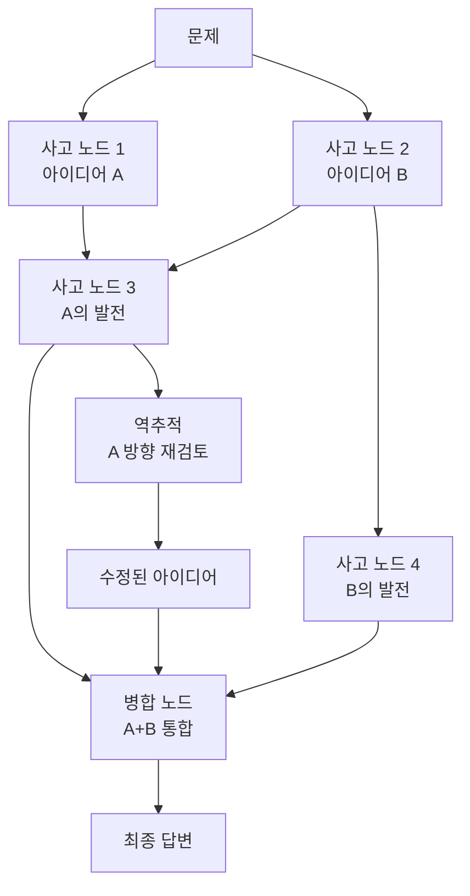
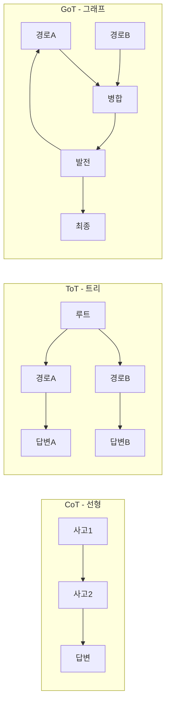

# Graph of Thoughts (GoT)

## 개념 정의

Graph of Thoughts(GoT)는 Besta et al.(2023)이 제안한 프레임워크로, LLM의 사고 과정을 방향성 비순환 그래프(DAG, Directed Acyclic Graph)로 모델링한다. [[chain-of-thought]] (CoT)의 선형 구조, [[tree-of-thought]] (ToT)의 트리 구조를 넘어, 사고 노드들이 **병합(aggregation)**, **분기(splitting)**, **역추적(backtracking)**을 자유롭게 수행할 수 있는 비선형 추론을 가능하게 한다.

GoT는 특히 여러 독립 추론 경로의 결과를 합산하거나 교차 검증해야 하는 복잡한 문제에서 강점을 발휘한다.



사고 노드들이 선형이나 트리가 아닌 그래프 형태로 연결되어, 병합과 역추적이 가능한 구조를 보여준다.

## CoT / ToT / GoT 비교



| 속성 | CoT | ToT | GoT |
|------|-----|-----|-----|
| 구조 | 선형 시퀀스 | 트리 (분기만) | 그래프 (분기+병합+역추적) |
| 병합 | 불가 | 불가 | 가능 |
| 역추적 | 불가 | 제한적 | 가능 |
| 표현력 | 낮음 | 중간 | 높음 |
| 구현 복잡도 | 낮음 | 중간 | 높음 |

## 핵심 연산자

GoT는 세 가지 기본 연산자로 구성된다:

### 1. 생성(Generate)
현재 사고 노드에서 새로운 후보 사고를 생성한다. CoT의 다음 단계 또는 ToT의 분기와 동일한 역할.

```
입력 사고: "정렬 알고리즘을 최적화해야 한다"
생성 결과: ["퀵소트 분기 전략 개선", "캐시 지역성 활용", "병렬화 도입"]
```

### 2. 평가/스코어(Score)
각 사고 노드의 유망도를 평가한다. LLM 자기 평가 또는 외부 평가 함수 사용.

```python
def score_thought(thought: str, problem: str, llm) -> float:
    """사고 노드의 유망도 0.0~1.0 평가"""
    prompt = f"""
문제: {problem}
현재 사고: {thought}

이 사고가 최종 답변으로 이어질 가능성을 0~10으로 평가하고 이유를 설명하라.
점수:"""
    response = llm.generate(prompt)
    return extract_score(response) / 10.0
```

### 3. 집계(Aggregate)
여러 사고 노드를 병합하여 새로운 통합 사고를 생성한다. GoT의 핵심 차별점.

```python
def aggregate_thoughts(thoughts: list[str], problem: str, llm) -> str:
    """여러 독립 사고를 하나로 통합"""
    thoughts_text = "\n".join(f"- {t}" for t in thoughts)
    prompt = f"""
문제: {problem}

다음 여러 관점의 부분 해결책을 하나의 통합된 접근으로 병합하라:
{thoughts_text}

통합된 해결책:"""
    return llm.generate(prompt)
```

## GoT 실행 예시: 문서 정렬 문제

긴 문서의 핵심 문장들을 논리적 순서로 배열하는 문제:

```
1단계 - 독립 분류 (병렬 분기):
   노드A: 도입부 문장 식별
   노드B: 결론 문장 식별
   노드C: 중간 논거 문장 식별

2단계 - 병합:
   노드D: A + B + C를 통합한 전체 구조 파악

3단계 - 세부 정렬 (재분기):
   노드E: 도입부 내 순서
   노드F: 본론 내 순서

4단계 - 역추적 및 수정:
   노드E에서 논리 모순 발견 -> 노드D로 역추적
   노드D 수정 후 재분기

5단계 - 최종 병합:
   전체 정렬된 순서 생성
```

## 구현 스케치

```python
from dataclasses import dataclass, field
from typing import List, Optional

@dataclass
class ThoughtNode:
    content: str
    score: float = 0.0
    parents: List["ThoughtNode"] = field(default_factory=list)
    children: List["ThoughtNode"] = field(default_factory=list)
    node_type: str = "generate"  # "generate", "aggregate", "backtrack"

class GraphOfThoughts:
    def __init__(self, llm, max_nodes: int = 20, branch_factor: int = 3):
        self.llm = llm
        self.max_nodes = max_nodes
        self.branch_factor = branch_factor
        self.nodes: List[ThoughtNode] = []

    def solve(self, problem: str) -> str:
        root = ThoughtNode(content=problem)
        self.nodes.append(root)
        frontier = [root]

        while len(self.nodes) < self.max_nodes and frontier:
            # 1. 가장 유망한 노드 선택
            current = max(frontier, key=lambda n: n.score)
            frontier.remove(current)

            # 2. 새 사고 생성 (분기)
            new_thoughts = self._generate(current, problem)

            # 3. 병합 기회 탐색
            if len(self.nodes) > 3:
                merged = self._aggregate(new_thoughts[:2], problem)
                if merged:
                    self.nodes.append(merged)
                    frontier.append(merged)

            # 4. 점수화 및 역추적
            for node in new_thoughts:
                node.score = self._score(node, problem)
                if node.score < 0.3 and current.parents:
                    # 역추적: 상위 노드로 돌아가 재탐색
                    frontier.append(current.parents[0])
                else:
                    frontier.append(node)
                    self.nodes.append(node)

        # 최고 점수 노드에서 최종 답변 생성
        best = max(self.nodes, key=lambda n: n.score)
        return self._finalize(best, problem)

    def _generate(self, node: ThoughtNode, problem: str) -> List[ThoughtNode]:
        prompt = f"문제: {problem}\n현재: {node.content}\n다음 {self.branch_factor}가지 접근:"
        raw = self.llm.generate(prompt)
        thoughts = parse_list(raw)
        children = [ThoughtNode(content=t, parents=[node]) for t in thoughts]
        node.children.extend(children)
        return children

    def _aggregate(self, nodes: List[ThoughtNode], problem: str) -> Optional[ThoughtNode]:
        if len(nodes) < 2:
            return None
        contents = [n.content for n in nodes]
        aggregated = aggregate_thoughts(contents, problem, self.llm)
        node = ThoughtNode(content=aggregated, parents=nodes, node_type="aggregate")
        for parent in nodes:
            parent.children.append(node)
        return node

    def _score(self, node: ThoughtNode, problem: str) -> float:
        return score_thought(node.content, problem, self.llm)

    def _finalize(self, node: ThoughtNode, problem: str) -> str:
        return self.llm.generate(f"문제: {problem}\n최선 사고: {node.content}\n최종 답변:")
```

## 적용 시 주의사항

### 그래프 복잡도 폭발
노드 수와 엣지 수가 제한 없이 증가하면 메모리와 연산 비용이 급격히 오른다. 최대 노드 수, 최대 깊이, 최소 점수 임계값으로 가지치기를 반드시 구현해야 한다.

### LLM 자기 평가의 한계
Score 연산자가 LLM 자기 평가에 의존하면 편향이 발생한다. 외부 검증자(코드 실행, 수식 계산기, 사실 검색)를 병합하면 정확도가 향상된다.

### 병합 품질
집계(Aggregate) 연산자가 여러 사고를 단순 나열하거나 모순된 아이디어를 충돌 없이 합치는 실수를 할 수 있다. 병합 프롬프트에 "충돌 확인 및 해결" 지시를 포함해야 한다.

### 역추적 설계
역추적이 너무 자주 발생하면 탐색이 수렴하지 않는다. 역추적 깊이 제한(최대 2단계)과 방문 노드 캐시로 순환을 방지한다.

### 실시간 응용 부적합
GoT는 많은 LLM 호출을 필요로 하므로 응답 시간이 수 분이 될 수 있다. 배치 처리나 오프라인 추론에 적합하며, 실시간 챗봇에는 부적합하다.

## 관련 문서

- [[chain-of-thought]] - 선형 추론 기법
- [[tree-of-thought]] - 트리 구조 탐색 (GoT의 선행 패턴)
- [[xot-explorer-of-thought]] - MCTS 기반 외부 탐색
- [[forest-of-thought]] - 다중 트리 앙상블
- [[mcts-llm-reasoning]] - MCTS와 LLM 추론 통합
- [[cumulative-reasoning]] - 누적 명제 기반 추론
- [[self-consistency-decoding]] - 다수결 앙상블 추론
- [[agent-planning-strategies]] - 에이전트 계획 전략 개요
