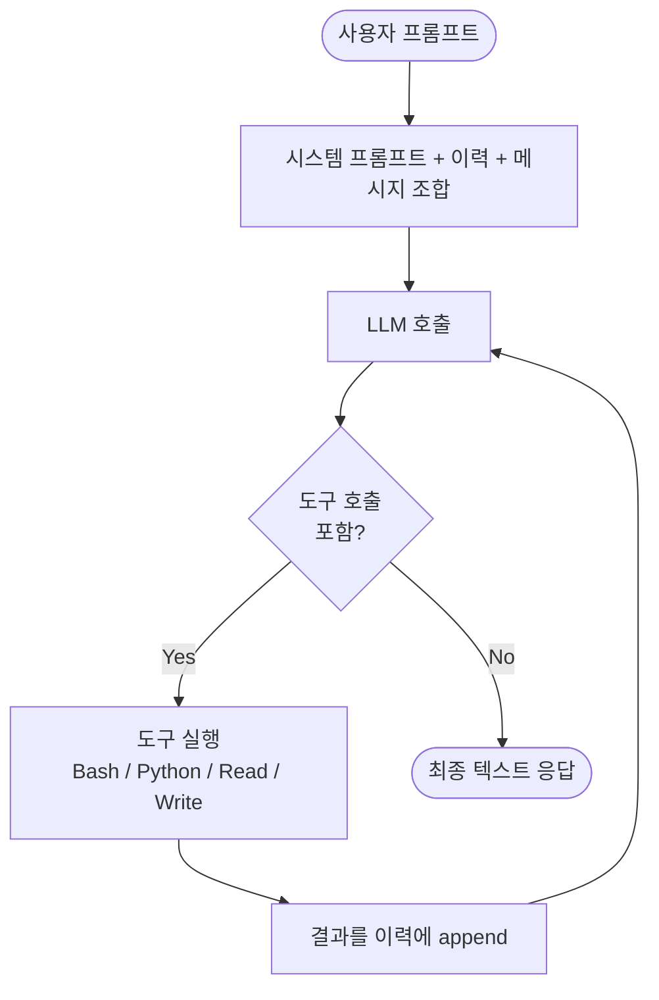

# How Coding Agents Work

Simon Willison이 [[agentic engineering guide]] Section 2에서 설명하는 코딩 에이전트의 내부 구조.

> "A coding agent functions as a harness for an LLM, extending language models with additional capabilities through invisible prompts and callable tools."

## 1. Large Language Models

- **LLM**은 토큰 시퀀스를 완성하는 ML 모델
- **토큰** = 텍스트의 정수 표현 (단어가 아님)
- 공급사는 토큰 수 기준으로 과금 → 비용 계산에 중요
- **프롬프트(prompt)** = 입력, **완성/응답(completion/response)** = 출력
- 다수의 현대 모델은 **multimodal** (이미지 + 텍스트)

## 2. Chat Templated Prompts

초기 LLM은 completion 엔진이었지만, 대부분 chat 형식으로 전환:

```
user: write a python function to download a file from a URL
assistant:
```

LLM은 **stateless**이다. 따라서:
- 소프트웨어가 대화 상태를 유지
- 매 프롬프트마다 전체 이력을 리플레이
- 대화가 길어질수록 비용 상승

## 3. Token Caching

공급사는 **캐시된 입력 토큰**에 저렴한 요금을 제공한다:
- 최근 처리된 공통 프리픽스는 계산 결과를 재사용
- 코딩 에이전트는 이전 대화 내용을 **수정하지 않도록** 설계됨 → 캐시 효율 극대화

이는 왜 에이전트가 중간 메시지를 되돌리지 않고 append-only로 동작하는지를 설명한다.

## 4. Calling Tools

에이전트의 핵심 특징 = **도구 호출**:

1. 하네스는 사용 가능한 도구 정의를 프롬프트에 포함
2. LLM이 응답에 도구 호출을 포함
3. 하네스가 호출을 파싱해서 실행
4. 결과를 다시 LLM에 전달
5. 반복

가장 강력한 도구들:
- `Bash()` — 터미널 명령 실행
- `Python()` — 파이썬 코드 실행
- 파일 Read/Write/Edit
- 웹 fetch

## 5. The System Prompt

코딩 에이전트는 긴 **시스템 프롬프트**로 시작한다:
- 행동 지침
- 사용 가능한 도구 정의
- 사용자에게는 숨겨져 있음

## 6. Reasoning (Thinking)

2025년에 등장한 발전: **reasoning** 또는 "thinking" 모드.
- 응답 전 중간 문제 해결 텍스트를 생성
- 복잡한 문제에 더 많은 토큰 지출 가능
- **디버깅**에 특히 유용

## 7. 구현

> "The fundamental mechanics require an LLM, system prompt, tools, and a loop — achievable in dozens of lines of code, though production-quality implementations require considerably more work."

핵심 루프:
```
while not done:
    response = llm(system_prompt + history + user_message, tools)
    if response.tool_calls:
        for call in response.tool_calls:
            result = execute(call)
            history.append(result)
    else:
        return response.text
```

시각화하면 에이전트 루프는 다음과 같다:



도구 호출이 없는 응답이 나올 때까지 루프가 계속 돈다. 이 단순한 구조가 코딩 에이전트의 근간이다.

수십 줄로 프로토타입 가능. 프로덕션은 토큰 관리, 에러 처리, 컨텍스트 압축, 병렬 도구 호출 등으로 훨씬 복잡하다.

## 실무적 함의

- **컨텍스트 관리가 비용의 핵심** — 긴 대화는 비싸므로 [[subagents]] 패턴으로 분리
- **캐시 친화적 행동** — 과거를 재작성하지 말고 새 메시지를 append
- **도구가 곧 능력** — 좋은 코딩 에이전트는 좋은 도구 세트에서 나온다
- **Reasoning은 트레이드오프** — 복잡한 문제에는 켜고, 단순 작업에는 끄는 것이 비용 효율적

## 관련 문서

- [[coding agent]]
- [[agentic engineering]]
- [[subagents]]
- [[agentic engineering guide]]
