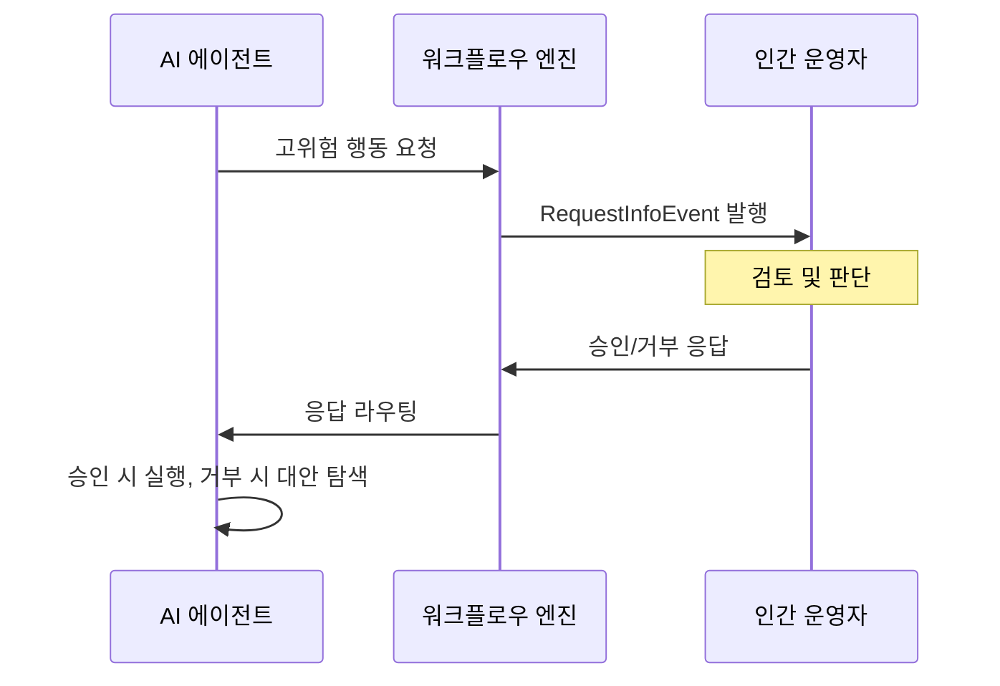

## 개요

Human-in-the-Loop(HITL) 승인 패턴은 [[agentic-ai-foundation|AI 에이전트]]가 고위험 행동을 실행하기 전에 인간의 명시적 승인을 요구하는 설계 패턴이다. 에이전트의 자율성이 높아질수록 잘못된 판단이 초래하는 위험도 커지기 때문에 [[zero-trust-ai-agents|제로 트러스트]] 원칙과 함께 적용해야 하며, 프로덕션 환경에서는 적절한 인간 개입 지점을 설계하는 것이 필수다. [[agentic-ai-production|에이전틱 AI 프로덕션]] 패턴과 함께 시스템 안전성을 확보한다. Control Gate, Circuit Breaker, Calibrated Autonomy 등 5가지 주요 패턴이 실무에서 활용된다.

## 핵심 개념

### 5가지 프로덕션 패턴

1. **Control Gate**: 특정 행동(결제, 삭제, 외부 API 호출 등) 실행 전 반드시 인간 승인을 거치는 관문. 가장 기본적이고 엄격한 패턴
2. **Circuit Breaker**: 에이전트가 연속 실패하거나 비정상 패턴을 보이면 자동으로 실행을 중단하고 인간에게 제어를 넘기는 안전장치
3. **Calibrated Autonomy**: 행동의 위험도에 따라 자율 실행/알림/승인 대기를 동적으로 결정. 저위험 행동은 자율, 고위험 행동은 승인 필요
4. **Escalation Chain**: 에이전트 -> 시니어 에이전트 -> 인간 순으로 의사결정을 단계적으로 상향 위임
5. **Checkpoint Review**: 일정 단계마다 중간 결과를 인간에게 보고하고 진행 여부를 확인받는 패턴

### Request-Response 메커니즘

Microsoft Agent Framework의 구현 예시에서 HITL은 `RequestPort` 패턴으로 구현된다:

## 기술 상세

### Tool Approval 패턴

에이전트 오케스트레이션에서 특정 도구에 인간 승인을 요구하는 방식이 가장 실용적이다. 에이전트가 승인 필요 도구를 호출하면 워크플로우가 일시 중단되고, `ToolApprovalRequestContent` 이벤트가 발생하여 인간이 승인/거부할 수 있다.

### 체크포인트와 결합

HITL 요청은 워크플로우 체크포인트에 함께 저장된다. 시스템 재시작이나 장애 복구 시에도 대기 중인 승인 요청이 유실되지 않고 재발행(re-emit)되므로, 장시간 실행되는 에이전트 워크플로우에서도 안전하다.

### 구현 패턴 유형

실무에서 활용되는 4가지 HITL 구현 패턴:

**1. Interrupt & Resume**
- 에이전트 실행 중 `interrupt()` 호출로 일시 중단하고 인간 응답 후 재개
- 도구 호출 승인, 장기 실행 워크플로우 일시 정지, 사전 행동 체크포인트에 적합
- LangGraph에서 네이티브 지원

**2. Human-as-a-Tool**
- 에이전트가 인간을 호출 가능한 도구로 취급하여 안내/판단을 요청
- 모호한 프롬프트 해소, 사실 확인, 맥락적 명확화에 활용
- LangChain, CrewAI(`HumanTool`), HumanLayer(`human_as_tool()`)에서 지원

**3. Approval Flow**
- 특정 역할(예: "Reviewer")만 승인 권한을 보유하고, 에이전트는 요청만 발행
- 정책 엔진에 승인 로직을 위임하여 선언적이고 버저닝 가능한 관리
- Permit.io, ReBAC 시스템에서 지원

**4. Fallback Escalation**
- 에이전트가 태스크 시도 후 실패하거나 권한이 부족하면 인간에게 에스컬레이션
- 우아한 성능 저하, 복잡한 쿼리, 낮은 신뢰도 결정에 활용

### 설계 원칙

- **기본값은 제한적 자율성**: 새 도구나 행동은 기본적으로 승인 필요로 시작하고, 신뢰도가 축적되면 자율로 전환
- **비동기 승인 지원**: 인간이 즉시 응답하지 못하는 상황을 고려하여 Slack, 이메일, 대시보드 등 비동기 채널로 라우팅하여 인간 병목 최소화
- **감사 로그 필수**: 모든 승인/거부 결정과 그 이유를 기록하여 SOC 2 정책, 감사 요건, 내부 거버넌스를 충족하고 추후 정책 개선에 활용
- **위험 점수 기반 라우팅**: 행동의 영향 범위, 되돌림 가능 여부, 비용 등을 종합하여 자동으로 승인 레벨 결정
- **정책 주도 접근**: 규칙을 하드코딩하지 않고 정책 엔진에 위임하여 선언적, 버저닝 가능, 강제 가능한 구조 구축
- **맥락적 승인 요청**: 리뷰어에게 필요한 최소한의 맥락을 명확히 전달하되, 원시 데이터로 압도하지 않기

### 구현 프레임워크 지원

| 프레임워크 | HITL 지원 방식 | 핵심 메커니즘 |
|-----------|--------------|-------------|
| Microsoft Agent Framework | RequestPort + WorkflowBuilder | `RequestInfoEvent`, `ToolApprovalRequestContent` |
| LangGraph | interrupt_before / human_node | `interrupt()` 함수, 그래프 기반 라우팅 |
| CrewAI | 역할 기반 멀티에이전트 | `human_input` 플래그, `HumanTool` |
| HumanLayer | SDK/API 기반 멀티채널 | `@require_approval()` 데코레이터, `human_as_tool()` |
| Temporal | Signal + Activity 패턴 | 시그널 기반 비동기 인간 입력 |
| Mastra | Human-in-the-loop step | 워크플로우 단계별 인간 개입 |
| Permit.io + MCP | 인가 서비스 레이어 | 접근 요청 + 위임 승인 UI/API |

### HITL은 임시 해결책이 아니다

HITL 패턴은 에이전트 기술이 미성숙해서 필요한 임시 조치가 아니라, 책임 있는 에이전트 배포의 **기본 설계 패턴**이다. AI를 "블랙박스"가 아닌 "감독받는 어시스턴트"로 만들어, 모든 행동에 인간 리뷰어/승인자가 존재하는 명확한 책임 체인을 구축한다.

## 관련 문서

- [[evolution-of-agentic-patterns]] - 에이전트 패턴의 진화
- [[ai-agent-guardrails]] - 에이전트 가드레일 시스템
- [[orchestrator-worker-pattern]] - 오케스트레이터-워커 패턴
- [[tool-calling-optimization]] - 도구 호출 최적화
