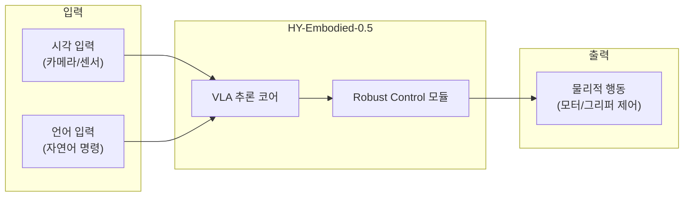

# HY-Embodied-0.5

## 개요

HY-Embodied-0.5는 Tencent Robotics X 연구소에서 발표한 임바디드 에이전트(embodied agent)용 파운데이션 모델이다. **22개 임바디드 벤치마크 중 16개에서 SOTA 성능**을 달성하여 범용 임바디드 파운데이션 모델의 가능성을 입증했다.

VLA(Vision-Language-Action) 모델 분야에서 NVIDIA GR00T, Google RT-X, Meta Ego4D 등과 경쟁하는 주요 플레이어다.

## 핵심 성과

- **22개 임바디드 벤치마크 중 16개**에서 리딩 성능(SOTA)
- 실제 로봇 태스크에서 **robust control** 검증 완료
- **범용 임바디드 에이전트** 파운데이션 모델로서의 범용성 입증

## 기술 스택

위 다이어그램은 HY-Embodied-0.5의 VLA 추론 파이프라인을 보여준다. 시각과 언어 입력을 VLA 코어에서 통합 추론하고, robust control 모듈을 거쳐 물리적 행동으로 출력한다.

## 벤치마크 현황

| 항목 | 수치 |
|------|------|
| 평가 벤치마크 | 22개 |
| SOTA 달성 | 16개 (72.7%) |
| 실제 로봇 태스크 검증 | 완료 |

## 시장 맥락

| 플레이어 | 모델 | 특징 |
|----------|------|------|
| **Tencent Robotics X** | **HY-Embodied-0.5** | **22개 중 16개 SOTA** |
| NVIDIA | Isaac GR00T | 오픈 VLA, Physical AI 생태계 |
| Google | RT-X | 범용 로보틱스 |
| Meta | Ego4D | 1인칭 시점 데이터 |

2026년은 임바디드 AI가 데모에서 실제 배포로 전환되는 과도기다. HY-Embodied-0.5는 벤치마크 성능에서 압도적이지만, 실제 공장/물류 환경에서의 장기 운영 신뢰성은 아직 검증이 필요한 단계다.

Tencent이 로보틱스 전문 연구소(Robotics X)를 운영하며 파운데이션 모델 레벨에서 경쟁하고 있다는 점은, 중국 빅테크의 Physical AI 투자 규모를 보여주는 지표다.

## 관련 문서

- [[nvidia-isaac-groot]] -- NVIDIA의 Isaac GR00T VLA 파운데이션 모델
- [[ami-labs]] -- LeCun의 JEPA 기반 월드 모델 벤처
- [[ai-robotics-physical-ai]] -- Physical AI 및 로보틱스 시장 전반
