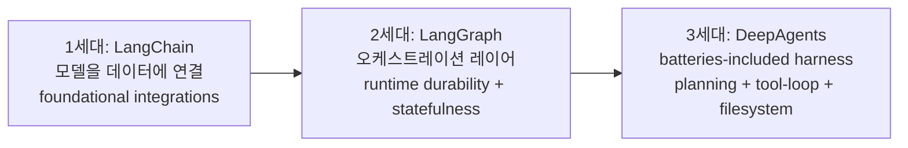

# On Agent Frameworks and Agent Observability (Harrison Chase 2026-02)

Harrison Chase(LangChain CEO)의 "In the Loop" 시리즈 글. 에이전트 프레임워크의 진화와 observability의 위치를 정리.

## 프레임워크 진화 3세대

### 1세대: LangChain
모델을 데이터에 연결하는 foundational 통합.

### 2세대: LangGraph
오케스트레이션 레이어, runtime durability + statefulness.

### 3세대: DeepAgents
"batteries-included agent harness", planning + tool-calling loops + filesystem context management.

> "Agent patterns have moved from chaining to workflow orchestration to **tool-calling-in-a-loop**."

## 프레임워크가 여전히 필요한 이유

LLM이 발전해도 프레임워크는 필요: 에이전트는 **"a system around the model"**.

- 모델 능력 향상에 맞춰 프레임워크도 진화해야
- 도태되는 게 아니라 함께 발전

## LangSmith의 독립적 디자인 철학

- LangSmith는 의도적으로 특정 OSS 프레임워크에서 분리됨
- **Vercel이 다양한 프론트엔드 솔루션을 지원하는 방식**에서 영감
- 통합 지원: AutoGen, CrewAI, OpenAI Agents 등 + OpenTelemetry-based tracing

## Agent Observability 핵심 원칙

> "**Agent app logic is documented in traces, not code.**"

- 트레이스 = 에이전트 행동의 critical 문서
- 비결정적 시스템에서는 코드만으로 디버깅 불충분
- 디버깅, 테스팅, 모니터링의 기반

## 핵심 메시지

**모델이 강해질수록 오히려 프레임워크가 더 중요해진다** (둘러싸는 시스템이 더 복잡해지므로). LangSmith는 OSS 프레임워크 비종속적 observability 도구로 포지셔닝.

## 메모

- 게시일: 2026-02-12
- 시리즈: "Harrison's In the Loop"

## 관련 문서

- [[langchain]] — LangChain entity
- [[langgraph]] — LangGraph (있다면 후속 보강)
- [[deep-agents]] — DeepAgents
- [[langsmith]] — LangSmith observability
- [[langfuse-observability-summary]] — Langfuse 비교
- [[agent-observability]] — Agent Observability 일반
- [[ai-observability-patterns]] — Observability 패턴
- [[evolution-of-agentic-patterns]] — 에이전트 패턴 진화 연대기
