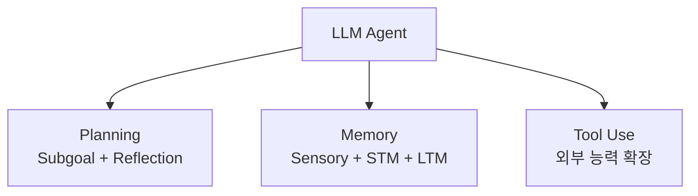
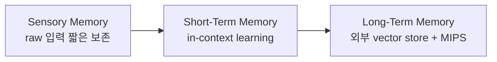

# LLM Powered Autonomous Agents (Lilian Weng 2023-06)

Lilian Weng의 LLM 에이전트 분야 사실상 표준 레퍼런스. AutoGPT, GPT-Engineer, BabyAGI 등 사례를 분석하며 에이전트의 핵심 구성 요소를 체계화한 첫 종합 정리.

## 에이전트 시스템 구조 (3대 컴포넌트)

## 1. Planning (계획)

### Subgoal & Decomposition (하위 목표 + 분해)
- 큰 작업을 관리 가능한 하위 목표로 분해
- 효율적 처리 가능

### Reflection & Refinement (반성·정제)
- 과거 행동에 대한 자기 비판/반성
- 실수에서 학습, 미래 행동 정제

### 기법

| 기법 | 핵심 |
|---|---|
| **Chain of Thought (CoT)** | "think step by step" |
| **Tree of Thoughts (ToT)** | 여러 추론 경로를 BFS/DFS로 탐색 |
| **ReAct** (Yao et al. 2023) | Reasoning + Acting을 thought-action-observation 사이클로 통합 |
| **Reflexion** (Shinn & Labash 2023) | 동적 메모리 + heuristic-based trajectory 평가 |
| **Chain of Hindsight (CoH)** (Liu et al. 2023) | 피드백 시퀀스로 모델 훈련 |
| **Algorithm Distillation (AD)** (Laskin et al. 2023) | 학습 히스토리를 long context로 인코딩 |

## 2. Memory (메모리)

인지과학 기반 분류:

### MIPS 알고리즘 (Maximum Inner Product Search)
- **LSH** (Locality-Sensitive Hashing)
- **ANNOY** (Approximate Nearest Neighbors Oh Yeah)
- **HNSW** (Hierarchical Navigable Small World)
- **FAISS** (Facebook AI Similarity Search)
- **ScaNN** (Scalable Nearest Neighbors)

## 3. Tool Use (도구 사용)

> "Tool use is a remarkable and distinguishing characteristic of human beings."

대표 시스템:

| 시스템 | 핵심 |
|---|---|
| **MRKL** (Karpas et al. 2022) | Modular Reasoning, Knowledge and Language — 전문 모듈 routing |
| **TALM** (Parisi et al. 2022) | Tool Augmented Language Models — 외부 도구로 LM 증강 |
| **Toolformer** (Schick et al. 2023) | self-supervised로 LM이 API 사용 학습 |
| **HuggingGPT** (Shen et al. 2023) | ChatGPT가 task planner, HuggingFace 모델 라우팅 |
| **API-Bank** | 53개 도구 벤치마크 |
| **ChemCrow** (Bran et al. 2023) | 13개 전문 도구로 화학 합성/약물 발견 |

## 사례 연구

### Generative Agents (Park et al. 2023)
- 25개 LLM-controlled 가상 캐릭터
- 메모리 + reflection + planning 메커니즘
- 인간과 같은 사회적 행동 시뮬레이션

### AutoGPT
- 자연어 목표를 자율적으로 분해, 도구 사용으로 달성
- 메모리 외부화 + GPT-4

### GPT-Engineer
- 자연어 설명으로 전체 코드베이스 생성

### BabyAGI
- 작업 생성 + 우선순위 매김 + 실행 루프

## 챌린지

### 1. Finite Context Length (제한된 컨텍스트)
- 역사적 정보, 상세 지침, API 호출 컨텍스트 제한
- 메모리 압축 필요

### 2. Long-Term Planning & Task Decomposition (장기 계획)
- 동적 환경에서 적응 어려움
- 인간보다 trial-and-error에 비효율적

### 3. Reliability of Natural Language Interface (자연어 인터페이스 신뢰성)
- LLM이 형식 지침을 어기거나 반항
- 파싱 실패 → 시스템 오류
- 견고한 출력 후처리 필요

## 메모

- 게시일: 2023-06-23 (31분 분량)
- 본 글은 "LLM Agent" 분야의 사실상 표준 레퍼런스
- 후속: "Why we think CoT works"(2024), "Extrinsic hallucinations"(2024) 등 Lil'Log 시리즈

## 관련 문서

- [[react-pattern]] — ReAct 패턴
- [[reflexion]] — Reflexion 패턴
- [[chain-of-thought]] — CoT 추론
- [[graph-of-thoughts-got]] — Graph of Thoughts (확장)
- [[autogpt-original-agent]] — AutoGPT
- [[babyagi-task-agent]] — BabyAGI
- [[agent-memory-systems]] — 메모리 시스템 일반
- [[agent-planning-strategies]] — 계획 전략 일반
- [[function-calling]] — Tool Use 기반
- [[chip-huyen-agents-summary]] — Chip Huyen의 Agents 가이드 (보완)
