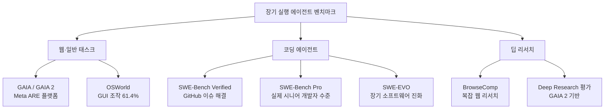
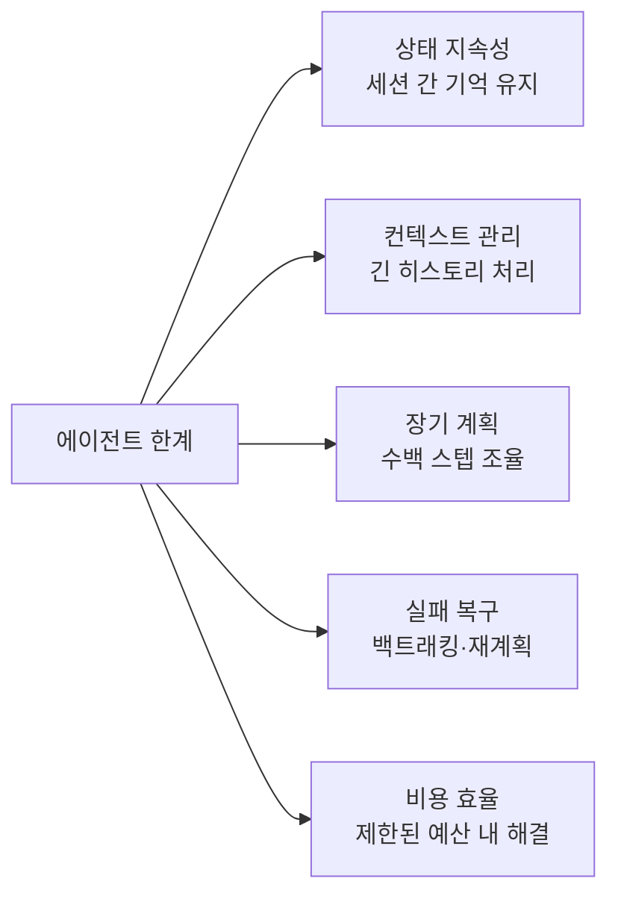

# Long-Horizon Agent Benchmarks (GAIA 2 / SWE-Bench Pro / SWE-EVO)

수십~수백 단계, 수십 파일에 걸친 실세계 과제로 에이전트의 지속 추론·도구 사용·환경 상호작용을 평가하는 벤치마크 세대. 단발성 질문-응답 평가에서 "에이전트가 실제 업무를 얼마나 완수하는가"로 패러다임이 이동했다.

## 왜 중요한가

2025년 9월 Meta의 ARE 플랫폼과 GAIA 2가 시간·예산 제약을 도입했고, SWE-EVO가 GPT-5가 SWE-Bench Verified(65%) 대비 21%만 해결한다는 결과로 장기 실행 갭을 폭로했다. 2026년 1분기 모든 주요 랩(lab)이 평가 프레임워크를 장기 실행 중심으로 재정비 중이다.

## 벤치마크 생태계 개요



## 주요 벤치마크 비교

| 벤치마크 | 평가 대상 | 난이도 특징 | SOTA (2026-04) |
|---------|---------|-----------|---------------|
| SWE-Bench Verified | GitHub 이슈 자동 해결 | 50-200줄 패치 | Claude Opus 4.5: 80.9% |
| SWE-EVO | 장기 소프트웨어 진화 | 다중 파일, 수백 스텝 | GPT-5: 21% |
| GAIA 2 / ARE | 시간·예산 제약 태스크 | 실세계 제약 포함 | 미공개 |
| OSWorld | GUI 조작 에이전트 | 실제 데스크톱 환경 | Claude Sonnet 4.5: 61.4% |
| BrowseComp | 복잡 웹 리서치 | 다단계 검색·종합 | AgentFold 등 |
| **YC-Bench** | 1년 startup 시뮬레이션 | 부분 관찰, 수백 턴, adversarial | Claude Opus 4.6: $1.27M |
| **MLE-Bench** | Kaggle ML 파이프라인 자동화 | end-to-end ML 개발 | AIBuildAI: 63.1% |

## SWE-EVO: 장기 갭 폭로

SWE-EVO(Benchmarking Coding Agents in Long-Horizon Software Evolution)의 핵심 발견:

```
SWE-Bench Verified 성능 vs SWE-EVO 성능 (GPT-5)
- SWE-Bench Verified: 65%
- SWE-EVO: 21%
- 격차: 44%p

이유: SWE-EVO는 단일 이슈 해결이 아닌
      수개월에 걸친 소프트웨어 진화 전체를 시뮬레이션
```

SWE-EVO 태스크는 10-50개 파일이 연관되고, 이전 커밋 히스토리를 이해하며, 다른 모듈에 미치는 영향을 예측해야 한다.

## GAIA 2 / ARE 플랫폼

Meta의 ARE(Agent Runtime Environment) 플랫폼은 GAIA의 확장으로 **실세계 제약**을 도입한다:

- **시간 예산**: 태스크당 최대 실행 시간 제한
- **비용 예산**: API 호출 비용 상한
- **환경 다양성**: 웹 브라우저, 터미널, 파일 시스템 통합

단순히 정답을 맞히는 것이 아니라 **제약 안에서 합리적인 결과**를 내는 능력을 평가한다.

## 평가 지표 진화

| 세대 | 지표 | 한계 |
|------|------|------|
| 1세대 | 정확도(accuracy) | 단일 답변 평가. 과정 무시 |
| 2세대 | 패스율(pass@k) | 여러 시도 중 성공률 |
| 3세대 | 해결율 + 효율 + 비용 | 복합 지표. ARE/GAIA 2 |
| (현재) 장기 진화 | 코드베이스 전반 영향 평가 | SWE-EVO |

## Claude 모델 성능 (2026-04 기준)

- **Claude Opus 4.5**: SWE-bench Verified 80.9%
- **Claude Sonnet 4.5**: OSWorld 61.4%, 30시간+ 연속 포커스 작업 지원

이 수치는 장기 실행 에이전트 훈련([[long-horizon-rl-training-for-agents|Multi-Turn RLVR]])과 직결된다.

## 벤치마크가 밝히는 남은 과제



## YC-Bench: 1년 Startup 시뮬레이션 (2026)

YC-Bench(arXiv 2604.01212)는 기존 코딩/태스크 벤치마크와 다른 차원의 장기 실행 능력을 측정한다.

- **시뮬레이션 규모**: 1년 기간, 수백 턴, $200K 초기 자본
- **핵심 과제**: 직원 관리, 계약 선택, 재정 유지, adversarial client 탐지
- **12개 모델 평가**: 9개(75%)가 초기 자본도 보존 실패
- **주요 발견**: adversarial client 미탐지가 파산의 47%. **Scratchpad 사용이 성공의 최강 예측 변수** — 컨텍스트 절단 너머 정보를 명시적으로 보존하는 전략의 중요성을 실증

자세한 내용: [[ycbench-paper]]

## MLE-Bench: ML 파이프라인 자동화 평가 (2026)

MLE-Bench는 Kaggle 스타일의 현실적 ML 과제로 에이전트의 end-to-end ML 엔지니어링 능력을 측정한다.

- **AIBuildAI 기록**: medal rate **63.1%** (리더보드 1위, 2026-03-18 기준)
- **AIBuildAI 구조**: Manager + Designer + Coder + Tuner 계층적 멀티에이전트
- **평가 범위**: visual, text, time-series, tabular 4가지 모달리티
- **의의**: "AI가 AI를 만든다"는 패러다임을 실제 수치로 검증. 기존 AutoML(HPO/NAS 슬라이스) 대비 전체 파이프라인 자동화

자세한 내용: [[aibuildai-paper]]

## 평가 비용 절감: 효율적 벤치마킹

에이전트 벤치마크는 interactive rollout과 도구 사용으로 인해 단일 LLM 호출 평가 대비 수십~수백 배 비싸다. [[efficient-benchmarking-paper|Efficient Benchmarking of AI Agents (2603.23749)]]는 **IRT(Item Response Theory) 영감 필터**로 이 문제를 해결한다.

핵심 방법: pass rate 30-70% 구간의 중간 난이도 태스크만 선별하면, 전체 태스크의 44-70%를 제거해도 에이전트 간 **순위(rank-order)는 안정적으로 유지**된다. Terminal-Bench 2.0과 HAL 7개 벤치마크, scaffold 33개 이상에서 검증. 단, 절대 점수 예측은 불안정하므로 리더보드 목적에만 적합하다. 자세한 내용은 [[item-response-theory-benchmarking|IRT 기반 벤치마크 설계]] 참조.

## 실무 적용 관점

- **에이전트 개발 기준**: SWE-Bench Verified로 기본 코딩 역량 측정 후 SWE-EVO로 장기 실행 역량 확인
- **성능 해석**: SWE-Bench 점수가 높다고 실무 에이전트로 바로 쓸 수 없음. SWE-EVO 점수를 반드시 병행 확인
- **비용 예산 설계**: ARE/GAIA 2의 비용 제약 프레임을 프로덕션 에이전트 설계 기준으로 차용
- **[[agent-memory-systems|메모리 시스템]] 연동**: 장기 벤치마크에서 세션 간 기억 유지 능력이 성패를 가르는 경우 많음

## 대표 자료

- [ARE: Scaling up Agent Environments and Evaluations (Meta, GAIA 2)](https://arxiv.org/abs/2509.17158)
- [SWE-EVO: Benchmarking Coding Agents in Long-Horizon Software Evolution](https://arxiv.org/abs/2512.18470)
- [SOTA on SWE-Bench Verified with Inference-Time Scaling and Critic Model (OpenHands)](https://openhands.dev/blog/sota-on-swe-bench-verified-with-inference-time-scaling-and-critic-model)
- [Introducing Claude Opus 4.5 (SWE-bench Verified 80.9%)](https://www.anthropic.com/news/claude-opus-4-5)
- [Introducing Claude Sonnet 4.5 (OSWorld 61.4%, 30+ hour focus)](https://www.anthropic.com/news/claude-sonnet-4-5)

## 관련 문서
- [[ycbench-paper]] -- YC-Bench: 1년 startup 시뮬레이션, adversarial client, scratchpad 기반 성공 패턴
- [[aibuildai-paper]] -- AIBuildAI: MLE-Bench 63.1%, 계층적 멀티에이전트 ML 자동화
- [[multi-agent-coding-wave]] -- 멀티에이전트 코딩 웨이브 (2026년 2월)
- [[gaia-benchmark]] -- GAIA Benchmark
- [[featbench-paper]] -- FeatBench: Realistic Feature-level Code Generation Evaluation
- [[evaluation-contamination-dynamic]] -- 평가 데이터 오염과 동적 벤치마크
- [[agentfly-paper]] -- AgentFly: Fine-tuning LLM Agents without Fine-tuning LLMs
- [[long-horizon-eval-metr-gdpval]] -- METR HCAST + GDPval 평가 인프라 디테일 (50%-time-horizon, scaffold sensitivity)
- [[agent-benchmark-harness-comparison]] -- SWE-bench / AgentBench / GAIA / WebArena 인프라 비교
- [[evaluation-harness-comparison]] -- 9개 평가 harness 횡단 비교 + 세 세대 분리
- [[inspect-ai]] -- METR 이 Vivaria 에서 마이그레이션한 차세대 표준 framework

- [[ai-hot-topics-2026-04]]
- [[agent-trees|Hierarchical Planning with Agent Trees]]
- [[long-horizon-rl-training-for-agents|Long-Horizon RL Training for Agents]]
- [[agent-memory-systems|Agent Memory Systems]]
- [[context-folding|Context Folding & Sub-Trajectory Compression]]
- [[deep-research-agents-roadmap|Deep Research Agents Roadmap]]
- [[skywork-deepresearchagent|SkyworkAI DeepResearchAgent]]
